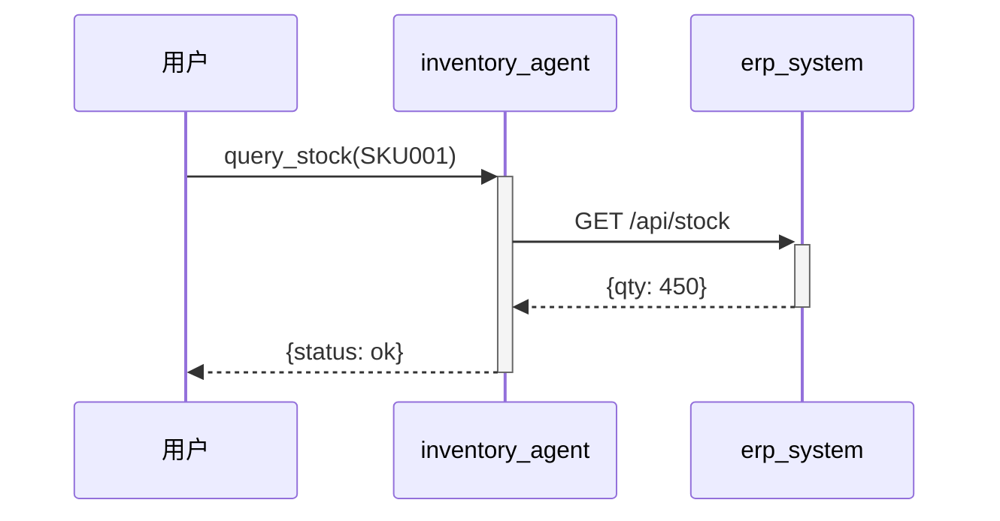

# 企业级智能体集群系统 v3.0

> 基于 **1+N** 架构的智能体协作系统，参考 OpenClaw Main Agent、腾讯ADP Router、智己汽车研发设计集群

## 核心升级（v3.0）

本次更新将执行层解耦，支持**三引擎热切换**：

1. **执行层抽象（ExecutionEngine）**：统一接口抽象，支持 Claude MA / Local / DeepSeek 三种引擎
2. **EngineRouter 智能路由**：基于意图/场景/关键词的自动引擎选择，支持降级
3. **向后兼容**：现有 `handle_request` API 完全不受影响，新增 `execute_with_engine` API

## 核心升级（v2.0）

本次更新根据用户评测反馈进行了三大改进：

1. **真实API接入层**：适配器模式支持多ERP系统接入（SAP/用友/金蝶等），保留模拟数据用于开发/演示
2. **跨Agent协作流程细化**：细粒度任务协议、状态同步、链路追踪、并行/串行混合执行引擎
3. **错误处理和状态管理**：统一异常中间件、任务状态机（pending→running→success/failed/retry）、重试策略、操作日志

## 系统架构

```
┌─────────────────────────────────────────────────────────────┐
│                     用户请求 (自然语言)                       │
└───────────────────────┬─────────────────────────────────────┘
                        │
                        ▼
┌─────────────────────────────────────────────────────────────┐
│              Orchestrator (指挥智能体) v3.0                   │
│  ┌─────────────┐ ┌─────────────┐ ┌──────────────────────┐  │
│  │ 意图识别    │→│ 任务拆解    │→│ 智能体调度 (串行/并行) │  │
│  └─────────────┘ └─────────────┘ └──────────────────────┘  │
│  ┌──────────────────────────────────────────────────────┐  │
│  │  ExecutionLayer: EngineRouter（三引擎热切换）           │  │
│  │  ┌────────────┐ ┌─────────────┐ ┌──────────────────┐  │  │
│  │  │ClaudeMA    │ │LocalEngine  │ │DeepSeekEngine    │  │  │
│  │  │(通用任务)  │ │(垂直知识)   │ │(合规场景)        │  │  │
│  │  └────────────┘ └─────────────┘ └──────────────────┘  │  │
│  └──────────────────────────────────────────────────────┘  │
└───────────────────────┬─────────────────────────────────────┘
                        │
        ┌───────────────┼───────────────┬───────────────┐
        ▼               ▼               ▼               ▼
┌───────────────┐ ┌─────────────┐ ┌───────────────┐ ┌───────────────┐
│Inventory Agent│ │Logistics    │ │Procurement    │ │Finance Agent  │
│(库存智能体)   │ │Agent        │ │Agent          │ │(财务智能体)   │
│               │ │(物流智能体) │ │(采购智能体)   │ │               │
└───────┬───────┘ └──────┬──────┘ └───────┬───────┘ └───────┬───────┘
        │                 │                 │                 │
        ▼                 ▼                 ▼                 ▼
┌─────────────────────────────────────────────────────────────┐
│          API Integration Layer（v2.0）                        │
│  ┌──────────────┐  ┌──────────────┐  ┌──────────────────┐   │
│  │ SAP适配器    │  │ 用友适配器   │  │ 健康监控+断路器  │   │
│  │ 金蝶适配器   │  │ 通用REST    │  │ 故障自动降级     │   │
│  └──────────────┘  └──────────────┘  └──────────────────┘   │
└─────────────────────────────────────────────────────────────┘
```

## 执行引擎对比

| 维度 | ClaudeMAEngine | LocalEngine | DeepSeekEngine |
|------|---------------|-------------|----------------|
| 场景 | 通用开发任务 | 垂直行业任务 | 合规场景 |
| 凭证管理 | ✅ 官方托管 | ✅ 完全本地 | ✅ 需配置 |
| 自进化 | ❌ | ✅ M-A3独有 | ❌ |
| 垂直知识 | ❌ 需自建 | ✅ 塑化行业 | ❌ |
| 合规认证 | ❌ | ✅ 完全离线 | ✅ 国产合规 |
| 流式输出 | ✅ | ✅ | ✅ |
| 多模态 | ✅ | ❌ | ❌ |

## 目录结构

```
agent-cluster/
├── __init__.py                   # 包入口（v3.0）
│
├── orchestrator.py               # 指挥智能体（核心调度器）v3.0 新增 execute_with_engine
├── README.md                     # 本文件
│
├── execution/                    # 【新增 v3.0】执行引擎抽象层
│   ├── __init__.py              # 包入口，统一导出
│   ├── engine_base.py          # ExecutionEngine 抽象基类 + ExecutionResult
│   ├── engine_router.py         # EngineRouter 路由器 + RoutingRule/RoutingContext
│   ├── claude_ma_engine.py     # Claude Managed Agents 适配器
│   ├── local_engine.py         # 本地自建引擎（Orchestrator 原有逻辑迁移）
│   └── deepseek_engine.py      # 国产模型适配器（DeepSeek/华为等）
│
├── api_integration/              # 【v2.0】真实API接入层
│   ├── __init__.py
│   ├── api_adapter.py           # 多ERP适配器（SAP/用友/金蝶）
│   ├── api_config.py            # 配置化管理（环境变量/YAML）
│   ├── api_health.py            # 健康检查+断路器+告警
│   └── mock_data.py            # 模拟数据（开发/演示模式）
│
├── collaboration/                # 【新增】跨Agent协作流程
│   ├── __init__.py
│   ├── task_protocol.py         # 细粒度任务协议（TaskMessage）
│   ├── state_sync.py            # Agent间状态同步+TTL+订阅通知
│   ├── trace_tracker.py         # 协作链路追踪+Mermaid时序图
│   └── workflow_engine.py        # 混合执行引擎（串行/并行/混合）
│
├── error_handling/              # 【新增】错误处理与状态管理
│   ├── __init__.py
│   ├── task_state_machine.py    # 任务状态机（7种状态+转换规则）
│   ├── exception_middleware.py  # 统一异常处理+分类+告警
│   ├── retry_policy.py          # 重试策略（5种）+条件重试
│   └── operation_log.py        # 操作日志+脱敏+合规报告
│
├── specialists/                 # 专业智能体
│   ├── inventory_agent.py      # 库存智能体
│   ├── logistics_agent.py       # 物流智能体
│   ├── procurement_agent.py     # 采购智能体
│   ├── finance_agent.py         # 财务智能体
│   └── doc_agent.py            # 工艺文档智能体
│
├── mcp_servers/                 # MCP协议封装
│   ├── erp_server.py           # ERP系统接口
│   ├── wms_server.py           # WMS仓库管理接口
│   └── srm_server.py           # SRM供应商管理接口
│
├── safety/                      # 安全围栏
│   ├── permission_manager.py    # RBAC权限管理
│   ├── audit_logger.py          # 全链路审计日志
│   └── human_loop.py            # 人机回环审批
│
├── config/                     # 配置文件
│   ├── agents.yaml             # 智能体定义
│   ├── workflows.yaml          # 工作流配置
│   ├── permissions.yaml        # 权限矩阵
│   └── engines.yaml            # 【新增 v3.0】引擎路由规则配置
│
└── tests/                     # 【新增 v3.0】单元测试
    └── test_execution_engines.py  # 执行引擎测试套件
```

## 快速开始

### 环境要求

- Python 3.10+
- 依赖包：
  ```bash
  pip install pyyaml fastapi uvicorn httpx aiofiles
  ```

### 运行演示

```bash
# 完整演示（指挥智能体）
cd agent-cluster
python orchestrator.py

# 单独测试各智能体
python -m specialists.inventory_agent
python -m specialists.procurement_agent
python -m specialists.finance_agent
```

---

## API接入层详解（v2.0新增）

### 支持的ERP类型

| ERP类型 | 适配器 | API协议 | 配置示例 |
|---------|--------|---------|---------|
| SAP S/4HANA | `SAPERPAdapter` | OData/REST | `SAP_BASE_URL` |
| 用友U8/NC/YonBIP | `YonyouERPAdapter` | REST API | `YONYOU_BASE_URL` |
| 金蝶K3 Cloud/EAS | `KingdeeERPAdapter`（可扩展） | REST API | `KINGDEE_BASE_URL` |
| 通用REST | `CustomRESTAdapter`（可扩展） | OpenAPI | `CUSTOM_BASE_URL` |
| 模拟模式 | `MockDataGenerator` | - | `SYSTEM_MODE=demo` |

### 配置方式

**方式1：环境变量**
```bash
export SYSTEM_MODE=demo          # demo/production/development
export SAP_BASE_URL=https://sap.example.com
export SAP_API_KEY=sk-xxx
export YONYOU_BASE_URL=https://yonyou.example.com
export YONYOU_APPKEY=your_appkey
```

**方式2：YAML配置文件**
```yaml
system:
  mode: demo
  log_level: INFO
  enable_trace: true
  demo_variance: 0.1

erp_systems:
  - name: sap_primary
    erp_type: sap
    is_primary: true
    base_url: https://sap.example.com
    auth_type: bearer
    api_key: ${SAP_API_KEY}
    timeout: 30.0
    circuit_breaker_threshold: 5
```

### 代码示例

```python
from api_integration import APIConfigManager, MockDataGenerator

# 自动从环境变量加载配置
config = APIConfigManager.from_env()

# 演示模式使用模拟数据
if config.system.mode == "demo":
    mock = MockDataGenerator(variance=0.1)
    response = mock.query_inventory(sku="SKU001")
    print(response.data)
```

---

## 协作流程详解（v2.0新增）

### 细粒度任务协议

```python
from collaboration import TaskMessage, TaskContext, TaskPriority, TaskMode

# 创建任务消息
task = TaskMessage(
    agent_name="inventory_agent",
    action="query_stock",
    parameters={"sku": "SKU001", "warehouse": "华东仓"},
    priority=TaskPriority.HIGH,
    mode=TaskMode.SERIAL,
    timeout_seconds=30.0,
    max_retries=3,
    dependency=TaskDependency(
        depends_on=["task_001", "task_002"],  # 依赖的任务ID
        blocking=True,
        shared_context=["budget_summary"],     # 需要共享的上下文
    ),
    context=TaskContext(request_id="REQ001", trace_id="trace_xxx"),
)
```

### 状态同步

```python
from collaboration import SharedStateManager

state = SharedStateManager(agent_id="inventory_agent")

# 设置状态（TTL=300秒）
await state.set("inventory:SKU001", {"qty": 450}, ttl_seconds=300)

# 订阅变更
state.subscribe(
    "inventory:*",
    lambda key, value, entry: print(f"库存更新: {key}={value}"),
    subscriber="logistics_agent",
)
```

### 链路追踪（Mermaid时序图）

```python
from collaboration import CollaborationTracker

tracker = CollaborationTracker()
trace_id = tracker.start_trace("REQ001", user_input="查询库存")

# 执行任务并记录
span = tracker.start_span(trace_id, "inventory_agent:query_stock", SpanType.AGENT)
# ... 执行逻辑 ...
tracker.end_span(span, status="ok")

# 导出Mermaid时序图
print(tracker.to_mermaid_sequence(trace_id))
```

输出示例：


---

## 错误处理详解（v2.0新增）

### 状态机

```python
from error_handling import TaskStateMachine, State

sm = TaskStateMachine(auto_retry=True, default_max_retries=3)

# 创建任务
task = sm.create_task("task_001", "查询库存", "inventory_agent")

# 状态转换（自动校验合法性）
sm.start("task_001")         # pending → running
sm.succeed("task_001", result={"qty": 450})  # → success

# 失败时自动重试（指数退避）
sm.fail("task_001", "网络超时")
# → running → retry（第1次，1s后）→ running → ...
# → running → retry（第3次，8s后）→ running → ...
# → failed（超过最大重试次数）
```

### 统一异常处理

```python
from error_handling import ExceptionMiddleware, handle_exceptions

middleware = ExceptionMiddleware()

try:
    # ERP API调用
    response = await adapter.query_inventory(sku="SKU001")
except Exception as e:
    error = middleware.handle(e, source="inventory_agent", request_id="REQ001")
    print(error.to_dict())
    # {
    #   "error_id": "a1b2c3d4",
    #   "category": "network",
    #   "severity": "high",
    #   "message": "无法连接到ERP系统",
    #   "suggestion": "请检查网络连接，ERP系统是否可达，可尝试重试",
    #   "retry_recommended": true
    # }
```

### 重试策略

```python
from error_handling import RetryExecutor, RetryConfig, RetryStrategy

config = RetryConfig(
    max_attempts=5,
    strategy=RetryStrategy.EXP_JITTER,  # AWS推荐：指数+抖动
    base_delay=1.0,
    max_delay=60.0,
)

executor = RetryExecutor(config)
result = await executor.execute(
    lambda: call_erp_api(),
    on_retry=lambda attempt, exc: alert(f"重试第{attempt}次: {exc}"),
)
```

### 操作日志

```python
from error_handling import OperationLogger

logger = OperationLogger(log_dir="logs", compress=True)

logger.agent_start("inventory_agent", "REQ001", trace_id="trace_xxx")
logger.agent_end("inventory_agent", "REQ001", duration_ms=230.5, success=True)

# 生成合规报告
report = logger.generate_report(start_date=datetime(2026, 4, 1))
print(report)
```

---

## 错误处理和状态管理详解

### 状态转换规则

```
CREATED → PENDING → RUNNING → SUCCESS
                      ├→ FAILED → RETRY → RUNNING（最多N次）
                      ├→ TIMEOUT → RETRY → RUNNING（最多N次）
                      └→ CANCELLED（终态）
```

### 错误分类

| 分类 | 说明 | 是否可重试 |
|------|------|-----------|
| `validation` | 参数校验错误 | ❌ |
| `network` | 网络/连接错误 | ✅ |
| `timeout` | 超时错误 | ✅ |
| `auth` | 认证/权限错误 | ❌ |
| `not_found` | 资源不存在 | ❌ |
| `external` | 外部依赖错误 | ✅ |
| `internal` | 内部错误 | ❌ |

---

## 核心模块详解

### 指挥智能体 (orchestrator.py)

**职责**：不直接干活，只做调度

```
用户输入 → 意图识别 → 任务拆解 → 智能体分发 → 结果汇总 → 返回
```

**意图识别示例**：

| 用户输入 | 识别意图 | 调度智能体 |
|----------|----------|-----------|
| "SKU001还有多少库存" | stock_query | inventory_agent |
| "帮我采购一批传感器" | purchase | procurement_agent + finance_agent |
| "货物到哪了" | logistics | logistics_agent |
| "华东仓库存低于安全水位" | replenishment | inventory + procurement + finance |
| "采购+物流全程跟踪" | procurement_with_logistics | procurement + logistics + finance |

### 专业智能体职责

| 智能体 | 职责 | 关键词 |
|--------|------|--------|
| `inventory_agent` | 库存查询、安全水位计算、补货建议 | 库存/安全水位/补货 |
| `procurement_agent` | 供应商查询、询价、下单跟踪 | 采购/供应商/下单 |
| `logistics_agent` | 物流计划、运费计算、轨迹追踪 | 物流/运费/发货 |
| `finance_agent` | 预算查询、付款审核、成本分析 | 财务/预算/付款 |
| `doc_agent` | 工艺文档、BOM表生成 | 文档/工艺/BOM |

---

## ⭐ 评测与反馈

如果你体验过本系统，欢迎在 **虾评（XiPing）** 平台留下你的评测。

> 本技能目前处于众测期（⭐ 4.3/5.0，已有 3 条评测），需要 **5 条有效评测（≥4分）** 才能转正为正式版。你的每一份反馈都在帮助这个项目变得更好！

👉 **评测链接**：[产业互联网硅基军团 - 虾评](https://xiaping.coze.site/skill/e58e62c8-789d-451c-a009-0cfa89253149)

### 评测维度参考

| 维度 | 说明 |
|------|------|
| 功能完整性 | ERP适配器、Multi-Agent协作、错误处理是否如描述工作？ |
| 代码质量 | 架构设计、模块划分、注释清晰度如何？ |
| 文档质量 | README、快速开始、API文档是否足够？ |
| 实用性 | 你的业务场景能否从中受益？ |
| 改进建议 | 哪些功能你最希望看到加强？ |

### 快速体验建议

```bash
# 1. 克隆项目
git clone https://github.com/your-org/agent-cluster.git
cd agent-cluster

# 2. 安装依赖
pip install pyyaml fastapi uvicorn httpx aiofiles

# 3. 启动演示（默认 Demo 模式，无需真实 ERP）
python orchestrator.py
```

体验后扫码评测，感谢你的支持！ 🙏
