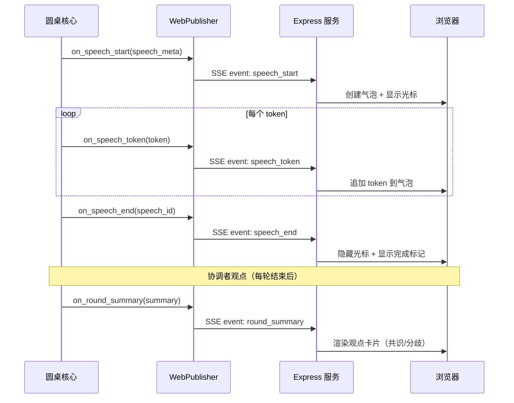
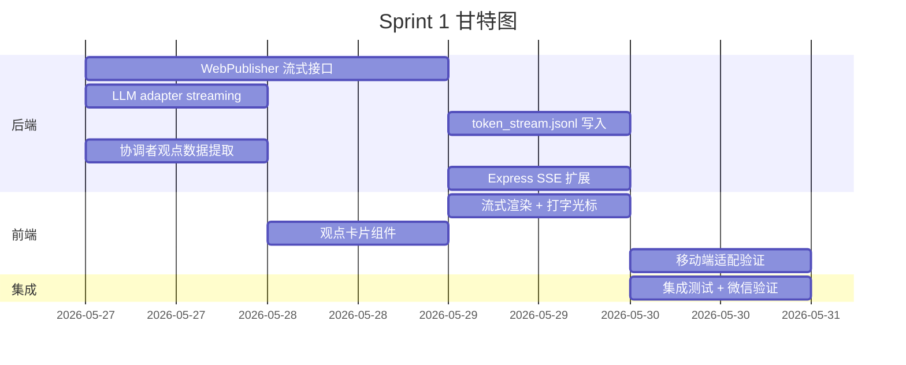

# agent-roundtable v2 Sprint 1 PRD — 流式输出 + 协调者观点展示

> **版本**: 1.0
> **日期**: 2026-05-26
> **状态**: 草稿
> **产品负责人**: 饼哥
> **关联讨论**: rt_8aef3fe0（圆桌讨论共识）
> **分支**: feature/v2-ux-improvements

---

## 1. 背景与目标

### 1.1 问题

agent-roundtable v1 的 WebViewer 已实现基础 SSE 实时推送，但存在两个核心体验短板：

1. **输出体验割裂**：发言以完整 JSON 块一次性推送到前端，用户看到的是"整段文字突然出现"，缺乏 ChatGPT 式逐字流的沉浸感。
2. **观点提炼缺失**：协调者（Coordinator）在每轮讨论后会总结核心观点和共识分歧，但这些关键信息淹没在发言流中，用户需要自己从大量文本中提炼结论。

### 1.2 目标

Sprint 1 聚焦两个核心体验升级：

| 优先级 | 功能 | 核心价值 |
|--------|------|---------|
| **P0** | WebViewer 实时逐字流式输出 | 讨论过程像 ChatGPT 一样有"实时感"，提升用户参与度 |
| **P1** | 协调者核心观点展示 | 让用户在讨论过程中就能看到观点提炼，降低信息获取成本 |

### 1.3 非目标（Sprint 1 不做）

- 讨论回放模式（Replay）
- 导出/嵌入功能
- 多 Token 访问控制
- WebSocket 双向交互（仅作为技术预研方向）

---

## 2. 目标用户

| 用户类型 | 场景 | Sprint 1 痛点 |
|---------|------|--------------|
| 内容创作者 | 分享 AI 讨论给读者 | 当前输出缺乏实时感，读者容易流失 |
| 技术决策者 | 团队快速对齐观点 | 需要自己从长讨论中提炼结论 |
| AI 爱好者 | 体验多 Agent 协作 | 缺乏"看 AI 实时思考"的沉浸感 |

---

## 3. 功能需求

### 3.1 P0 — WebViewer 实时逐字流式输出

#### 3.1.1 用户故事

> 作为圆桌讨论的观众，我希望看到每个 Agent 的发言像 ChatGPT 一样逐字流出，而不是整段突然出现，这样我能感受到 AI 实时思考的过程。

#### 3.1.2 功能规格

| 编号 | 功能点 | 说明 | 验收标准 |
|------|--------|------|---------|
| F1.1 | 逐字流式渲染 | Agent 发言以 token 粒度逐步渲染到页面 | 每个 token 从接收到渲染 ≤50ms |
| F1.2 | 打字光标动画 | 发言未结束时显示闪烁光标 `▊` | 光标在最后一个 token 后闪烁，发言结束后消失 |
| F1.3 | 群聊视觉隐喻 | 每个 Agent 有独立头像、名称、气泡颜色 | 不同 Agent 的发言视觉上清晰可区分 |
| F1.4 | 气泡区分 | 用户消息 vs AI 消息 vs 协调者消息使用不同气泡样式 | 三种消息类型视觉差异明显 |
| F1.5 | 自动滚动 | 新内容出现时自动滚动到底部 | 用户手动上翻时暂停自动滚动，回到底部后恢复 |
| F1.6 | 发言完成标记 | 发言结束后气泡显示完成状态（如 ✓） | 从"打字中"到"完成"状态转换流畅 |

#### 3.1.3 视觉设计要点

```
┌─────────────────────────────────────────────┐
│  🤖 Alice (GPT-4o)                          │
│  ┌─────────────────────────────────────┐    │
│  │ 我认为 FastAPI 的性能优势在...       │    │
│  │ IO 密集场景下更为明显▊              │    │
│  └─────────────────────────────────────┘    │
│                                             │
│  🧠 Bob (Claude)                            │
│  ┌─────────────────────────────────────┐    │
│  │ 同意 Alice 的观点。但需要注意...     │    │
│  └─────────────────────────────────────┘ ✓  │
│                                             │
│  📋 协调者                                   │
│  ╔═════════════════════════════════════╗    │
│  ║ 第 1 轮核心观点：                    ║    │
│  ║ ✅ FastAPI 性能优势明确              ║    │
│  ║ ⚠️ 团队学习成本需评估               ║    │
│  ╚═════════════════════════════════════╝    │
└─────────────────────────────────────────────┘
```

---

### 3.2 P1 — 协调者核心观点展示

#### 3.2.1 用户故事

> 作为圆桌讨论的观众，我希望每轮讨论结束后能看到协调者总结的核心观点，用卡片形式突出展示共识和分歧，这样我不用读完全部发言就能抓住要点。

#### 3.2.2 功能规格

| 编号 | 功能点 | 说明 | 验收标准 |
|------|--------|------|---------|
| F2.1 | 观点卡片 | 每轮讨论结束后，协调者观点以特殊卡片形式插入发言流 | 卡片样式与普通发言气泡明显不同 |
| F2.2 | 共识/分歧标签 | 观点分为"共识 ✅"和"分歧 ⚠️"两类，用颜色区分 | 共识为绿色标签，分歧为橙色标签 |
| F2.3 | 可折叠展示 | 观点卡片默认展开，支持折叠/展开 | 点击标题区域可折叠，再点击可展开 |
| F2.4 | 观点归属 | 每个观点标注支持/反对的 Agent 名称 | 标签如"Alice, Bob 支持" |
| F2.5 | 最终总结 | 讨论结束时，协调者输出最终总结卡片，包含所有轮次的共识和分歧 | 总结卡片视觉突出（发光/高亮边框） |

#### 3.2.3 观点卡片视觉设计

```
╔═══════════════════════════════════════════╗
║  📋 协调者总结 — 第 1 轮                   ║
╠═══════════════════════════════════════════╣
║                                           ║
║  ✅ 共识                                  ║
║  ┌─────────────────────────────────────┐  ║
║  │ FastAPI 性能优势在 IO 密集场景明显   │  ║
║  │ [Alice ✓] [Bob ✓] [Carol ✓]        │  ║
║  └─────────────────────────────────────┘  ║
║                                           ║
║  ⚠️ 分歧                                  ║
║  ┌─────────────────────────────────────┐  ║
║  │ 是否应该全面迁移现有 Flask 代码      │  ║
║  │ [Alice 支持] [Bob 反对]             │  ║
║  └─────────────────────────────────────┘  ║
║                                           ║
╚═══════════════════════════════════════════╝
         ▼ 点击折叠   ▲ 点击展开
```

---

*（下一章节：技术方案）*

## 4. 产品流程图

### 4.1 流式输出核心流程



### 4.2 SSE 事件协议（扩展）

| 事件名 | 触发时机 | data 格式 |
|--------|---------|-----------|
| `speech_start` | Agent 开始发言 | `{"id": "s_xxx", "agent": "Alice", "avatar": "🤖", "round": 1}` |
| `speech_token` | 每个 token 到达 | `{"id": "s_xxx", "delta": "我认为", "seq": 42}` |
| `speech_end` | 发言结束 | `{"id": "s_xxx"}` |
| `round_summary` | 每轮协调者总结 | `{"round": 1, "consensus": [...], "disagreement": [...]}` |
| `final_summary` | 讨论最终总结 | `{"consensus": [...], "disagreement": [...], "verdict": "..."}` |
| `status` | 状态变更 | `{"state": "waiting\|running\|concluded"}` |

> **向后兼容**：保留原有 `speech` 事件（完整发言），客户端可选择使用流式或非流式模式。

### 4.3 断线续传增强

```
客户端断线重连时：
1. 发送 Last-Event-ID（最后收到的 seq）
2. 服务端从该 seq 后补发所有 speech_token 事件
3. 补发完成后，切换到实时模式

关键：服务端需缓存最近 N 轮的 token 序列
```

---

## 5. 技术方案

### 5.1 架构变更概览

```
现有架构（v1）：
  Roundtable → WebPublisher.on_speech(complete_speech) → SSE → 浏览器
                                                        ↑
                                                   一次性推送

Sprint 1 架构：
  Roundtable → WebPublisher.on_speech_start() → SSE: speech_start
           → WebPublisher.on_speech_token()  → SSE: speech_token (流式)
           → WebPublisher.on_speech_end()    → SSE: speech_end
           → WebPublisher.on_round_summary() → SSE: round_summary
```

### 5.2 Python 端变更

#### 5.2.1 WebPublisher 接口扩展

```python
class WebPublisher:
    """现有接口保持不变，新增流式接口"""
    
    # === 现有接口（保留，向后兼容） ===
    def on_speech(self, speech: dict):
        """完整发言推送（v1 兼容）"""
        ...
    
    def conclude(self, conclusion: str):
        """讨论结束"""
        ...
    
    # === Sprint 1 新增接口 ===
    def on_speech_start(self, speech_id: str, agent: str, avatar: str, round_num: int):
        """发言开始：创建气泡"""
        ...
    
    def on_speech_token(self, speech_id: str, delta: str, seq: int):
        """发言 token：逐字追加"""
        ...
    
    def on_speech_end(self, speech_id: str):
        """发言结束：标记完成"""
        ...
    
    def on_round_summary(self, round_num: int, consensus: list[dict], disagreement: list[dict]):
        """每轮协调者总结"""
        ...
    
    def on_final_summary(self, consensus: list[dict], disagreement: list[dict], verdict: str):
        """最终总结"""
        ...
```

#### 5.2.2 core.py 集成点

```python
# 在 Roundtable 主循环中：

# 1. 发言开始时
publisher.on_speech_start(
    speech_id=speech.id,
    agent=speech.participant,
    avatar=get_avatar(speech.participant),
    round_num=current_round
)

# 2. LLM 流式输出时（关键：需要 adapter 支持 streaming）
for chunk in llm_stream(prompt):
    publisher.on_speech_token(
        speech_id=speech.id,
        delta=chunk.text,
        seq=seq_counter
    )

# 3. 发言结束时
publisher.on_speech_end(speech.id)

# 4. 每轮结束时（协调者总结）
publisher.on_round_summary(
    round_num=current_round,
    consensus=consensus_points,
    disagreement=disagreement_points
)
```

### 5.3 Express 端变更

#### 5.3.1 SSE 事件转发

```javascript
// 现有：监听 discussion.json 变化
// 新增：监听 token_stream.jsonl 变化（流式 token 文件）

app.get('/api/:token/events', (req, res) => {
    // ... 现有 SSE 设置 ...
    
    // 新增：监听流式 token 文件
    const tokenFile = path.join(discDir, 'token_stream.jsonl');
    const watcher = fs.watch(tokenFile, () => {
        // 读取新增行，转发为 SSE 事件
        const newTokens = readNewLines(tokenFile, lastPosition);
        for (const token of newTokens) {
            res.write(`event: ${token.type}\ndata: ${JSON.stringify(token)}\n\n`);
        }
    });
});
```

#### 5.3.2 数据文件变更

```
discussion_dir/
├── discussion.json          # 现有：完整讨论数据（保留）
├── token_stream.jsonl       # 新增：流式 token 序列文件
│   # 格式：{"type":"speech_start","id":"s_xxx","agent":"Alice",...}
│   # 格式：{"type":"speech_token","id":"s_xxx","delta":"我认为","seq":1}
│   # 格式：{"type":"speech_end","id":"s_xxx"}
│   # 格式：{"type":"round_summary","round":1,"consensus":[...],...}
└── events.jsonl             # 可选：事件日志（用于断线续传）
```

### 5.4 前端变更

#### 5.4.1 核心渲染逻辑

```javascript
// 事件处理器
const handlers = {
    speech_start(data) {
        // 创建新气泡，显示打字光标
        createBubble(data.agent, data.avatar, data.id);
    },
    
    speech_token(data) {
        // 追加 token 到对应气泡
        appendToken(data.id, data.delta);
        // 触发自动滚动
        autoScroll();
    },
    
    speech_end(data) {
        // 隐藏光标，显示完成标记
        hideCursor(data.id);
        showCheckmark(data.id);
    },
    
    round_summary(data) {
        // 渲染观点卡片
        renderSummaryCard(data.round, data.consensus, data.disagreement);
    },
    
    final_summary(data) {
        // 渲染最终总结卡片（发光效果）
        renderFinalSummary(data.consensus, data.disagreement, data.verdict);
    }
};
```

#### 5.4.2 自动滚动逻辑

```javascript
let autoScrollEnabled = true;

function autoScroll() {
    if (autoScrollEnabled) {
        window.scrollTo(0, document.body.scrollHeight);
    }
}

// 用户手动上翻时暂停自动滚动
window.addEventListener('scroll', () => {
    const isAtBottom = (window.innerHeight + window.scrollY) >= document.body.scrollHeight - 50;
    autoScrollEnabled = isAtBottom;
});
```

---

*（下一章节：数据结构、验收标准、工期）*

## 6. 数据结构变更

### 6.1 SSE 事件数据格式

#### 6.1.1 speech_start

```json
{
    "type": "speech_start",
    "id": "s_a1b2c3d4",
    "agent": "Alice",
    "avatar": "🤖",
    "avatar_url": "/avatars/alice.png",
    "round": 1,
    "timestamp": 1779761742
}
```

#### 6.1.2 speech_token

```json
{
    "type": "speech_token",
    "id": "s_a1b2c3d4",
    "delta": "我认为",
    "seq": 42,
    "timestamp": 1779761743
}
```

> **seq 说明**：每个发言独立的 token 序列号，从 0 开始递增，用于断线续传定位。

#### 6.1.3 speech_end

```json
{
    "type": "speech_end",
    "id": "s_a1b2c3d4",
    "total_tokens": 156,
    "timestamp": 1779761745
}
```

#### 6.1.4 round_summary

```json
{
    "type": "round_summary",
    "round": 1,
    "consensus": [
        {
            "content": "FastAPI 性能优势在 IO 密集场景明显",
            "supporters": ["Alice", "Bob", "Carol"]
        }
    ],
    "disagreement": [
        {
            "content": "是否应该全面迁移现有 Flask 代码",
            "supporters": ["Alice"],
            "opponents": ["Bob"]
        }
    ],
    "timestamp": 1779761750
}
```

#### 6.1.5 final_summary

```json
{
    "type": "final_summary",
    "consensus": [
        {
            "content": "FastAPI 性能优势在 IO 密集场景明显",
            "supporters": ["Alice", "Bob", "Carol"]
        },
        {
            "content": "团队熟悉 Python，学习成本可控",
            "supporters": ["Alice", "Bob"]
        }
    ],
    "disagreement": [
        {
            "content": "是否应该全面迁移现有 Flask 代码",
            "supporters": ["Alice"],
            "opponents": ["Bob", "Carol"]
        }
    ],
    "verdict": "采用 FastAPI 重写核心模块，保留 Flask 遗留代码渐进迁移",
    "timestamp": 1779761760
}
```

### 6.2 token_stream.jsonl 文件格式

每行一个 JSON 对象，与 SSE 事件一一对应：

```
{"type":"speech_start","id":"s_a1b2c3d4","agent":"Alice","avatar":"🤖","round":1,"timestamp":1779761742}
{"type":"speech_token","id":"s_a1b2c3d4","delta":"我","seq":0,"timestamp":1779761742}
{"type":"speech_token","id":"s_a1b2c3d4","delta":"认为","seq":1,"timestamp":1779761743}
{"type":"speech_end","id":"s_a1b2c3d4","total_tokens":2,"timestamp":1779761743}
```

### 6.3 向后兼容

| 场景 | 处理方式 |
|------|---------|
| 旧客户端连接 | 服务端检测 `Accept` 头或 URL 参数 `?mode=legacy`，降级为完整 speech 事件 |
| discussion.json | 继续保留，作为讨论数据的权威来源 |
| 新旧事件共存 | speech_start/token/end 与 speech 事件同时写入，前端按能力选择 |

---

## 7. 验收标准

### 7.1 P0 — 流式输出

| 编号 | 验收项 | 标准 | 测试方法 |
|------|--------|------|---------|
| A1 | 逐字渲染 | token 从接收到渲染 ≤50ms | 控制台打时间戳，对比 SSE 事件和 DOM 更新 |
| A2 | 打字光标 | 发言中光标闪烁，发言结束后消失 | 真机观察，截图对比 |
| A3 | Agent 区分 | 不同 Agent 头像、颜色、气泡样式可区分 | 3 个以上 Agent 同时发言，肉眼可分辨 |
| A4 | 自动滚动 | 新内容自动滚动，上翻暂停，回到底部恢复 | 手动测试上翻/回到底部 |
| A5 | 断线续传 | 断线 30s 内重连后补齐缺失 token | 模拟网络中断后恢复 |
| A6 | 完成标记 | 发言结束显示 ✓ 标记 | 真机观察 |

### 7.2 P1 — 协调者观点

| 编号 | 验收项 | 标准 | 测试方法 |
|------|--------|------|---------|
| B1 | 观点卡片 | 每轮结束后出现观点卡片 | 完整讨论流程测试 |
| B2 | 共识/分歧标签 | 共识绿色、分歧橙色，视觉可区分 | 截图对比 |
| B3 | 折叠/展开 | 点击可折叠，再点击可展开 | 交互测试 |
| B4 | 观点归属 | 每个观点标注支持/反对 Agent | 完整讨论流程测试 |
| B5 | 最终总结 | 讨论结束时出现最终总结卡片，发光效果 | 完整讨论流程测试 |

### 7.3 整体体验

| 编号 | 验收项 | 标准 | 测试方法 |
|------|--------|------|---------|
| C1 | 移动端适配 | 微信内置浏览器无横向滚动 | 微信真机测试 |
| C2 | 性能 | 20 人同时在线无卡顿 | 压力测试 |
| C3 | 向后兼容 | 旧版讨论页面仍可正常显示 | 用 v1 数据访问新页面 |

---

## 8. 风险与应对

| 风险 | 影响 | 应对策略 |
|------|------|---------|
| LLM 流式输出接口不统一 | 各 adapter 实现差异大 | 定义统一的 `StreamChunk` 数据模型，adapter 负责转换 |
| Token 频率过高导致前端卡顿 | 用户体验下降 | 前端做节流（throttle），批量渲染（如每 100ms 渲染一次） |
| 观点卡片数据格式未定义 | 协调者输出不可控 | 在 Prompt 中明确输出格式，增加 JSON Schema 校验 |
| 断线续传缓存占用 | 内存增长 | 缓存仅保留最近 2 轮 token，旧数据丢弃 |
| 旧讨论数据兼容 | 老用户看到异常 | 旧数据走 legacy 模式，不显示流式效果 |

---

## 9. 工期与分工

### 9.1 任务拆解

| 任务 | 负责人 | 工期 | 依赖 |
|------|--------|------|------|
| **后端：WebPublisher 流式接口** | 码飞 | 1.5 天 | 无 |
| **后端：LLM adapter streaming 统一** | 码飞 | 1 天 | 无 |
| **后端：token_stream.jsonl 写入 + 断线续传** | 码飞 | 0.5 天 | WebPublisher 接口 |
| **后端：协调者观点数据提取** | 码飞 | 0.5 天 | 无 |
| **前端：流式渲染 + 打字光标** | 像素姐 | 1 天 | WebPublisher 接口 |
| **前端：观点卡片组件** | 像素姐 | 0.5 天 | 观点数据格式 |
| **前端：移动端适配验证** | 像素姐 | 0.5 天 | 前端完成 |
| **Express：SSE 事件扩展** | 码飞 | 0.5 天 | WebPublisher 接口 |
| **集成测试 + 微信真机验证** | 协调者 | 1 天 | 后端+前端完成 |

### 9.2 里程碑

```
Day 1-2: 后端核心（流式接口 + adapter 统一）
Day 2-3: 前端核心（流式渲染 + 观点卡片）
Day 3:   Express 适配 + 集成联调
Day 4:   移动端验证 + Bug 修复
Day 5:   验收 + Buffer
```

**总工期**：5 个工作日

### 9.3 依赖关系



---

## 10. 设计交付物

像素姐需产出：

1. **流式气泡组件规范** — 不同 Agent 的头像、颜色、气泡样式
2. **打字光标动画规范** — 闪烁频率、颜色、消失动画
3. **观点卡片组件规范** — 共识/分歧标签样式、折叠交互
4. **最终总结卡片规范** — 发光效果、边框样式
5. **移动端适配规则** — 气泡最大宽度、字号、间距

---

## 11. 技术预研方向（Sprint 2+）

| 方向 | 可行性 | 价值 |
|------|--------|------|
| WebSocket 双向交互 | 高 | 支持观众提问、投票等交互功能 |
| 讨论回放模式 | 中 | 用户可回看讨论过程，支持倍速 |
| 导出嵌入 | 高 | 讨论结果可嵌入博客、文档 |
| 多 Token 访问控制 | 中 | 企业级场景需要权限管理 |

---

## 12. 确认记录

- **2026-05-26**: PRD 初稿，基于圆桌讨论 rt_8aef3fe0 共识
- **待确认**: 饼哥（产品）、像素姐（设计）、码飞（技术）

---

*本文档由饼哥（产品总监）编写，如有疑问请联系产品负责人。*
