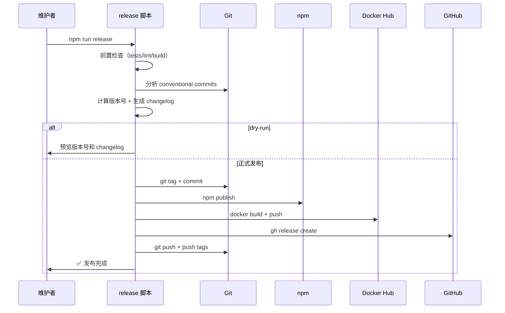
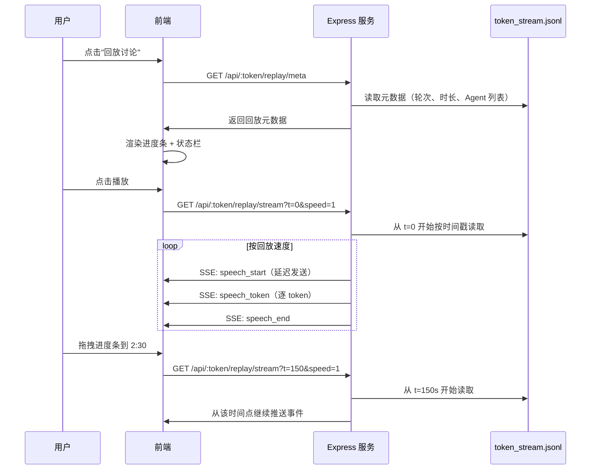
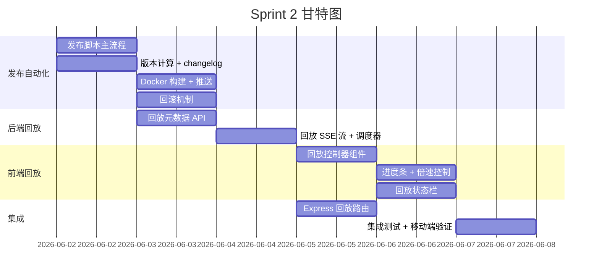

# agent-roundtable v2 Sprint 2 PRD — 发布自动化 + 讨论回放

> **版本**: 1.0
> **日期**: 2026-05-26
> **状态**: 草稿
> **产品负责人**: 饼哥
> **前置依赖**: Sprint 1（流式输出 + 协调者观点展示）
> **分支**: feature/v2-ux-improvements

---

## 1. 背景与目标

### 1.1 问题

Sprint 1 完成流式输出和协调者观点展示后，agent-roundtable 的实时讨论体验已经到位。但两个运营层面的痛点仍未解决：

1. **发布流程手动低效**：每次 release 后需要手动同步 npm、Docker Hub、GitHub Release 等多个渠道，耗时且容易遗漏。当前没有自动化脚本，全靠人工操作。
2. **讨论价值无法沉淀**：精彩的圆桌讨论结束后，内容就"死"了——用户只能看到最终结论，无法回看讨论过程中的思维碰撞和观点演变。讨论回放是产品分析中提出的第一迭代建议。

### 1.2 目标

Sprint 2 聚焦两个能力：

| 优先级 | 功能 | 核心价值 |
|--------|------|---------|
| **P0** | 发布流程自动化 | 一条命令完成 release → npm publish → Docker build → GitHub Release，降低运维负担 |
| **P1** | 讨论回放模式 | 用户可回看已完成讨论的完整过程，支持进度条拖拽和倍速播放，让讨论内容可沉淀、可传播 |

### 1.3 非目标（Sprint 2 不做）

- WebSocket 双向交互
- 导出/嵌入功能
- 多 Token 访问控制
- 讨论实时协作编辑
- 自动化 CI/CD 流水线（仅做本地发布脚本，不做 GitHub Actions）

---

## 2. 目标用户

| 用户类型 | 场景 | Sprint 2 痛点 |
|---------|------|--------------|
| 项目维护者（饼哥/码飞） | 发布新版本 | 每次 release 要手动跑 5+ 个命令，容易漏步骤 |
| 内容创作者 | 分享精彩讨论 | 讨论结束后无法让读者体验讨论过程 |
| 技术决策者 | 回顾团队讨论 | 只能看结论，无法回溯推理过程 |
| AI 爱好者 | 学习多 Agent 协作 | 想看 AI 是如何一步步达成共识的 |

---

## 3. 功能需求

### 3.1 P0 — 发布流程自动化

#### 3.1.1 用户故事

> 作为项目维护者，我希望执行一条命令就能完成版本发布，自动同步到 npm、Docker Hub 和 GitHub Release，这样我不用记住每个渠道的发布步骤，也不会遗漏。

#### 3.1.2 功能规格

| 编号 | 功能点 | 说明 | 验收标准 |
|------|--------|------|---------|
| F1.1 | 一键发布脚本 | `npm run release` 触发完整发布流程 | 执行一条命令完成所有渠道同步 |
| F1.2 | 版本号自动管理 | 根据 conventional commits 自动计算 semver 版本号 | 支持 patch/minor/major 三种 bump 类型 |
| F1.3 | Changelog 自动生成 | 从 commit 历史自动生成 CHANGELOG.md | 格式遵循 Keep a Changelog 规范 |
| F1.4 | npm 自动发布 | 构建并发布到 npm registry | `npm install agent-roundtable` 可安装最新版 |
| F1.5 | Docker 镜像构建 | 构建 Docker 镜像并推送到 Docker Hub | `docker pull agent-roundtable:latest` 可拉取 |
| F1.6 | GitHub Release | 自动创建 GitHub Release，附带 changelog 和二进制包 | Release 页面可看到版本和变更说明 |
| F1.7 | 发布前检查 | 发布前自动运行测试、lint、构建，任一失败则中止 | 测试不通过时阻止发布 |
| F1.8 | Dry-run 模式 | `--dry-run` 预览发布内容但不实际执行 | 显示将要发布的版本号和 changelog |
| F1.9 | 发布回滚 | 发布失败时自动回滚（unpublish npm、删除 tag） | 失败后仓库状态恢复到发布前 |

#### 3.1.3 发布流程图

```
┌─────────────────────────────────────────────────────┐
│  npm run release [--dry-run] [--type=patch|minor|major] │
└──────────────────────┬──────────────────────────────┘
                       │
                       ▼
              ┌─────────────────┐
              │  1. 前置检查     │
              │  - git clean?    │
              │  - tests pass?   │
              │  - lint clean?   │
              │  - build ok?     │
              └────────┬────────┘
                       │ pass
                       ▼
              ┌─────────────────┐
              │  2. 版本计算     │
              │  - 分析 commits  │
              │  - 计算 semver   │
              │  - 生成 changelog│
              └────────┬────────┘
                       │
                       ▼
              ┌─────────────────┐
              │  3. 版本提交     │
              │  - 更新 package  │
              │  - git commit    │
              │  - git tag       │
              └────────┬────────┘
                       │
                       ▼
              ┌─────────────────┐
              │  4. 多渠道发布   │
              │  ┌─ npm publish  │
              │  ├─ docker build │
              │  │  + push       │
              │  └─ gh release  │
              └────────┬────────┘
                       │
                       ▼
              ┌─────────────────┐
              │  5. 推送 & 清理  │
              │  - git push      │
              │  - git push --tags│
              └────────┬────────┘
                       │
                  ┌────┴────┐
                  │ 失败?   │
                  ▼         ▼
              回滚操作    完成 ✅
```

### 3.2 P1 — 讨论回放模式

#### 3.2.1 用户故事

> 作为圆桌讨论的观众，我希望在讨论结束后能回放整个讨论过程，像看视频一样看到每个 Agent 是如何逐步思考和回应的，这样我能深入理解观点的演变过程，而不仅仅是看最终结论。

#### 3.2.2 功能规格

| 编号 | 功能点 | 说明 | 验收标准 |
|------|--------|------|---------|
| F2.1 | 回放入口 | 讨论结束后，页面顶部出现"回放讨论"按钮 | 讨论状态为 concluded 时按钮可见 |
| F2.2 | 时间线进度条 | 页面底部显示讨论时间线，标注每轮起止和关键事件 | 进度条可拖拽定位 |
| F2.3 | 播放控制 | 播放/暂停、倍速（1x/2x/4x）、跳到某轮 | 倍速切换流畅，无跳帧 |
| F2.4 | 逐字回放 | 回放时复用 Sprint 1 的流式渲染，逐字重现发言 | 回放效果与实时讨论视觉一致 |
| F2.5 | 轮次跳转 | 点击进度条上的轮次标记，跳转到该轮开始 | 跳转后从该轮第一个发言开始回放 |
| F2.6 | 回放状态栏 | 显示当前轮次、发言 Agent、已用时间/总时间 | 信息实时更新 |
| F2.7 | 回放与实时互斥 | 讨论进行中时禁用回放入口，回放中时禁用新讨论发起 | 状态互斥，无冲突 |

#### 3.2.3 回放界面视觉设计

```
┌─────────────────────────────────────────────────────┐
│  🔁 回放中 — 第 2 轮 / 共 4 轮    ⏱ 01:23 / 05:40  │
│                                                     │
│  🤖 Alice (GPT-4o)                                  │
│  ┌─────────────────────────────────────┐            │
│  │ 我认为 FastAPI 的性能优势在...       │            │
│  │ IO 密集场景下更为明显▊              │            │
│  └─────────────────────────────────────┘ ✓          │
│                                                     │
│  🧠 Bob (Claude)                                    │
│  ┌─────────────────────────────────────┐            │
│  │ 同意 Alice 的观点。但需要注意...     │            │
│  └─────────────────────────────────────┘            │
│                                                     │
│  ═══════════════════════════════════════════════    │
│  ▶ ⏸  │ 1x │ │◄ 第1轮 │◄ 第2轮 │◄ 第3轮 │► │     │
│  ─────●───────────────────────────────────────      │
│       ↑ 拖拽定位                                     │
└─────────────────────────────────────────────────────┘
```

#### 3.2.4 回放数据模型

回放依赖 Sprint 1 的 `token_stream.jsonl` 文件，该文件已包含完整的发言序列和时间戳。回放本质上是"按时间戳重放 token_stream.jsonl 中的事件"。

```
回放数据流：
  token_stream.jsonl → 按时间戳排序 → 按回放速度逐步 dispatch → SSE 事件 → 前端流式渲染

关键：回放复用 Sprint 1 的 SSE 事件协议和前端渲染逻辑，不引入新事件类型。
```

---

## 4. 产品流程图

### 4.1 发布自动化流程



### 4.2 讨论回放流程



### 4.3 SSE 事件协议（Sprint 2 扩展）

| 事件名 | 触发时机 | data 格式 | 新增/复用 |
|--------|---------|-----------|----------|
| `speech_start` | 回放中 Agent 开始发言 | 同 Sprint 1 | 复用 |
| `speech_token` | 回放中每个 token | 同 Sprint 1 | 复用 |
| `speech_end` | 回放中发言结束 | 同 Sprint 1 | 复用 |
| `round_summary` | 回放中每轮总结 | 同 Sprint 1 | 复用 |
| `replay_meta` | 回放开始前 | `{"rounds": 4, "duration": 340, "agents": ["Alice","Bob"], "round_boundaries": [{"round":1,"start":0,"end":85},...]}` | **新增** |
| `replay_progress` | 回放进度更新 | `{"elapsed": 123, "total": 340, "round": 2, "agent": "Alice"}` | **新增** |
| `replay_end` | 回放结束 | `{"total_duration": 340}` | **新增** |

> **核心设计决策**：回放不引入新的发言事件类型，而是复用 Sprint 1 的 `speech_start/token/end` 事件。区别仅在于回放事件由服务端按时间戳节奏发送，而非实时 LLM 流。前端无需区分"实时"和"回放"，渲染逻辑完全一致。

---

## 5. 技术方案

### 5.1 发布自动化架构

#### 5.1.1 脚本结构

```
scripts/
└── release/
    ├── release.sh          # 主入口脚本
    ├── bump-version.js     # 版本号计算 + package.json 更新
    ├── changelog.js        # Changelog 生成
    ├── preflight-check.sh  # 前置检查（tests/lint/build）
    └── rollback.sh         # 回滚脚本
```

#### 5.1.2 版本号计算逻辑

```javascript
// scripts/release/bump-version.js
// 基于 conventional commits 自动计算 semver

const commitTypes = {
    'feat': 'minor',      // 新功能 → minor bump
    'fix': 'patch',       // 修复 → patch bump
    'perf': 'patch',      // 性能优化 → patch bump
    'BREAKING': 'major',  // 破坏性变更 → major bump
};

function calculateBump(commits) {
    let bump = 'patch';
    for (const commit of commits) {
        if (commit.type === 'BREAKING' || commit.body.includes('BREAKING CHANGE')) {
            return 'major';
        }
        if (commitTypes[commit.type] === 'minor') {
            bump = 'minor';
        }
    }
    return bump;
}
```

#### 5.1.3 npm scripts 扩展

```json
{
    "scripts": {
        "release": "node scripts/release/release.sh",
        "release:dry": "node scripts/release/release.sh --dry-run",
        "release:patch": "node scripts/release/release.sh --type=patch",
        "release:minor": "node scripts/release/release.sh --type=minor",
        "release:major": "node scripts/release/release.sh --type=major"
    }
}
```

#### 5.1.4 Docker 发布流程

```bash
# Docker 构建 & 推送
docker build -t agent-roundtable:${VERSION} .
docker tag agent-roundtable:${VERSION} agent-roundtable:latest
docker push agent-roundtable:${VERSION}
docker push agent-roundtable:latest
```

#### 5.1.5 GitHub Release 创建

```bash
# 使用 gh CLI 创建 Release
gh release create "v${VERSION}" \
    --title "v${VERSION}" \
    --notes-file CHANGELOG_LATEST.md \
    --generate-notes
```

### 5.2 讨论回放技术方案

#### 5.2.1 架构设计

```
回放架构：

  ┌──────────────┐     ┌──────────────────┐     ┌──────────────┐
  │  前端回放控制器│────▶│  Express 回放 API │────▶│ token_stream  │
  │  (Playbar)   │◀────│  (时间戳调度器)    │◀────│ .jsonl 文件   │
  └──────────────┘     └──────────────────┘     └──────────────┘
        │                      │
        │ SSE (复用 Sprint 1)  │
        ▼                      ▼
  ┌──────────────┐     ┌──────────────────┐
  │  流式渲染引擎  │     │  回放状态管理     │
  │  (复用 S1)   │     │  (速度/位置/轮次) │
  └──────────────┘     └──────────────────┘
```

#### 5.2.2 Express 回放 API

```javascript
// 回放元数据接口
app.get('/api/:token/replay/meta', (req, res) => {
    const streamFile = getStreamFile(req.params.token);
    const meta = parseReplayMeta(streamFile);
    res.json({
        rounds: meta.rounds,
        duration: meta.totalDuration,
        agents: meta.agents,
        round_boundaries: meta.roundBoundaries, // [{round, startTime, endTime}]
        speech_count: meta.speechCount,
    });
});

// 回放 SSE 流接口
app.get('/api/:token/replay/stream', (req, res) => {
    const startTime = parseFloat(req.query.t) || 0;  // 秒
    const speed = parseFloat(req.query.speed) || 1;   // 1x, 2x, 4x
    
    res.writeHead(200, {
        'Content-Type': 'text/event-stream',
        'Cache-Control': 'no-cache',
    });
    
    const streamFile = getStreamFile(req.params.token);
    replayFromTimestamp(streamFile, startTime, speed, (event) => {
        res.write(`event: ${event.type}\ndata: ${JSON.stringify(event)}\n\n`);
    });
    
    req.on('close', () => { /* 清理定时器 */ });
});
```

#### 5.2.3 回放时间戳调度器

```javascript
// 核心：按时间戳差值调度事件发送
function replayFromTimestamp(filePath, startTime, speed, onEvent) {
    const events = loadEventsFromJsonl(filePath);
    const baseTime = events[0].timestamp;
    const startOffset = startTime * 1000; // 转为毫秒
    
    let timer = null;
    let eventIndex = 0;
    
    // 跳到 startTime 对应的事件
    while (eventIndex < events.length) {
        const relativeTime = events[eventIndex].timestamp - baseTime;
        if (relativeTime >= startOffset) break;
        eventIndex++;
    }
    
    // 按时间差调度后续事件
    function scheduleNext() {
        if (eventIndex >= events.length) {
            onEvent({ type: 'replay_end', total_duration: (events[events.length-1].timestamp - baseTime) / 1000 });
            return;
        }
        
        const event = events[eventIndex];
        const relativeTime = event.timestamp - baseTime;
        const delay = (relativeTime - startOffset) / speed;
        
        timer = setTimeout(() => {
            onEvent(event);
            eventIndex++;
            scheduleNext();
        }, Math.max(delay, 0));
    }
    
    scheduleNext();
    return () => clearTimeout(timer); // 返回取消函数
}
```

#### 5.2.4 前端回放控制器

```javascript
// 回放控制器组件
class ReplayController {
    constructor(container, sseHandlers) {
        this.container = container;
        this.handlers = sseHandlers;  // 复用 Sprint 1 的 SSE 事件处理器
        this.isPlaying = false;
        this.speed = 1;
        this.currentTime = 0;
        this.totalDuration = 0;
        this.eventSource = null;
    }
    
    // 开始回放
    start(token, startTime = 0) {
        this.eventSource = new EventSource(
            `/api/${token}/replay/stream?t=${startTime}&speed=${this.speed}`
        );
        
        // 复用 Sprint 1 的事件处理器
        this.eventSource.addEventListener('speech_start', (e) => {
            this.handlers.speech_start(JSON.parse(e.data));
        });
        this.eventSource.addEventListener('speech_token', (e) => {
            this.handlers.speech_token(JSON.parse(e.data));
        });
        this.eventSource.addEventListener('speech_end', (e) => {
            this.handlers.speech_end(JSON.parse(e.data));
        });
        
        // 回放特有事件
        this.eventSource.addEventListener('replay_progress', (e) => {
            const data = JSON.parse(e.data);
            this.updateProgressBar(data.elapsed, data.total);
            this.updateStatus(data.round, data.agent);
        });
        
        this.eventSource.addEventListener('replay_end', () => {
            this.isPlaying = false;
            this.showReplayComplete();
        });
        
        this.isPlaying = true;
    }
    
    // 切换倍速
    setSpeed(speed) {
        this.speed = speed;
        if (this.isPlaying) {
            // 重启回放从当前位置
            this.stop();
            this.start(this.token, this.currentTime);
        }
    }
    
    // 拖拽进度条
    seekTo(time) {
        this.currentTime = time;
        if (this.isPlaying) {
            this.stop();
            this.start(this.token, time);
        }
    }
    
    stop() {
        if (this.eventSource) {
            this.eventSource.close();
            this.eventSource = null;
        }
        this.isPlaying = false;
    }
}
```

---

## 6. 数据结构变更

### 6.1 新增 API 接口

| 接口 | 方法 | 说明 | 响应格式 |
|------|------|------|---------|
| `/api/:token/replay/meta` | GET | 获取回放元数据 | JSON（见下） |
| `/api/:token/replay/stream` | GET | 回放 SSE 流 | SSE 事件流 |

#### 6.1.1 replay/meta 响应

```json
{
    "rounds": 4,
    "duration": 340.5,
    "agents": [
        {"name": "Alice", "avatar": "🤖", "provider": "GPT-4o"},
        {"name": "Bob", "avatar": "🧠", "provider": "Claude"}
    ],
    "round_boundaries": [
        {"round": 1, "start": 0, "end": 85.2},
        {"round": 2, "start": 85.2, "end": 170.8},
        {"round": 3, "start": 170.8, "end": 256.0},
        {"round": 4, "start": 256.0, "end": 340.5}
    ],
    "speech_count": 12
}
```

### 6.2 新增 SSE 事件

#### 6.2.1 replay_meta

```json
{
    "type": "replay_meta",
    "rounds": 4,
    "duration": 340.5,
    "agents": ["Alice", "Bob"],
    "timestamp": 1779770000
}
```

#### 6.2.2 replay_progress

```json
{
    "type": "replay_progress",
    "elapsed": 123.4,
    "total": 340.5,
    "round": 2,
    "agent": "Alice",
    "timestamp": 1779770123
}
```

#### 6.2.3 replay_end

```json
{
    "type": "replay_end",
    "total_duration": 340.5,
    "timestamp": 1779770340
}
```

### 6.3 向后兼容

| 场景 | 处理方式 |
|------|---------|
| 无 token_stream.jsonl 的旧讨论 | 回放按钮不显示，提示"该讨论不支持回放" |
| 无 replay API 的旧版 Express | 前端检测 404，优雅降级，不报错 |
| 回放中刷新页面 | 从头开始回放（不支持断点续播，Sprint 2 scope 外） |

---

## 7. 验收标准

### 7.1 P0 — 发布自动化

| 编号 | 验收项 | 标准 | 测试方法 |
|------|--------|------|---------|
| D1 | 一键发布 | `npm run release` 完成全部渠道同步 | 真实执行一次 patch 发布 |
| D2 | 版本自动计算 | feat commit → minor, fix → patch, BREAKING → major | 构造不同 commit 历史测试 |
| D3 | Changelog 生成 | 自动生成 CHANGELOG.md，格式规范 | 检查生成文件格式 |
| D4 | 发布前检查 | 测试失败时阻止发布 | 故意引入测试失败 |
| D5 | Dry-run | `--dry-run` 显示版本和 changelog 但不发布 | 执行 dry-run 检查输出 |
| D6 | 回滚 | 发布失败后仓库状态恢复 | 模拟 npm publish 失败 |
| D7 | npm 可安装 | `npm install agent-roundtable@latest` 安装成功 | 在干净环境安装测试 |
| D8 | Docker 可拉取 | `docker pull agent-roundtable:latest` 成功 | 在干净环境拉取测试 |

### 7.2 P1 — 讨论回放

| 编号 | 验收项 | 标准 | 测试方法 |
|------|--------|------|---------|
| E1 | 回放入口 | concluded 讨论显示回放按钮 | 完成一次讨论后检查 |
| E2 | 进度条 | 可拖拽，标注轮次边界 | 拖拽测试 |
| E3 | 播放/暂停 | 点击切换，状态正确 | 交互测试 |
| E4 | 倍速 | 1x/2x/4x 切换流畅 | 对比不同倍速的回放时间 |
| E5 | 逐字渲染 | 回放中发言逐字流出，效果与实时一致 | 视觉对比 |
| E6 | 轮次跳转 | 点击轮次标记跳转到该轮 | 跳转后检查发言内容 |
| E7 | 状态栏 | 显示当前轮次、Agent、时间 | 回放过程中观察 |
| E8 | 回放结束 | 播放完成后显示"回放结束"状态 | 播放到结尾检查 |

### 7.3 整体体验

| 编号 | 验收项 | 标准 | 测试方法 |
|------|--------|------|---------|
| F1 | 移动端回放 | 回放控件在移动端可用，进度条可拖拽 | 微信真机测试 |
| F2 | 性能 | 长讨论（100+ 发言）回放不卡顿 | 用大文件测试 |
| F3 | 内存 | 回放不导致浏览器内存持续增长 | Chrome DevTools 内存监控 |

---

## 8. 风险与应对

| 风险 | 影响 | 应对策略 |
|------|------|---------|
| token_stream.jsonl 文件过大 | 长讨论文件可能几 MB，回放加载慢 | 服务端流式读取，不一次性加载全文件 |
| 回放时间戳精度不够 | 事件间隔太短导致"瞬移"效果 | 最小间隔 50ms，短于此的事件合并发送 |
| npm/Docker 权限问题 | CI 环境 token 配置复杂 | 脚本内置权限检查，失败时给出明确提示 |
| 发布回滚不完整 | npm unpublish 有时间窗口限制 | 24h 内可 unpublish，超过则发布 patch 修复 |
| 倍速回放时序错乱 | 4x 倍速下事件间隔太短导致渲染异常 | 前端做节流，确保最小渲染间隔 30ms |
| 旧讨论无 token_stream.jsonl | 回放功能对旧数据不可用 | 优雅降级，不显示回放按钮 |

---

## 9. 工期与分工

### 9.1 任务拆解

| 任务 | 负责人 | 工期 | 依赖 |
|------|--------|------|------|
| **发布脚本：主流程** | 码飞 | 1 天 | 无 |
| **发布脚本：版本计算 + changelog** | 码飞 | 0.5 天 | 无 |
| **发布脚本：Docker 构建 + 推送** | 码飞 | 0.5 天 | 主流程 |
| **发布脚本：回滚机制** | 码飞 | 0.5 天 | 主流程 |
| **后端：回放元数据 API** | 码飞 | 0.5 天 | 无 |
| **后端：回放 SSE 流 + 时间戳调度** | 码飞 | 1 天 | 元数据 API |
| **前端：回放控制器组件** | 像素姐 | 1 天 | 回放 API |
| **前端：进度条 + 倍速控制** | 像素姐 | 0.5 天 | 回放控制器 |
| **前端：回放状态栏** | 像素姐 | 0.5 天 | 回放控制器 |
| **Express：回放路由扩展** | 码飞 | 0.5 天 | 后端回放 API |
| **集成测试 + 移动端验证** | 协调者 | 1 天 | 全部完成 |

### 9.2 里程碑

```
Day 1-2: 发布自动化（脚本 + Docker + 回滚）
Day 2-3: 后端回放（API + 时间戳调度）
Day 3-4: 前端回放（控制器 + 进度条 + 状态栏）
Day 4:   Express 适配 + 集成联调
Day 5:   移动端验证 + Bug 修复 + 验收
```

**总工期**：5 个工作日

### 9.3 依赖关系



---

## 10. 设计交付物

像素姐需产出：

1. **回放控制器组件规范** — 播放/暂停按钮、倍速切换、进度条样式
2. **进度条交互规范** — 轮次标记样式、拖拽交互、当前位置指示器
3. **回放状态栏规范** — 信息布局、字号、颜色
4. **回放完成状态规范** — 结束提示样式、重新播放按钮
5. **移动端回放适配** — 控件布局、触摸拖拽、字号调整

---

## 11. 技术预研方向（Sprint 3+）

| 方向 | 可行性 | 价值 |
|------|--------|------|
| WebSocket 双向交互 | 高 | 支持观众提问、投票等交互功能 |
| 导出嵌入 | 高 | 讨论结果可嵌入博客、文档 |
| 多 Token 访问控制 | 中 | 企业级场景需要权限管理 |
| 回放断点续播 | 中 | 长讨论回放到一半可保存进度 |
| 讨论精彩片段剪辑 | 低 | 从长讨论中截取高光片段分享 |

---

## 12. 确认记录

- **2026-05-26**: PRD 初稿，基于产品分析报告 t_c9f23bb1 的迭代建议
- **待确认**: 饼哥（产品）、像素姐（设计）、码飞（技术）

---

*本文档由饼哥（产品总监）编写，如有疑问请联系产品负责人。*
