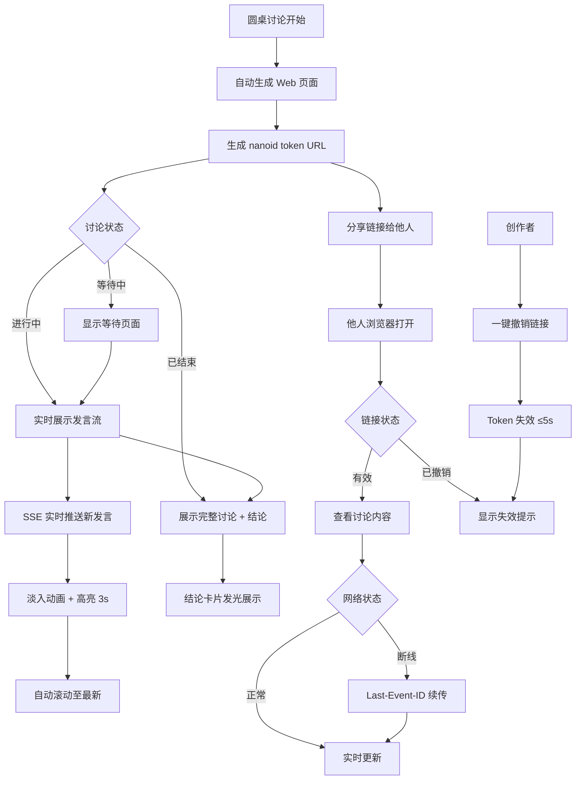
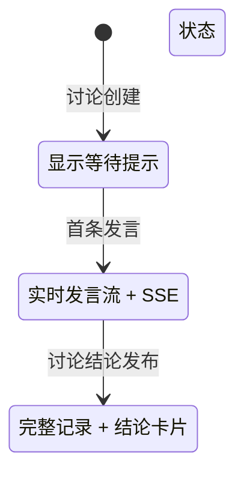
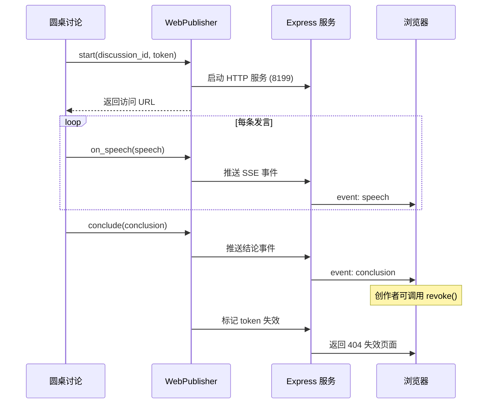

# 圆桌 Web Viewer — 产品需求文档 (PRD)

> **版本**: 1.0  
> **日期**: 2026-05-21  
> **状态**: 已确认（基于圆桌讨论 rt_36c7dbdd 三方共识）  
> **产品负责人**: 饼哥  
> **关联讨论**: `/docs/discussions/web-viewer-discussion.md`

---

## 1. 背景与目标

### 1.1 问题

圆桌讨论目前依赖 channel 配置才能分发内容。没有配置 channel 的用户无法查看讨论过程和结论，导致信息孤岛。

### 1.2 目标

为圆桌讨论内置 Web 查看页面，讨论开始时自动生成可分享链接，任何人通过浏览器即可实时查看讨论过程和最终结论。

### 1.3 核心价值

**降低圆桌讨论的分发门槛** — 零配置、零依赖、一键分享。

---

## 2. 目标用户

| 用户类型 | 场景 | 需求 |
|---------|------|------|
| 内容创作者/自媒体 | 分享 AI 讨论过程给读者 | 美观、可分享、实时更新 |
| 内部小团队 | 团队成员查看讨论结果 | 无需额外配置、移动端友好 |
| 外部协作方 | 与合作方共享讨论结论 | 临时访问、可控撤销 |

---

## 3. 功能需求

### 3.1 MVP 功能清单（P0）

| # | 功能 | 说明 | 验收标准 |
|---|------|------|---------|
| F1 | 自动 Web 页面 | 讨论开始时自动生成，nanoid(21) token URL | 讨论启动后 ≤5s 生成可访问链接 |
| F2 | 单页阅读 | 单列时间流布局，品牌蓝 #4F46E5，亮色主题 | 页面无横向滚动，发言按时间正序排列 |
| F3 | SSE 实时更新 | 新发言淡入动画 + 高亮 3s，Last-Event-ID 断线续传 | 新发言从写入到展示 ≤2s |
| F4 | 结论卡片 | 讨论结束后自动追加，发光卡片设计，自动滚动定位 | 结论出现后自动滚动至可见区域 |
| F5 | 移动端适配 | 响应式布局，<768px 单列，最小字号 14px | 微信内置浏览器无横向滚动 |
| F6 | 链接撤销 | 创作者可一键撤销 token，优雅失效提示 | 撤销后 ≤5s 页面变为失效提示 |
| F7 | 页面三态 | 等待中/进行中/已结束，视觉状态清晰区分 | 三种状态视觉差异明显，状态切换流畅 |

### 3.2 后续迭代（P1/P2）

| 阶段 | 功能 | 优先级 |
|------|------|--------|
| P1 | 过期时间（链接自动失效） | 高 |
| P2 | 访问密码（密码保护） | 中 |

---

## 4. 产品流程图

### 4.1 核心用户流程



### 4.2 页面状态流转



### 4.3 数据流



---

## 5. 技术方案

### 5.1 架构概览

```
┌─────────────────────────────────────────────┐
│         Hermes Agent 主进程                  │
│  roundtable-ai (Python)                     │
│    └─ discussion.json ← 唯一数据源           │
│    └─ 启动时 spawn → Web 服务 (8199)         │
├─────────────────────────────────────────────┤
│       Express (Node.js) 单文件               │
│  GET /r/:token         → SPA 页面            │
│  GET /api/:token/data  → JSON 数据           │
│  GET /api/:token/events→ SSE 推送            │
│  POST /api/:token/revoke → 链接撤销          │
└─────────────────────────────────────────────┘
```

### 5.2 技术选型

| 组件 | 选型 | 理由 |
|------|------|------|
| 后端服务 | Express (Node.js) 单文件 | 轻量、零依赖、与 Hermes 主进程集成 |
| 前端页面 | 单文件 SPA + Tailwind CDN | 零构建、内联 CSS+JS、快速迭代 |
| 实时通信 | SSE (Server-Sent Events) | 浏览器原生支持、自动重连、单向推送 |
| 数据存储 | discussion.json 文件 | 零额外依赖、与圆桌讨论系统一致 |
| 部署模式 | 集成到 Hermes 主进程 | 零配置、讨论开始即自动可用 |

### 5.3 文件结构

```
roundtable_ai/
  web_publisher.py      # 核心模块：WebPublisher 类
  web/
    index.html          # 单文件 SPA（内联 CSS+JS，Tailwind CDN）
    theme.css           # CSS 变量表
```

### 5.4 API 接口

| 路径 | 方法 | 说明 | 请求/响应 |
|------|------|------|----------|
| `/r/:token` | GET | SPA 页面入口 | 返回 HTML |
| `/api/:token/data` | GET | 返回完整 discussion JSON | `{"discussion": {...}}` |
| `/api/:token/events` | GET | SSE 实时推送 | `event: speech\ndata: {...}` |
| `/api/:token/revoke` | POST | L1 链接撤销 | `{"success": true}` |

### 5.5 Python 集成接口

```python
class WebPublisher:
    def start(self, discussion_id: str, token: str) -> str:
        """启动 Web 服务，返回访问 URL"""
        ...
    
    def on_speech(self, speech: dict):
        """Hook: 新发言时调用"""
        ...
    
    def conclude(self, conclusion: str):
        """Hook: 讨论结束时调用"""
        ...
    
    def revoke(self):
        """L1 链接撤销"""
        ...
```

**集成点**: `Roundtable.run()` 主循环中，每条发言后调 `publisher.on_speech(speech)`，讨论结束时调 `publisher.conclude(conclusion)`。

---

## 6. 隐私与安全

### 6.1 隐私分层策略

| 层级 | 功能 | 优先级 | 状态 |
|------|------|--------|------|
| L1 | 链接撤销 | P0 | MVP |
| L2 | 过期时间 | P1 | 后续迭代 |
| L3 | 访问密码 | P2 | 后续迭代 |

### 6.2 安全措施

- **Token 生成**: nanoid(21)，不可猜测
- **链接撤销**: 创作者可一键撤销，撤销后 ≤5s 生效
- **创建提示**: 讨论开始时提示"本讨论将生成公开页面"
- **无认证设计**: MVP 不要求登录，降低使用门槛

---

## 7. 验收标准

| 项目 | 标准 | 测试方法 |
|------|------|---------|
| 首屏加载 | 3G 网络下 ≤3s 看到已有发言 | Chrome DevTools 模拟 3G |
| 实时延迟 | 新发言从写入到页面展示 ≤2s | 发送测试发言，计时 |
| 移动端 | 微信内置浏览器打开无横向滚动 | 微信真机测试 |
| 断线恢复 | 网络中断 30s 内重连后自动补齐 | 模拟网络中断后恢复 |
| 链接撤销 | 撤销后 ≤5s 页面变为失效提示 | 调用撤销 API，观察页面 |
| 并发 | 单讨论支持 ≥20 同时在线查看 | 压力测试工具 |
| 零配置 | 用户无需额外操作，讨论开始即自动可用 | 端到端测试 |

---

## 8. 风险与应对

| 风险 | 影响 | 应对策略 |
|------|------|---------|
| 端口冲突 | 服务无法启动 | 默认 8199，支持 `--web-port` 参数 |
| 文件锁 | 数据不一致 | 多进程读写 discussion.json 需加锁 |
| 内存泄漏 | 服务不稳定 | SSE 长连接需处理断开清理 |
| 微信兼容 | 移动端不可用 | SSE 可能被拦截，需降级为长轮询 |
| Token 泄露 | 隐私泄露 | 创建时提示"本讨论将生成公开页面" |

---

## 9. 工期与分工

| 角色 | 任务 | 工期 | 依赖 |
|------|------|------|------|
| 码飞 | 后端开发（WebPublisher + SSE + 端口探测 + 文件锁） | 2 天 | 无 |
| 像素姐 | 前端页面（三态 + 响应式 + 主题变量） | 1 天 | 可与码飞并行 |
| 协调者 | 集成测试 + 微信真机验证 + 验收 | 1 天 buffer | 后端+前端完成 |

**总工期**: 3 个工作日（后端 2 天 + 前端 1 天并行）

---

## 10. 设计交付物

1. **CSS 变量表** (`theme.css`)
2. **页面状态原型 × 3** (等待中/进行中/已结束)
3. **发言卡片组件规范**
4. **移动端适配规则**
5. **实时更新动效规范**
6. **分享交互稿**

---

## 11. 确认记录

- **2026-05-21**: 圆桌讨论 rt_36c7dbdd，三方确认（饼哥、像素姐、码飞）
- **2026-05-21**: PRD 基于结论文档输出，产品总监确认

---

*本文档基于圆桌讨论结论自动生成，如有疑问请联系产品负责人。*
