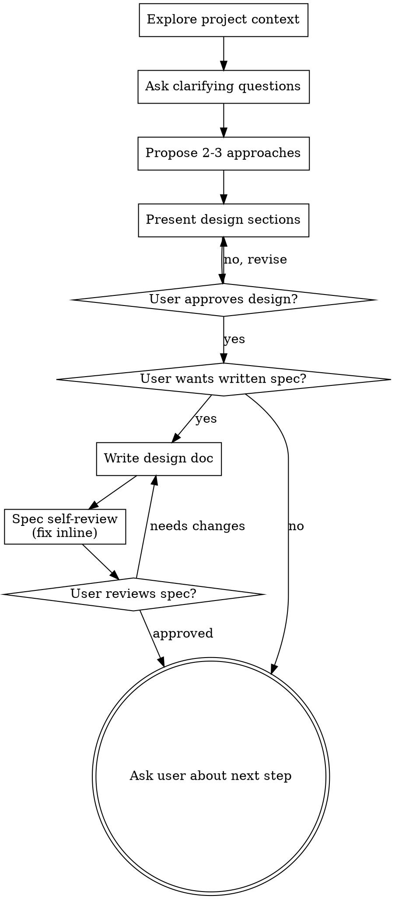

# Brainstorming Ideas Into Designs

Help turn ideas into fully formed designs and specs through natural collaborative dialogue.

Start by understanding the current project context, then ask questions one at a time to refine the idea. Once you understand what you're building, present the design and get user approval.

<HARD-GATE>
Do NOT invoke any execution skill, take any implementation action, or start producing deliverables until you have presented a design and the user has approved it. This applies to EVERY task regardless of perceived simplicity.
</HARD-GATE>

## Anti-Pattern: "This Is Too Simple To Need A Design"

Every task goes through this process. A short document, a minor change, a config tweak — all of them. "Simple" tasks are where unexamined assumptions cause the most wasted work. The design can be short (a few sentences for truly simple tasks), but you MUST present it and get approval.

## Checklist

You MUST create a task for each of these items and complete them in order:

1. **Explore project context** — check existing files, docs, prior work
2. **Ask clarifying questions** — one at a time, understand purpose/constraints/success criteria
3. **Propose 2-3 approaches** — with trade-offs and your recommendation
4. **Present design** — in sections scaled to their complexity, get user approval after each section
5. **Confirm next step with user** — ask the user if they want a written spec saved to disk, or if the conversation summary is sufficient
6. **Write design doc (if requested)** — only if user confirms, save to `docs/specs/YYYY-MM-DD-<topic>-design.md`
7. **Spec self-review (if written)** — quick inline check for placeholders, contradictions, ambiguity, scope (see below)
8. **User reviews written spec** — ask user to review the spec file before proceeding
9. **Ask user about next step** — ask if user wants to proceed to execution planning; do NOT automatically invoke other skills

## Process Flow



## Clarifying Questions

Ask one question at a time. Do NOT ask multiple questions in one message.

**Good questions:**
- "What problem does this solve for the user?"
- "What does success look like for this?"
- "Are there any constraints I should know about?"
- "Who is the audience for this?"

**Bad questions:**
- "What's the goal, what are the constraints, and who uses this?" (too many at once)

## Proposing Approaches

After gathering enough context, propose 2-3 distinct approaches:

```
Approach 1: [Name]
- How it works: ...
- Trade-offs: ...

Approach 2: [Name]
- How it works: ...
- Trade-offs: ...

My recommendation: Approach N, because ...
```

Don't just list options — give a recommendation with reasoning.

## Spec Self-Review

After writing the spec, check it yourself before asking the user to review:

1. **Completeness** — Does every stated goal have a corresponding section?
2. **Placeholder scan** — Any "TBD", "TODO", "fill in later"? Fix them.
3. **Contradiction check** — Do any two sections conflict?
4. **Scope check** — Is anything in the spec out of scope for this task?

Fix issues inline. Then ask user to review.

## Transition to Execution

After user approves the spec, ask before proceeding:

```
Spec approved. Would you like me to create an execution plan using agent-workflow:writing-plans?
```

Wait for explicit user confirmation before invoking any other skill or writing any file.

## Common Mistakes

**Skipping the design for "simple" tasks**
- Problem: Unexamined assumptions cause rework
- Fix: Always present a design, even if brief

**Asking multiple questions at once**
- Problem: Overwhelming, hard to answer
- Fix: One question per message

**Presenting a design without trade-offs**
- Problem: User can't make informed choice
- Fix: Always include trade-offs and a recommendation

**Starting execution before approval**
- Problem: Wasted work if direction changes
- Fix: Hard gate — no action before approval
