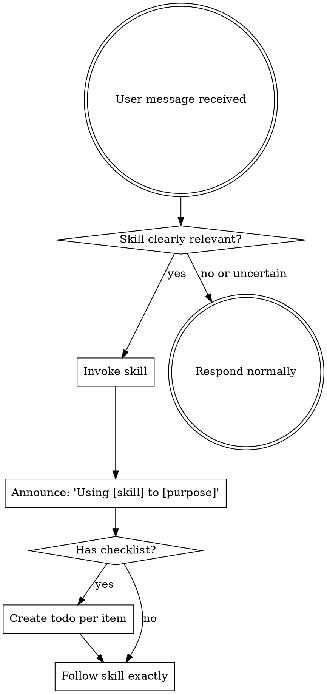

## Skill Invocation Guidelines

When a skill is clearly and directly relevant to the current task, invoke it before proceeding. If relevance is uncertain, you may ask the user or proceed without it — do not force skill invocation on speculative grounds.

**User instructions always take precedence over skill behavior.**

## Instruction Priority

Agent-workflow skills override default behavior, but **user instructions always take precedence**:

1. **User's explicit instructions** (project config files, direct requests) — highest priority
2. **Agent-workflow skills** — override default behavior where they conflict
3. **Default behavior** — lowest priority

## How to Access Skills

Use the platform's skill invocation mechanism. When you invoke a skill, its content is loaded and presented to you — follow it directly.

# Using Skills

## The Rule

**Invoke skills when they are clearly relevant to the current task.** If a skill directly matches what the user is asking for, invoke it. If relevance is uncertain, ask the user or proceed normally — the agent should not be blocked from responding by speculative skill checks.

## Red Flags

These thoughts indicate you may be forcing a skill where it doesn't belong:

| Thought | Guidance |
|---------|----------|
| "This might apply even though user didn't ask" | If it's not clearly relevant, skip it or ask the user |
| "I must invoke before responding" | You can clarify, ask questions, or respond directly first |
| "Every task needs a skill" | Most tasks don't. Only invoke when clearly applicable |

## Skill Priority

When multiple skills could apply, use this order:

1. **Process skills first** (brainstorming, systematic-problem-solving) — these determine HOW to approach the task
2. **Execution skills second** (writing-plans, subagent-driven-execution) — these guide execution

"Let's do X" → brainstorming first, then execution skills.
"Something went wrong" → systematic-problem-solving first, then domain-specific skills.

## Skill Types

**Rigid** (systematic-problem-solving, verification-before-completion): Follow exactly. Don't adapt away the discipline.

**Flexible** (brainstorming, writing-plans): Adapt principles to context.

The skill itself tells you which type it is.

## User Instructions

Instructions say WHAT, not HOW. "Do X" or "Fix Y" doesn't mean skip workflows.
