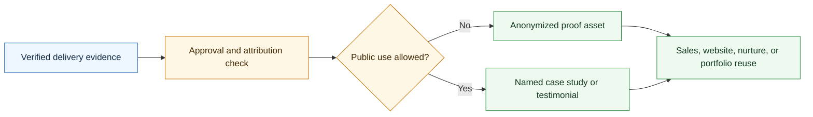

# Agentic Case Study Skill

<p align="center">
  
</p>

A CompleteTech LLC Codex skill for creating case studies, testimonials, and proof assets after agentic development delivery.

## About

Part of the CompleteTech LLC agentic services skill library. This skill packages verified delivery outcomes into approved proof assets while preserving confidentiality, attribution boundaries, and brand consistency.

## OpenClaw / ClawHub Metadata

- Skill key: `agentic-case-study-skill`
- Version-ready metadata: `1.0.3`
- Homepage: https://github.com/CompleteTech-LLC/agentic-case-study-skill
- README: https://github.com/CompleteTech-LLC/agentic-case-study-skill#readme
- Runtime binaries: `python3`
- Python packages: `reportlab==4.5.1`, `pyyaml==6.0.3` (optional PNG preview: `pypdfium2==5.8.0`, `pillow==12.2.0`)
- Intended registry/discovery tags: `latest`, `complete-tech`, `codex-skill`, `agentic-development`, `agentic-workflows`, `case-study`, `testimonials`, `proof-assets`, `pdf`, `pdf-generator`
- License: repository code, templates, and documentation use MIT; published by CompleteTech on ClawHub.
- Brand assets: CompleteTech LLC names, logos, seals, and brand assets are reserved; see `BRAND_ASSETS.md`.

## Workflow Diagram

Source: [assets/diagrams/workflow.mmd](assets/diagrams/workflow.mmd).




## What It Does

- Selects the right proof artifact by evidence, approval status, and channel.
- Drafts case study intake, client interviews, anonymized/named case studies, before/after summaries, implementation stories, technical notes, risk/control summaries, testimonials, proof libraries, sales one-pagers, website case studies, LinkedIn posts, nurture stories, referral blurbs, portfolio entries, pitches, award submissions, press releases, and approval checklists.
- Helps turn delivered agentic workflow projects into credible sales and marketing assets without inventing proof or exposing sensitive details.
- Keeps proof aligned with practical CompleteTech LLC positioning: bounded agentic workflow implementation, human approval gates, evaluation, monitoring, documentation, support, and handoff.

## Contents

- `SKILL.md` - operating instructions and proof-asset selection guide.
- `references/proof-catalog.md` - reusable case study/testimonial/proof templates.
- `references/use-case-decision-table.md` - quick guide for choosing the right artifact.
- `references/proof-lifecycle.md` - flow from proof intake through approval and reuse.
- `references/proof-positioning.md` - CompleteTech LLC evidence and anonymization guardrails.
- `scripts/render_proof.py` - deterministic template listing and rendering helper.
- `scripts/render_pdf.py` - branded CompleteTech PDF generator (Markdown -> PDF + optional PNG preview).
- `requirements.txt` - Python dependencies for branded PDF rendering.

## Quick Start

```bash
python3 scripts/render_proof.py --list
python3 scripts/render_proof.py \
  --template anonymized-case-study \
  --var workflow="support triage" \
  --var before_state="manual queue review" \
  --var after_state="reviewed agent workflow with approval gates"
```

Rendered assets are drafts. Replace placeholders with verified, client-approved facts before public or external use.

## Example


Example files: [Markdown](assets/examples/example.md) · [PDF](assets/examples/example.pdf) · [DOCX](assets/examples/example.docx).

**Client case study: Northwind Trading Co. — Customer Support Email Triage Agent**

- Named, client-approved proof with measured outcomes from the pilot evaluation set.
- Separates measured outcomes (93.4% routing accuracy) from qualitative observations.
- Includes an approved customer quote and the safety controls behind the result.
- Uses only verified, approved facts — no invented ROI or permissions.

Generate it in one command (branded PDF + Markdown, like the contract skill):

```bash
pip install -r requirements.txt
python3 scripts/render_proof.py --template public-named-client-case-study \
  --out assets/examples/example.pdf --png assets/examples/example.png \
  --markdown-out assets/examples/example.md \
  --logo assets/logo.png --title "Customer Support Email Triage Agent" --doc-type "CLIENT CASE STUDY" \
  --subtitle "Northwind Trading Co. × CompleteTech LLC" --meta "CASE NO.=CASE-2026-007" --meta "DATE=2026-07-01"
```

The committed `example.{md,pdf,png}` use curated, realistic demonstration data for the Northwind Trading Co. support-triage pilot; pass `--var key=value` to fill template placeholders with your own facts.

## Brand Notes

Use careful evidence packaging. Distinguish measured outcomes from qualitative observations, protect confidential details, anonymize when needed, avoid regulated-use assurances, avoid legal claims, avoid fabricated ROI/savings metrics, and preserve the CompleteTech LLC emphasis on bounded implementation, human approval gates, evaluation, monitoring, documentation, support, and handoff.

## Runtime Permissions

This skill needs local filesystem access only for the documented renderer workflow. It reads bundled templates, references, examples, `assets/logo.png`, and user-provided Markdown or variables, then writes only to the selected `--out`, `--png`, `--markdown-out`, or default `output/` artifact paths. It runs local Python renderer entry points and does not require network access, credential access, persistence, privilege escalation, or destructive file operations.

## License

Code, templates, and documentation are licensed under the MIT License. CompleteTech LLC names, logos, seals, and brand assets are reserved and are not licensed for reuse except to identify this project. See `LICENSE` and `BRAND_ASSETS.md`.

## Network Boundary

This skill is local-only. It does not include outbound network helpers, callbacks, or any helper that posts case-study run metadata to an external service.
