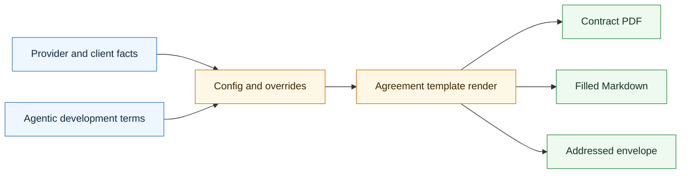

# Agentic Contract Skill

<p align="center">
  
</p>

A configurable, branded PDF skill for CompleteTech LLC Agentic Development Services Agreements.

## About

Part of the CompleteTech LLC agentic services skill library. This skill generates branded agreement artifacts for bounded agentic development services using verified provider, client, project, and governance facts.

## OpenClaw / ClawHub Metadata

- Skill key: `agentic-contract-skill`
- Version-ready metadata: `1.0.9`
- Homepage: https://github.com/CompleteTech-LLC/agentic-contract-skill
- README: https://github.com/CompleteTech-LLC/agentic-contract-skill#readme
- Runtime binaries: `python3`
- Python packages: `reportlab==4.5.1`, `jinja2==3.1.6`, `pyyaml==6.0.3`
- Intended registry/discovery tags: `latest`, `complete-tech`, `codex-skill`, `agentic-development`, `agentic-workflows`, `contract`, `agreement`, `pdf-generator`
- License: repository code, templates, and documentation use MIT; published by CompleteTech on ClawHub.
- Brand assets: CompleteTech LLC names, logos, seals, and brand assets are reserved; see `BRAND_ASSETS.md`.

## Workflow Diagram

Source: [assets/diagrams/workflow.mmd](assets/diagrams/workflow.mmd).




## What It Does

- Generates branded agreement package artifacts from verified provider, client, project, commercial, and governance facts.
- Supports base config plus override files so demos and client-specific packages can reuse the same generator.
- Produces contract PDF, filled Markdown, and optional addressed envelope output.
- Keeps legal terms, commercial authority, billing, delivery, and packaging boundaries explicit.

## Contents

- `SKILL.md` - operating instructions, contract boundaries, input rules, and generator guidance.
- `generate_contract.py` - root CLI entry point for agreement package generation.
- `config.ini` - default provider, agreement, branding, and envelope configuration.
- `client_config.example.ini` - example client override configuration.
- `examples/` - sample override inputs for runnable demos.
- `references/agentic_development_agreement.md` - packaged contract template source used by the generator.
- `templates/` - GitHub compatibility copy of the contract template.
- `assets/diagrams/workflow.mmd` - Mermaid source for the workflow diagram.
- `assets/examples/` - rendered demonstration artifacts used by the README.
- `references/` - reserved for supporting reference docs.
- `scripts/` - reserved for helper automation.
- `requirements.txt` - Python dependencies for contract rendering.

## Quick Start

```bash
pip install -r requirements.txt

python generate_contract.py --config config.ini \
  --out output/agentic_development_contract_demo.pdf
```

The contract generator creates:

- A PDF contract at the `--out` path.
- A filled Markdown source file beside the PDF unless `--markdown-out` is provided.
- A separate printable #10 envelope PDF unless disabled.

## Example


Example files: [Markdown](assets/examples/example.md) · [PDF](assets/examples/example.pdf) · [DOCX](assets/examples/example.docx) · [Envelope PDF](assets/examples/example-envelope.pdf).

**Agreement package: Northwind Trading Co. — Customer Support Email Triage Agent (Pilot)**

```bash
python generate_contract.py \
  --config config.ini examples/northwind_support_triage.ini \
  --out assets/examples/example.pdf \
  --markdown-out assets/examples/example.md \
  --envelope-out assets/examples/example-envelope.pdf
```

Example package (realistic demonstration data):

- Contract: `ADSA-2026-0142`, an 8-week, USD 28,000 fixed-fee Agentic Development Services Agreement between CompleteTech LLC and Northwind Trading Co.
- System: bounded customer support email-triage agent — classify, draft, and route inbound support email.
- Governance: human approval required before any customer-facing send; sandbox-only until acceptance.
- Delivery inputs: approved service summary, evaluation plan, monitoring plan, excluded uses, fee, and payment terms.
- Packaging handoff: use `agentic-envelope-skill` for final recipient metadata, attachment manifest, and delivery-readiness review.

## Overrides

Pass multiple INI files; later files override earlier files:

```bash
python generate_contract.py \
  --config config.ini examples/minimum_client_override.ini \
  --out output/acme_contract.pdf \
  --envelope-out output/acme_envelope.pdf
```

Skip the envelope for one run:

```bash
python generate_contract.py --config config.ini --out output/no_envelope_contract.pdf --no-envelope
```

## Branding Assets

- `assets/logo.png` - CompleteTech LLC primary logo, used on contract cover and letterhead.

## Brand Notes

Use a direct, bounded, implementation-focused tone. Do not treat the demo contract as legal advice, and do not invent commercial authority, client acceptance, billing approval, signatures, security signoff, or mailing readiness.

## Toggles

In `[branding]`:

```ini
watermark_enabled = yes
watermark_text = DEMO DRAFT
cover_page_enabled = yes
letterhead_enabled = yes
header_enabled = yes
footer_enabled = yes
envelope_enabled = yes
```

## Legal Note

The contract template is a demonstration template, not legal advice. Replace it with counsel-reviewed terms before any real engagement.

## Network Boundary

This skill is local-only. It does not include outbound network helpers, callbacks, or any helper that posts contract run metadata to an external service.

## License

Code, templates, and documentation are licensed under the MIT License. CompleteTech LLC names, logos, seals, and brand assets are reserved and are not licensed for reuse except to identify this project. See `LICENSE` and `BRAND_ASSETS.md`.
