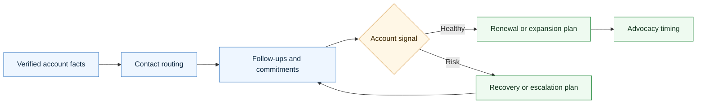

# Agentic Customer Success Skill

<p align="center">
  
</p>

A CompleteTech LLC Codex skill for creating customer success and account management artifacts for agentic development clients.

## About

Part of the CompleteTech LLC agentic services skill library. This skill keeps post-contact and post-sale client relationships organized through verified routing, follow-up, health, renewal, expansion, and advocacy artifacts.

## OpenClaw / ClawHub Metadata

- Skill key: `agentic-customer-success-skill`
- Version-ready metadata: `1.0.2`
- Homepage: https://github.com/CompleteTech-LLC/agentic-customer-success-skill
- README: https://github.com/CompleteTech-LLC/agentic-customer-success-skill#readme
- Runtime binaries: `python3`
- Python packages: `reportlab==4.5.1`, `pyyaml==6.0.3` (optional PNG preview: `pypdfium2==5.8.0`, `pillow==12.2.0`)
- Intended registry/discovery tags: `latest`, `complete-tech`, `codex-skill`, `agentic-development`, `agentic-workflows`, `customer-success`, `account-management`, `renewal`, `pdf`, `pdf-generator`
- License: repository code, templates, and documentation use MIT; published by CompleteTech on ClawHub.
- Brand assets: CompleteTech LLC names, logos, seals, and brand assets are reserved; see `BRAND_ASSETS.md`.

## Workflow Diagram

Source: [assets/diagrams/workflow.mmd](assets/diagrams/workflow.mmd).




## What It Does

- Selects the right customer success artifact by customer situation, account stage, relationship risk, contact-routing need, support issue, renewal timing, or expansion opportunity.
- Drafts account profiles, contact maps, routing guides, meeting notes, follow-up trackers, health scorecards, relationship risk logs, renewal reviews, expansion briefs, QBRs, support escalation summaries, satisfaction surveys, referral/testimonial request plans, executive check-ins, at-risk recovery plans, offboarding checklists, stakeholder change notes, cadence plans, success criteria reviews, and adoption check-ins.
- Keeps customer management focused on verified facts, clear ownership, practical next steps, and appropriate human review.
- Helps agents avoid missed follow-ups, wrong-contact messages, invented sentiment, unsupported renewal assumptions, and premature testimonial/referral requests.

## Contents

- `SKILL.md` - operating instructions and artifact-selection guide.
- `references/customer-success-catalog.md` - reusable customer success artifact templates.
- `references/use-case-decision-table.md` - quick guide for choosing the right artifact.
- `references/customer-success-lifecycle.md` - flow from first contact through delivery, launch, renewal, expansion, or offboarding.
- `references/customer-success-positioning.md` - CompleteTech LLC language, contact routing, and guardrails.
- `references/template-index.json` - machine-readable artifact metadata.
- `scripts/render_customer_success.py` - deterministic artifact listing and rendering helper.
- `scripts/render_pdf.py` - branded CompleteTech PDF generator (Markdown -> PDF + optional PNG preview).
- `requirements.txt` - Python dependencies for branded PDF rendering.

## Quick Start

```bash
python3 scripts/render_customer_success.py --list
python3 scripts/render_customer_success.py \
  --template client-account-profile \
  --var client_name=Acme \
  --var workflow="support triage agent"
```

Rendered artifacts are drafts. Replace placeholders with verified account, contact, communication, delivery, support, renewal, and approval facts before use.

## Example


Example files: [Markdown](assets/examples/example.md) · [PDF](assets/examples/example.pdf) · [DOCX](assets/examples/example.docx).

**Internal account artifact: Northwind Trading Co. health scorecard & QBR**

- Health scorecard across engagement, product fit, adoption, commercial, and risk.
- Verified contact routing (sponsor, legal, billing) with a security contact still TBD.
- Open commitments, follow-ups, and an expansion signal for a returns workflow.
- Internal artifact only — not public proof.

Generate it in one command (branded PDF + Markdown, like the contract skill):

```bash
pip install -r requirements.txt
python3 scripts/render_customer_success.py --template client-health-scorecard \
  --out assets/examples/example.pdf --png assets/examples/example.png \
  --markdown-out assets/examples/example.md \
  --logo assets/logo.png --title "Client Health Scorecard & QBR Summary" --doc-type "CUSTOMER SUCCESS — INTERNAL" \
  --subtitle "Account: <b>Northwind Trading Co.</b>" --meta "DOCUMENT NO.=CS-2026-0051" --meta "DATE=2026-06-10"
```

The committed `example.{md,pdf,png}` use curated, realistic demonstration data for the Northwind Trading Co. support-triage pilot; pass `--var key=value` to fill template placeholders with your own facts.

## Brand Notes

Use a practical, direct, professional tone. Customer success artifacts should help CompleteTech LLC keep client relationships organized: know the contacts, route messages correctly, track commitments, surface risks early, confirm success criteria, and ask for referrals or testimonials only with verified approval. Do not invent client facts, customer sentiment, approvals, renewal intent, testimonials, referrals, email addresses, or business outcomes.

## Runtime Permissions

This skill needs local filesystem access only for the documented renderer workflow. It reads bundled templates, references, examples, `assets/logo.png`, and user-provided Markdown or variables, then writes only to the selected `--out`, `--png`, `--markdown-out`, or default `output/` artifact paths. It runs local Python renderer entry points and does not require network access, credential access, persistence, privilege escalation, or destructive file operations.

## Network Boundary

This skill is local-only. It does not include outbound network helpers, callbacks, or any helper that posts customer-success run metadata to an external service.

## License

Code, templates, and documentation are licensed under the MIT License. CompleteTech LLC names, logos, seals, and brand assets are reserved and are not licensed for reuse except to identify this project. See `LICENSE` and `BRAND_ASSETS.md`.
