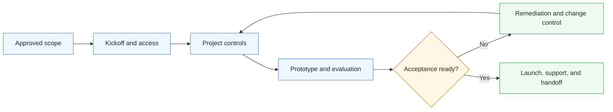

# Agentic Delivery Skill

<p align="center">
  
</p>

A CompleteTech LLC Codex skill for creating delivery execution artifacts after an agentic development proposal/SOW or contract is approved.

## About

Part of the CompleteTech LLC agentic services skill library. This skill supports approved-scope execution from kickoff through evaluation, launch, support, handoff, and closeout.

## OpenClaw / ClawHub Metadata

- Skill key: `agentic-delivery-skill`
- Version-ready metadata: `1.0.9`
- Homepage: https://github.com/CompleteTech-LLC/agentic-delivery-skill
- README: https://github.com/CompleteTech-LLC/agentic-delivery-skill#readme
- Runtime binaries: `python3`
- Python packages: `reportlab==4.5.1`, `pyyaml==6.0.3` (optional PNG preview: `pypdfium2==5.8.0`, `pillow==12.2.0`)
- Intended registry/discovery tags: `latest`, `complete-tech`, `codex-skill`, `agentic-development`, `agentic-workflows`, `delivery`, `project-management`, `handoff`, `pdf`, `pdf-generator`
- License: repository code, templates, and documentation use MIT; published by CompleteTech on ClawHub.
- Brand assets: CompleteTech LLC names, logos, seals, and brand assets are reserved; see `BRAND_ASSETS.md`.

## Workflow Diagram

Source: [assets/diagrams/workflow.mmd](assets/diagrams/workflow.mmd).




## What It Does

- Selects the right delivery artifact by operational event.
- Drafts kickoff agendas, access checklists, project plans, milestone trackers, status updates, decision logs, risk/issue logs, change requests, prototype reviews, evaluation reports, acceptance packets, launch readiness checks, monitoring plans, support plans, handoff docs, runbooks, quickstarts, closeout summaries, and escalation procedures.
- Helps run the engagement cleanly and feeds verified delivery facts back into proposal, contract, invoice, email, discovery, and certificate workflows.
- Keeps delivery focused on practical, bounded agentic workflow implementation with human approval gates, evaluation evidence, logs, monitoring, documentation, support, and handoff.

## Contents

- `SKILL.md` - operating instructions and artifact-selection guide.
- `references/delivery-catalog.md` - reusable delivery/execution artifact templates.
- `references/use-case-decision-table.md` - quick guide for choosing the right artifact.
- `references/delivery-lifecycle.md` - flow from kickoff through support and closeout.
- `references/delivery-positioning.md` - CompleteTech LLC delivery language and guardrails.
- `scripts/render_delivery.py` - deterministic template listing and rendering helper.
- `scripts/render_pdf.py` - branded CompleteTech PDF generator (Markdown -> PDF + optional PNG preview).
- `requirements.txt` - Python dependencies for branded PDF rendering.

## Quick Start

```bash
python3 scripts/render_delivery.py --list
python3 scripts/render_delivery.py \
  --template kickoff-agenda \
  --var client_name=Acme \
  --var workflow="support triage"
```

Rendered artifacts are drafts. Replace placeholders with verified client, scope, schedule, approval, risk, test, support, and handoff details before use.

## Example


Example files: [Markdown](assets/examples/example.md) · [PDF](assets/examples/example.pdf) · [DOCX](assets/examples/example.docx).

**Delivery artifact: Northwind Trading Co. — launch readiness for the pilot**

- Evaluation evidence: 93.4% routing accuracy, 4.3/5 reply quality, 0/42 prompt-injection actions.
- Operational readiness: logging, misclassification register, and rollback documented.
- Open items and approval gates tracked before the acceptance demonstration.
- Launch blocked until security signoff and sponsor go/no-go are recorded.

Generate it in one command (branded PDF + Markdown):

```bash
pip install -r requirements.txt
python3 scripts/render_delivery.py --template launch-readiness-checklist \
  --out assets/examples/example.pdf --png assets/examples/example.png \
  --markdown-out assets/examples/example.md \
  --logo assets/logo.png --title "Launch Readiness Checklist" --doc-type "DELIVERY ARTIFACT" \
  --subtitle "Northwind Trading Co. — Support Email Triage Agent (Pilot)" --meta "DOCUMENT NO.=DEL-2026-0233" --meta "DATE=2026-06-12"
```

The committed `example.{md,pdf,png}` use curated, realistic demonstration data for the Northwind Trading Co. support-triage pilot; pass `--var key=value` to fill template placeholders with your own facts.

## Brand Notes

Use a direct, concrete, low-hype tone. Present delivery as practical bounded implementation: execute the approved scope, protect human approval gates, track decisions and risks, verify evaluation examples, document logs and monitoring, prepare reviewers/admins, manage change requests, confirm acceptance, and hand off cleanly. Do not invent client facts, approvals, test results, metrics, regulated-use assurances, legal claims, or production readiness.

## Runtime Permissions

| Capability | Boundary |
|---|---|
| Files read | Bundled templates, references, examples, `assets/logo.png`, and user-provided Markdown or variables. |
| Files written | Only selected `--out`, `--png`, `--markdown-out`, or default `output/` artifact paths. |
| Local commands | Delivery and PDF renderer entry points. |
| Not required | Network access, credential access, persistence, privilege escalation, destructive file operations, background services, or project-system API calls. |

## License

Code, templates, and documentation are licensed under the MIT License. CompleteTech LLC names, logos, seals, and brand assets are reserved and are not licensed for reuse except to identify this project. See `LICENSE` and `BRAND_ASSETS.md`.

## Network Boundary

This skill is local-only. It does not include outbound network helpers, callbacks, or any helper that posts delivery run metadata to an external service.
