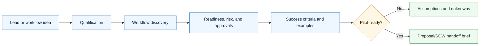

# Agentic Discovery Skill

<p align="center">
  
</p>

A CompleteTech LLC Codex skill for creating discovery and scoping artifacts before proposal/SOW creation for agentic development opportunities.

## About

Part of the CompleteTech LLC agentic services skill library. This skill turns early workflow opportunities into verified facts, readiness checks, risk boundaries, success criteria, and proposal handoff material.

## OpenClaw / ClawHub Metadata

- Skill key: `agentic-discovery-skill`
- Version-ready metadata: `1.0.3`
- Homepage: https://github.com/CompleteTech-LLC/agentic-discovery-skill
- README: https://github.com/CompleteTech-LLC/agentic-discovery-skill#readme
- Runtime binaries: `python3`
- Python packages: `reportlab==4.5.1`, `pyyaml==6.0.3` (optional PNG preview: `pypdfium2==5.8.0`, `pillow==12.2.0`)
- Intended registry/discovery tags: `latest`, `complete-tech`, `codex-skill`, `agentic-development`, `agentic-workflows`, `discovery`, `scoping`, `requirements`, `pdf`, `pdf-generator`
- License: repository code, templates, and documentation use MIT; published by CompleteTech on ClawHub.
- Brand assets: CompleteTech LLC names, logos, seals, and brand assets are reserved; see `BRAND_ASSETS.md`.

## Workflow Diagram

Source: [assets/diagrams/workflow.mmd](assets/diagrams/workflow.mmd).




## What It Does

- Selects the right discovery artifact by situation.
- Drafts intake questionnaires, discovery scripts, interview guides, workflow maps, readiness checklists, approval-gate reviews, risk checks, success criteria, evaluation worksheets, scorecards, recaps, and proposal handoff briefs.
- Helps gather verified facts for the existing agentic email, proposal, contract, invoice, and certificate skills.
- Keeps discovery focused on practical, bounded workflow scoping with human approvals, evaluation, logging, monitoring, documentation, support, and handoff.

## Contents

- `SKILL.md` - operating instructions and artifact-selection guide.
- `references/discovery-catalog.md` - reusable discovery/scoping artifact templates.
- `references/use-case-decision-table.md` - quick guide for choosing the right artifact.
- `references/discovery-lifecycle.md` - flow from qualification through proposal handoff.
- `references/discovery-positioning.md` - CompleteTech LLC discovery language and guardrails.
- `scripts/render_discovery.py` - deterministic template listing and rendering helper.
- `scripts/render_pdf.py` - branded CompleteTech PDF generator (Markdown -> PDF + optional PNG preview).
- `requirements.txt` - Python dependencies for branded PDF rendering.

## Quick Start

```bash
python3 scripts/render_discovery.py --list
python3 scripts/render_discovery.py \
  --template client-intake-questionnaire \
  --var client_name=Acme \
  --var workflow="support triage"
```

Rendered artifacts are drafts. Replace placeholders with verified client, workflow, systems, approval, risk, and success criteria details before use.

## Example


Example files: [Markdown](assets/examples/example.md) · [PDF](assets/examples/example.pdf) · [DOCX](assets/examples/example.docx).

**Discovery handoff brief: Northwind Trading Co. — Customer Support Email Triage Agent**

- Workflow: hand-triaged support inbox (~850 emails/day) with a 6–9 hour first-response lag.
- Readiness: sandbox mailbox available; help-center subset and labeled test set still needed.
- Gates: human approval before any customer-facing send, escalation, or refund suggestion.
- Downstream: proposal can scope an 8-week pilot once data boundaries and excluded uses are confirmed.

Generate it in one command (branded PDF + Markdown, like the contract skill):

```bash
pip install -r requirements.txt
python3 scripts/render_discovery.py --template requirements-brief-for-proposal-sow-handoff \
  --out assets/examples/example.pdf --png assets/examples/example.png \
  --markdown-out assets/examples/example.md \
  --logo assets/logo.png --title "Requirements Brief — Proposal / SOW Handoff" --doc-type "DISCOVERY HANDOFF" \
  --subtitle "Prepared for <b>Northwind Trading Co.</b>" --meta "DOCUMENT NO.=DISC-2026-0117" --meta "DATE=2026-05-15"
```

The committed `example.{md,pdf,png}` use curated, realistic demonstration data for the Northwind Trading Co. support-triage pilot; pass `--var key=value` to fill template placeholders with your own facts.

## Brand Notes

Use a direct, concrete, low-hype tone. Present discovery as bounded workflow scoping: repeated workflow, inputs, systems, tools, retrieval sources, decision points, human approvals, risks, exclusions, evaluation examples, logging, monitoring, documentation, support, and handoff. Do not invent proof, regulated-use assurances, legal claims, savings metrics, or client facts.

## Network Boundary

This skill is local-only. It does not include outbound network helpers, callbacks, or any helper that posts discovery run metadata to an external service.

## License

Code, templates, and documentation are licensed under the MIT License. CompleteTech LLC names, logos, seals, and brand assets are reserved and are not licensed for reuse except to identify this project. See `LICENSE` and `BRAND_ASSETS.md`.
