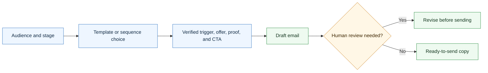

# Agentic Email Skill

<p align="center">
  
</p>

A CompleteTech LLC Codex skill for creating agentic development outreach, sales, follow-up, delivery, retention, referral, and win-back emails.

## About

Part of the CompleteTech LLC agentic services skill library. This skill drafts message copy and sequences that support sales, delivery, retention, referral, and reactivation without replacing specialist artifacts.

## OpenClaw / ClawHub Metadata

- Skill key: `agentic-email-skill`
- Version-ready metadata: `1.0.9`
- Homepage: https://github.com/CompleteTech-LLC/agentic-email-skill
- README: https://github.com/CompleteTech-LLC/agentic-email-skill#readme
- Runtime binaries: `python3`
- Python packages: `reportlab==4.5.1`, `pyyaml==6.0.3` (optional PNG preview: `pypdfium2==5.8.0`, `pillow==12.2.0`)
- Intended registry/discovery tags: `latest`, `complete-tech`, `codex-skill`, `agentic-development`, `agentic-workflows`, `email`, `outreach`, `sales`, `pdf`, `pdf-generator`
- License: repository code, templates, and documentation use MIT; published by CompleteTech on ClawHub.
- Brand assets: CompleteTech LLC names, logos, seals, and brand assets are reserved; see `BRAND_ASSETS.md`.

## Workflow Diagram

Source: [assets/diagrams/workflow.mmd](assets/diagrams/workflow.mmd).




## What It Does

- Selects the right email for the prospect or client stage.
- Drafts individual emails or full outreach/sales cadences.
- Keeps the pitch focused on practical agentic workflow development: discovery, implementation, evaluation, approval gates, monitoring, documentation, and handoff.
- Includes a near-exhaustive template catalog for end-to-end sales motion.

## Contents

- `SKILL.md` - operating instructions and template-selection guide.
- `references/email-catalog.md` - 52 reusable email templates.
- `references/use-case-decision-table.md` - quick guide for choosing the right email.
- `references/sequence-blueprints.md` - recommended multi-email cadences.
- `references/positioning.md` - CompleteTech LLC agentic development positioning and guardrails.
- `scripts/render_email.py` - deterministic template listing and rendering helper.
- `scripts/render_pdf.py` - branded CompleteTech PDF generator (Markdown -> PDF + optional PNG preview).
- `requirements.txt` - Python dependencies for branded PDF rendering.

## Quick Start

```bash
python3 scripts/render_email.py --list
python3 scripts/render_email.py \
  --template cold-problem-pilot \
  --var prospect_name=Alex \
  --var company=Acme \
  --var trigger="the team is scaling support operations" \
  --var workflow="support triage"
```

Rendered templates are drafts. Replace placeholders with verified prospect, client, offer, proof, and timing details before use.

## Example


Example files: [Markdown](assets/examples/example.md) · [PDF](assets/examples/example.pdf) · [DOCX](assets/examples/example.docx).

**Outbound email sequence: 3-step cold cadence for a support-triage bottleneck**

- Three drafts: cold operations bottleneck, workflow-map follow-up, and breakup.
- One clear CTA per email; polite opt-out on cold outbound.
- Drafts only — verify recipient and routing before sending.
- No fabricated metrics or client names.

Generate it in one command (branded PDF + Markdown, like the contract skill):

```bash
pip install -r requirements.txt
python3 scripts/render_email.py --template cold-operations-bottleneck \
  --out assets/examples/example.pdf --png assets/examples/example.png \
  --markdown-out assets/examples/example.md \
  --logo assets/logo.png --title "Outbound Email Sequence" --doc-type "EMAIL DRAFTS — VERIFY BEFORE SENDING" \
  --subtitle "Prospect: <b>Northwind Trading Co.</b>" --meta "SEQUENCE=PRO-OUT-014" --meta "STAGE=Cold outreach"
```

| Example artifact | Path |
|---|---|
| Markdown source | `assets/examples/example.md` |
| Branded PDF | `assets/examples/example.pdf` |
| PNG preview | `assets/examples/example.png` |

The committed example artifacts use curated, realistic demonstration data for the Northwind Trading Co. support-triage pilot. Pass `--var key=value` to fill template placeholders with your own facts.

## Brand Notes

Use a direct, concrete, low-hype tone. Pitch agentic development as bounded workflow implementation with human approval gates, evaluation examples, logging, monitoring, and handoff documentation. Do not invent client proof, metrics, regulated-use assurances, or legal claims.

## Runtime Permissions

| Area | Runtime behavior |
|---|---|
| Execution | Runs local Python entry points: `scripts/render_email.py` and `scripts/render_pdf.py`. |
| Reads | Bundled templates, references, examples, `assets/logo.png`, and user-provided Markdown or email variables. |
| Writes | Only user-selected `--out`, `--png`, `--markdown-out`, or default `output/` artifact paths. |
| Network | Not required and not used for email drafting or document rendering. |

| Not Included | Boundary |
|---|---|
| Email delivery | Does not send email, contact prospects, call mail-provider APIs, add tracking pixels, or approve outreach. |
| Credentials | Does not read mail credentials, API keys, browser sessions, or CRM tokens. |
| System changes | Does not create persistence, escalate privileges, run background services, or perform destructive file operations. |

## Network Boundary

This skill is local-only. It does not include outbound network helpers, callbacks, mail-provider integrations, tracking pixels, or any helper that posts email run metadata to an external service.

## License

Code, templates, and documentation are licensed under the MIT License. CompleteTech LLC names, logos, seals, and brand assets are reserved and are not licensed for reuse except to identify this project. See `LICENSE` and `BRAND_ASSETS.md`.
