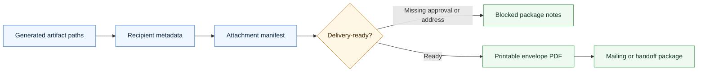

<div align="center">


# Agentic Envelope Skill

**A CompleteTech LLC envelope generator - from mailing details to branded, printable #10 addressed envelopes.**


</div>

---

This skill generates CompleteTech-branded #10 addressed envelope PDFs with a logo, return address, recipient block, attention line, postage box, and print-at-100-percent footer note. It is built for mailing contracts, certificates, notices, and other artifacts that need consistent CompleteTech presentation.

## About

Part of the CompleteTech LLC agentic services skill library. This skill owns delivery packaging details: addressed envelope PDFs, recipient metadata, attachment manifests, package filenames, mailing notes, and delivery-readiness checks for contracts, invoices, certificates, proposals, notices, and other CompleteTech artifacts.

## OpenClaw / ClawHub Metadata

- Skill key: `agentic-envelope-skill`
- Version-ready metadata: `1.0.3`
- Homepage: https://github.com/CompleteTech-LLC/agentic-envelope-skill
- README: https://github.com/CompleteTech-LLC/agentic-envelope-skill#readme
- Runtime binaries: `python3`
- Python packages: `reportlab==4.5.1`
- Intended registry/discovery tags: `latest`, `complete-tech`, `codex-skill`, `agentic-development`, `agentic-workflows`, `envelope`, `delivery-packaging`, `pdf-generator`
- License: repository code, templates, and documentation use MIT; published by CompleteTech on ClawHub.
- Brand assets: CompleteTech LLC names, logos, seals, and brand assets are reserved; see `BRAND_ASSETS.md`.

## Workflow Diagram

Source: [assets/diagrams/workflow.mmd](assets/diagrams/workflow.mmd).




## What It Does

- Generates branded printable envelope PDFs and delivery package metadata from verified recipient and artifact facts.
- Supports default config, CLI overrides, and per-recipient override files.
- Tracks attachment manifest and delivery-readiness notes for external handoff.
- Keeps package labeling separate from authoring contracts, invoices, certificates, proposals, proof assets, or emails.

## Contents

- `SKILL.md` - operating instructions, package boundaries, input rules, and generator guidance.
- `generate_envelope.py` - root CLI entry point for envelope PDF generation.
- `config.ini` - default provider, client, envelope, and branding configuration.
- `examples/` - sample override inputs for runnable demos.
- `assets/diagrams/workflow.mmd` - Mermaid source for the workflow diagram.
- `assets/examples/` - rendered demonstration artifacts used by the README.
- `references/` - reserved for supporting reference docs.
- `scripts/` - reserved for helper automation.
- `requirements.txt` - Python dependencies for envelope rendering.

## Quick Start

```bash
pip install -r requirements.txt

# Use the default recipient from config.ini.
python generate_envelope.py

# Generate using a per-recipient override file.
python generate_envelope.py \
  --config config.ini examples/client_address_override.ini \
  --out output/acme_envelope.pdf

# Omit return address for one run.
python generate_envelope.py --no-return-address
```

The default output path is `output/addressed_envelope.pdf`.

## Example


Example files: [Markdown](assets/examples/example.md) · [PDF](assets/examples/example.pdf) · [DOCX](assets/examples/example.docx).

**Delivery package: Signed agreement and deposit invoice for Northwind Trading Co.**

```bash
python generate_envelope.py \
  --config config.ini examples/northwind_address.ini \
  --out assets/examples/example.pdf
```

Example package manifest (realistic demonstration data):

| Item | Filename | Recipient | Status |
|---|---|---|---|
| Agreement PDF | `northwind_support_triage_agreement.pdf` | Morgan Reyes, General Counsel | Ready for signature review |
| Deposit invoice | `northwind_support_triage_deposit_invoice.pdf` | Morgan Reyes, General Counsel | Draft until billing approval |
| Envelope PDF | `assets/examples/example.pdf` | Morgan Reyes, General Counsel | Ready to print at 100% scale |

Use this skill to make the delivery package clear before mailing or external handoff; keep the agreement, invoice, and email body owned by their specialist skills.

## Inputs

The generator reads these INI sections:

| Section | Purpose |
|---|---|
| `provider` | Return-address name and mailing address |
| `client` | Recipient name and mailing address |
| `branding` | Logo path, brand name, tagline, and color palette |
| `envelope` | Attention line, postage-box text, return-address toggle, footer note |

Pass multiple config files with `--config`; later files override earlier files.

## Assets

- `assets/logo.png` - envelope header logo.

## Brand Notes

Use envelope packaging only after the source artifact exists. Do not invent recipient names, mailing addresses, email addresses, attachment lists, billing approval, signature authority, or send approval. Keep the contract, invoice, certificate, proposal, proof asset, and email body owned by their specialist skills; this skill packages and labels the delivery.

## Runtime Permissions

This skill needs local filesystem access only for the documented envelope workflow. It reads bundled config files, recipient override INI files, and the configured local logo path, then writes only to the selected `--out` path or default `output/addressed_envelope.pdf`. It runs `generate_envelope.py` and does not require network access, credential access, persistence, privilege escalation, or destructive file operations.

## Source

This standalone skill was extracted from the envelope generator originally bundled in `CompleteTech-LLC/agentic-contract-skill`.

## License

Code, templates, and documentation are licensed under the MIT License. CompleteTech LLC names, logos, seals, and brand assets are reserved and are not licensed for reuse except to identify this project. See `LICENSE` and `BRAND_ASSETS.md`.

## Network Boundary

This skill is local-only. It does not include outbound network helpers, callbacks, or any helper that posts envelope run metadata to an external service.
