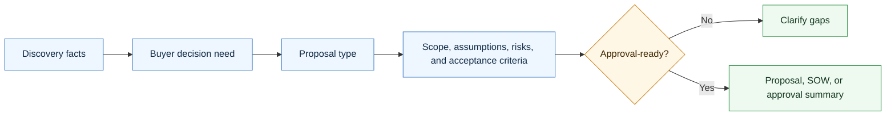

# Agentic Proposal Skill

<p align="center">
  
</p>

A CompleteTech LLC Codex skill for creating proposal and SOW-style documents for agentic development opportunities.

## About

Part of the CompleteTech LLC agentic services skill library. This skill turns verified discovery into buyer-facing proposals, SOWs, pilot recommendations, roadmaps, risk plans, and approval artifacts.

## OpenClaw / ClawHub Metadata

- Skill key: `agentic-proposal-skill`
- Version-ready metadata: `1.0.0`
- Homepage: https://github.com/CompleteTech-LLC/agentic-proposal-skill
- README: https://github.com/CompleteTech-LLC/agentic-proposal-skill#readme
- Runtime binaries: `python3`
- Python packages: `reportlab>=4.0` (optional PNG preview: `pypdfium2`, `pillow`)
- Intended registry/discovery tags: `latest`, `complete-tech`, `codex-skill`, `agentic-development`, `agentic-workflows`, `proposal`, `sow`, `sales`, `pdf`, `pdf-generator`
- License: repository code, templates, and documentation use MIT; ClawHub publishing is intentionally skipped for now.
- Brand assets: CompleteTech LLC names, logos, seals, and brand assets are reserved; see `BRAND_ASSETS.md`.

## Workflow Diagram

Source: [assets/diagrams/workflow.mmd](assets/diagrams/workflow.mmd).




## What It Does

- Selects the right proposal document by buyer stage and decision need.
- Drafts discovery recaps, one-page pilots, full proposals, SOWs, roadmaps, evaluation plans, risk/control plans, change orders, retainer proposals, and buyer approval summaries.
- Bridges the gap between outreach emails and signed contracts/invoices.
- Keeps the offer focused on practical, bounded agentic workflow implementation with human approval gates, evaluation, monitoring, documentation, support, and handoff.

## Contents

- `SKILL.md` - operating instructions and proposal-selection guide.
- `references/proposal-catalog.md` - reusable proposal and SOW templates.
- `references/use-case-decision-table.md` - quick guide for choosing the right document.
- `references/proposal-lifecycle.md` - end-to-end proposal flow and handoff points.
- `references/proposal-positioning.md` - CompleteTech LLC proposal language and guardrails.
- `scripts/render_proposal.py` - deterministic template listing and rendering helper.
- `scripts/render_pdf.py` - branded CompleteTech PDF generator (Markdown -> PDF + optional PNG preview).
- `requirements.txt` - Python dependencies for branded PDF rendering.

## Quick Start

```bash
python3 scripts/render_proposal.py --list
python3 scripts/render_proposal.py \
  --template one-page-pilot-proposal \
  --var client_name=Acme \
  --var workflow="support triage" \
  --var pain="manual queue review is slowing response times"
```

Rendered templates are drafts. Replace placeholders with verified client, scope, timeline, pricing, risk, and approval details before use.

## Example


Example files: [Markdown](assets/examples/example.md) · [PDF](assets/examples/example.pdf) · [DOCX](assets/examples/example.docx).

**Pilot proposal: Northwind Trading Co. — Customer Support Email Triage Agent**

- Scope: bounded, evaluation-first 8-week pilot to classify, draft, and route inbound support email.
- Commercials: USD 28,000 fixed fee, USD 8,400 deposit, Net 15.
- Acceptance: routing accuracy ≥ 90% on a held-out labeled test set; zero unapproved sends.
- Out of scope: autonomous sending and production deployment (handled by change order).

Generate it in one command (branded PDF + Markdown, like the contract skill):

```bash
pip install -r requirements.txt
python3 scripts/render_proposal.py --template one-page-pilot-proposal \
  --out assets/examples/example.pdf --png assets/examples/example.png \
  --markdown-out assets/examples/example.md \
  --logo assets/logo.png --title "Support Email Triage Agent — Pilot Proposal" --doc-type "PROPOSAL / STATEMENT OF WORK" \
  --subtitle "Prepared for <b>Northwind Trading Co.</b>" --meta "PROPOSAL NO.=PRO-2026-0188" --meta "DATE=2026-05-20"
```

The committed `example.{md,pdf,png}` use curated, realistic demonstration data for the Northwind Trading Co. support-triage pilot; pass `--var key=value` to fill template placeholders with your own facts.

## Brand Notes

Use a direct, concrete, low-hype tone. Present agentic development as bounded workflow implementation: workflow discovery, tool routing, retrieval, approval gates, evaluation examples, logs, monitoring, documentation, and handoff. Do not invent proof, regulated-use assurances, legal claims, savings metrics, or client facts.

## License

Code, templates, and documentation are licensed under the MIT License. CompleteTech LLC names, logos, seals, and brand assets are reserved and are not licensed for reuse except to identify this project. See `LICENSE` and `BRAND_ASSETS.md`.

## Network Boundary

This skill is local-only. It does not include outbound network helpers, callbacks, or any helper that posts proposal run metadata to an external service.
