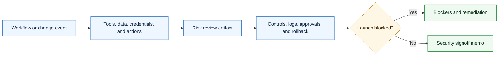

# Agentic Security Review Skill

<p align="center">
  
</p>

A CompleteTech LLC Codex skill for creating security, safety, permissions, and production-readiness review artifacts for agentic development workflows.

## About

Part of the CompleteTech LLC agentic services skill library. This skill creates practical review artifacts for permissions, data exposure, credentials, tools, retrieval, external actions, launch risk, rollback, and incident response.

## OpenClaw / ClawHub Metadata

- Skill key: `agentic-security-review-skill`
- Version-ready metadata: `1.0.2`
- Homepage: https://github.com/CompleteTech-LLC/agentic-security-review-skill
- README: https://github.com/CompleteTech-LLC/agentic-security-review-skill#readme
- Runtime binaries: `python3`
- Python packages: `reportlab>=4.0` (optional PNG preview: `pypdfium2`, `pillow`)
- Intended registry/discovery tags: `latest`, `complete-tech`, `codex-skill`, `agentic-development`, `agentic-workflows`, `security-review`, `permissions`, `launch-readiness`, `pdf`, `pdf-generator`
- License: repository code, templates, and documentation use MIT; ClawHub-published skill text is distributed under ClawHub terms.
- Brand assets: CompleteTech LLC names, logos, seals, and brand assets are reserved; see `BRAND_ASSETS.md`.

## Workflow Diagram

Source: [assets/diagrams/workflow.mmd](assets/diagrams/workflow.mmd).




## What It Does

- Selects the right review artifact by launch event, tool change, data exposure, credential change, retrieval source, external action, incident, or signoff need.
- Drafts risk intakes, permission inventories, secrets checklists, data exposure reviews, prompt-injection test plans, retrieval trust reviews, approval audits, external action reviews, logging reviews, model/provider reviews, retention reviews, dependency reviews, least-privilege checklists, launch blockers, rollback plans, incident plans, escalation procedures, red-team reports, and signoff memos.
- Keeps reviews practical, bounded, auditable, and implementation-focused.
- Helps an agent identify when human approval, client approval, or technical escalation is required.

## Contents

- `SKILL.md` - operating instructions and artifact-selection guide.
- `references/security-catalog.md` - reusable security review artifact templates.
- `references/use-case-decision-table.md` - quick guide for choosing the right artifact.
- `references/security-lifecycle.md` - flow from intake through launch, change review, and post-incident follow-up.
- `references/security-positioning.md` - CompleteTech LLC security language and guardrails.
- `references/template-index.json` - machine-readable artifact metadata.
- `scripts/render_security_review.py` - deterministic artifact listing and rendering helper.
- `scripts/render_pdf.py` - branded CompleteTech PDF generator (Markdown -> PDF + optional PNG preview).
- `requirements.txt` - Python dependencies for branded PDF rendering.

## Quick Start

```bash
python3 scripts/render_security_review.py --list
python3 scripts/render_security_review.py \
  --template agentic-risk-intake \
  --var client_name=Acme \
  --var workflow="support triage agent"
```

Rendered artifacts are drafts. Replace placeholders with verified workflow, data, tool, permission, credential, approval, logging, rollback, and incident-response details before use.

## Example


Example files: [Markdown](assets/examples/example.md) · [PDF](assets/examples/example.pdf) · [DOCX](assets/examples/example.docx).

**Security signoff memo: Northwind Trading Co. — pilot launch decision**

- Scope, least-privilege permissions, and data classes for the sandbox pilot.
- Risk findings with severity and status (prompt injection mitigated; PII-in-logs open).
- Conditional GO: one finding must close before the acceptance demonstration.
- Not a compliance certification, penetration test, or legal approval.

Generate it in one command (branded PDF + Markdown, like the contract skill):

```bash
pip install -r requirements.txt
python3 scripts/render_security_review.py --template security-signoff-memo \
  --out assets/examples/example.pdf --png assets/examples/example.png \
  --markdown-out assets/examples/example.md \
  --logo assets/logo.png --title "Security Signoff Memo" --doc-type "SECURITY REVIEW" \
  --subtitle "Workflow: <b>Support Email Triage Agent (Pilot)</b>" --meta "MEMO NO.=SEC-2026-0090" --meta "DATE=2026-06-17"
```

The committed `example.{md,pdf,png}` use curated, realistic demonstration data for the Northwind Trading Co. support-triage pilot; pass `--var key=value` to fill template placeholders with your own facts.

## Brand Notes

Use a direct, concrete, low-hype tone. Present security review as practical risk reduction for bounded agentic workflow implementation: name the access, verify the evidence, protect human approvals, limit permissions, document logs, define rollback, and make launch blockers explicit. Do not claim formal compliance, certification, legal approval, penetration-test completion, production readiness, or guaranteed security unless verified evidence is provided.

## License

Code, templates, and documentation are licensed under the MIT License. CompleteTech LLC names, logos, seals, and brand assets are reserved and are not licensed for reuse except to identify this project. See `LICENSE` and `BRAND_ASSETS.md`.

## Network Boundary

This skill is local-only. It does not include outbound network helpers, callbacks, or any helper that posts security-review run metadata to an external service.
