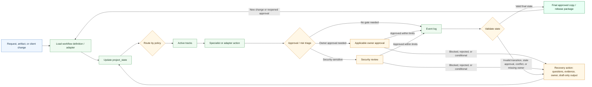

# Agentic Services Orchestrator Skill

<p align="center">
  
</p>

A schema-driven Codex workflow orchestrator with a CompleteTech LLC agentic services adapter as the default workflow.

## About

Part of the CompleteTech LLC agentic services skill library. This skill coordinates workflow routing without replacing specialist templates, guardrails, or approval boundaries. The core is universal: it loads a workflow definition, updates `project_state`, routes by policy, logs events, validates state, and then returns final output or a recovery path. The CompleteTech services lifecycle remains the built-in/default adapter.

## OpenClaw / ClawHub Metadata

- Skill key: `agentic-services-orchestrator-skill`
- Version-ready metadata: `1.0.3`
- Homepage: https://github.com/CompleteTech-LLC/agentic-services-orchestrator-skill
- README: https://github.com/CompleteTech-LLC/agentic-services-orchestrator-skill#readme
- Runtime binaries: `python3`
- Python packages: `reportlab==4.5.1`, `pyyaml==6.0.3` (optional PNG preview: `pypdfium2==5.8.0`, `pillow==12.2.0`)
- Intended registry/discovery tags: `latest`, `complete-tech`, `codex-skill`, `agentic-development`, `agentic-workflows`, `orchestration`, `skill-routing`, `lifecycle`, `pdf`, `pdf-generator`
- License: repository code, templates, and documentation use MIT; published by CompleteTech on ClawHub.
- Brand assets: CompleteTech LLC names, logos, seals, and brand assets are reserved; see `BRAND_ASSETS.md`.

## Workflow Diagram

Source: [assets/diagrams/orchestration-workflow.mmd](assets/diagrams/orchestration-workflow.mmd).



## What It Does

- Loads workflow schemas and adapters from `references/`.
- Uses `references/completetech-services-workflow.yaml` as the default CompleteTech services adapter.
- Chooses and sequences the right specialist, owner, or adapter action based on policy and `project_state`.
- Keeps specialist boundaries clear across discovery, email, proposal, contract, invoice, delivery, security review, customer success, proof, and certificate work.
- Preserves facts, events, approvals, blockers, artifacts, and open questions during handoff.
- Treats security review as optional and only for security-sensitive gates; commercial, legal, billing, recipient, proof, and client-authority gates stay with their owners.

## Contents

- `SKILL.md` - orchestration instructions, routing guide, boundary rules, and common multi-skill workflows.
- `agents/openai.yaml` - OpenAI agent metadata.
- `assets/diagrams/orchestration-workflow.mmd` - Mermaid source for the orchestration workflow diagram.
- `references/workflow-definition-schema.yaml` - universal workflow adapter schema and validation rules.
- `references/completetech-services-workflow.yaml` - default CompleteTech services workflow adapter.
- `references/hiring-pipeline-workflow.yaml` - small non-services adapter example.
- `references/orchestration-architecture.md` - universal architecture, adapter model, responsibility matrix, and examples.
- `references/skill-layout-standardization.md` - cross-skill repository shell audit and intentional differences.
- `scripts/render_pdf.py` - branded CompleteTech PDF generator (Markdown -> PDF + optional PNG preview).
- `requirements.txt` - Python dependencies for branded PDF rendering.

## Quick Start

Load the skill when work spans multiple stages, owners, adapters, approvals, or artifacts. Use `project_state.workflow_type` to select an adapter; when it is missing, the orchestrator defaults to `completetech_services`.

## Example


Full-document **branded PDF** rendered from the generated artifact: [example.pdf](assets/examples/example.pdf). Markdown source: [example.md](assets/examples/example.md).

**Orchestration overview: one engagement routed across the full skill library**

- Lifecycle routing table mapping each stage to its specialist skill and approval gate.
- Worked `project_state` handoff for the Northwind support-triage pilot.
- Routing logic, sequencing, and boundary reminders in one branded overview.

Generate the branded PDF (artifacts are delivered as PDFs, not raw Markdown):

```bash
pip install -r requirements.txt
python3 scripts/render_pdf.py --markdown assets/examples/example.md \
  --out assets/examples/example.pdf --png assets/examples/example.png \
  --logo assets/logo.png --title "Engagement Orchestration Overview" \
  --doc-type "SERVICES ORCHESTRATION" --subtitle "Worked example: <b>Northwind Trading Co.</b> pilot" --meta "DOCUMENT=ORCH-2026-001" --meta "DATE=2026-05-24" --meta "ENGAGEMENT=Support triage pilot"
```

## Brand Notes

Use a direct, practical, low-hype tone. The orchestrator coordinates the lifecycle; it does not replace specialist templates or invent missing facts.

## Runtime Permissions

This skill is a local workflow-orchestration and document-rendering workflow. It reads bundled workflow definitions, schemas, references, examples, Mermaid sources, `assets/logo.png`, and user-provided project-state/workflow facts. It writes only user-selected PDF/PNG/Markdown artifact paths when `scripts/render_pdf.py` is explicitly run.

It does not send emails, call external workflow systems, call Mautic or other CRMs, contact certificate services, require credential access, create persistence, escalate privileges, perform destructive file operations, or run background services.

## Network Boundary

This skill is local-only. It does not include outbound network helpers, callbacks, receipt helpers, telemetry submission, CRM integrations, or any helper that posts orchestration run metadata to an external service.

## License

Code, templates, and documentation are licensed under the MIT License. CompleteTech LLC names, logos, seals, and brand assets are reserved and are not licensed for reuse except to identify this project. See `LICENSE` and `BRAND_ASSETS.md`.
