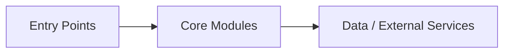
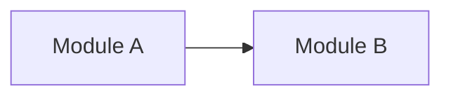
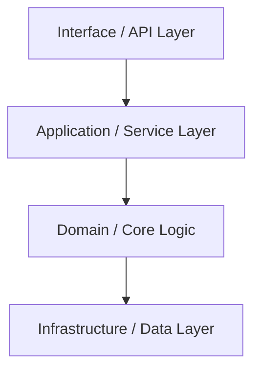
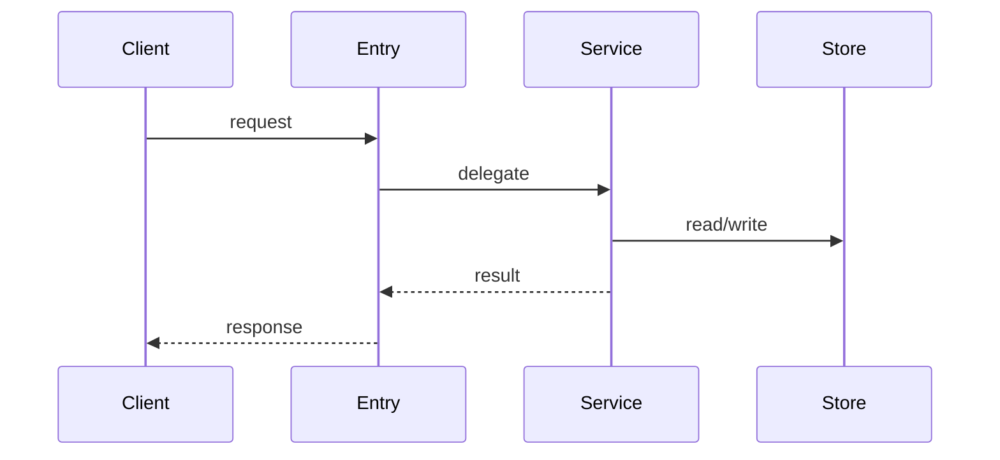

# AI README Generator

Use this skill to scan an existing code project and generate maintainable documentation for both AI agents and developers.

The generated docs should help future AI coding sessions quickly understand:

- what the project does
- how the code is organized
- how to run, test, and build it
- what the key technical flows are
- what business knowledge still needs human input

## Default output

Generate or update these files in the target project:

```text
AGENTS.md
.cursor/rules/ai-readme/RULE.mdc
.cursor/rules/ai-readme/generated/project-structure.mdc
.cursor/rules/ai-readme/generated/technical-architecture.mdc
.cursor/rules/ai-readme/generated/development-guide.mdc
.cursor/rules/ai-readme/generated/core-flows.mdc
.cursor/rules/ai-readme/manual/business-knowledge.mdc
.cursor/rules/ai-readme/manual/lessons-learned.mdc
```

Use English file names for better cross-platform compatibility. Chinese section text is allowed when the project language is Chinese.

## Safety rules

- Do not invent APIs, commands, paths, services, or business rules. If uncertain, write `<!-- TODO: verify ... -->`.
- Do not overwrite existing files under `.cursor/rules/ai-readme/manual/`.
- If `AGENTS.md` already exists, read it first. Preserve useful human-written constraints and update only project facts that can be verified from code.
- Generated files under `.cursor/rules/ai-readme/generated/` may be refreshed from code evidence.
- Avoid secrets. Do not copy `.env`, credentials, tokens, private keys, or local machine-specific paths into generated docs.
- Prefer concise, factual documentation over long explanations.
- Every `.mdc` file must include frontmatter with `description` and `alwaysApply: false`.
- Each generated technical `.mdc` file should include at least one Mermaid or ASCII diagram when useful.

## Workflow

### 1. Identify the target project

If the user provides a path, use it. Otherwise inspect the current workspace and ask only if the project root is ambiguous.

Confirm the project root by checking common files:

- JavaScript/TypeScript: `package.json`, `pnpm-lock.yaml`, `yarn.lock`
- Java: `pom.xml`, `build.gradle`, `settings.gradle`
- Python: `pyproject.toml`, `requirements.txt`, `setup.py`
- Go: `go.mod`
- Rust: `Cargo.toml`
- .NET: `*.csproj`, `*.sln`

### 2. Scan code evidence

Read only enough files to understand the project:

1. dependency/build files
2. README or existing docs
3. top-level directory tree
4. main entry points
5. 3-8 representative source files
6. tests, config, and scripts when available

Record facts with source paths in your notes before writing docs.

### 3. Plan generated files

For non-trivial projects, keep a short task plan:

1. create/update `RULE.mdc` skeleton
2. write `project-structure.mdc`
3. write `technical-architecture.mdc`
4. write `development-guide.mdc`
5. write `core-flows.mdc`
6. create missing manual templates only
7. create/update `AGENTS.md`
8. verify generated paths and summarize TODOs

### 4. Write files

Create directories as needed. Use the templates below, adapting content to verified project facts.

## Templates

### RULE.mdc

```md
---
description: "AI README entrypoint - project rules navigation. Read this before working on the project."
alwaysApply: false
---

# AI README - Project Rules Entry

## Project overview

<!-- One short paragraph describing the verified project purpose. -->



## Generated information

- Generated at: <!-- YYYY-MM-DD HH:mm -->
- Project root: <!-- path or repository name -->
- Evidence scope: <!-- key files/directories scanned -->

## Navigation

### Generated technical docs

- [ ] [Project Structure](./generated/project-structure.mdc) - directories, modules, and responsibilities
- [ ] [Technical Architecture](./generated/technical-architecture.mdc) - layers, dependencies, and technology stack
- [ ] [Development Guide](./generated/development-guide.mdc) - setup, run, build, test, and config
- [ ] [Core Flows](./generated/core-flows.mdc) - important runtime or business call chains

### Human-maintained docs

- [ ] [Business Knowledge](./manual/business-knowledge.mdc) - domain terms, business rules, product context
- [ ] [Lessons Learned](./manual/lessons-learned.mdc) - pitfalls, decisions, and team experience
```

### generated/project-structure.mdc

```md
---
description: "Project structure - directories, modules, and responsibilities. Use when understanding code organization."
alwaysApply: false
---

# Project Structure

## Directory tree

```text
project-root/
├── ...
```

## Module responsibilities

| Path | Responsibility | Key files |
| --- | --- | --- |

## Dependencies between modules



## Evidence

- `path/to/file`
```

### generated/technical-architecture.mdc

```md
---
description: "Technical architecture - layers, dependencies, and technology stack. Use when understanding technical design."
alwaysApply: false
---

# Technical Architecture

## Architecture overview



## Layers

| Layer | Responsibility | Main files/classes |
| --- | --- | --- |

## Technology stack

| Category | Technology | Version/source | Purpose |
| --- | --- | --- | --- |
| Language/runtime | | | |
| Framework | | | |
| Build tool | | | |
| Test framework | | | |

## Evidence

- `path/to/file`
```

### generated/development-guide.mdc

```md
---
description: "Development guide - setup, run, build, test, and configuration. Use when preparing a development environment."
alwaysApply: false
---

# Development Guide

## Requirements

| Tool | Version | Evidence |
| --- | --- | --- |

## Common commands

| Task | Command | Evidence |
| --- | --- | --- |
| Install dependencies | <!-- TODO: verify --> | |
| Run locally | <!-- TODO: verify --> | |
| Build | <!-- TODO: verify --> | |
| Test | <!-- TODO: verify --> | |

## Configuration

| File / variable | Purpose | Required? |
| --- | --- | --- |

## Validation checklist

- [ ] dependencies install successfully
- [ ] app starts locally
- [ ] tests pass
- [ ] build succeeds
```

### generated/core-flows.mdc

```md
---
description: "Core flows - important runtime or business call chains. Use when understanding how the system works."
alwaysApply: false
---

# Core Flows

> These flows are inferred from code evidence. Ask the user to confirm if they match the team's product understanding.

## Flow list

| Priority | Flow | Entry point | Evidence |
| --- | --- | --- | --- |
| P0 | | | |
| P1 | | | |

## Flow: <!-- name -->



### Call chain

1. `file:Class.method`
2. `file:Class.method`

### Key branches

- <!-- error handling / cache / fallback / async branch -->
```

### manual/business-knowledge.mdc

Create this file only if it does not already exist.

```md
---
description: "Business knowledge - product context, domain terms, and business rules. Use when business context is needed."
alwaysApply: false
---

# Business Knowledge

## Project context

<!-- TODO: human to fill: who uses this project, what problem it solves, and important product boundaries. -->

## Domain terms

| Term | Code name | Meaning |
| --- | --- | --- |

## Business rules

<!-- TODO: human to fill: state transitions, limits, calculations, approvals, exceptions. -->
```

### manual/lessons-learned.mdc

Create this file only if it does not already exist.

```md
---
description: "Lessons learned - pitfalls, decisions, and team experience. Read before changing risky code."
alwaysApply: false
---

# Lessons Learned

## Pitfalls

| Problem | Cause | Solution |
| --- | --- | --- |

## Decisions

| Decision | Reason | Date / owner |
| --- | --- | --- |
```

### AGENTS.md

```md
# AGENTS.md

## Project Overview

<!-- One verified paragraph describing the project purpose and core capability. -->

## Development Commands

- Install dependencies: <!-- TODO: verify -->
- Run locally: <!-- TODO: verify -->
- Build: <!-- TODO: verify -->
- Test: <!-- TODO: verify -->

## Key Directories

- `src/` - <!-- responsibility -->
- `tests/` - <!-- responsibility, if present -->

## Boundaries and Constraints

<!-- Verified project conventions, safety rules, generated-code boundaries, or things not to modify. -->

## AI Context

Detailed project rules live in `.cursor/rules/ai-readme/RULE.mdc`:

- architecture: `.cursor/rules/ai-readme/generated/technical-architecture.mdc`
- flows: `.cursor/rules/ai-readme/generated/core-flows.mdc`
- business context: `.cursor/rules/ai-readme/manual/business-knowledge.mdc`
- lessons learned: `.cursor/rules/ai-readme/manual/lessons-learned.mdc`
```

## Verification

After writing files:

1. Re-read every generated path to confirm it exists.
2. Check `.mdc` frontmatter is valid.
3. Confirm manual files were not overwritten.
4. List unresolved `TODO` items.
5. Report generated files with paths and sizes.

## Final response

Return a concise summary:

- generated/updated files
- skipped files, especially existing manual files
- key uncertainties marked as TODO
- recommended next human edits
