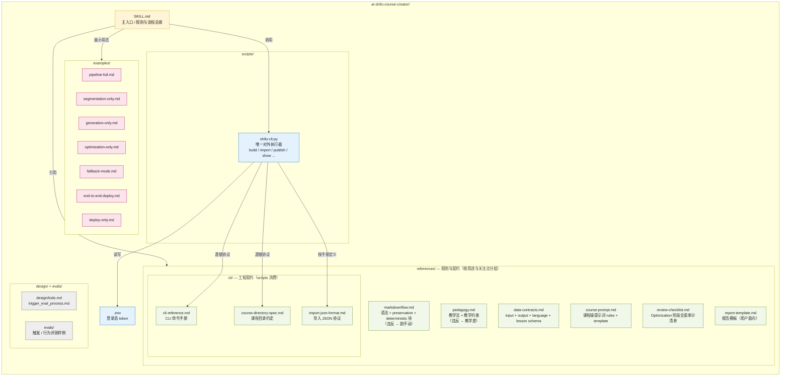
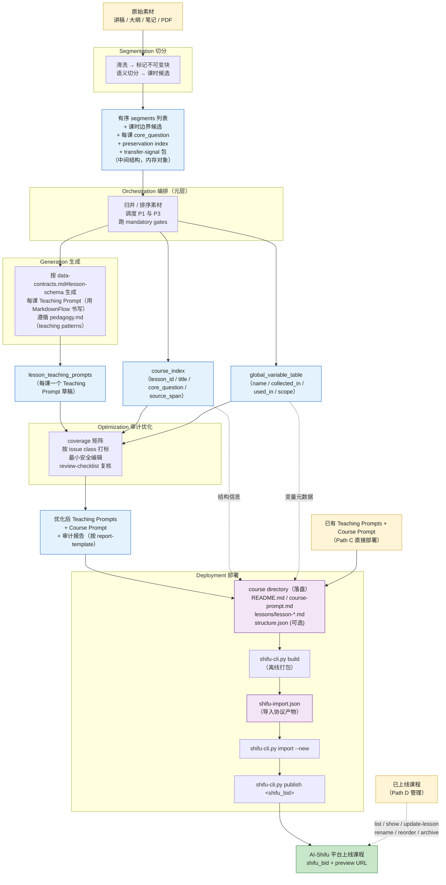
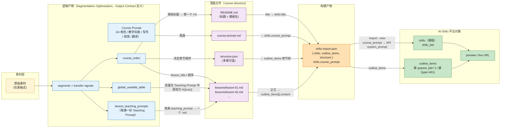
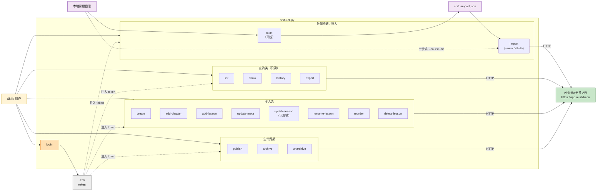

## 概览

ai-shifu-course-creator 是一个把"原始素材 → 可运行的 MarkdownFlow 课程脚本 → AI-Shifu 平台上线课程"全流程封装起来的 skill。整体由四类组件构成：

- 主入口规则文件：[SKILL.md](../SKILL.md)
- 唯一对外执行器：[scripts/shifu-cli.py](../scripts/shifu-cli.py)
- 规则与契约（references/）
- 用法示例（examples/）

下文用三张 mermaid 图分别呈现：① skill 整体架构；② 全流程及中间产物；③ 文件之间的对应关系。

## 1. Skill 整体架构

## 2. 从建课到发布的全流程 + 中间产物

## 3. 中间文件与产物的对应关系

## 关键说明

- **逻辑产物 vs 落盘文件**：Segmentation–Optimization 的 `segments / course_index / global_variable_table / lesson_teaching_prompts / course_prompt` 由 [data-contracts.md#output-contract](../references/data-contracts.md#output-contract) 定义，是会话内的逻辑对象；只有进入 Deployment 时才按 [cli/course-directory-spec.md](../references/cli/course-directory-spec.md) 写入 `README.md` / `course-prompt.md`（Course Prompt）/ `lessons/lesson-*.md`（每课一份 Teaching Prompt）/ `structure.json`。
- **唯一执行器**：所有平台交互都走 [shifu-cli.py](../scripts/shifu-cli.py)（`build / import / publish / show / update-lesson` 等），SKILL 明确禁止直接调 HTTP API。
- **build 是离线步骤**：把课程目录打包成 [shifu-import.json](../references/cli/import-json-format.md)（`shifu` + `outline_items` + `structure`），然后由 `import --new` 或 `import <bid>` 推送到平台，最终 `publish` 上线。
- **Course Prompt 命名映射（CLI 内部）**：本仓库对外统一叫 `course_prompt`（文件名 `course-prompt.md`、JSON 字段 `shifu.course_prompt`、CLI 参数 `--course-prompt-file`）；CLI 在调 `/shifus/<bid>/detail` 时会把它映射成平台 API 的 `system_prompt` 字段。
- **四种使用路径**：
  - Path A — 全流程（Orchestration → Optimization → Deployment）；
  - Path B — 只产 MarkdownFlow（Segmentation–Optimization，不部署）；
  - Path C — 已有脚本直接部署（仅 Deployment）；
  - Path D — 管理已上线课程（list / update / rename / reorder / archive 等）。

## 4. shifu-cli.py 提供的接口能力

所有平台交互都通过 [scripts/shifu-cli.py](../scripts/shifu-cli.py) 完成。CLI 共有 17 个子命令，按职能分为六组。详细参数见 [cli-reference.md](../references/cli/cli-reference.md)。

### 4.1 命令总览（按职能分组）

| 分组 | 命令 | 作用 | 是否联网 |
|---|---|---|---|
| 认证 | `login` | 手机号 + 4 位短信验证码登录，token 写入 `.env` | ✅ |
| 查询 | `list` | 列出当前账号下所有课程 | ✅ |
| 查询 | `show <shifu_bid> [outline_bid]` | 查看课程大纲树；带 outline_bid 时读取该课的 MarkdownFlow 正文 | ✅ |
| 查询 | `history <shifu_bid> <outline_bid>` | 查看一课的 Teaching Prompt 修订历史 | ✅ |
| 查询 | `export <shifu_bid> [-o file.json]` | 把课程导出为 JSON | ✅ |
| 创建 | `create --name ... [--description ...]` | 创建空课程（仅 shifu 主体，无章节） | ✅ |
| 创建 | `add-chapter <shifu_bid> --name ...` | 新增一个顶层章节 | ✅ |
| 创建 | `add-lesson <shifu_bid> --name ... --parent-bid ... [--teaching-prompt-file ...]` | 在指定章节下新增一课，可附带 Teaching Prompt 文件 | ✅ |
| 更新 | `update-meta <shifu_bid> [--name] [--description] [--course-prompt-file]` | 更新课程标题 / 简介 / Course Prompt | ✅ |
| 更新 | `update-lesson <shifu_bid> <outline_bid> --teaching-prompt-file ...` | 替换一课的 Teaching Prompt（带乐观锁） | ✅ |
| 更新 | `rename-lesson <shifu_bid> <outline_bid> --name ...` | 仅改课时名称 | ✅ |
| 更新 | `reorder <shifu_bid> --order bid1,bid2,bid3` | 按给定顺序重排课时 | ✅ |
| 删除 | `delete-lesson <shifu_bid> <outline_bid>` | 删除一课 | ✅ |
| 构建 / 导入 | `build --course-dir ... [-o ...] [--title] [--chapter-name] [--description] [--keywords]` | 离线把课程目录打包成 `shifu-import.json` | ❌ |
| 构建 / 导入 | `import --new --json-file ...` 或 `import --new --course-dir ...` | 用 JSON / 目录创建一门新课程 | ✅ |
| 构建 / 导入 | `import <shifu_bid> --json-file ...` 或 `import <shifu_bid> --course-dir ...` | 把 JSON / 目录覆盖到已有课程 | ✅ |
| 状态 | `publish <shifu_bid>` | 发布课程，对外可见 | ✅ |
| 状态 | `archive <shifu_bid>` / `unarchive <shifu_bid>` | 归档 / 取消归档 | ✅ |

### 4.2 命令调用图

### 4.3 用法路径与命令映射

| 路径 | 典型命令序列 |
|---|---|
| **Path A 全流程** | （生成 lessons/ 后） → `build --course-dir ./course/` → `import --new --json-file ./course/shifu-import.json` → `publish <bid>` |
| **Path C 仅部署已有脚本** | 同上 build/import/publish |
| **Path D 管理已上线课程** | `list` / `show` / `update-meta` / `update-lesson` / `rename-lesson` / `reorder` / `delete-lesson` / `archive` / `unarchive` / `history` / `export` |
| **从零增量搭建** | `create` → `add-chapter` → `add-lesson`（重复） → `publish` |

### 4.4 关键设计点

- **唯一入口**：所有平台交互都走 CLI，SKILL.md 明确禁止直接调原始 HTTP API。
- **离线 / 在线分离**：`build` 是纯本地操作（不联网），其他命令需要 token；这种分离方便在 CI / 受限网络下先打包再分发。
- **两种导入形态**：`import --json-file` 接受预先 build 好的 JSON；`import --course-dir` 在内部先 build 再 import，等价于一键发布。
- **两种创建模式**：`import --new` 用于完整目录一次建课；`create + add-chapter + add-lesson` 用于细粒度逐步搭建。
- **乐观锁**：`update-lesson` 会先拉取当前 revision，若服务端已被他人修改则拒绝写入，避免覆盖他人改动。
- **token 持久化**：`login` 把 token 写到 `.env`，后续命令无需重复登录；token 失效时再次跑 `login` 即可。
