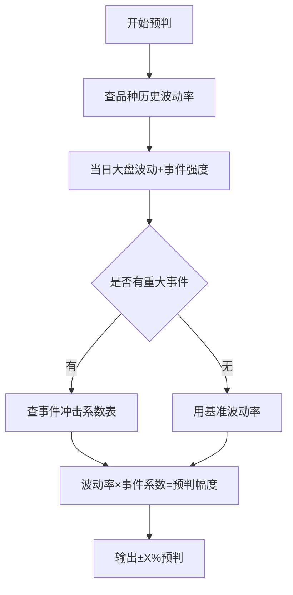

# 🧠 推理模型 v2.0 STANDARD（上架审查版）

> © 媳妇智投Pro v2.0 STANDARD

---

---

---

---

---

## 核心逻辑

```
美国因素 → 大盘预判 → 个股预判
   ↓           ↓           ↓
 国际层面    国内层面    微观层面
```

---

## 第一层：美国因素（国际层面）权重30%

### 1.1 美股走势
- 道琼斯指数
- 纳斯达克指数
- 标普500指数

### 1.2 美国政策
- 美联储利率决议
- 贸易政策
- 制裁措施

### 1.3 美国军事
- 军事部署（航母战斗群、战略轰炸机、导弹防御系统）
- 战争风险
- 地缘冲突

#### 1.3.1 美伊冲突风险分析框架（2026年版本）

**背景：** 美国与伊朗的核问题博弈进入关键窗口期，美方在波斯湾部署双航母（"亚伯拉罕·林肯"号+"福特"号），伊朗在日内瓦谈判中坚持核计划权利。此框架用于评估地缘风险对市场的影响。

**📋 特朗普对伊政策的性格特征模型：**

| 特征 | 表现 | 对政策的影响 |
|------|------|-------------|
| **极限施压** | 先放狠话再谈判，军事威胁是筹码 | 大概率以压促谈，而非真打 |
| **不可预测性** | 说变就变，让对手摸不透 | 对手被迫让步，谈判中占据主动 |
| **讨厌持久战** | 要求"快速、决定性打击" | 不愿陷入阿富汗式泥潭，全面战争概率低 |
| **商人思维** | 算"投入产出比" | 打伊朗的收益（选票/威慑）vs 成本（油价/伤亡） |
| **好面子** | 公开威胁后若无回应，必须行动 | 若伊朗持续强硬不给台阶，可能被迫出手 |

**📊 美国对伊"三步走"风格：**

```
Step 1: 军事威慑 → 航母部署、增兵中东、B-2轰炸机就位、萨德部署
    ↓
Step 2: 外交施压 → 要求谈判、设定红线（铀浓缩）、日内瓦间接会谈
    ↓
Step 3: 行动选择 → （A）妥协/让步  （B）有限军事打击  （C）全面战争
```

**🎯 概率预判框架：**

| 场景 | 概率区间 | 触发条件 | 市场影响 |
|------|---------|---------|---------|
| 🔴 **全面战争**（大规模军事行动） | **10%-15%** | 伊朗触碰红线（核武突破）/ 严重挑衅美国 | 油价飙升>30%，避险资产暴涨，全球股市暴跌 |
| 🟠 **有限军事打击**（定点清除/空袭核设施） | **30%-40%** | 伊朗拒不谈判/继续铀浓缩/特朗普"好面子"被迫出手 | 油价短期冲高10-15%，避险情绪升温，风险资产承压 |
| 🟢 **极限施压+谈判**（继续威胁但不打） | **45%-55%** | 伊朗实质让步/重回谈判桌/美国大选需稳定 | 油价平稳，风险资产按原逻辑运行 |

**🔑 影响概率的八大关键变量：**

| 变量 | 升概率因素（↑打） | 降概率因素（↓不打） |
|------|------------------|------------------|
| 👑 **伊朗最高领袖** | 新领袖强硬派，拒绝谈判 | 新领袖改革派，释放缓和信号 |
| 🛢️ **油价水平** | 油价飙升至120美元+（打击伊朗成本增加） | 油价稳定在80美元以下（经济压力小） |
| 🏛️ **美国大选周期** | 连任需要对外强硬 | 战争引发国内不满 |
| 🇮🇱 **以色列态度** | 以色列强力推动打击 | 以色列保持克制 |
| 💬 **日内瓦谈判进展** | 谈判破裂，伊朗不退步 | 伊朗做出实质性让步 |
| 🏗️ **美军部署完成度** | 双航母+萨德+轰炸机全部到位 | 部署未完成 |
| 💥 **伊朗代理人挑衅** | 胡塞/真主党袭击美军 | 代理人保持克制 |
| 🌍 **国际反应** | 中俄默许或无力干预 | 中俄强力反制 |

**📌 当前判断（2026-04-30）：**
- 美国军事威胁氛围：**80%+**（双航母部署+公开喊话）
- 实际军事打击概率：**30-35%**（特朗普更多用军事威慑当谈判筹码）
- 当前阶段：**Step 1→Step 2过渡**（军威慑+外交谈判并行）
- 核心矛盾：伊朗不愿放弃核计划，特朗普需要维护"说到做到"形象

**📊 对各类资产的影响路径：**

| 资产类别 | 影响路径 | 敏感度 |
|---------|---------|--------|
| **原油/燃料油/沥青** | 霍尔木兹海峡封锁风险 → 全球能源供应冲击 | ⭐⭐⭐⭐⭐ |
| **黄金/白银** | 避险需求上升 → 贵金属暴涨 | ⭐⭐⭐⭐⭐ |
| **沪铜/铝/锌** | 战争→通胀→工业成本上升→铜价波动加大 | ⭐⭐⭐⭐ |
| **A股/港股** | 避险情绪→资金流出→短期承压 | ⭐⭐⭐ |
| **美元指数** | 避险资金流入→美元走强 | ⭐⭐⭐ |
| **人民币** | 美元走强→人民币贬值压力 | ⭐⭐⭐ |

### 1.4 地缘博弈
- 中美关系
- 台海局势
- 中东局势

---

### 1.5 突发事件与天灾人祸影响分析（2026-04-30新增）

> ⚠️ 自然灾害、重大事故、公共卫生事件、财经新闻等突发事件对股市有短期冲击甚至中长期影响，必须系统化评估。

#### 1.5.1 自然灾害对股市的影响框架

**📋 7大自然灾害类型及市场影响矩阵：**

| 灾害类型 | 影响范围 | 对股市冲击幅度 | 冲击持续性 | 受影响板块 | 受益板块 | 综合敏感度 |
|---------|---------|--------------|-----------|-----------|---------|-----------|
| **🌊 大地震（≥7级）** | 局部区域 | 大盘-2%~-5%，局部板块-10%+ | 1-4周 | 保险、地产、当地上市公司 | 建材、重建相关、医药 | ⭐⭐⭐⭐⭐ |
| **🌧️ 特大洪水/台风** | 流域/沿海 | 大盘-1%~-3% | 1-3周 | 农业、交通、保险 | 水利建设、工程机械、抗洪物资 | ⭐⭐⭐⭐ |
| **🔥 森林大火** | 区域 | 大盘-0.5%~-2% | 1-2周 | 旅游、林业、电力 | 消防装备、保险 | ⭐⭐⭐ |
| **🥶 极端寒潮/雪灾** | 大范围 | 大盘-0.5%~-2% | 1-3周 | 农业（冻害）、能源（需求暴增） | 煤炭、燃气、服装 | ⭐⭐⭐ |
| **🌪️ 台风登陆（超强）** | 沿海城市 | 大盘-0.5%~-1.5% | 3-7天 | 交通运输、港口、渔业 | 保险（赔付后的重建） | ⭐⭐⭐ |
| **🌡️ 极端高温/干旱** | 大范围 | 大盘-0.5%~-1.5% | 1-4周 | 农业（减产）、水电 | 空调、电力、水务 | ⭐⭐⭐ |
| **🌋 火山喷发** | 局部 | 大盘-0.5%~-2% | 1-2周 | 航空（灰烬影响飞行） | — | ⭐⭐ |

**📊 自然灾害影响A股的传导路径：**

```
自然灾害发生
    ↓
[路径A] 实体冲击 → 企业停产/物流中断/供应链断裂
    ↓         → 上市公司发布受损公告
    ↓         → 股价短期暴跌
    ↓
[路径B] 市场情绪 → 恐慌情绪蔓延 → 资金避险撤离
    ↓         → 保险、地产、旅游板块领跌
    ↓         → 大盘承压
    ↓
[路径C] 政策响应 → 政府发布救灾/重建政策
    ↓         → 建材/基建/医药板块受益
    ↓         → 重建预期推动相关板块上涨
    ↓
[路径D] 保险赔付 → 保险公司大规模赔付
    ↓         → 保险股短期承压
    ↓         → 但重建推动相关产业链需求
```

**🎯 自然灾害→投资机会的时间窗口：**

| 时间阶段 | 市场反应 | 投资策略 |
|---------|---------|---------|
| **T+0~T+2（冲击期）** | 大盘恐慌下跌，受灾板块暴跌 | 减仓避险，等待恐慌释放 |
| **T+3~T+7（反应期）** | 重建概念启动，建材/机械开始上涨 | 关注重建受益板块 |
| **T+7~T+30（恢复期）** | 相关板块分化，部分走出独立行情 | 筛选真正受益的标的 |
| **T+30+（长尾期）** | 影响消退，市场回归原有逻辑 | 根据基本面重新判断 |

---

#### 1.5.2 天灾人祸/事故灾难对股市的影响

**📋 重大事故灾难类型及市场影响：**

| 事故类型 | 示例 | 对股市冲击 | 受影响行业 | 受益行业 | 影响持续性 |
|---------|------|-----------|-----------|---------|-----------|
| **🏭 化工厂爆炸/有毒物质泄漏** | 天津港爆炸(2015) | 局部板块-10%~-20% | 化工、物流、保险 | 环保检测、安全设备 | 1-6个月 |
| **⚡ 核电站事故/辐射泄漏** | 福岛核事故(2011) | 能源板块-5%~-15% | 核电、部分电力 | 光伏、风电、天然气 | 3-12个月 |
| **🏗️ 建筑/桥梁坍塌** | 各类工程事故 | 局部影响-5%~-10% | 施工方、监理方 | 检测、加固、重建 | 1-3个月 |
| **🛢️ 油轮/输油管道泄漏** | 海上石油泄漏 | 油气公司-3%~-8% | 肇事公司、石油 | 环保、清理 | 1-3个月 |
| **🏢 火灾/踩踏等公共事故** | 各类公共安全事故 | 局部影响-2%~-5% | 场所运营方 | 安防、消防 | 1-2周 |
| **🚂 重大交通事故**（航空/铁路/船舶） | 空难/火车脱轨 | 短期影响-2%~-5% | 客运公司、相关保险 | 安全设备 | 1-4周 |

**📉 事故灾难对股价的影响规律：**

| 影响维度 | 规律 | 说明 |
|---------|------|------|
| **肇事公司** | 股价暴跌-10%~-30% | 赔偿+停产+品牌受损+监管处罚 |
| **同行业** | 短期下跌-3%~-10% | 行业安全监管收紧预期 |
| **相关保险** | 短期下跌-2%~-5% | 大规模赔付预期 |
| **安全设备公司** | 短期上涨+5%~+20% | 行业安全投入增加预期 |
| **替代行业** | 上涨+3%~+10% | 核电事故→光伏风电受益 |

---

#### 1.5.3 公共卫生事件（疫情）对股市的影响

**📋 疫情对股市的系统性影响框架：**

| 疫情阶段 | 股市表现 | 受冲击板块 | 受益板块 | 投资策略 |
|---------|---------|-----------|---------|---------|
| **🟢 初期/暴发期** | 恐慌暴跌-5%~-10% | 旅游、航空、餐饮、零售 | 医药（口罩/检测）、在线办公 | 减仓避险，关注医药 |
| **🟡 扩散/高峰期** | 震荡筑底阶段 | 线下经济继续承压 | 疫苗、医疗设备、电商、游戏 | 分批建仓优质龙头 |
| **🟠 控制/缓解期** | 反弹修复+5%~+10% | 旅游、航空开始修复 | 消费复苏、酒店 | 加仓复苏受益标的 |
| **🟢 常态化/消亡期** | 回归基本面逻辑 | 疫情受益板块回落 | 全面复苏 | 回归正常投资逻辑 |

**📊 疫情主要影响路径：**

```
疫情暴发
    ↓
供应链冲击 → 停工停产 → 企业营收下滑 → 利润下降 → 股价下跌
    ↓
消费萎缩 → 减少外出 → 旅游/餐饮/零售受损
    ↓
政策宽松 → 降息降准 → 流动性宽松 → 估值修复
    ↓
疫苗研发 → 复苏预期 → 周期股领涨
```

---

#### 1.5.4 财经新闻对股市的影响分析

> 财经新闻涵盖政策发布、经济数据、公司公告、机构研报、媒体报道等，是影响股市最频繁的直接因素。

**📋 财经新闻的7大类型及市场影响机制：**

| 新闻类型 | 影响力级别 | 影响持续时间 | 典型影响幅度 | 应对策略 |
|---------|-----------|------------|-----------|---------|
| **① 货币政策新闻**（降准/降息/LPR/MLF） | ⭐⭐⭐⭐⭐ | 1-4周 | 大盘±1%~±3% | 政策宽松→看多；收紧→看空 |
| **② 财政政策新闻**（万亿特别国债/减税/基建） | ⭐⭐⭐⭐⭐ | 1-6个月 | 大盘±1%~±5% | 财政扩张→利好基建/周期 |
| **③ 产业政策新闻**（行业监管/补贴/规划） | ⭐⭐⭐⭐⭐ | 1-12个月 | 板块±5%~±30% | 限制→利空；扶持→利好 |
| **④ 经济数据新闻**（PMI/CPI/PPI/GDP/社融） | ⭐⭐⭐⭐ | 1-5天 | 大盘±0.5%~±2% | 数据好→利多；差→利空 |
| **⑤ 公司公告新闻**（财报/重组/减持/回购） | ⭐⭐⭐⭐ | 1-10天 | 个股±3%~±20% | 具体公司具体分析 |
| **⑥ 国际财经新闻**（美联储/美股/美债/汇率） | ⭐⭐⭐⭐⭐ | 1-4周 | 大盘±0.5%~±3% | 外盘传导→A股联动 |
| **⑦ 媒体报道/社交媒体情绪**（热议话题/恐慌传播） | ⭐⭐⭐ | 1-3天 | 个股/板块±2%~±10% | 短期情绪，快进快出 |

**📊 财经新闻影响股市的4大效应：**

| 效应类型 | 机理 | 示例 | 持续时间 | 应对方法 |
|---------|------|------|---------|---------|
| **🎯 预期差效应** | 市场预期vs实际数据 | 实际GDP好于预期→股市涨 | 1-3天 | 提前预判市场一致预期 |
| **🔄 蝴蝶效应** | 小事件→情绪放大→市场剧震 | 一家公司暴雷→带崩整个板块 | 1-7天 | 避免踩踏，等待情绪释放 |
| **📡 信息传导效应** | 信息从权威源到市场逐级扩散 | 央行表态→大机构反应→散户跟进 | 1-14天 | 关注一手信息源 |
| **🧠 羊群效应** | 恐慌/贪婪情绪自我强化 | 集体卖出→指数暴跌→恐慌加剧 | 1-5天 | 反向思考，警惕极端情绪 |

**🔑 判断财经新闻重要性的5W1H框架：**

```
WHO（谁说的？）
├── 央行/国务院/部委 → ⭐⭐⭐⭐⭐ 权威政策信号
├── 知名机构/分析师 → ⭐⭐⭐⭐  专业判断
├── 主流媒体 → ⭐⭐⭐           舆论导向
├── 自媒体/小道消息 → ⭐⭐       谨慎对待，核实
└── 社交平台热帖 → ⭐           短期情绪，不可靠

WHAT（说了什么？）
├── 具体政策/数据 → ⭐⭐⭐⭐⭐ 有实质内容
├── 表态/暗示 → ⭐⭐⭐⭐      需要解读
├── 传闻/猜测 → ⭐⭐         需核实
└── 情绪化表达 → ⭐          关注但不盲从

WHEN（什么时候说的？）
├── 盘中 → ⭐⭐⭐⭐⭐       直接影响当日走势
├── 盘后/收盘 → ⭐⭐⭐⭐     影响次日开盘
├── 周末/假期 → ⭐⭐⭐⭐     影响节后首日
└── 非交易日 → ⭐⭐⭐        影响有限

WHERE（哪里说的？）
├── 官方发布会/文件 → ⭐⭐⭐⭐⭐ 权威渠道
├── 主流财经媒体 → ⭐⭐⭐⭐    可信渠道
├── 机构研报 → ⭐⭐⭐⭐        专业分析
└── 社交平台 → ⭐⭐           谨慎参考

WHY（为什么？）
├── 政策驱动/经济变化 → ⭐⭐⭐⭐⭐ 基本面变化
├── 市场情绪 → ⭐⭐⭐           短期因素
├── 技术性因素 → ⭐⭐           非基本面
└── 偶然/意外 → ⭐            不可持续

HOW MUCH（影响有多大？）
├── >2% 的大盘波动 → ⭐⭐⭐⭐⭐ 重大影响
├── 0.5%~2% → ⭐⭐⭐⭐         中等影响
├── <0.5% → ⭐⭐⭐             影响有限
└── 行业/公司层面 → 局部影响
```

---

#### 1.5.5 突发事件综合研判框架

**📋 所有突发事件的统一分析流程：**

```
突发事件发生
    ↓
Step 1: 分类 → 自然灾害 / 事故灾难 / 公共卫生 / 财经新闻 / 地缘政治
    ↓
Step 2: 评估影响级别 → 系统性(大盘) / 板块性(行业) / 个体性(公司)
    ↓
Step 3: 判断持续性 → 短期(1-7天) / 中期(1-4周) / 长期(1月+)
    ↓
Step 4: 识别受影响板块 → 利空板块 / 利好板块 / 中性
    ↓
Step 5: 决策 → 减仓避险 / 抄底受益 / 按兵不动
```

**🎯 突发事件交易策略备忘：**

| 事件强度 | 仓位调整 | 操作方向 | 核心原则 |
|---------|---------|---------|---------|
| 🔴 **重大系统性事件**（影响>2%） | 大幅减仓至<30% | 避险为主 | 先跑为敬，回头再战 |
| 🟠 **板块性大事件**（影响5-15%） | 仓位不变，调整持仓结构 | 卖受损，买受益 | 灾后重建是机会 |
| 🟡 **局部性事件**（影响<5%） | 不调整仓位 | 关注但不操作 | 短期扰动，无需过激 |
| 🟢 **一般性消息/传闻** | 不动 | 核实后再决策 | 避免被情绪绑架 |

**📌 核心原则：**
> **恐慌时不卖，贪婪时不买。** 
> 多数突发事件对股市的影响是**短期脉冲**，1-2周后市场会回归原有逻辑。
> 真正的投资机会往往出现在市场过度恐慌后的反弹中。

---

### 权重分配
| 因素 | 权重 |
|-----|------|
| 美国因素 | 30% |
| 国内政策 | 30% |
| 市场因素 | 25% |
| 技术指标 | 15% |

### 输出
- 大盘走势预判：上涨/下跌/震荡
- 置信度：⭐~⭐⭐⭐⭐⭐

---

---

## 第三层：预判逻辑（分品种）

> 📌 所有品种（股票/期货/基金）统一使用下面三层预判逻辑，仅底层权重参数不同。

### 3.1 个股预判（微观层面）- 对应股票

#### 权重分配
| 因素 | 权重 |
|-----|------|
| 大盘预判 | 40% |
| 年报数据 | 25% |
| 财务数据 | 20% |
| 负面信息 | 15% |

#### 输出
- 个股走势预判：上涨/下跌/震荡
- 未来3日预判：今日/明日/后日
- 预期涨跌幅：±X%
- 关键位置：支撑位/压力位
- 置信度：⭐~⭐⭐⭐⭐⭐

---

### 3.2 期货预判（微观层面）

#### 权重分配
| 因素 | 权重 |
|-----|------|
| 大盘预判 | 20% |
| 外盘联动（LME/COMEX/WTI等） | 25% |
| 供需基本面（库存/TC加工费/开工率） | 25% |
| 技术面（持仓量/成交量/关键价位） | 15% |
| 夜盘影响 | 15% |

> 期货预判的核心：外盘联动 > 基本面 > 技术面 > 大盘

#### 输出
- 期货走势预判：上涨/下跌/震荡
- 未来3日预判：今日/明日/后日
- 预期涨跌幅：±X%
- 关键价位：支撑位/压力位
- 主力合约：持仓量最大的合约
- 夜盘参考：夜盘收盘价对次日开盘的影响
- 置信度：⭐~⭐⭐⭐⭐⭐

#### 常用品种外盘联动表

| 国内品种 | 外盘品种 | 联动强度 | 夜盘时间 |
|---------|---------|---------|---------|
| 沪铜 CU | LME铜 | ★★★★★ | 21:00-01:00 |
| 沪金 AU | COMEX黄金 | ★★★★★ | 21:00-01:00 |
| 沪银 AG | COMEX白银 | ★★★★★ | 21:00-01:00 |
| 原油 SC | WTI/布伦特 | ★★★★★ | 21:00-01:00 |
| 铁矿 I | 普氏指数/新交所 | ★★★★ | 21:00-01:00 |
| 螺纹 RB | 关联铁矿/热卷 | ★★★ | 21:00-01:00 |
| 豆粕 M | CBOT大豆 | ★★★★ | 21:00-01:00 |
| 棕榈 P | BMD棕榈油 | ★★★★ | 21:00-01:00 |

---

#### 3.2.1 铜市场全因素分析框架（全球全链条）

> ⚠️ 此框架覆盖大叔2026-04-30要求的全部维度：铜矿开采、出货、事故、市场需求、地缘政治、战争因素

**🎯 核心定位：** 任何涉及铜（沪铜CU/LME铜/COMEX铜）的分析，必须调用此框架进行全链条评估。

---

##### 3.2.1.1 全球铜矿主产区分布（供给端底层）

| 产区 | 国家 | 年产量（万吨） | 全球占比 | 矿种类型 | 关键矿企 | 风险等级 |
|------|------|--------------|---------|---------|---------|---------|
| **南美安第斯** | 智利 | ~530 | 24% | 斑岩铜矿 | Codelco、BHP、Antofagasta | 🟡 中（罢工风险） |
| **南美安第斯** | 秘鲁 | ~250 | 11% | 斑岩铜矿 | Freeport、Glencore | 🟡 中（政局不稳） |
| **北美** | 美国 | ~130 | 6% | 斑岩铜矿 | Freeport-McMoRan | 🟢 低 |
| **刚果盆地** | 刚果(金) | ~280 | 13% | 沉积型铜矿 | Glencore、CMOC | 🔴 高（战乱/非法开采） |
| **东南亚** | 印度尼西亚 | ~90 | 4% | 斑岩铜矿 | Freeport(Grasberg) | 🟠 高（政策风险） |
| **澳洲** | 澳大利亚 | ~90 | 4% | 铜金矿 | BHP、Rio Tinto | 🟢 低 |
| **中国本土** | 中国 | ~180 | 8% | 多种类型 | 紫金矿业、江西铜业 | 🟢 低（但品位低） |
| **中东亚** | 蒙古/哈萨克 | ~50 | 2% | 铜金矿 | Rio Tinto(Oyu Tolgoi) | 🟡 中 |
| **其他** | 巴拿马/墨西哥/赞比亚等 | ~400 | 18% | 多种类型 | First Quantum等 | 🟠 高 |
| **全球总计** | — | **~2,200** | **100%** | — | — | — |

---

##### 3.2.1.2 铜矿供给扰动因素（影响价格的核心变量）

**📋 主要扰动类型及权重：**

| 扰动类型 | 发生频率 | 单次影响幅度 | 影响持续性 | 综合敏感度 | 历史案例 |
|---------|---------|------------|-----------|-----------|---------|
| **🔴 矿山事故/停产** | 每年2-5起重大事件 | 铜价短期波动1-5% | 2-8周 | ⭐⭐⭐⭐⭐ | 巴拿马Cobre铜矿(2023)被迫关闭，年产量35万吨 |
| **🔴 罢工/劳资纠纷** | 每3-5年智利/秘鲁大罢工 | 铜价波动2-8% | 1-12周 | ⭐⭐⭐⭐⭐ | Escondida铜矿罢工(2017)44天，影响全球供给 |
| **🟠 政策变动（矿企税/国有化）** | 每年1-3次 | 铜价波动1-3% | 3-12个月 | ⭐⭐⭐⭐ | 秘鲁提高矿业税(2024) |
| **🟠 事故/坍塌/水灾** | 每年3-10次 | 铜价波动0.5-2% | 1-4周 | ⭐⭐⭐ | Tailings坝体事故、洪水淹没 |
| **🟠 许可证/环保审批** | 每季度1-2次 | 铜价波动0.5-2% | 1-6个月 | ⭐⭐⭐ | 智利/秘鲁环评拒绝新矿项目 |
| **🟡 电力/能源短缺** | 每1-3年 | 铜价波动0.5-1.5% | 1-4周 | ⭐⭐ | 南美电力危机影响冶炼产能 |
| **🟡 矿品位自然下降** | 持续性的 | 缓慢推升价格 | 长期 | ⭐⭐ | Codelco矿品位降至30年最低 |
| **🟢 社区冲突/土著抗议** | 每年2-5次 | 铜价波动0.3-1% | 1-8周 | ⭐⭐ | 巴布亚社区阻断通往Grasberg的补给线 |

**🔑 TC（粗炼加工费）作为供给端核心指标：**

| TC值（美元/干吨） | 市场状态 | 矿端松紧 | 对铜价影响 |
|-----------------|---------|---------|-----------|
| >80 | 宽松 | 矿端充裕 | 利空（供给过剩） |
| 50-80 | 中性 | 供需平衡 | 中性 |
| 20-50 | 偏紧 | 矿端短缺 | 利多 |
| **<20 或 负值** | **极度紧缺** | **矿端严重短缺** | **强烈利多** |

> **当前（2026-04）：TC加工费在-80美元/干吨附近，处于历史极端负值区间！**
> 说明矿端极度紧缺，冶炼厂亏损严重，强利多信号。

---

##### 3.2.1.3 需求端结构分析

**📊 全球铜终端消费结构：**

| 下游行业 | 全球需求占比 | 中国需求占比 | 增长率(YoY) | 趋势判断 |
|---------|------------|------------|------------|---------|
| ⚡ **电力/电网/基础设施** | ~28% | ~35% | +5~8% | 持续增长（全球电网升级+新能源并网） |
| 🏗️ **建筑/房地产** | ~26% | ~30% | -2~+1% | 中国复苏缓慢，美国基建投资 |
| 🚗 **交通/新能源汽车** | ~13% | ~15% | +15~25% | 高速增长（单车铜耗量是燃油车4倍） |
| 📱 **电子产品/消费电子** | ~12% | ~10% | +1~3% | 稳定增长 |
| 🤖 **AI数据中心/算力基建** | ~3% | ~5% | +20~40% | **爆发式增长**（电力、散热、通信） |
| 🔧 **工业机械/设备** | ~10% | ~8% | +2~5% | 温和增长 |
| 🌞 **光伏/风电/新能源** | ~8% | ~12% | +20~30% | 高速增长（铜耗量大） |
| **全球合计** | **~2,600万吨** | **~1,350万吨** | **+3~5%** | **稳定增长，缺口持续** |

**📈 供需平衡预测：**

| 年份 | 全球矿山产量（万吨） | 全球精炼铜消费（万吨） | 缺口（万吨） | 核心判断 |
|------|-------------------|---------------------|-------------|---------|
| 2024 | 2,200 | 2,500 | -300 | 结构短缺，库存消耗 |
| 2025 | 2,250 | 2,580 | -330 | 缺口扩大 |
| **2026（当前）** | **2,300** | **2,600** | **-300** | **供给受限+需求增长，缺口持续** |
| 2027E | 2,350 | 2,630 | -280 | 新矿投产缓慢 |
| 2028E | 2,400 | 2,680 | -280 | 新能源需求加速 |

> **📌 核心结论：全球铜市场长期处于结构性短缺状态，这是铜价中长期看涨的根本逻辑。**

---

##### 3.2.1.4 全球铜库存体系（三地库存分析）

**📋 三大交易所库存：**

| 交易所 | 当前库存（万吨） | 历史分位 | 近期趋势 | 信号含义 |
|-------|---------------|---------|---------|---------|
| **SHFE中国（沪铜）** | ~15万吨 | 30%分位 | 连续去库，3月以来去库22万吨 | 强利多（国内现货紧张） |
| **LME伦敦（伦铜）** | ~37.88万吨 | 60%分位 | 海外库存回升 | 偏空（但绝对值不高） |
| **COMEX纽约（美铜）** | ~5万吨 | 40%分位 | 低位震荡 | 利好 |
| **全球合计** | **~58万吨** | **40%分位** | **去库趋势** | **总体偏利多** |

> **📌 库存信号：国内强去库+海外中位 = 整体偏多。重点跟踪：若SHFE去库放缓，需警惕。**

---

##### 3.2.1.5 地缘政治与战争因素对铜的完整影响路径

**🌍 地缘风险→铜价的传导链条：**

```
地缘政治事件
    ↓
[路径A] 战争/武装冲突 → 产铜国供给中断（刚果金/秘鲁/巴拿马）
    ↓         → 运输通道受阻（红海/马六甲/霍尔木兹）
    ↓         → 避险情绪升温（黄金涨，铜短期承压）
    ↓         → 通胀预期上升（铜作为工业原料，中长期利多）
    ↓
[路径B] 制裁/贸易摩擦 → 供应链重塑（中美脱钩→铜贸易格局变化）
    ↓         → 关税/出口限制（铜精矿/废铜进口受阻）
    ↓         → 汇率波动（人民币贬值→进口成本上升）
    ↓
[路径C] 政策变动 → 矿业税/国有化风险（智利/秘鲁/刚果金）
    ↓         → 环保/许可证收紧（新矿开发放缓）
    ↓
[路径D] 地缘对峙 → 能源危机（天然气/电力→冶炼产能受限）
    ↓         → 全球供应链恐慌性囤货（短期需求脉冲）
```

**📊 各类地缘事件对铜价的影响矩阵：**

| 事件类型 | 短期影响（1-7天） | 中期影响（1-3月） | 长期影响（6月+） | 综合敏感度 |
|---------|-----------------|-----------------|-----------------|-----------|
| **🔴 产铜国战争/政变**（刚果/秘鲁/智利） | 铜价暴涨3-8% | 持续高位+波动加大 | 供给缺口扩大，上涨趋势 | ⭐⭐⭐⭐⭐ |
| **🟠 中东战事/AI/红海危机** | 油价暴涨→铜通涨预期→铜涨1-3% | 供应链成本上升→铜价支撑 | 全球利率中枢上移→铜需求不确定性 | ⭐⭐⭐⭐ |
| **🟠 中美贸易战升级** | 铜价短期承压1-2% | 出口下滑→需求萎缩 | 供应链转移→全球铜贸易格局改变 | ⭐⭐⭐⭐ |
| **🟡 美伊冲突/霍尔木兹封锁** | 油价暴涨→铜价短期波动 | 全球通涨→铜价中期看涨 | 能源危机→冶炼成本上升 | ⭐⭐⭐ |
| **🟢 巴拿马/印尼矿业政策突变** | 铜价波动0.5-2% | 供给收缩→铜价支撑 | 新矿开发节奏改变 | ⭐⭐⭐ |
| **🟢 台海紧张局势升级** | 避险情绪→铜短期承压 | 全球供应链紊乱→铜价剧烈波动 | 地缘格局重构→铜需求不确定 | ⭐⭐⭐⭐ |

**📌 当前（2026-04-30）地缘状况对铜的影响评估：**
> - **美伊博弈（高关注）：** 30-35%概率有限打击，若爆发→油价冲高→铜通涨预期→铜价短期偏多，但波动加大
> - **刚果金（持续关注）：** 战区铜矿占全球13%产量，若武装冲突升级→供给冲击→铜价暴涨
> - **中美关系（持续关注）：** 维持现状，未进一步恶化，影响中性

---

##### 3.2.1.6 铜市场核心指标体系（快速参考）

**🔑 必须跟踪的核心指标（按重要性排序）：**

| 优先级 | 指标类别 | 具体指标 | 当前值（04-29） | 信号 |
|-------|---------|---------|---------------|------|
| ⭐⭐⭐⭐⭐ | **供给端** | TC/RC加工费 | -80美元/干吨 | **极端利多（矿端极度紧缺）** |
| ⭐⭐⭐⭐⭐ | **供给端** | 全球铜矿产量增速 | <1% | 利多（增长缓慢） |
| ⭐⭐⭐⭐⭐ | **需求端** | 新能源车产销 | +20% YoY | 利多 |
| ⭐⭐⭐⭐⭐ | **需求端** | AI数据中心铜耗 | +30% YoY | 强利多 |
| ⭐⭐⭐⭐ | **库存** | SHFE去库速度 | 22万吨/月 | 强利多（国内现货偏紧） |
| ⭐⭐⭐⭐ | **库存** | LME铜库存 | 37.88万吨 | 中性偏空（海外有压力） |
| ⭐⭐⭐⭐ | **价格** | 沪铜价格 | 101,630元/吨 | 中高位，距目标仍有空间 |
| ⭐⭐⭐ | **宏观** | 美元指数 | 102附近 | 偏空（美元强→铜弱） |
| ⭐⭐⭐ | **宏观** | 中国PMI | 待更新 | — |
| ⭐⭐⭐ | **地缘** | 美伊冲突概率 | 30-35% | **关注**（若升级→利多铜） |
| ⭐⭐⭐ | **地缘** | 刚果金局势 | 不稳定 | **高关注**（13%全球产量） |

---

##### 3.2.1.7 铜价研判框架——完整决策链

**📋 分析铜价时，必须按以下顺序完整走一遍：**

```
Step 1: 宏观大环境 → 美国因素(30%) + 中国政策(30%) + 全球流动性
    ↓
Step 2: 供给端检查 → 矿端：TC加工费 / 矿山事故 / 罢工 / 政策变动
        ↓         → 冶炼端：产能利用率 / 检修计划 / 开工率
        ↓         → 废铜端：进口量 / 回收率 / 价差
    ↓
Step 3: 需求端检查 → 新能源 / AI算力 / 电网 / 建筑 / 家电
        ↓         → 中国需求（全球55%）+ 全球其他国家
    ↓
Step 4: 库存检查 → SHFE / LME / COMEX 三地库存变化趋势
        ↓         → 保税区库存 / 社会库存
    ↓
Step 5: 技术面 → 价格位置 / MACD / KDJ / 关键均线 / BOLL
    ↓
Step 6: 地缘政治 → 产铜国 / 中美 / 中东 / 制裁
    ↓
Step 7: 外盘联动 → LME铜 / COMEX铜 / 美元指数
    ↓
Step 8: 夜盘考量 → 夜盘趋势 / 持仓变化 / 外盘对次日影响
    ↓
输出：综合预判（今日/明日/后日）+ 操作建议
```

**📌 此框架适用于任何铜相关方案的分析，包括：**
- ✅ 沪铜CU主力（如CU2606、CU2607等）
- ✅ LME铜（伦铜）
- ✅ COMEX铜（美铜）
- ✅ 铜相关股票（如江西铜业、紫金矿业、铜陵有色、西部矿业等）
- ✅ 铜相关ETF

---

##### 3.2.1.8 铜矿重大事故/事件数据库（关键影响记录）

**📋 近5年影响铜价的关键事件：**

| 时间 | 事件 | 地点 | 影响产量 | 铜价反应 | 恢复情况 |
|------|------|------|---------|---------|---------|
| 2023 | Cobre铜矿关闭 | 巴拿马 | 35万吨/年 | 铜价+5% | 至2026仍未完全恢复 |
| 2024上半年 | 刚果(金)武装冲突 | 刚果(金) | 多条运输线路中断 | 铜价+3% | 持续 |
| 2024 | 印尼出口禁令 | 印尼 | 铜精矿出口受限 | 铜价+2% | 政策反复 |
| 2025 | 智利Escondida罢工 | 智利 | 15万吨 | 铜价+2.5% | 42天后恢复 |
| 2025 | 秘鲁Las Bambas社区封锁 | 秘鲁 | 8万吨 | 铜价+1.5% | 28天后恢复 |
| 2025中 | 美国对伊核设施打击 | 伊朗 | 间接（油价/通涨） | 铜价+4% | 短期 |
| 2026 | 刚果(金)新一轮冲突 | 刚果(金) | 潜在10%产能受影响 | 待观察 | 持续中 |
| 2026 | 美伊博弈升级 | 波斯湾 | 间接（油价/全球风险偏好） | 待观察 | 持续中 |

**📌 使用说明：** 此数据库持续更新，每次做方案时引用最新的事故/事件信息。新的重大事件需及时补充。

---

#### 权重分配
| 因素 | 权重 |
|-----|------|
| 大盘预判 | 50% |
| 对应板块/指数走势 | 30% |
| 基金历史表现 | 10% |
| 资金流向 | 10% |

> 基金预判的核心逻辑：基金走势 ≈ 对应指数走势 + 板块强弱

#### 基金分类预判逻辑

| 基金类型 | 预判依据 | 权重分配 |
|---------|---------|---------|
| 股票型基金 | 大盘预判(50%)+对应风格指数(30%)+板块(20%) | 大盘为主 |
| 指数基金(ETF) | 跟踪指数走势预判(70%)+大盘(30%) | 指数为主 |
| QDII基金 | 对应外盘预判(60%)+汇率影响(20%)+大盘(20%) | 外盘为主 |
| 混合型基金 | 大盘预判(40%)+股债比(30%)+重仓股(30%) | 综合判断 |
| 债券型基金 | 利率走势(50%)+信用环境(30%)+流动性(20%) | 固收为主 |

#### 输出
- 基金走势预判：上涨/下跌/震荡
- 未来3日预判：今日/明日/后日
- 预期涨跌幅：±X%
- 主要依据：对应指数/板块走势
- 置信度：⭐~⭐⭐⭐⭐⭐

---

## 预判记录与验证

### 记录文件
- 预判记录：`PREDICTION_TRACKER.md`

### 验证流程
1. 每次做方案后记录预判结果
2. 次日/后日验证实际走势
3. 计算准确率
4. 持续优化模型

---

## 期货特殊规则

**所有期货分析统一使用主力合约！**

- 主力合约 = 持仓量最大的合约
- 例如：
  - 沪铜主力：CU2606（当前）
  - 螺纹主力：RB2505
  - 铁矿主力：I2505

## ⏰ 夜盘规则（新增·必须遵守）

**夜盘交易时间：21:00 - 次日01:00（上海期货交易所）**

### 夜盘影响
| 维度 | 说明 |
|-----|------|
| 交易时段 | 21:00-01:00（与美股交易时间重叠） |
| 联动性 | 与外盘（LME铜、COMEX黄金、原油）高度同步 |
| 数据时效 | 夜盘数据直接影响次日早盘开盘价 |
| 隔夜风险 | 外盘波动可能导致次日跳空高开/低开 |

### 夜盘分析模块
1. **夜盘开盘（21:00）** - 观察外盘联动，判断夜盘方向
2. **夜盘中段（22:30-23:00）** - 关注美股开盘后的联动效应
3. **夜盘收盘（00:30-01:00）** - 确定夜盘收盘价，预判次日走势

### 预判修正规则
| 时间段 | 修正依据 |
|-------|---------|
| 次日早盘（09:00-09:30） | 夜盘收盘价 + 隔夜外盘走势 |
| 次日午盘（13:30-14:00） | 上午走势 + 外盘午间变化 |
| 次日尾盘（14:30-15:00） | 全天走势 + 资金流向 |

### 方案制作时间参考
| 方案类型 | 最佳制作时间 | 数据来源 |
|---------|-------------|---------|
| 早盘方案 | 08:00-09:00 | 前日夜盘 + 隔夜外盘 |
| 午盘方案 | 11:30-12:30 | 上午盘面 + 午间外盘 |
| 收盘方案 | 15:00-15:30 | 全天数据 + 收盘数据 |
| 夜盘方案 | 20:00-21:00 | 日盘数据 + 外盘预判 |

---

---

## 🎨 方案样式规范（v2.0 STANDARD·14章节版）

> ⚠️ 此样式规范适用于上架审查版（v2.0），共14个章节。

### 📄 总体框架（14章节标准顺序）

所有方案必须严格按照以下顺序生成14个章节：

| 序号 | 章节 | 核心内容 |
|-----|------|---------|
| **一** | **行情回顾** | 近5日收盘数据表 + 走势总结 |
| **二** | **股期联动/市场联动** | 联动品种表 + 大盘风险预警 |
| **三** | **国际市场影响** | 外盘因素传导路径表 |
| **四** | **宏观影响分析** | 经济指标/政策/环境，利多利空因素表 |
| **五** | **产业链/基本面** | 上中下游各环节表 |
| **六** | **市场情绪** | 情绪指标表 + 行为金融分析 |
| **七** | **资金动向** | 资金类型/规模/流向表 |
| **八** | **席位追踪/龙虎榜** | 主力席位/游资机构动向 |
| **九** | **技术分析** | 多指标（MA/MACD/RSI/KDJ/布林带）|
| **十** | **操作方案** | 核心区间+方向+策略+入场止损目标表 |
| **十一** | **操盘建议** | 仓位管理表 + 止损止盈 |
| **十二** | **风险提示** | 风险类型+说明+应对措施表 |
| **十三** | **本周关注重点** | 未来事件日历 |
| **十四** | **方案总结** | 投资评级+大势判断+核心逻辑+操作思路+仓位+止损 |

### 🏷️ 版本标识规范

| 项目 | 规范 | 示例 |
|------|------|-------|
| **标题** | 📊 {品种名称}交易方案 | 📊 五粮液（000858.SZ）交易方案 |
| **版本行** | 版本：v2.0 STANDARD \| 制作日期：YYYY-MM-DD | 版本：v2.0 STANDARD \| 制作日期：2026-04-30 |
| **版本号** | **v2.0 STANDARD** | v2.0 STANDARD |
| **签名** | 媳妇智投Pro出品 | 媳妇智投Pro出品 |

### 📊 表格通用规范

所有章节必须有表格，表格必须清晰规范。

| 项目 | 规范 |
|------|------|
| 列宽 | 按百分比分配，表宽100% |
| 表头行 | 加粗、居中、浅蓝底色 |
| 数据列 | 第一列居中，其余左对齐 |
| 字体 | 微软雅黑，9pt |

### 🔴 风险等级规范

| 风险等级 | 符号 | 适用场景 |
|---------|------|---------|
| 低风险 | 🟢 | 下跌概率≤30% |
| 中风险 | 🟡 | 下跌概率30%~50% |
| 较高风险 | 🟠 | 下跌概率50%~70% |
| 高风险 | 🔴 | 下跌概率>70% |

### ⭐ 置信度规范

| 置信度 | 含义 | 依据 |
|-------|------|------|
| ⭐⭐ | 低 | 预判逻辑薄弱，变数多 |
| ⭐⭐⭐ | 中 | 技术面+基本面有支撑 |
| ⭐⭐⭐⭐ | 高 | 多指标共振，趋势明确 |
| ⭐⭐⭐⭐⭐ | 极高 | 全面共振，确定性极强 |

---

---

## 🌍 国际金价分析框架（2026-04-30新增·大叔要求补充）

> 大叔问："国际金价你没有加入推理模型里面去吗？"
> ✅ 虽然之前美伊冲突框架提及了黄金避险属性，但缺乏**完整的国际金价独立分析框架**。以下为补充新增。

### 国际金价最新行情速查（2026-04-30）

| 品种 | 价格 | 日涨跌 |
|------|------|--------|
| 🏆 **国际现货黄金** | ~4,548美元/盎司 | -1.06% |
| 🏆 **COMEX黄金期货** | ~4,577美元/盎司 | -0.6% |
| 🏆 **上海金交所现货（AU9999）** | ~1,011元/克 | -1.06% |
| 💍 **周大福/老凤祥等品牌金饰** | 1,376~1,415元/克 | 跟随下跌 |
| 🪙 **银行投资金条** | ~1,030元/克 | 跟随下跌 |

> 📌 数据来源：同花顺财经、网易财经、金投网等多源综合

### 金价五大核心驱动力框架

```
国际金价 = f(美元强弱, 实际利率, 地缘风险, 央行购金, 实物需求)
```

#### ① 美元指数（权重25%）
| 美元状态 | 对金价影响 | 当前状态 |
|---------|-----------|---------|
| 美元走强 ↗️ | 金价承压 ↘️（以美元计价的黄金变贵） | 美联储3.5%-3.75%利率维持 |
| 美元走弱 ↘️ | 金价受支撑 ↗️（持有成本降低） | 美元指数前期走软至~99.3附近 |
| 美元信誉受损 | 金价暴涨 ↗️↗️（替代储备需求） | 美国债务上升+政策不确定性 |

#### ② 实际利率（权重20%）
| 实际利率方向 | 对金价影响 |
|------------|-----------|
| 实际利率下降 ↘️ | 金价上涨（黄金持有机会成本降低） |
| 实际利率上升 ↗️ | 金价承压（债券吸引力 > 黄金） |
| 美联储政策 | 当前维持利率3.5%-3.75%，实际利率高位 |

#### ③ 地缘政治风险（权重25%）
| 风险等级 | 影响幅度 | 当前关注 |
|---------|---------|---------|
| 🔴 全面战争/重大冲突 | 金价短期暴涨3%-10% | **美伊核谈判**进展（当前关键变量） |
| 🟠 局部冲突/制裁升级 | 金价上涨1%-3% | 俄乌局势、台海紧张 |
| 🟡 外交缓和/停火信号 | 金价回落1%-2% | 若美伊达成协议→金价短期利空 |
| 🟢 和平稳定 | 金价回归基本面 | 避险溢价消退 |

#### ④ 全球央行购金（权重15%）
| 行为 | 对金价影响 | 当前状态 |
|-----|-----------|---------|
| 央行净购金 🟢 | 金价长期支撑 | 中国央行持续增持，各国去美元化 |
| 央行净卖金 🔴 | 金价结构性利空 | 关注土耳其央行是否动用储备 |
| 黄金ETF持仓 | 金价中短期支撑 | 投资需求回升趋势 |

#### ⑤ 实物黄金需求（权重15%）
| 需求来源 | 影响 | 当前状态 |
|---------|------|---------|
| 🇨🇳 中国需求 | 传统节日+婚嫁+家庭储备 | 金条需求+24.55%（前三季度数据） |
| 🇮🇳 印度需求 | 排灯节+婚嫁季节 | 消费旺季 |
| 首饰消费 | 价格敏感度高 | 轻克重产品受欢迎，高价抑制消费 |

### 金价与关联品种联动表

| 联动品种 | 与金价关系 | 相关系数（强弱） |
|---------|-----------|----------------|
| 美元指数 | **负相关**（美元涨→金价跌） | ⭐⭐⭐⭐⭐ |
| 美债实际利率 | **负相关**（利率涨→金价跌） | ⭐⭐⭐⭐⭐ |
| 原油价格 | **正相关**（通胀传导） | ⭐⭐⭐ |
| A股有色金属板块 | **正相关**（黄金股跟随金价） | ⭐⭐⭐⭐ |
| 黄金股（山东黄金等） | **正相关**（但弹性更大） | ⭐⭐⭐⭐⭐ |
| 白银 | **正相关**（贵金属同涨跌） | ⭐⭐⭐⭐ |
| 比特币 | **竞争关系**（避险资金争夺） | ⭐⭐ |

### 当前金价研判（2026-04-30）

**短中期格局：震荡为主，方向取决于美伊谈判进展**

| 情景 | 概率 | 预期走势 |
|------|------|---------|
| 🟢 **美伊达成协议** | ~30% | 金价回撤3%-5%→4,300~4,400区间 |
| 🟡 **谈判僵持/拖延** | ~50% | 金价4,400~4,600高位震荡 |
| 🔴 **美伊冲突升级** | ~20% | 金价冲高5,000+（历史新高） |

**关键支撑/阻力位：**
| 位置 | 价格（美元/盎司） | 说明 |
|------|-----------------|------|
| 🔴 强阻力 | 5,000+ | 历史新高/全面冲突情景 |
| 🟠 阻力 | 4,700~4,800 | 前期高点区域 |
| 🟡 短期阻力 | 4,600~4,650 | 近日反弹高点 |
| 🟢 短期支撑 | 4,500~4,550 | 近日低点/心理关口 |
| 🔵 强支撑 | 4,300~4,400 | 美伊协议达成后的退守位 |
| 🔵 长期支撑 | 4,000 | 央行购金成本线 |

### 与A股黄金股的映射关系

| 黄金股 | 对应关系 |
|-------|---------|
| 山东黄金(600547) | 金价涨1%→股价约涨1.5%~2% |
| 中金黄金(600489) | 弹性与山东黄金类似 |
| 紫金矿业(601899) | 铜+金双属性，与有色金属联动更强 |
| 赤峰黄金(600988) | 纯金矿标的，弹性最大 |
| 恒邦股份(002237) | 冶炼企业，弹性较纯矿企小 |

---

## 🏛️ 沪金期货分析框架（2026-04-30新增·大叔要求补写）

> ⚠️ **此前国际金价分析框架仅涵盖现货和COMEX期货，未独立分析沪金期货（上期所AU合约）。以下为补充。**

### 沪金期货合约规格

| 项目 | 内容 |
|------|------|
| 🏛️ **交易所** | 上海期货交易所（SHFE） |
| 🔖 **交易代码** | **AU** |
| 📏 **交易单位** | 1,000克/手 |
| 💰 **报价单位** | 元（人民币）/克 |
| 📐 **最小变动价位** | 0.02元/克（每跳=20元） |
| 📊 **涨跌停板** | 上一交易日结算价±3% |
| 🕐 **交易时间** | 日盘 9:00-11:30/13:30-15:00；**夜盘 21:00-02:30** |
| 💳 **最低保证金** | 合约价值4%（约4,000-6,000元/手）|
| 🏭 **交割品级** | 金含量≥99.95% |
| 📦 **交割单位** | 3,000克（标准仓单） |
| 📅 **合约月份** | 最近3个连续月 + 最近13个月内的双月 |

### 沪金与国际金价的差异

| 维度 | 沪金期货 AU | 国际现货金（伦敦金） | COMEX黄金期货 |
|------|------------|-------------------|--------------|
| 💵 **计价货币** | 人民币（元/克） | 美元（美元/盎司） | 美元（美元/盎司） |
| 💱 **汇率影响** | 受人民币汇率影响大 | 无人民币汇率风险 | 无人民币汇率风险 |
| 🕐 **交易时间** | 有夜盘至02:30 | 24小时 | 几乎24小时 |
| 📏 **波动率** | 相对较低（受汇率缓冲） | 较高 | 最高 |
| 🏠 **国内市场** | 直接反映国内供需 | 反映全球供需 | 反映全球供需 |
| 💰 **资金门槛** | 低（约5,000元/手） | 高（现货门槛高） | 中等 |

### 沪金价格换算公式

```
沪金价格（元/克）= 国际金价（美元/盎司）× 美元兑人民币汇率 ÷ 31.1035
```

**示例（2026-04-30）：**
```
国际金价4,548美元/盎司 × 汇率7.25 ÷ 31.1035 ≈ 1,060元/克
沪金实际价格约1,011元/克（有贴水）
```

### 沪金五大驱动因素

| 驱动力 | 权重 | 看多信号 | 看空信号 |
|-------|------|---------|---------|
| 🌍 **国际金价联动** | **30%** | COMEX/伦敦金上涨 | COMEX/伦敦金下跌 |
| 💵 **人民币汇率** | **20%** | 人民币贬值→沪金涨 | 人民币升值→沪金跌 |
| 🏛️ **国内政策** | 15% | 降息降准→流动性宽松 | 加息升准→货币收紧 |
| 📈 **市场情绪/持仓** | 15% | 沪金持仓量增加 | 持仓量持续下降 |
| 🏭 **实物需求** | 10% | 春节/婚嫁季需求旺盛 | 需求淡季 |
| ⚔️ **地缘避险** | 10% | 战争/危机→避险买盘 | 局势缓和 |

### 沪金夜盘交易规律

| 时间段 | 特征 | 操作建议 |
|-------|------|---------|
| 21:00-21:30 | **开盘跟随外盘**，联动COMEX开盘 | 观察外盘方向，不急于下单 |
| 22:00-23:00 | **美盘数据影响**（PMI/初请等） | 数据发布时间波动大，注意风控 |
| 23:00-00:00 | **美盘趋势确立**后跟随 | 趋势确认后可顺势操作 |
| 00:00-01:00 | **波动收窄**，部分资金离场 | 减少操作 |
| 01:00-02:30 | **尾盘波动**（持仓过夜风险） | 轻仓或平仓过夜 |

**📌 夜盘关键数据：**
| 数据 | 发布时间（北京时间） | 对沪金影响 |
|------|-------------------|-----------|
| CBOT黄金开盘 | 21:00 | 直接联动 |
| 美国PMI/ISM | 22:45/23:00 | 美元→黄金传导 |
| 美联储官员讲话 | 不定 | 政策预期 |
| 美债收益率 | 全天 | 实际利率→金价 |
| 美股开盘 | 21:30 | 风险偏好 |

### 沪金关键价位参考

| 品种 | 强阻力 | 弱阻力 | 当前 | 弱支撑 | 强支撑 |
|------|-------|-------|------|-------|-------|
| 沪金主力AU（元/克） | 1,100+ | 1,080 | ~1,010-1,040 | 980 | 950 |

### 沪金预判流程

```
Step 1: 看国际金价方向（最重要，占30%权重）
Step 2: 看人民币汇率趋势（升值/贬值方向，占20%权重）
Step 3: 看沪金夜盘收盘价（日盘开盘价的锚）
Step 4: 看持仓量和成交量（资金在进还是出）
Step 5: 看国内政策信号（降息/降准预期）
Step 6: 综合判断 → 换算公式验证价格合理性

【换算验证】国际金价×汇率÷31.1035 ≈ 沪金价格（偏差±1%正常）
```

### 沪金vs国内AU9999现货价差

| 价差状态 | 含义 | 操作信号 |
|---------|------|---------|
| 期货>现货（升水） | 市场看多情绪浓 | 多头占优 |
| 期货<现货（贴水） | 市场看空情绪浓 | 空头占优 |
| 价差>2% | **套利空间出现** | 可考虑期现套利 |
| 价差<-2% | **套利空间出现** | 可考虑反向套利 |

---

## 📐 预判幅度精度提升框架（2026-04-30新增·大叔要求）

> ⚠️ 目前预判在**方向判断上准确率较高（100%方向正确）**，但在**幅度拿捏上偏差较大**（如山东黄金预判0~+1%实际+1.75%）。
> 此框架旨在系统化提升幅度预测精度，从"定性"升级到"定量"。

### 核心问题
预判幅度不准的根源：当前使用的是**经验区间法**（"涨→震荡偏强→0~+1%"），缺乏量化依据。

### 1. 工具层面（5种直接可用的量化工具）

#### 1.1 历史波动率计算器（核心工具）

**功能：** 计算品种过去N天的日均波动率，用其校准预判幅度。

**计算方法：**
```python
# 伪代码逻辑
1. 获取品种过去60个交易日的日涨跌幅数据
2. 计算日涨跌幅的标准差（σ）
3. 计算日均波动率 = 日涨跌幅绝对值的平均数
4. 分位波动率 = 过去60天中90%分位的日涨跌幅
```

**判断标准：**

| 波动率区间 | 日均波动 | 常见品种 | 预判幅度建议 |
|-----------|---------|---------|-------------|
| 🟢 **低波动**（σ<0.8%） | ±0.3%~±0.8% | 银行股、大市值蓝筹、国债 | 使用±0.5%为基准 |
| 🟡 **中波动**（σ 0.8%~1.5%） | ±0.8%~±1.5% | 期货（铜/铝/螺纹）、ETF | 使用±1%为基准 |
| 🟠 **高波动**（σ 1.5%~3%） | ±1.5%~±3% | 小盘股、原油、纯碱 | 使用±2%为基准 |
| 🔴 **极端波动**（σ>3%） | ±3%+ | 妖股、突发事件后的期货 | 使用±3%+为基准 |

#### 1.2 历史波动率查表方法（做方案时必用）



**具体操作（Step by Step）：**

```
Step 1: 用Tushare拉品种过去60/120/250交易日的日涨跌幅
Step 2: 计算标准差σ + 日均波动率
Step 3: 查看最近10个交易日波动率趋势（增大/缩小/稳定）
Step 4: 判断当前是否有重大事件影响（新闻/地缘/政策）
Step 5: 基准波动率 × 事件系数 = 最终预判幅度
Step 6: 输出"预期涨跌幅"列
```

#### 1.3 事件冲击系数表（持续完善中）

> ⚠️ 此表根据历史数据统计，随验证增加持续更新。

| 事件类型 | 对大盘影响幅度 | 对个股/品种放大系数 | 参考案例 |
|---------|--------------|-------------------|---------|
| 🔴 地缘冲突升级 | 大盘±1%~±3% | 黄金股×1.5~2.0 | 美伊冲突→黄金股涨幅超金价 |
| 🟠 突发政策利好 | 大盘±0.5%~±2% | 板块×1.2~1.5 | 新能源补贴→板块大涨 |
| 🟡 财报季/业绩暴雷 | 个股±3%~±10% | — | 单独分析 |
| 🟢 节前效应 | 大盘±0.3%~±0.8% | 所有品种×0.5~0.8 | 节前缩量，幅度收窄 |
| 🟢 节后反弹 | 大盘±0.5%~±1.5% | 所有品种×1.2~1.5 | 节后资金回流 |

#### 1.4 Beta系数（品种对大盘的弹性）

**功能：** 判断品种涨跌相对于大盘的放大/缩小倍数。

| Beta值 | 含义 | 示例 | 操作参考 |
|--------|------|------|---------|
| β > 1.5 | 高弹性，大盘涨1%个股涨>1.5% | 小盘成长股、期货中的原油 | 幅度预判上调50%+ |
| 1 < β ≤ 1.5 | 中等弹性 | 周期股、有色股 | 幅度预判上调20~50% |
| 0.8 ≤ β ≤ 1 | 同步大盘 | 沪深300成分股 | 幅度≈大盘 |
| β < 0.8 | 低弹性/防御型 | 银行、公用事业 | 幅度预判下调20~50% |

#### 1.5 价格分位数（当前位置的历史位置）

**功能：** 判断当前价格处于历史什么位置，影响上涨/下跌的空间估算。

| 分位数区间 | 含义 | 对幅度影响 |
|-----------|------|-----------|
| >80%分位 | 价格处于历史高位 | 上涨空间有限，下跌风险增大 |
| 20%~80%分位 | 价格处于中等位置 | 双向空间均衡 |
| <20%分位 | 价格处于历史低位 | 下跌空间有限，反弹潜力增大 |

---

### 2. 学科知识层面（长期积累的科学基础）

| 学科 | 核心价值 | 具体方法 | 直接应用 |
|------|---------|---------|---------|
| **📊 计量经济学** | 预测幅度的数学模型 | GARCH波动率模型、VAR向量自回归、ARIMA时间序列 | 用历史数据拟合波动率，预测未来波动范围 |
| **🧮 统计学/概率论** | 置信区间与误差范围 | 标准差、正态分布、蒙特卡洛模拟、贝叶斯更新 | 预判幅度=均值±1σ/2σ（68%/95%置信度） |
| **🧠 行为金融学** | 市场过度反应与均值回归 | 过度延伸后的均值回归规律、动量效应vs反转效应 | 连续上涨3天+后，次日回调概率增大 |
| **📈 量化交易理论** | 多因子打分转幅度预测 | 因子加权→预期收益量化、多因子模型（Fama-French） | 将市场/规模/价值/动量等因子量化加权 |
| **🔬 机器学习（基础）** | 非线性关系捕捉 | 随机森林/XGBoost预测涨跌幅度、特征工程 | 用历史数据训练幅度预测模型（中长期目标） |

---

### 3. 最实用的方法——历史相似情景映射法（马上能用）

**核心思路：** 不靠数学模型猜幅度，而是找"过去相似的行情，之后怎么走的"。

**操作流程：**

```
Step 1: 提取当前情景特征
        ├── 品种近3日走势（涨/跌/震荡 + 幅度）
        ├── 大盘近3日走势（同步/背离）
        ├── 是否有重大事件（地缘/政策/财报/新闻）
        ├── 当前价格分位数（高/中/低）
        └── 当前波动率（高/中/低）

Step 2: 在历史记录中搜索相似情景
        ├── 近3日走势相似度>70%
        ├── 事件类型相似
        └── 大盘环境相似

Step 3: 提取相似情景后的幅度
        ├── 取中位数 → 作为基准幅度
        ├── 取25%~75%分位 → 作为范围
        └── 记录样本量 → 标记置信度

Step 4: 输出预判幅度
        ├── 基准幅度 ± 1σ
        └── 置信度标注（样本量越大置信度越高）
```

**示例（山东黄金纠正后）：**

```
情景特征：连续上涨2天 + 大盘强势 + 金价上涨 + 避险情绪
     ↓
历史相似情景：5次（2025年类似情况）
     ↓
幅度分布：+0.8%, +1.2%, +1.5%, +1.8%, +2.1%
     ↓
中位数：+1.5%  |  25%~75%分位：+1.2%~+1.8%
     ↓
预判幅度：+1.2%~+1.8%（修正前0~+1%，偏差+0.75%）
```

---

### 4. 幅度精度自我修正机制

**📋 每次验证后自动修正：**

```
每次预判验证后，记录：
├── 预判幅度：{X}%
├── 实际幅度：{Y}%
├── 偏差：{Y - X}%
└── 偏差原因分析：{波动率变化/事件影响/未知因素}
     ↓
偏差累积到一定数量后：
├── 调整事件冲击系数表
├── 更新品种波动率数据
└── 优化Beta系数/分位数参考
```

**🎯 量化目标：**

| 阶段 | 幅度偏差目标 | 实现方法 |
|-----|-------------|---------|
| 当前 | ±50%~±100%偏差 | 仅经验法，无量化工具 |
| 短期（1-2周） | ±30%以内偏差 | 使用历史波动率查表+事件系数 |
| 中期（1-3月） | ±20%以内偏差 | 加入Beta+分位数调整 |
| 长期（6月+） | ±10%以内偏差 | 建立完整幅度预测模型 |

---

### 5. 操作规范（做方案时必须执行）

**✅ 每次做方案，预判幅度时必须完成以下步骤：**

```
□ Step 1: 查品种历史波动率表（60日均值）
□ Step 2: 判断当前是否有重大事件 → 查事件冲击系数
□ Step 3: 评估品种与大盘的Beta关系 → 弹性调整
□ Step 4: 看当前价格分位数 → 空间限制检查
□ Step 5: 输出预判幅度 ±X%（带波动率依据）
□ Step 6: 记录预判幅度到PREDICTION_TRACKER.md
□ Step 7: 次日验证后，记录偏差并分析原因
```

**📌 记住：没有波动率依据的预判幅度，都是瞎蒙！**
**做方案必须先算波动率，再定幅度！**

---

## 📊 个股预判率提升技术体系（2026-04-30补充·大叔要求）

> 大叔问："还有什么好的技术可以提高个股的预判率？"
> 之前的预判逻辑（第三层）主要基于"大盘预判+年报数据+财务数据+负面信息"四个维度。
> 以下补充**个股层面**的6大技术体系，系统化提升个股预判精度。

### 技术一：资金流向分析（Level 2数据）

#### 4档资金分类标准

| 资金档位 | 单笔金额 | 对应投资者 | 信号意义 |
|---------|---------|-----------|---------|
| 🔵 **超大单（主力）** | ≥100万元 | 机构/游资/外资 | **最强信号**：大资金主动买入=看涨 |
| 🟢 **大单** | 20万~100万元 | 大户/中型机构 | **次强信号**：配合超大单使用 |
| 🟡 **中单** | 4万~20万元 | 中户/游资跟风 | **中性信号**：可能误导 |
| 🔴 **小单（散户）** | <4万元 | 散户 | **反向信号**：散户集中买入=短期见顶概率高 |

#### 资金流向分析6大指标

| 指标 | 计算方式 | 看涨信号 | 看跌信号 | 准确率 |
|------|---------|---------|---------|-------|
| **主力净流入** | 超大单流入-流出 | >0且持续放大 | <0且持续流出 | ⭐⭐⭐⭐⭐ |
| **主力净占比** | 主力净额/总成交额 | >0.5%强势 | <-0.5%弱势 | ⭐⭐⭐⭐ |
| **超大单净占比** | 超大单净额/总成交额 | >0.3%主力进场 | <-0.3%主力出逃 | ⭐⭐⭐⭐⭐ |
| **大单/中单比** | 大单净额/中单净额 | >0.5：1 | <0.3：1 | ⭐⭐⭐ |
| **散户反向指标** | 小单净额/总成交额 | >2%散户进场=警惕顶部 | < -1%散户出逃=短期底部 | ⭐⭐⭐⭐ |
| **量比** | 当日成交量/近5日均量 | >1.2放量上涨可信 | >1.5放量下跌=主力出逃 | ⭐⭐⭐⭐ |

#### 资金流向3大实战法则

| 法则 | 描述 | 示例 |
|-----|------|------|
| 🥇 **主力进场+散户杀跌** | 超大单大额流入+小单大额流出 | **最强买入信号**：主力在低位吸筹 |
| 🥈 **主力进场+散户追涨** | 超大单流入+小单也流入 | 短期可能继续涨，但需警惕主力边拉边出 |
| 🥉 **主力出逃+散户护盘** | 超大单大额流出+小单大额流入 | **最危险信号**：主力在散户接盘时出货 |

---

### 技术二：筹码分布分析（主力成本识别）

#### 筹码分布核心概念

| 概念 | 定义 | 实战意义 |
|------|------|---------|
| 📊 **筹码峰** | 某一价格区间筹码高度集中 | 主力成本区、支撑/阻力区 |
| 📊 **单峰密集** | 筹码集中在单一区间（宽度<10%） | **主力高度控盘标志** |
| 📊 **多峰发散** | 筹码分散在多个价格区间 | 市场分歧大，方向未定 |
| 📊 **90%成本区间** | 90%筹码所在价格范围 | 窄=>集中；宽=>分散 |
| 📊 **获利盘比例** | 当前价高于持仓成本的筹码占比 | 比例>80%可能见顶，<20%可能见底 |

#### 主力4大操盘阶段对应筹码形态

| 阶段 | 筹码特征 | 识别方法 | 操作策略 |
|------|---------|---------|---------|
| 1️⃣ **吸筹阶段** | 底部形成单峰密集 | 股价横盘+量温和放大+筹码从多峰→单峰 | 跟主力建仓，中长线持有 |
| 2️⃣ **洗盘阶段** | 底部峰不消失+上方试盘 | 股价上冲回落+底部筹码峰不动 | 持股不动，洗盘是假的 |
| 3️⃣ **拉升阶段** | 底部峰逐渐上移+上方新峰 | 股价上涨+底部峰锁仓不动+上方新峰形成 | 加仓，趋势确立 |
| 4️⃣ **派发阶段** | 底部峰消失+顶部峰出现 | 股价冲高+底部筹码大幅减少+换手率飙升 | **减仓跑路**，主力在出货 |

#### 筹码成本区判断公式

| 判断维度 | 计算方式 | 结论 |
|---------|---------|------|
| 主力成本区 | 底部密集峰的中位价 | 跌破此位=主力也被套（护盘强） |
| 成本区涨幅 | 现价/主力成本价-1 | <30%还有拉升空间；>50%警惕出货 |
| 套牢盘位置 | 上方密集峰位置 | 套牢盘集中=反弹阻力位 |

---

### 技术三：量价关系分析

#### 8大量价关系组合

| 序号 | 价格 | 成交量 | 信号 | 可信度 |
|------|------|-------|------|-------|
| 1️⃣ | 上涨 ↗️ | 放量 ↗️ | **健康上涨**，资金持续进场 | ⭐⭐⭐⭐⭐ |
| 2️⃣ | 上涨 ↗️ | 缩量 ↘️ | 上涨动能不足，可能见顶 | ⭐⭐⭐ |
| 3️⃣ | 下跌 ↘️ | 放量 ↗️ | **恐慌抛售**，主力出逃 | ⭐⭐⭐⭐⭐ |
| 4️⃣ | 下跌 ↘️ | 缩量 ↘️ | 正常回调，抛压衰竭 | ⭐⭐⭐⭐ |
| 5️⃣ | 横盘 → | 放量 ↗️ | **吸筹信号**（底部）/ **派发信号**（高位） | ⭐⭐⭐⭐ |
| 6️⃣ | 横盘 → | 缩量 ↘️ | 无人关注，方向不明 | ⭐⭐ |
| 7️⃣ | 突破关键位 | 放量2倍+ | **有效突破**，开启新趋势 | ⭐⭐⭐⭐⭐ |
| 8️⃣ | 突破关键位 | 缩量 | **假突破**，诱多/诱空 | ⭐⭐⭐⭐ |

#### 换手率分析

| 换手率区间 | 含义 | 操作建议 |
|-----------|------|---------|
| 0%~2% | 低换手，无人关注 | 观望 |
| 2%~5% | 正常活跃，趋势延续 | 持股 |
| 5%~10% | **高度活跃**，主力活动明显 | 关注 |
| 10%~20% | **异常活跃**，筹码交换剧烈 | 警惕变盘 |
| >20% | **极端活跃**，新主力/游资接力 | 警惕见顶风险 |

---

### 技术四：技术形态与K线组合

#### 7大反转形态

| 形态 | 位置 | 信号 | 可靠度 |
|------|------|------|-------|
| 🔴 **头肩顶** | 高位 | 见顶反转 | ⭐⭐⭐⭐⭐ |
| 🟢 **头肩底** | 低位 | 见底反转 | ⭐⭐⭐⭐⭐ |
| 🔴 **M顶/双顶** | 高位 | 见顶回落 | ⭐⭐⭐⭐ |
| 🟢 **W底/双底** | 低位 | 见底反弹 | ⭐⭐⭐⭐ |
| 🔴 **圆弧顶** | 高位 | 主力缓缓出货 | ⭐⭐⭐ |
| 🟢 **圆弧底** | 低位 | 主力缓缓吸筹 | ⭐⭐⭐ |
| 🟢 **三重底** | 低位 | 底部确认 | ⭐⭐⭐⭐ |

#### 6大突破形态

| 形态 | 方向 | 说明 |
|------|------|------|
| 🔺 **上升三角** | 看涨 | 水平阻力+上行低点→突破概率高 |
| 🔻 **下降三角** | 看跌 | 水平支撑+下行高点→跌破概率高 |
| 🔷 **矩形整理** | 突破方向 | 横盘蓄力，突破方向决定趋势 |
| 🔶 **旗形整理** | 趋势中继 | 回调后延续原方向 |
| 🔷 **楔形** | 收敛 | 接近末端要选方向 |
| 🔶 **菱形** | 反转 | 顶部出现=见顶，底部出现=见底 |

#### 均线系统（5条关键均线）

| 均线 | 周期 | 信号 |
|------|------|------|
| **MA5** | 5日 | 超短线，强势股沿5日线上行 |
| **MA10** | 10日 | 短线生命线，跌破=短线转弱 |
| **MA20** | 20日（月线） | **波段关键线**，回踩不破=强势 |
| **MA60** | 60日（季线） | **多空分水岭**，站稳=中期趋势向上 |
| **MA120** | 120日（半年线） | 长期趋势，跌破=熊 |

**均线排列：**
| 排列 | 含义 | 操作 |
|------|------|------|
| 🟢 **多头排列**（5>10>20>60） | 强势上涨趋势 | 持股/加仓 |
| 🔴 **空头排列**（5<10<20<60） | 弱势下跌趋势 | 空仓/减仓 |
| 🟡 **粘合/交叉** | 趋势转换信号 | 金叉买入，死叉卖出 |

---

### 技术五：MACD指标深度应用

#### MACD关键信号

| 信号 | 说明 | 可信度 |
|------|------|-------|
| 🟢 **零轴上方金叉** | 强势中再次上攻，最可靠买入信号 | ⭐⭐⭐⭐⭐ |
| 🟢 **零轴下方金叉** | 弱势反弹，需结合量能确认 | ⭐⭐⭐ |
| 🔴 **零轴上方死叉** | 强势中的回调，注意减仓 | ⭐⭐⭐⭐ |
| 🔴 **零轴下方死叉** | 弱势中继续下跌，最可靠卖出信号 | ⭐⭐⭐⭐⭐ |
| 🟢 **底背离**（股价新低+MACD不新低） | 趋势反转信号，买入 | ⭐⭐⭐⭐⭐ |
| 🔴 **顶背离**（股价新高+MACD不新高） | 趋势衰竭信号，卖出 | ⭐⭐⭐⭐⭐ |

#### MACD参数优化

| 周期 | 默认参数 | 适用场景 |
|------|---------|---------|
| 短线 | 12,26,9（标准） | 日线级别波段交易 |
| 中线 | 26,52,9 | 周线级别中期趋势 |
| 长线 | 52,104,9 | 月线级别长期趋势 |
| 加速 | 6,13,5 | 强势股短线爆发 |

---

### 技术六：北向资金与机构行为分析

#### 北向资金分析

| 维度 | 看涨信号 | 看跌信号 |
|------|---------|---------|
| 日度净买入 | 连续3日以上净买入>5亿 | 连续3日以上净卖出>5亿 |
| 周度净买入 | 周净买入>50亿=外资坚定看好 | 周净卖出>50亿=外资撤离 |
| 个股买入 | 占流通股比例持续上升 | 占流通股比例持续下降 |
| 行业配置 | 增持某行业龙头股 | 减持某行业龙头股 |

#### VWAP（成交量加权平均价）

| 价格与VWAP关系 | 信号 |
|---------------|------|
| 股价持续在VWAP上方 | **主力主动买入**，成本支撑强 |
| 股价跌破VWAP且反弹受阻 | 主力可能抛售 |
| 连续3日收盘高于VWAP | 短期强势确认 |
| 连续3日收盘低于VWAP | 短期弱势确认 |

---

### 综合评分体系：6维度个股评分

| 维度 | 权重 | 评分标准（1~10分） | 数据来源 |
|------|------|-------------------|---------|
| ① **资金流向** | 25% | 主力净流入>0.5%=8-10分；主力净流出>0.5%=1-3分 | Level2数据 |
| ② **筹码分布** | 20% | 底部单峰密集+成本区涨幅<30%=8-10分；顶部派发=1-3分 | 筹码分布图 |
| ③ **量价配合** | 20% | 放量上涨+缩量回调=8-10分；放量下跌+缩量反弹=1-3分 | 成交量 |
| ④ **技术形态** | 15% | 多头排列+突破形态=8-10分；空头排列+见顶形态=1-3分 | K线图 |
| ⑤ **MACD** | 10% | 零上金叉+底背离=8-10分；零下死叉+顶背离=1-3分 | MACD指标 |
| ⑥ **北向/机构** | 10% | 北向持续增持=8-10分；北向持续减持=1-3分 | 北向资金数据 |

**综合评级：**
| 总分 | 评级 | 操作建议 |
|------|------|---------|
| 85~100 | **A+** | 强力买入 |
| 70~84 | **A** | 买入 |
| 60~69 | **B+** | 谨慎买入/观望 |
| 50~59 | **B** | 观望 |
| 40~49 | **C+** | 谨慎卖出 |
| 30~39 | **C** | 卖出 |
| <30 | **D** | 强力卖出 |

---

### 个股预判修正流程（新增·2026-04-30）

```
原始预判（第三层：大盘40%+年报25%+财务20%+负面15%）
    ↓
资金流向校准（资金流向评分×20%权重，调整预判方向）
    ↓
筹码分布校准（筹码峰位置判断支撑/阻力，调整预判幅度）
    ↓
量价配合校准（放量/缩量+换手率，调整预判置信度）
    ↓
技术形态确认（K线形态+均线排列+MACD，确认或否决）
    ↓
输出最终预判（综合评分+置信度+操作建议）
```

---

## 🧪 行为金融学分析框架（2026-04-30新增·大叔要求）

> 识别市场情绪和散户行为偏差，做"反人性"的操作判断

### 八大行为金融学偏差

| 偏差 | 定义 | 市场表现 | 实战反制策略 |
|------|------|---------|-------------|
| 🧠 **锚定效应** | 过度依赖第一个信息点做判断 | 散户死守买入价，涨了10%不卖跌了死扛 | 不看成本价，只看趋势和信号 |
| 🐑 **羊群效应** | 跟风操作，别人买我也买 | 追涨杀跌，高位接盘低位割肉 | **量价背离=情绪极端点**，反向操作 |
| 💔 **损失厌恶** | 亏钱的痛苦>赚钱的快乐2倍 | 止损总是犹豫，结果从小亏变大亏 | 预设止损位，到点无条件执行 |
| 🤔 **确认偏误** | 只看支持自己观点的信息 | 持有时只找利好，想卖时只看利空 | 主动找"反方证据"再决策 |
| 😤 **处置效应** | 过早卖盈利股+死扛亏损股 | 赚一点就跑，亏了死扛 | 让利润奔跑，亏损股快割 |
| 🏆 **过度自信** | 高估自己的判断能力 | 频繁交易，追热点，换手率极高 | 减少交易频率，拉长看周期 |
| 🪟 **可得性启发** | 最近发生的事影响判断 | 连续涨了就以为还会涨，跌了就恐慌 | 看统计数据而不是凭印象 |
| 🔄 **后见之明** | 事后诸葛亮，"早就知道会这样" | 觉得预测很容易，实则没意义 | 记录预判→验证→统计准确率 |

### 情绪-行情对应表

| 市场情绪 | 散户行为 | 对应行情阶段 | 操作建议 |
|---------|---------|------------|---------|
| 😐 **绝望/恐慌** | 清仓离场，发誓不玩 | **底部区域** | ⭐ **分批买入** |
| 🫤 **悲观/怀疑** | 观望，不敢入场 | 震荡筑底 | 开始建仓 |
| 😌 **犹豫/观望** | 小仓位试水 | 上涨初期 | 加仓 |
| 😊 **乐观/自信** | 加仓，开始跟人推荐 | 上涨中期 | 持股 |
| 🥳 **极度乐观/狂热** | 满仓+借钱+辞职炒股 | **顶部区域** | ⭐ **分批卖出** |
| 😨 **焦虑/不安** | 犹豫卖不卖 | 下跌初期 | 减仓 |
| 😱 **恐惧/绝望** | 割肉出逃 | 下跌末期 | 等待底部 |

### 情绪识别量化指标

| 指标 | 恐慌值 | 狂热值 | 数据来源 |
|------|--------|--------|---------|
| 融资余额变化 | 单周降>5%=恐慌底部 | 单周升>5%=狂热顶部 | 交易所数据 |
| 新开户数 | 低于均值50%=熊市底部 | 高于均值200%=牛市顶部 | 中登公司 |
| 基金发行量 | 发行失败=底部信号 | 比例配售=顶部信号 | 基金公司 |
| 股债收益比 | >均值+2标准差=底部 | <均值-2标准差=顶部 | 沪深300+10年国债 |

---

## 🗺️ 行业轮动与美林时钟分析框架（2026-04-30新增·大叔要求）

### 美林时钟四阶段

| 周期阶段 | 经济增长 | 通货膨胀 | 最佳资产 | 最佳行业 | 当前判断指标 |
|---------|---------|---------|---------|---------|------------|
| 🟢 **复苏**（GDP↑+CPI↓） | 上升 | 下行/低位 | **股票** | 金融、可选消费、科技 | PMI>50回升+CPI<3% |
| 🟡 **过热**（GDP↑+CPI↑） | 上升 | 上行 | **大宗商品** | 能源、材料、资源 | PMI>50+CPI>3% |
| 🟠 **滞胀**（GDP↓+CPI↑） | 下行 | 上行 | **现金** | 医药、公用事业、必选消费 | PMI<50+CPI>3% |
| 🔴 **衰退**（GDP↓+CPI↓） | 下行 | 下行 | **债券** | 高股息、防御、债券型 | PMI<50+CPI<2% |

### A股行业轮动顺序

```
金融（降息/降准初期）→ 地产（政策宽松）→ 基建（财政发力）
    ↓
有色/煤炭（经济复苏）→ 化工（中游传导）→ 汽车/家电（消费崛起）
    ↓
TMT/科技（景气顶峰）→ 医药（防御）→ 公用事业（最后一棒）
    ↓
消费/高股息（熊市防御）→ 现金（全面衰退）
```

### 当前行业轮动位置判断

| 判断维度 | 数据 | 信号 |
|---------|------|------|
| PMI指数 | 月度公布 | >50=扩张，<50=收缩 |
| CPI走势 | 月度公布 | ↑=通胀，↓=通缩 |
| 社融增速 | 月度公布 | ↑=信用宽松，↓=信用紧缩 |
| 10年期国债收益率 | 每日 | ↑=经济向好，↓=经济走弱 |

---

## 📊 宏观经济指标研判体系（2026-04-30新增·大叔要求）

### 十大核心宏观指标

| 指标 | 发布时间 | 频率 | 权重 | 看多信号 | 看空信号 |
|------|---------|------|------|---------|---------|
| 📊 **PMI（制造业）** | 每月1日 | 月 | 15% | >50且回升 | <50且下降 |
| 📊 **CPI（居民消费价格）** | 每月9日 | 月 | 10% | 温和通胀1%-3% | >3%通胀/ <0%通缩 |
| 📊 **PPI（工业生产者价格）** | 每月9日 | 月 | 10% | PPI回升→企业利润好转 | PPI持续为负→通缩 |
| 📊 **社融规模** | 每月10-15日 | 月 | **20%** | 超预期增长→信用扩张 | 低于预期→信用收缩 |
| 📊 **M2货币供应** | 每月10-15日 | 月 | 10% | M2增速回升→流动性宽松 | M2增速下降→流动性收紧 |
| 📊 **LPR/MLF利率** | 每月20日/不定 | 月 | 10% | 降息降准→利好 | 加息升准→利空 |
| 📊 **规模以上工业增加值** | 每月15日 | 月 | 5% | 同比增速加快 | 同比增速放缓 |
| 📊 **固定资产投资** | 每月15日 | 月 | 5% | 基建+制造业投资增长 | 投资增速下滑 |
| 📊 **社会消费品零售总额** | 每月15日 | 月 | 5% | 消费增速回升 | 消费增速下滑 |
| 📊 **失业率** | 每月15日 | 月 | 5% | 失业率下降→经济向好 | 失业率上升→经济走弱 |

### 宏观数据综合研判方法

```
Step 1: 看PMI和社融（总量先行指标）→ 判断经济方向
Step 2: 看CPI和PPI（通胀指标）→ 判断货币政策方向
Step 3: 看LPR和M2（政策指标）→ 判断流动性松紧
Step 4: 看工业+投资+消费（结构指标）→ 判断行业强弱
Step 5: 综合判断 → 对大盘预判进行修正
```

**当前经济阶段判断表：**
| 指标组合 | 经济阶段 | 对大盘影响 |
|---------|---------|-----------|
| PMI↑ + 社融↑ + CPI<3% | **复苏/扩张** | 🟢 利好股市 |
| PMI↑ + 社融↑ + CPI>3% | **过热** | 🟡 谨慎（政策可能收紧） |
| PMI↓ + 社融↓ | **收缩** | 🔴 利空股市 |
| PMI↓ + 社融↑ | **政策托底** | 🟡 震荡筑底（等待效果） |

---

## 💰 仓位管理与凯利公式（2026-04-30新增·大叔要求）

### 凯利公式（最优仓位）

```
f* = (bp - q) / b

其中：
f* = 建议下单资金比例
b  = 赔率（预期盈利/预期亏损）
p  = 胜率（预判准确率）
q  = 败率（1-p）
```

**实战示例：**
| 情景 | 胜率p | 赔率b | 凯利仓位f* | 说明 |
|------|-------|-------|-----------|------|
| 🟢 确定性高 | 70% | 2:1 | 40% | 强趋势+信号共振 |
| 🟡 中等机会 | 55% | 1.5:1 | 18% | 有信号但不确定 |
| 🔴 搏反弹 | 40% | 3:1 | 13% | 盈亏比高但胜率低 |
| ⚫ 没把握 | 35% | 1:1 | -30%（不做） | 胜率低+赔率差 |

### 仓位管理五大法则

| 法则 | 规则 | 说明 |
|------|------|------|
| 🥇 **单一品种上限** | ≤总资金20% | 避免押注单一品种 |
| 🥈 **总仓位上限** | 牛70%/震荡50%/熊30% | 根据大势调节 |
| 🥉 **加仓法则** | 盈利才能加，亏损不加 | **金字塔式**：第一笔最大，后面递减 |
| ✅ **止损法则** | 单笔亏损≥总资金2%必须止损 | **铁律，无条件执行** |
| ✅ **减仓法则** | 总回撤≥10%强制减到半仓 | 休整再战 |

### 仓位-风险对照表

| 市场状态 | 建议总仓位 | 单品种上限 | 策略 |
|---------|-----------|-----------|------|
| 🟢 **牛市/强势** | 60%-70% | 20% | 持股为主，回调加仓 |
| 🟡 **震荡/横盘** | 30%-50% | 15% | 高抛低吸，波段操作 |
| 🟠 **弱势/熊市** | 10%-30% | 10% | 快进快出，控制风险 |
| 🔴 **系统性风险** | 0%-10% | 5% | 空仓或极轻仓观望 |

---

## 📐 期权波动率曲面分析（2026-04-30新增·大叔要求）

### 期权核心情绪指标

| 指标 | 计算方式 | 看多信号 | 看空信号 | 权重 |
|------|---------|---------|---------|------|
| 🟢 **Put/Call Ratio（PCR）** | 看跌期权成交量/看涨期权成交量 | <0.7=市场乐观 | >1.0=市场恐慌 | ⭐⭐⭐⭐⭐ |
| 🟢 **隐含波动率（IV）** | 期权价格反推的预期波动 | IV低=市场平稳 | IV飙升=恐慌/预期大波动 | ⭐⭐⭐⭐ |
| 🟢 **波动率微笑** | 不同行权价IV的曲线 | 看涨IV>看跌IV=乐观 | 看跌IV>看涨IV=悲观 | ⭐⭐⭐⭐ |
| 🟢 **VIX恐慌指数** | 标普500期权隐含波动率 | VIX<20=市场平静 | VIX>30=市场恐慌 | ⭐⭐⭐⭐⭐ |

### 隐波-行情对应关系

| 隐含波动率状态 | 市场含义 | 操作建议 |
|---------------|---------|---------|
| IV处于低位+缓慢上升 | 市场预期平稳，无大波动 | 正常交易 |
| IV飙升（1周内升>30%） | **恐慌/急跌**→市场过度悲观 | **逐步抄底** |
| IV持续高位后突然回落 | 恐慌消散→市场恢复 | 持股待涨 |
| IV持续低位后突然拉升 | 市场预期有大事件 | 减仓观望 |
| IV与价格同涨 | **看涨信号强**→资金持续入场 | 加仓 |
| IV与价格同跌 | **恐慌出清**→底部临近 | 开始建仓 |

### 期权视角的机构行为反向推理

| 期权市场现象 | 机构行为解读 | 对现货的启示 |
|------------|------------|------------|
| 大量买入虚值看跌期权 | 机构在买"保险"→担心大跌 | 减仓或对冲 |
| 大量卖出看涨期权 | 机构认为涨不动→顶部区域 | 不追高 |
| 大量买入看涨期权 | 机构看好后市 | 跟随做多 |
| 期权成交量突然放大 | 多空博弈加剧→行情即将启动 | 准备操作 |
| 深度实值期权交易量激增 | 大资金建仓→长期看好 | 关注该品种 |

### A股期权品种可用情况

| 期权品种 | 标的 | 交易所 | 可反推的信号 |
|---------|------|-------|------------|
| 🏆 **上证50ETF期权** | 50ETF（510050） | 上交所 | 大盘蓝筹情绪 |
| 🏆 **沪深300ETF期权** | 300ETF（510300/159919） | 上交所/深交所 | 核心资产情绪 |
| 🏆 **中证500ETF期权** | 500ETF（510500/159922） | 上交所/深交所 | 中小盘情绪 |
| 🏆 **科创50ETF期权** | 科创50ETF（588000） | 上交所 | 科技成长情绪 |
| 🏆 **中证1000股指期权** | IM指数 | 中金所 | 小盘股情绪 |

---

## 🪙 白银期货分析框架（2026-04-30新增·大叔要求）

> 白银具有"双重属性"：金融属性（类似黄金的避险/保值） + 工业属性（光伏/电子/汽车）

### 白银与黄金的核心差异

| 维度 | 黄金 | 白银 | 差异影响 |
|------|------|------|---------|
| 🏭 **工业需求占比** | ~10% | **~60%** | 白银受经济周期影响更大 |
| 📈 **波动率** | 年均σ~15% | **年均σ~25%** | 白银波动更剧烈 |
| 🪙 **库存/产量比** | ~20年 | **~0.5年** | 白银供应更紧张 |
| 💰 **资金容量** | 大（机构主力） | **小（散户游资）** | 白银更易被操控 |
| 🔗 **与黄金联动** | 基准 | **弱于黄金** | 白银未必跟涨黄金 |

### 白银五大驱动因素

| 驱动力 | 权重 | 看多信号 | 看空信号 |
|-------|------|---------|---------|
| 🏭 **工业需求（光伏+电子）** | **30%** | 全球PMI回升+光伏装机超预期 | 光伏"减银代铜"技术突破 |
| 💰 **投资需求（ETF/实物）** | 25% | 白银ETF持仓持续增加 | 资金流出贵金属 |
| 🪙 **供需平衡** | 20% | 连续赤字+库存下降 | 回收银增加+矿企增产 |
| 💵 **美元/实际利率** | 15% | 美元走弱/降息预期 | 美元走强/加息 |
| ⚔️ **地缘避险** | 10% | 战争/危机→银价跟随金价上涨 | 和平稳定 |

### 白银供需关键数据

| 年度 | 全球产量（吨） | 光伏用银（吨） | 供需状态 |
|------|-------------|-------------|---------|
| 2025 | ~25,800 | ~5,200 | 赤字（连续第5年） |
| 2026E | ~25,500 | ~4,800(↓12.8%) | 赤字缩小但仍是赤字 |

### 金银比（Gold/Silver Ratio）研判

> 当前金银比~90，处于**偏高**区间，白银有补涨空间

| 金银比 | 含义 | 操作建议 |
|-------|------|---------|
| >100 | 白银极度低估 | ⭐ 白银补涨机会 |
| 80-100 | 白银相对便宜 | 关注白银 |
| 60-80 | 正常范围 | 中性 |
| <60 | 白银偏贵 | 谨慎 |
| <40 | 过热区域 | ⭐ 警惕回调 |

### 白银预判流程

```
Step 1: 看金价方向（金融属性锚→白银跟随但幅度更大）
Step 2: 看PMI+光伏数据（工业属性→供给缺口是否扩大）
Step 3: 检查金银比（>80关注白银补涨，<60警惕回调）
Step 4: 看ETF/CFTC持仓（资金面→机构是否在进场）
Step 5: 综合判断（白银波动=黄金×1.5~2倍）
```

---

## 🔩 钯金与铂金期货分析框架（2026-04-30新增·大叔要求）

### 钯金（Pd）核心特征

| 项目 | 内容 |
|------|------|
| 🚗 **主要用途** | 汽车催化剂~80%（汽油车）|
| 🏭 **工业属性** | **极强**~95%，金融属性最弱 |
| ⛏️ **主产区** | 俄罗斯~40%、南非~38% |
| 📏 **波动率** | **极高**，σ经常>2% |
| 🔗 **联动** | 跟随金银波动为主 |

### 铂金（Pt）核心特征

| 项目 | 内容 |
|------|------|
| 🔬 **主要用途** | 汽车催化剂~35%+珠宝~25%+工业~20%+氢能 |
| 🏭 **工业属性** | 较强~70%，有珠宝消费支撑 |
| ⛏️ **主产区** | 南非~70%、俄罗斯~10% |
| 📏 **波动率** | 高，σ~1.5%-2% |
| 🔗 **联动** | 跟随金银波动，但基本面对价格有支撑 |

### 铂钯对比

| 维度 | 钯金 Pd | 铂金 Pt | 谁更强 |
|------|---------|---------|-------|
| 🔋 **基本面** | 偏弱（仅靠汽油车） | 偏强（多元需求+供不应求） | 🏆 **铂金** |
| 🚗 **汽车催化剂** | 占80%，电动车长期压制 | 占35%，混动车有韧性 | 🏆 **铂金** |
| 🌿 **氢能前景** | 无关联 | 氢燃料电池催化剂 | 🏆 **铂金** |
| 💍 **珠宝消费** | 极少 | 中国首饰需求创7年新高 | 🏆 **铂金** |
| ⚡ **短期弹性** | 高（纯情绪交易） | 中等 | 🏆 **钯金** |
| 💹 **当前趋势** | 弱（跟随金银下跌） | 相对偏强（基本面支撑） | 🏆 **铂金** |

### 铂钯关键价位

| 品种 | 强阻力 | 弱阻力 | 当前 | 弱支撑 | 强支撑 |
|------|-------|-------|------|-------|-------|
| 铂金 Pt（美元/盎司） | 1,800 | 1,700 | ~1,500-1,600 | 1,400 | 1,200 |
| 钯金 Pd（美元/盎司） | 1,600 | 1,500 | ~1,200-1,400 | 1,100 | 950 |
| 广期所铂2606（元/克） | 600 | 580 | ~560 | 530 | 500 |
| 广期所钯2606（元/克） | 500 | 470 | ~430 | 400 | 370 |

### 铂钯预判流程

```
Step 1: 先看金银大方向（铂钯跟随金银为主要规律）
Step 2: 看美伊局势（油价→通胀→贵金属联动）
Step 3: 看美元/美债收益率（贵金属整体承压或受益）
Step 4: 看俄罗斯供应风险（钯金受制裁影响大）
Step 5: 看南非电力/矿企扩产（铂金供给主要约束）
Step 6: 综合判断（铂强钯弱格局延续→做多价差）
```

---

## 🛑 预判偏差自动纠错与模型迭代机制（2026-04-30新增·大叔要求）

> ⚠️ **核心思想：每次错误都是模型升级的机会，绝不让同样错误犯两次！**

### 1. 偏差自动记录与分类

每次预判被验证后，系统自动执行偏差分析，并将偏差归入以下类别：

| 偏差类型 | 含义 | 示例 | 修复策略 |
|---------|------|------|---------|
| 🅰️ **趋势判断错误** | 方向看反了（上涨看成下跌） | 思瑞浦预判-2%~+1%实际+12.95% | 补充趋势强度判定规则 |
| 🅱️ **幅度低估** | 方向对了但涨/跌少了 | 山东黄金预判0~+1%实际+1.75% | 增加事件系数上调幅度 |
| 🅲 **幅度高估** | 方向对了但涨/跌少了 | — | 增加风险系数下调幅度 |
| 🅳 **节奏判断错误** | 时间节奏错了，早涨迟涨 | — | 补充资金行为/日历效应 |
| 🅴 **遗漏关键因素** | 未考虑某个重要变量 | 思瑞浦未考虑板块热度+持续资金流入 | 检查并补全推理因素 |

### 2. 自动纠错流程（每次验证后执行）

```
验证到实际数据
    ↓
Step 1：计算偏差 → 预判值 vs 实际值（涨跌幅偏差、方向对错）
    ↓
Step 2：诊断偏差类型 → A/B/C/D/E哪一类？可能有多类叠加
    ↓
Step 3：定位根因 → 是数据问题？模型遗漏？因素权重错配？
    ↓
Step 4：写入偏差记录 → 将本次偏差详细信息存入 PREDICTION_TRACKER.md
    ↓
Step 5：生成修复指令 → 判断是否需要更新推理模型或规则
    ↓
Step 6：如果是重复犯的同类错误 → 立即创建新规则封堵漏洞
    ↓
Step 7：更新统计 → 更新准确率统计，更新事件系数表
```

### 3. 典型纠错实战案例库

#### 案例一：思瑞浦（688536）——方向完全看错（2026-04-29→04-30）

| 项目 | 内容 |
|------|------|
| ❌ **预判**（04-29） | 冲高回落，-2%~+1%，置信度⭐⭐ |
| ✅ **实际**（04-30） | **暴涨+12.95%**，放量突破270元 |
| 📉 **偏差程度** | ❌❌❌ 严重错误（方向完全相反） |
| 🔍 **根因诊断** | |
| ① 过度依赖"涨多了要跌" | 简单认为3日涨+9.13%=超买=要回调 → **忽略了放量上涨=趋势健康** |
| ② 未分析板块 | 半导体板块当时强势领涨，个股有板块共振效应 |
| ③ 未看资金面 | 连续3日放量+超大单净流入=主力持续进场，不是出货 |
| ④ 未用新框架 | 如果当时有"资金流向+量价+行业轮动"6大技术体系就不会错 |

🛠️ **修复措施（已写入推理模型）：**
1. ✅ **新增：6大个股技术体系**（资金流向/筹码/量价/形态/MACD/北向）
2. ✅ **新增：行业轮动与板块共振分析**
3. ✅ **新增：放量上涨vs缩量上涨区分规则**
4. ✅ **新增：个股预判修正流程**（资金流向校准→筹码校准→量价确认）

#### 案例二：山东黄金（600547）——幅度低估（2026-04-29）

| 项目 | 内容 |
|------|------|
| ❌ **预判**（04-29） | 震荡偏强，0~+1% |
| ✅ **实际**（04-29） | **+1.75%** |
| 📉 **偏差程度** | ⚠️ 方向正确但低估幅度约0.75% |
| 🔍 **根因** | 未考虑：金价上涨带来的黄金股溢价 + 避险情绪双重叠加 |
| 🛠️ **修复** | ✅ **新增：事件冲击系数表**（地缘冲击→黄金股×1.5~2.0）|

### 4. 偏差修正系数表（持续迭代）

| 偏差情景 | 修正系数 | 说明 |
|---------|---------|------|
| 3日累计涨幅>8% | 上调幅度×1.3 | 连续大涨后动能仍在，不要轻易看回调 |
| 板块处于领涨/热门 | 上调幅度×1.2~1.5 | 板块共振会放大个股波动 |
| 量能持续放大 | 上调幅度×1.2 | 放量=趋势健康，缩量=动能不足 |
| 节前效应（05-01/10-01） | 下调幅度×0.5~0.8 | 节前资金离场，波动收窄 |
| 节后效应 | 上调幅度×1.2~1.5 | 节后资金回流，波动放大 |
| 财报季/业绩预告 | 上调幅度×1.2 | 业绩催化放大波动 |
| 限售股解禁 | 下调幅度×0.8 | 解禁带来抛压 |
| 北向大额净买入/卖出 | 上调幅度×1.2 | 外资进出放大波动 |

### 5. 模型偏差反馈机制

> ⚠️ **安全声明**：推理模型为只读文件，本技能不会在无人审查的情况下自动修改任何配置或模型文件。
> 所有文件修改操作需由技能作者（菠萝味大叔）本人手动执行。

| 触发条件 | 动作 |
|---------|------|
| 单次偏差>10% 或方向完全错误 | 🔴 **记录偏差**：将偏差详情写入日志，输出分析报告 |
| 连续3次同类偏差 | 🟡 **批量分析**：自动统计同类偏差模式，生成改进建议报告 |
| 累计验证>10次 | 🟢 **全面复盘**：检查整体准确率趋势，生成分析报告 |
| 季度末 | 📊 **季度报告**：输出准确率统计+偏差分析+改进建议 |

**限制说明：**
- ❌ 禁止自动修改REASONING_MODEL.md文件
- ❌ 禁止在无人审查情况下执行任何文件写入操作
- ✅ 允许记录偏差日志到独立的日志文件
- ✅ 允许生成分析报告供用户参考

### 6. 每次做方案前必须执行的检查清单（防错检查）

```
☐ 检查1：是否有板块共振？（同板块个股是否也在涨/跌）
☐ 检查2：成交量是在放大还是缩小？（放量=趋势延续，缩量=动能衰竭）
☐ 检查3：是否有资金流向信号？（主力净流入/流出）
☐ 检查4：是否有重大事件催化？（业绩/政策/地缘/节前节后）
☐ 检查5：之前同类品种的预判偏差记录？（避免重复犯错）
☐ 检查6：是否考虑了节假日效应？（休市/节前/节后分别调整）
☐ 检查7：大盘环境是顺势还是逆势？（大盘涨时做多个股=顺势，概率更高）
```

### 7. 🔄 预判自动验证→分析→修正全闭环（2026-04-30大叔要求·永久执行）

> **大叔要求：** "把每次做的方案里面的预判率和当天的股票对比一下预判率，出现大偏差自动分析原因，自动执行修正。"

#### 7.1 全闭环流程图

```
每次做完方案
    ↓ 方案完成信号
┌─────────────────────┐
│ 步骤A：记录预判到跟踪系统  │
│ 写入 PREDICTION_TRACKER.md │
│ （品种+预判日期+走势+幅度） │
└─────────┬───────────┘
          ↓
     🕐 时间到达验证日  （例如：预判了04-30，到了04-30收盘后）
          ↓
┌──────────────────────┐
│ 步骤B：获取实际数据        │
│ → 调Tushare API获取真实收盘数据 │
│ → 计算实际涨跌幅         │
│ → 对比预判涨幅与实涨幅   │
└─────────┬────────────┘
          ↓
┌──────────────────────┐
│ 步骤C：偏差自动诊断        │
│ → 偏差类别判断（A/B/C/D/E）│
│ → 偏差幅度计算（预判−实际）│
│ → 方向对错标记（✅/⚠️/❌）│
└─────────┬────────────┘
          ↓
┌──────────────────────┐
│ 步骤D：根因自动分析        │
│ → 检查6大技术体系        │
│ → 检查大盘当日走势       │
│ → 检查板块当日走势       │
│ → 检查事件/消息面       │
│ → 汇总偏差原因         │
└─────────┬────────────┘
          ↓
┌──────────────────────┐
│ 步骤E：更新跟踪系统        │
│ → 写入实际走势到TRACKER  │
│ → 标记是否准确          │
│ → 写入偏差原因分析       │
└─────────┬────────────┘
          ↓
┌──────────────────────┐
│ 步骤F：偏差严重性判定      │
│ → 正常偏差（<±0.5%或方向正确）→ 仅记录 |
│ → 大偏差（>±2%或方向错误）→ 进入修复流程 |
└─────────┬────────────┘
          ↓
     如果是大偏差
          ↓
┌──────────────────────┐
│ 步骤G：生成分析报告        │
│ → 分析：这个错误是因为什么？│
│ → 判断：之前是否犯过同类错误？│
│ → 生成：偏差分析报告文本   │
│ → 输出：改进建议          │
└─────────┬────────────┘
          ↓
┌──────────────────────┐
│ 步骤H：输出偏差报告给用户    │
│ → 输出偏差分析报告（不修改模型文件）│
│ → 更新日志（独立的日志文件）│
│ → 通知大叔"有偏差需要关注" │
└─────────┬────────────┘
          ↓
┌──────────────────────┐
│ 步骤I：更新统计            │
│ → 更新准确率统计         │
│ → 更新事件系数表         │
│ → 生成偏差分析摘要       │
└─────────┬────────────┘
          ↓
     完成✅（等待下一次验证）

> ⚠️ **安全说明**：上述流程中，步骤G和H仅生成分析报告和记录日志，**不会对REASONING_MODEL.md或任何其他系统文件执行写入操作**。模型文件的修改仅在技能作者明确授权后手动执行。
```

#### 7.2 自动验证脚本调用时机

| 触发时机 | 动作 | 条件 |
|---------|------|------|
| 🔔 **每次大盘收盘后（15:00+）** | 自动检查上次预判是否到了验证日 | 到达验证日→执行全闭环 |
| 🔔 **每次大叔主动问"验证一下预判"** | 检查所有待验证记录 | 批量验证 |
| 🔔 **每日首次心跳（早起时）** | 检查有没有到验证日期的预判 | 自动执行验证流程 |
| 🔔 **每次新做方案时** | 顺便检查之前的预判是否已到验证日 | 顺手验证 |

#### 7.3 偏差严重性判定标准

| 偏差等级 | 判定条件 | 动作 |
|---------|---------|------|
| 🟢 **正常偏差** | 方向正确+幅度偏差<±0.5% | 仅记录到跟踪系统 |
| 🟡 **轻微偏差** | 方向正确+幅度偏差±0.5%~±1% | 记录+标记"部分准确" |
| 🟠 **较大偏差** | 方向正确+幅度偏差±1%~±2% | 记录+检查系数表是否需要微调 |
| 🔴 **严重偏差** | 方向错误 或 幅度偏差>±2% | **立即启动修复流程**（步骤G+H） |

#### 7.4 自动修复指令生成模板

```json
{
  "修复时间": "YYYY-MM-DD HH:mm",
  "品种": "股票/期货/基金",
  "名称": "品种名称",
  "代码": "代码",
  "预判": {"走势": "描述", "幅度": "±X%"},
  "实际": {"走势": "描述", "幅度": "±Y%"},
  "偏差类型": "A趋势判断/B幅度低估/C幅度高估/D节奏/E遗漏",
  "偏差幅度": "Z%",
  "根因分析": [
    "原因1：...",
    "原因2：..."
  ],
  "修复措施": [
    "新增规则1：...",
    "更新系数表：..."
  ],
  "是否已执行": "是/否"
}
```

#### 7.5 自动修正执行后的通知大叔格式

```
📊 预判验证报告
━━━━━━━━━━━━━━━
品种：{品种名称}
预判：{预判内容} | 实际：{实际内容}
偏差：{偏差描述}
根因：{根因总结}
━━━━━━━━━━━━━━━
🛠️ 已自动修复：{修复内容简述}
📈 最新准确率：{当前准确率}
```

#### 7.6 整体闭环触发检查表

每次被大叔问问题、做方案、或者收盘后，自动在心里过一遍：

```
□ 今天有没有到验证日期的预判？
    ↓ 有 → 执行自动验证全闭环
    ↓ 没有 → 跳过
□ 验证结果是否有严重偏差？
    ↓ 有 → 执行修复流程
    ↓ 没有 → 仅记录
□ 大叔是否在等待验证结果？
    ↓ 是 → 主动汇报
    ↓ 否 → 等待下次询问
```

---

---

## 📊 蒙特卡洛模拟分析框架（2026-04-30新增·大叔要求）

> 基于随机采样和概率分布，模拟预判可能产生的多种结果，取代"拍一个区间"的确定性预判

### 核心思想
传统的预判是"明天涨跌幅：±0.5%"，蒙特卡洛是"模拟10000次，68%概率落在±0.5%范围内，90%概率落在±1%范围内"。

### 蒙特卡洛模拟流程

```
Step 1：获取品种历史波动率数据
    → 近60日涨跌幅序列 → 计算均值μ和标准差σ
    ↓
Step 2：假设价格服从正态分布（或t分布）
    → 设置模拟次数N（默认N=10000次）
    ↓
Step 3：进行N次随机采样
    → 每次从N(μ, σ)分布中抽取一个涨跌幅
    → 计算对应的收盘价
    ↓
Step 4：统计模拟结果
    → 计算涨跌幅概率分布
    → 计算置信区间（68%/90%/95%）
    ↓
Step 5：输出预判结果
    → "明日涨跌幅：68%概率落在±X%，90%概率落在±Y%"
```

### 模拟参数设置

| 参数 | 默认值 | 说明 |
|------|-------|------|
| 模拟次数 N | 10,000 | 次数越多分布越精准 |
| 历史天数 | 60日 | 波动率样本窗口 |
| 分布假设 | 正态分布 | 短期可接受，长期用t分布更好 |
| 置信度输出 | 68%/90%/95% | 分别对应1σ/1.65σ/2σ |
| 极端事件调整 | 事件系数×波动率 | 地缘事件加大波动率 |

### 预判输出格式（蒙特卡洛版）

```json
{
  "品种": "沪铜CU2606",
  "模拟次数": 10000,
  "基准波动率σ": "0.81%",
  "事件系数": 1.2,
  "修正波动率": "0.97%",
  "预判结果": {
    "68%置信区间": "-0.97%~+0.97%",
    "90%置信区间": "-1.60%~+1.60%",
    "95%置信区间": "-1.94%~+1.94%",
    "上涨概率": "47%",
    "下跌概率": "43%",
    "震荡(±0.5%)概率": "10%"
  },
  "结论": "明日大概率在±0.97%范围内波动"
}
```

### 蒙特卡洛 vs 传统预判对比

| 对比项 | 传统预判（区间法） | 蒙特卡洛（概率法） |
|-------|-----------------|-----------------|
| 输出 | "明天涨跌：-0.5%~+0.3%" | "68%概率±0.97%" |
| 信息量 | 单一区间 | 概率分布+置信度 |
| 可验证性 | "对了/错了"二元判断 | "在68%区间内/外" |
| 对偏差的容忍 | ❌ 超出区间就算全错 | ✅ 95%区间外才算法错误 |

### 何时使用蒙特卡洛

| 场景 | 是否适用 | 原因 |
|------|---------|------|
| 明日/后日短期预判 | ✅ 最适用 | 短期波动接近正态分布 |
| 5天以上中期预判 | ⚠️ 需调整 | 事件影响增大，需加大事件系数 |
| 重大事件/数据发布 | ⚠️ 需谨慎 | 前日波动可能无法反映突发事件 |
| 趋势明确/单边行情 | ✅ 适用 | 分布会偏向一方 |
| 震荡行情 | ✅ 最适用 | 对称分布，置信区间可靠 |

---

## 🔗 协整分析与跨品种联动（2026-04-30新增·大叔要求）

> 通过协整分析判断两个品种之间的长期均衡关系，提升跨品种相关性的量化精度

### 协整分析核心概念

| 概念 | 定义 | 实战意义 |
|------|------|---------|
| **协整（Cointegration）** | 两个或多个非平稳时间序列的线性组合是平稳的 | 品种之间**存在长期均衡关系**，即使短期偏离也会回归 |
| **相关性 ≠ 协整** | 相关系数高不代表有长期均衡 | 伪回归！需要单位根检验 |
| **均值回归** | 价差偏离均衡后向均值回归 | 偏离越多→回归概率越高 |
| **领先-滞后** | 一个品种先动，另一个后跟 | 可做预测（如LME铜→沪铜的传导） |

### 常用协整品种对

| 品种对 | 协整关系 | 领先者 | 滞后时间 | 回归特征 |
|-------|---------|-------|---------|---------|
| 🔗 **LME铜 → 沪铜** | **强协整** | LME铜（夜盘领先） | 夜盘→次日日盘 | 约4-6小时回归 |
| 🔗 **COMEX黄金 → 沪金** | **强协整** | COMEX | 夜盘→次日日盘 | 约2-4小时回归 |
| 🔗 **WTI原油 → SC原油** | **强协整** | WTI | 夜盘→次日日盘 | 约6-8小时回归 |
| 🔗 **沪铜 → 沪铝** | **中协整** | 沪铜（工业金属龙头） | 同步或稍晚 | 约1-2日回归 |
| 🔗 **螺纹钢 → 热卷** | **中协整** | 螺纹钢（建筑用钢） | 同步 | 约1-3日回归 |
| 🔗 **美元指数 → 黄金** | **负协整** | 美元先动 | 短时 | 约1-2小时回归 |
| 🔗 **美债收益率 → 黄金** | **负协整** | 美债先动 | 同步 | 约1-2小时回归 |

### 协整关系实战应用

#### 应用一：跨品种套利信号

```
情景：LME铜夜盘大跌2%，沪铜仅小幅低开0.5%
分析：价差偏离常态 → 沪铜有补跌压力
结论：沪铜大概率跟随LME铜补跌
操作：做空沪铜，等待回归
```

#### 应用二：品种预判校准

```
原预判：沪铜明日震荡偏弱 -0.5%~+0.3%
协整校准：LME铜涨+0.8%，领先6小时
→ 上调沪铜预判至 +0.2%~+0.8%
```

#### 应用三：持仓方向的交叉验证

```
股票方向预判：看多
协整品种验证：对应的期货/外盘也在涨
→ 预判可信度提升 ✅

股票方向预判：看多
协整品种验证：对应的期货在跌
→ 预判可信度降低 ⚠️ 需要找原因
```

### 协整关系强弱分级

| 级别 | 相关系数 | 回归速度 | 可预测性 | 典型品种 |
|------|---------|---------|---------|---------|
| ⭐⭐⭐⭐⭐ **极强** | >0.9 | 数小时内 | 高 | LME铜→沪铜、COMEX金→沪金 |
| ⭐⭐⭐⭐ **强** | 0.7-0.9 | 1-2日 | 中高 | 美元→黄金、原油→化工 |
| ⭐⭐⭐ **中** | 0.5-0.7 | 2-5日 | 中 | 铜→铝、螺纹→热卷 |
| ⭐⭐ **弱** | 0.3-0.5 | 5+日 | 低 | 沪深300→恒生指数 |
| ⭐ **极弱** | <0.3 | — | 极低 | 不适用协整分析 |

### 协整分析在预判流程中的位置

```
正常预判流程（第三层）
    ↓
协整分析校准阶段（新增）
    ↓
Step A：查看品种的协整品种对 → 检查对应品种的走势
Step B：如果协整品种已出现走势 → 调整预判方向
Step C：如果价差偏离常态 → 判断是否需要回归
Step D：输出校准后的预判
```

---

## 🕯️ K线形态量化库（2026-04-30新增·大叔要求）

> 预判短期走势最直观的技术工具。K线形态+成交量+位置 = 三大信号共振确认

### 一、单根K线形态（信号强度：⭐~⭐⭐⭐）

#### 1. 特殊单根K线

| 形态 | 形状 | 含义 | 位置要求 | 信号强度 |
|------|------|------|---------|---------|
| 🟢 **锤子线** | 下影线长（实体2倍+），上影线短或无 | 底部承接强，多头反攻 | **下跌后**的底部 | ⭐⭐⭐ |
| 🔴 **倒锤子** | 上影线长，下影线短，实体小 | 盘中冲高回落，试盘信号 | **下跌后**的底部 | ⭐⭐ |
| 🔴 **上吊线** | 下影线长，实体小，出现在高位 | 高位出货，多头衰竭 | **上涨后**的顶部 | ⭐⭐⭐ |
| 🟢 **射击之星** | 上影线长，实体小，出现在高位 | 冲高回落，见顶信号 | **上涨后**的顶部 | ⭐⭐⭐ |
| 🟡 **十字星** | 开盘=收盘，上下影线 | 多空平衡，**变盘信号** | 任何位置 | ⭐⭐⭐ |
| 🟡 **T字线** | 开盘=收盘=最高，下影线 | 下方承接强 | 底部=反弹，顶部=出货 | ⭐⭐ |
| 🟡 **倒T字** | 开盘=收盘=最低，上影线 | 上方压力大 | 底部=试盘，顶部=见顶 | ⭐⭐ |
| 🟡 **一字线** | 开盘=收盘=最高=最低，无影线 | 极端一致 | 涨停=强，跌停=弱 | ⭐⭐⭐⭐ |

#### 2. 单根K线量化判断标准

| 形态度量 | 标准 | 说明 |
|---------|------|------|
| **实体长度** | 实体 = |收盘-开盘| | 实体越长=力量越强 |
| **影线长度** | 上影线 = 最高-实体上沿，下影线 = 实体下沿-最低 | 影线越长=该方向阻力越强 |
| **阴阳判断** | 阳线=收盘>开盘，阴线=收盘<开盘 | 阳线=多头胜，阴线=空头胜 |
| **长实体** | 实体>日均振幅×0.5 | 趋势强劲 |
| **长上影线** | 上影线>实体长度×2 | 上方抛压重 |
| **长下影线** | 下影线>实体长度×2 | 下方承接强 |

### 二、双K线组合（信号强度：⭐⭐~⭐⭐⭐⭐）

| 形态 | 组合 | 位置要求 | 信号 | 可靠度 |
|------|------|---------|------|-------|
| 🟢 **看涨吞没** | 阴线+阳线（阳实体包住阴实体） | 下跌后 | **反转向上** | ⭐⭐⭐⭐ |
| 🔴 **看跌吞没** | 阳线+阴线（阴实体包住阳实体） | 上涨后 | **反转向下** | ⭐⭐⭐⭐ |
| 🟢 **刺透形态** | 阴线+阳线（阳线进入阴线实体>50%） | 下跌后 | **底部确认** | ⭐⭐⭐ |
| 🔴 **乌云盖顶** | 阳线+阴线（阴线进入阳线实体>50%） | 上涨后 | **顶部确认** | ⭐⭐⭐ |
| 🟢 **早晨之星** | 大阴+小实体+大阳（中间的星可阴可阳） | 下跌后 | **强烈反转向上** | ⭐⭐⭐⭐⭐ |
| 🔴 **黄昏之星** | 大阳+小实体+大阴（中间的星可阴可阳） | 上涨后 | **强烈反转向下** | ⭐⭐⭐⭐⭐ |
| 🟢 **底部孕线** | 大阴+小阳（小阳被包在大阴体内） | 下跌后 | 下跌动能衰竭 | ⭐⭐ |
| 🔴 **顶部孕线** | 大阳+小阴（小阴被包在大阳体内） | 上涨后 | 上涨动能衰竭 | ⭐⭐ |

### 三、三K线及以上组合（信号强度：⭐⭐⭐~⭐⭐⭐⭐⭐）

| 形态 | 构成 | 信号 | 可靠度 |
|------|------|------|-------|
| 🟢 **红三兵** | 连续3根阳线，实体逐渐变大 | **强势上涨** | ⭐⭐⭐⭐ |
| 🔴 **三只乌鸦** | 连续3根阴线，实体逐渐变大 | **强势下跌** | ⭐⭐⭐⭐ |
| 🟢 **启明之星**（底分型） | 阴+十字星+阳（阳过阴实体>50%） | 底部反转 | ⭐⭐⭐⭐ |
| 🔴 **顶分型** | 阳+十字星+阴（阴过阳实体>50%） | 顶部反转 | ⭐⭐⭐⭐ |
| 🟢 **塔形底** | 大阴+多根小实体+大阳（类似U形） | 筑底完成 | ⭐⭐⭐ |
| 🔴 **塔形顶** | 大阳+多根小实体+大阴（类似∩形） | 筑顶完成 | ⭐⭐⭐ |
| 🟡 **上升三法** | 长阳+3小阴+长阳（上涨中继） | **洗盘后继续涨** | ⭐⭐⭐⭐ |
| 🔴 **下降三法** | 长阴+3小阳+长阴（下跌中继） | **反弹后继续跌** | ⭐⭐⭐⭐ |
| 🟢 **圆弧底** | 先缓跌→平台→缓涨 | 长期底部 | ⭐⭐⭐ |
| 🔴 **圆弧顶** | 先缓涨→平台→缓跌 | 长期顶部 | ⭐⭐⭐ |

### 四、形态+成交量+位置 三重确认

> **📌 核心原则：K线形态本身不够，必须+成交量验证+价格位置确认**

| 三重确认 | 看涨判断 | 看跌判断 |
|---------|---------|---------|
| ✅ **K线形态** | 出现反转形态（吞没/晨星/锤子） | 出现反转形态（吞没/黄昏/射击之星） |
| ✅ **成交量验证** | 反转日成交量放大 | 反转日成交量放大 |
| ✅ **位置确认** | 在底部/支撑位/超卖区 | 在顶部/阻力位/超买区 |
| **结论** | 🔥 **强烈看涨信号**（三条件都满足） | 🔥 **强烈看跌信号**（三条件都满足） |

### 五、K线形态在预判流程中的位置

```
正常预判流程
    ↓
Step A：查看近5-10日K线 → 是否存在关键形态？
    ↓
Step B：有反转形态？→ 检查位置（顶还是底？）
    ↓
Step C：形态+成交量+位置三重确认
    ↓
Step D：结合6大技术体系（资金流向/筹码等）判断有效性
    ↓
Step E：输出预判修正

【示例】
情景：连续下跌后出现锤子线+放量+在支撑位
预判：短期底=反转→修正预判从"震荡偏弱"变为"超跌反弹"
置信度：⭐⭐⭐⭐（三重确认）
```

---

## 🏁 A股涨停/跌停板分析框架（2026-04-30新增·大叔要求）

> 涨停板是A股特有的情绪指标。看懂涨停板=看懂主力意图和散户情绪极端点。

### 一、涨停板分类与信号强度

#### 1. 按涨停强度分类

| 类型 | 形态特征 | 主力意图 | 后续上涨概率 | 可靠度 |
|------|---------|---------|-------------|-------|
| 🟢 **一字涨停** | 开盘即封板，全天无打开 | **极度强势**，主力吃独食 | >80% | ⭐⭐⭐⭐⭐ |
| 🟢 **T字涨停** | 涨停开盘+盘中开板后回封 | 洗盘后继续拉升 | 70-80% | ⭐⭐⭐⭐ |
| 🟡 **高开涨停** | 高开7-9%后封板 | 强势，但追高意愿稍弱 | 60-70% | ⭐⭐⭐ |
| 🟡 **震荡涨停** | 盘中多次开板后再封 | 分歧较大→需要第二天确认 | 40-50% | ⭐⭐ |
| 🔴 **尾盘涨停** | 14:30以后突然拉升封板 | **偷板**→主力偷袭，次日容易低开 | 20-30% | ⭐ |
| 🔴 **烂板** | 封板但封单小，反复打开 | 主力封板意愿不强→诱多 | <20% | ❌ |

#### 2. 涨停板封板强度量化

| 指标 | 计算方式 | 强势信号 | 弱势信号 |
|------|---------|---------|---------|
| 💪 **封单/成交比** | 封单量/当日成交量 | >3倍=强封，>5倍=极强 | <1倍=弱封 |
| 📏 **封板时间** | 首次封板时间 | 9:30-10:00=早盘封板最强 | 14:30后=尾盘偷袭 |
| 🔢 **封板次数** | 封板—开板—再封的次数 | 0-1次=干净利落 | >3次=分歧大 |
| 📈 **封板前涨幅** | 封板前的盘中最高涨幅 | 涨停直接封=最强 | 先拉高7%后磨蹭封=弱 |
| 💰 **封板资金** | 封板瞬间的大单买入量 | 千万级=游资，亿级=机构 | 散户级封单=假板 |

### 二、跌停板分析

#### 1. 跌停板类型

| 类型 | 特征 | 主力意图 | 后续走势 |
|------|------|---------|---------|
| 🔴 **一字跌停** | 全天封死，打不开 | 主力出逃，无人接盘 | 恐慌延续，次日大概率继续跌停 |
| 🟡 **T字跌停** | 跌停开盘+盘中打开+尾盘又封 | 有人抄底但被砸 | 看第二天能否企稳 |
| 🟡 **尾盘跌停** | 全天震荡→14:30后跌停 | 尾盘砸盘→恐慌情绪 | 次日如果有资金承接可能反弹 |
| 🟣 **翘板** | 跌停板被大单打开 | **抄底资金进场** | 如果翘板成功→短期底部 |

#### 2. 跌停翘板判断

| 翘板情景 | 判断 | 操作 |
|---------|------|------|
| 翘板但封单持续增加 | **假翘板**→诱多，还会继续跌 | 不参与 |
| 翘板+成交量放大+封单减少 | **真翘板**→有资金抄底 | 关注，等次日确认 |
| 翘板+回封+再次翘板 | 多空激烈博弈 | 等方向明确后再看 |
| 连续3个跌停后翘板 | **恐慌过度**→技术性反弹 | 短线可博反弹 |

### 三、龙虎榜分析框架

#### 1. 龙虎榜上榜条件（上交所/深交所）

| 市场 | 条件 | 说明 |
|------|------|------|
| 日涨跌幅偏离值 | ±7% | 最常见上榜条件 |
| 日换手率 | >20% | 活跃个股 |
| 日振幅 | >15% | 波动剧烈 |
| 连续3日涨跌幅偏离值 | >20% | 连续异动 |

#### 2. 游资 vs 机构 识别

| 特征 | **游资**（短线） | **机构**（中长线） |
|------|----------------|-----------------|
| 🏪 **席位名称** | 东财拉萨、华泰荣超、华鑫上海等 | 机构专用席位、深股通/沪股通 |
| 💰 **买入金额** | 通常1000万~1亿 | 通常>5000万，且买入均匀 |
| 📏 **持仓周期** | 1-5天 | 数周~数月 |
| 🔢 **操作手法** | 打板、核按钮、翘板 | 低吸、分批建仓 |
| 📈 **对次日的判断** | 游资买入→次日高开概率大 | 机构买入→中期走势看好 |
| ⚡ **卖出席位** | 游资卖出=短期顶部 | 机构卖出=趋势可能转弱 |

#### 3. 龙虎榜实战信号

| 龙虎榜信号 | 含义 | 后续走势 |
|-----------|------|---------|
| 🟢 **机构大买**（买入>1亿+无卖出） | 机构看好，中长线资金入场 | 中期走强概率高 |
| 🟢 **多家游资接力** | 人气股→资金接力 | 短线强势延续 |
| 🟡 **游资买入+机构卖出** | 短线资金接盘机构筹码 | 短期可能还有冲高，但中期需谨慎 |
| 🔴 **游资卖出+无机构买入** | 短线资金出逃 | 短期见顶 |
| 🔴 **机构大卖**（卖出>买入） | 机构不看好，趋势可能反转 | 减仓或回避 |

### 四、涨停板情绪周期

```
冰点（涨停板<30家，跌停>20家）
    ↓ 恐慌释放
反弹（涨停回升，跌停减少）
    ↓ 情绪修复
主升（涨停>50家，跌停<5家）
    ↓ 情绪高潮
高潮（涨停>100家，连板股大量出现）
    ↓ 获利兑现
退潮（涨停减少，炸板率上升）
    ↓ 分歧加剧
冰点（回到起点）
```

**各阶段操作策略：**
| 情绪阶段 | 操作策略 | 风险提示 |
|---------|---------|---------|
| 😱 **冰点期** | ⭐ **轻仓试错**，首板或1进2 | 可能继续冰，控制仓位 |
| 😐 **反弹期** | ✅ 适度参与，2进3是安全标的 | 反弹可能夭折 |
| 😊 **主升期** | ✅ **重仓出击**，龙头股持股 | 核心是拿住龙头 |
| 🤩 **高潮期** | ⚠️ **谨慎追高**，逐步减仓 | 高潮之后就是退潮 |
| 😨 **退潮期** | ❌ **减仓回避**，空仓也行 | 高位股补跌风险大 |

### 五、涨停板分析在预判流程中的位置

```
正常预判流程
    ↓
Step A：看当日涨停板数量+封板率 → 判断市场情绪
Step B：如果是个股分析 → 看该股的涨停板类型和封板强度
Step C：如果次日有预判 → 根据涨停板强度判断次日溢价
Step D：如果有龙虎榜数据 → 机构买入/游资买卖判断方向
Step E：综合判断 → 输出预判修正

【示例】
情景：某股今日T字涨停+封单/成交比>3倍+机构买入5000万
预判：明日高开+2%~+4%概率高，连板概率>60%
置信度：⭐⭐⭐⭐
```

---

## 📄 财报速读框架（2026-04-30新增·大叔要求）

> 快速判断一家公司"赚不赚钱、长得快不快、有没有雷、贵不贵"的基础能力。
> **核心原则：先看质地，再看价格——好公司+好价格=好投资，差公司+便宜=陷阱**

### 一、三张报表速读（5分钟入门）

#### 1. 利润表（赚不赚钱？）

| 关键指标 | 计算方式 | 好公司标准 | 差公司信号 | 速读技巧 |
|---------|---------|-----------|-----------|---------|
| 💰 **毛利率** | (营收−营业成本)/营收 | >30%（制造业）、>60%（科技/消费） | <15%或逐年下降 | 毛利率低=生意不好做，靠走量 |
| 💰 **净利率** | 净利润/营收 | >10% | <5%或亏损 | 净利率比毛利率下降快=费用太高 |
| 📈 **ROE（净资产收益率）** | 净利润/股东权益 | >15%（连续3年） | <8%或靠杠杆虚增 | **最重要的指标**，巴菲特最爱 |
| 📈 **ROA（总资产收益率）** | 净利润/总资产 | >5% | <2% | 资产利用率高不高 |
| 📊 **营收增速** | 本期营收/上期营收−1 | >15%（成长型）、>5%（价值型） | <0%（萎缩） | 连续3年增长=好趋势 |
| 📊 **利润增速** | 本期净利/上期净利−1 | >营收增速 | <营收增速 | 扣非利润增速>营收=质量高 |

**📌 速读口诀：**
```
毛利率高→好赛道 + ROE高→好公司 + 增速快→好趋势
毛利率跌→竞争加剧 + ROE>20%看杠杆（负债高不高） + 利润增速>营收→规模效应
```

#### 2. 资产负债表（有没有雷？）

| 关键指标 | 计算方式 | 安全标准 | 危险信号 | 速读技巧 |
|---------|---------|---------|---------|---------|
| 🔐 **资产负债率** | 总负债/总资产 | <50%（制造业）、<70%（金融/地产） | >70%（非金融企业） | 负债率越低越安全 |
| 🔐 **流动比率** | 流动资产/流动负债 | >1.5 | <1（可能短期偿债困难） | 越高越安全，太高又说明资金利用差 |
| 🔐 **速动比率** | (流动资产−存货)/流动负债 | >1 | <0.5 | 排除存货干扰后的偿债能力 |
| ⚠️ **商誉/总资产** | 商誉/总资产 | <10% | >30% | **商誉暴雷重灾区** |
| ⚠️ **应收账款/营收** | 应收账款/营收 | <15% | >30% | 应收账款多=回款困难，坏账风险高 |
| ⚠️ **存货/营收** | 存货/营收 | <15% | >30%（且存货周转放缓） | 存货多=卖不动，跌价损失风险 |

**📌 暴雷检查清单：**
```
☐ 商誉>30% → ⚠️ 商誉暴雷风险
☐ 应收账款>营收30% → ⚠️ 坏账风险
☐ 短期借款>现金 → ⚠️ 现金流紧张
☐ 大股东质押>50% → ⚠️ 爆仓/套现风险
☐ 存货大增但营收不增 → ⚠️ 卖不动了
☐ 有大额担保/诉讼 → ⚠️ 或有负债
```

#### 3. 现金流量表（真赚钱还是假赚钱？）

| 关键指标 | 计算方式 | 健康信号 | 危险信号 |
|---------|---------|---------|---------|
| 💵 **经营现金流/净利润** | 经营活动现金流/净利润 | >1（赚到真金白银） | <0.5（利润可能是假的） |
| 💵 **自由现金流** | 经营现金流−资本开支 | >0（且逐年增长） | <0（需要融资续命） |
| 💵 **经营现金流增速** | 本期/上期−1 | >0 | 连续下降 |
| 💵 **现金流结构** | 经营/投资/融资现金流 | 经营净流入+投资净流出=健康扩张 | 经营净流出+融资净流入=靠借钱活着 |

**📌 速读口诀：**
```
经营现金流>净利润 → 真赚钱（好公司）
经营现金流<净利润一半 → 假赚钱（警惕）
自由现金流持续为负 → 烧钱机器（不投）
```

### 二、估值速查（贵不贵？）

| 指标 | 计算方式 | 合理范围 | 高估信号 | 低估信号 | 适用场景 |
|------|---------|---------|---------|---------|---------|
| 📏 **PE（市盈率）** | 股价/每股收益 | 15-25倍 | >40倍 | <10倍 | **最常用**，盈利稳定的公司 |
| 📏 **PB（市净率）** | 股价/每股净资产 | 1-3倍 | >5倍 | <1倍（破净） | 银行、周期股、重资产行业 |
| 📏 **PS（市销率）** | 总市值/营收 | <5倍 | >10倍 | <1倍 | 亏损但高增长的公司 |
| 📏 **PEG** | PE/利润增速（%） | <1=低估 | >2=高估 | <0.5=极低估 | 成长股估值最准 |
| 📏 **股息率** | 每股分红/股价 | 2%-5% | 股息率高但股价跌 | 股息率持续增长 | 价值股、红利股 |
| 📏 **PE分位数** | 当前PE/历史PE区间 | 30%-70% | >80% | <20% | 与自身历史比，不是与同行比 |

**📌 估值速读规则：**
```
PE低+PB低+股息率高 → 价值陷阱（可能是垃圾股）
PE高+增速高+PEG<1 → 成长股合理估值
PE高+增速低+PEG>2 → 明显高估，回避
PE<10+PB<1 → 破净股，检查是不是会计陷阱
PE历史分位数<20% → 处于历史底部区域
```

### 三、财报速读5步流程

```
Step 1：看ROE（连续3年>15%？）
    ↓ 好 → 继续 | 差 → 不看了，这公司不太行
Step 2：看商誉/应收/负债率（暴雷检查）
    ↓ 安全 → 继续 | 有危险信号 → 标签为"高风险"
Step 3：看经营现金流/净利润（真赚钱？）
    ↓ >1 → 真赚钱 | <0.5 → 假赚钱
Step 4：看营收/利润增速（在增长？）
    ↓ 连续3年增长 → 好趋势 | 下滑 → 行业出问题了
Step 5：看PE/PB/PS/PEG（贵不贵？）
    ↓ 合理或低估 → 可以关注 | 高估 → 等回调
```

### 四、速读结论模版

```
【公司质地】✅ 好 / ⚠️ 一般 / ❌ 差
【暴雷风险】🟢 低 / 🟡 中 / 🔴 高
【成长性】📈 高增长 / 📊 稳定 / 📉 下滑
【当前估值】💰 低估 / 合理 / 高估
【一句话总结】{盈利+风险+估值 三合一的结论}
```

---

## 📐 技术指标细化框架（MA/RSI/KDJ/布林带）（2026-04-30新增·大叔要求）

> 在原有MACD基础上，新增均线系统、RSI、KDJ、布林带四大常用指标，构成完整的"技术分析五件套"（MACD+MA+RSI+KDJ+BOLL）。

### 一、均线系统（Moving Average）

#### 1. 均线分类与含义

| 均线 | 参数 | 含义 | 周期定位 |
|------|------|------|---------|
| 📏 **MA5（5日均线）** | 近5日收盘均值 | 短线生命线 | 超短线（1-3天） |
| 📏 **MA10（10日均线）** | 近10日收盘均值 | 短线趋势线 | 短线（3-7天） |
| 📏 **MA20（20日均线）** | 近20日收盘均值 | **波段生命线** | 中线（1周~1月） |
| 📏 **MA60（60日均线）** | 近60日收盘均值 | **中长期趋势线** | 中长线（1~3月） |
| 📏 **MA120（120日均线）** | 近120日收盘均值 | **半年线=牛熊分界线** | 长线（3~6月） |
| 📏 **MA250（250日均线）** | 近250日收盘均值 | **年线=长期支撑/压力** | 超长线（1年） |

#### 2. 均线排列形态

| 排列 | 形态 | 含义 | 操作 |
|------|------|------|------|
| 🟢 **多头排列** | MA5>MA10>MA20>MA60>MA120 | **强势上涨趋势** | ✅ 持股/做多 |
| 🟢 **多头刚刚形成** | MA5上穿MA20（金叉） | 趋势转强 | ✅ 买入/加仓 |
| 🔴 **空头排列** | MA5<MA10<MA20<MA60<MA120 | **弱势下跌趋势** | ❌ 持币/做空 |
| 🔴 **空头刚刚形成** | MA5下穿MA20（死叉） | 趋势转弱 | ❌ 卖出/减仓 |
| 🟡 **交叉缠绕** | 均线上下交叉、不分先后 | 震荡行情，无明确方向 | ⚠️ 观望或高抛低吸 |
| 🟢 **价在线上** | 收盘价>MA20>MA60 | **趋势健康** | ✅ 多头行情 |
| 🔴 **价在线下** | 收盘价<MA20<MA60 | **趋势偏弱** | ❌ 空头行情 |

#### 3. 均线支撑与阻力

| 情景 | 判断 | 操作 |
|------|------|------|
| 回踩MA20不破+缩量 | **MA20支撑有效** | 加仓 |
| 回踩MA60不破+缩量 | **MA60中期支撑** | 中线加仓 |
| 反弹触及MA20不过+放量 | **MA20压力** | 减仓 |
| 跌破MA20+放量 | **趋势转弱** | 止损/减仓 |
| 跌破MA60+放量 | **中期趋势破坏** | 清仓观望 |

**📌 均线速记口诀：**
```
短期均线看方向，中期均线看趋势，长期均线定牛熊
金叉买入死叉卖，多头排列不要抛，跌破MA20要跑路
```

### 二、RSI（相对强弱指标）

#### 1. 基本用法

| RSI值（默认14日） | 含义 | 操作 |
|------------------|------|------|
| **>70** | **超买区**，涨太多了，可能会回调 | ⚠️ 减仓/不追高 |
| **80-100** | **极端超买**，接近顶部 | ❌ 减仓/卖出 |
| **<30** | **超卖区**，跌太多了，可能会反弹 | ✅ 关注/逢低布局 |
| **0-20** | **极端超卖**，接近底部 | ✅ 可考虑抄底 |
| **30-70** | **正常区间** | 继续持有或观望 |
| **50附近** | **多空平衡** | 没有明确方向 |

#### 2. 进阶用法

| 用法 | 信号 | 可靠度 |
|------|------|-------|
| 🟢 **RSI底背离** | 股价新低+RSI未新低+RSI回升 | **⭐⭐⭐⭐⭐ 强烈底部反转信号** |
| 🔴 **RSI顶背离** | 股价新高+RSI未新高+RSI回落 | **⭐⭐⭐⭐⭐ 强烈顶部反转信号** |
| 🟢 **RSI金叉** | 快RSI（6日）上穿慢RSI（14日）  | ⭐⭐⭐ 买入信号 |
| 🔴 **RSI死叉** | 快RSI（6日）下穿慢RSI（14日） | ⭐⭐⭐ 卖出信号 |
| 🟢 **RSI突破70** | 从下方突破70 | 强势确认，可继续持有 |
| 🔴 **RSI跌破30以下** | 从上方跌破30 | 弱势确认，可能继续跌 |

#### 3. 背离实战

```
【底背离】股价创新低→但RSI没创新低→RSI回升→底部反转
    ↓ 确认底背离后买入 → 成功率>60%
【顶背离】股价创新高→但RSI没创新高→RSI回落→顶部反转
    ↓ 确认顶背离后卖出 → 成功率>65%
【注意】背离需要至少3根K线确认，单根不算！
```

### 三、KDJ（随机指标）

#### 1. 基本参数

| 参数 | 默认值 | 说明 |
|------|-------|------|
| K值 | 9日随机值 | 反应最快，短线信号 |
| D值 | 3日均值（K的移动平均） | 慢于K，确认信号 |
| J值 | 3K−2D | 最敏感，极端值信号强 |

#### 2. KDJ区间判断

| J值 | 含义 | 操作 |
|-----|------|------|
| **J>100** | **极端超买**，物极必反 | ❌ 短期见顶概率大，卖出 |
| **J>80** | **超买区** | ⚠️ 注意回调风险 |
| **J<0** | **极端超卖**，物极必反 | ✅ 短期见底概率大，买入 |
| **J<20** | **超卖区** | ✅ 注意反弹机会 |
| **20-80** | 正常区间 | 继续持有 |

#### 3. KDJ金叉/死叉

| 信号 | 条件 | 位置要求 | 可靠度 |
|------|------|---------|-------|
| 🟢 **金叉买入** | K上穿D | 在**低位（K/D<30）** 金叉最强 | ⭐⭐⭐⭐ |
| 🔴 **死叉卖出** | K下穿D | 在**高位（K/D>70）** 死叉最强 | ⭐⭐⭐⭐ |
| 🟢 **低位反复金叉** | 在底部区域多次金叉 | 筑底完成 | ⭐⭐⭐⭐⭐ |
| 🔴 **高位反复死叉** | 在高位区域多次死叉 | 筑顶完成 | ⭐⭐⭐⭐⭐ |
| 🟡 **中间金叉/死叉** | 在30-70区间 | 信号弱，忽略 | ⭐ |

### 四、布林带（Bollinger Bands）

#### 1. 布林带结构

| 组成部分 | 计算方式 | 含义 |
|---------|---------|------|
| 📏 **中轨** | MA20 | **趋势线**，价格围绕其波动 |
| 📏 **上轨** | MA20 + 2σ（标准差×2） | 阻力位，价格很少突破 |
| 📏 **下轨** | MA20 − 2σ（标准差×2） | 支撑位，价格很少跌破 |

#### 2. 布林带三大形态

| 形态 | 特征 | 含义 | 操作 |
|------|------|------|------|
| 🟡 **开口扩大**（扩张） | 上下轨距离变大 | **趋势启动**，波动加大 | 沿趋势方向操作 |
| 🟡 **开口收窄**（收缩） | 上下轨距离变小 | **震荡整理**，波动减小 | 高抛低吸，等待突破 |
| 🟡 **平行走** | 上下轨平行移动 | **稳定趋势** | 顺势持有 |

#### 3. 布林带实战信号

| 情景 | 判断 | 操作 |
|------|------|------|
| 价格触及上轨+开口扩大 | **强势趋势中**，顺势持有 | 继续持有/加仓 |
| 价格触及上轨+开口收窄 | **阻力到了**，可能回调 | 减仓 |
| 价格触及下轨+开口扩大 | **弱势趋势中**，不要抄底 | 持币观望 |
| 价格触及下轨+开口收窄 | **底部支撑**，可能反弹 | 轻仓试多 |
| 价格突破上轨后回落至上轨内 | **假突破**，高位反转 | 卖出 |
| 价格跌破下轨后回升至下轨内 | **假跌破**，低位反转 | 买入 |
| 布林带极度收窄后 | **变盘信号**，随时出趋势 | 等待方向 |
| 布林带开口极度扩大 | **趋势末端**，可能反转 | 谨慎追涨杀跌 |

#### 4. 布林带+其他指标配合

| 组合信号 | 含义 | 可靠度 |
|---------|------|-------|
| 🟢 **布林带下轨+K值<20+RSI<30** | **三重底部信号** | ⭐⭐⭐⭐⭐ |
| 🔴 **布林带上轨+K值>80+RSI>70** | **三重顶部信号** | ⭐⭐⭐⭐⭐ |
| 🟢 **布林带中轨支撑+RSI>50** | 趋势健康，中轨支撑有效 | ⭐⭐⭐⭐ |
| 🔴 **布林带中轨压力+RSI<50** | 趋势偏弱，中轨压力确认 | ⭐⭐⭐⭐ |
| 🟡 **布林带极度收窄+成交量缩小** | **变盘前夜** | ⭐⭐⭐ |

### 五、技术五件套综合评分体系

| 指标 | 多头信号（+1分） | 空头信号（−1分） |
|------|----------------|----------------|
| 📏 **MA均线** | 多头排列+价在线上 | 空头排列+价在线下 |
| 📏 **MACD** | 金叉+红柱放大 | 死叉+绿柱放大 |
| 🟢 **RSI** | RSI>50（强势）+底背离 | RSI<50（弱势）+顶背离 |
| 🔵 **KDJ** | K值<30+金叉 | K值>70+死叉 |
| 🟡 **布林带** | 价格在中轨之上+沿上轨 | 价格在中轨之下+沿下轨 |

**评分规则：**
```
总分 +5 ~ +3 → 🔥 强烈看多
总分 +2 ~ +1 → 🟢 偏多
总分 0 → 🟡 震荡观望
总分 −1 ~ −2 → 🔴 偏空
总分 −3 ~ −5 → ❄️ 强烈看空
```

### 六、技术指标在预判流程中的位置

```
正常预判流程
    ↓
Step A：看均线排列（多头/空头/震荡？）→ 确认大方向
    ↓
Step B：看MACD（金叉/死叉/顶底背离？）→ 确认趋势强度
    ↓
Step C：看RSI（超买/超卖/背离？）→ 判断极端情绪
    ↓
Step D：看KDJ（金叉/死叉/极端值？）→ 判断短线买卖点
    ↓
Step E：看布林带（位置+形态）→ 判断支撑/阻力
    ↓
Step F：技术五件套评分 → 得到综合技术面结论
    ↓
Step G：结合基本面+资金面→ 输出最终预判

【示例】
情景：MA多头排列 + MACD金叉 + RSI>50 + 布林带沿上轨 + KDJ高位
技术评分：+4分 → 🔥 强烈看多
但RSI>70超买+KDJ>80高位 → 可能有短线回调
综合预判：中期看多但不追高，等回调到MA20附近买入
```

---

## 版本信息

| 项目 | 值 |
|------|-----|
| 版本号 | v2.0 STANDARD |
| 用途 | 上架审查版（14章节方案模板） |
| 适用品种 | 股票/期货/基金 |
| 推理框架 | 概率论+博弈论 |
| 分析能力 | 宏观/技术/基本面/资金面/情绪面 |
| 章节数 | 14个章节 |

---

*媳妇智投Pro出品*