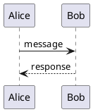
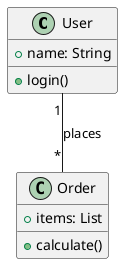
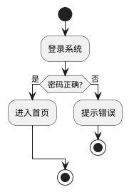
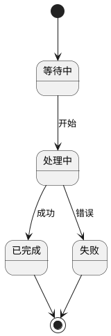
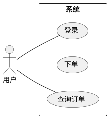
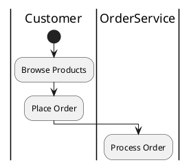

# AutoPlantUMLEdit

自动生成 UML 图表，一键导出可编辑的 PPT/EMF，支持 PowerPoint 直接编辑每个形状。

## 核心能力

- **自然语言 → PlantUML**：大模型根据用户需求生成 PlantUML 语法
- **一键导出**：生成 SVG → EMF → PPT，支持 SVG/PNG/EMF/PPT 四种格式
- **完全可编辑**：EMF/PPT 导入 PowerPoint 后可取消组合，每个形状独立编辑

## 触发条件

用户表达以下意图时激活：

- "生成一个...时序图/类图/流程图"
- "帮我画一个...架构图"
- "创建一个...状态图"
- "我想看...的 UML 图"

## 使用流程

1. 根据用户需求生成 PlantUML 语法
2. 保存为 `{name}.puml` 文件
3. 调用脚本生成输出

## 脚本命令

```bash
python svg2emf.py <input.puml> [-f ppt|svg|png|emf] [-o <output>]
```

**参数说明：**

| 参数 | 说明 | 默认值 |
|------|------|--------|
| `<input.puml>` | PlantUML 源文件 | 必填 |
| `-f` | 输出格式 | `ppt` |
| `-o` | 输出文件路径 | 同名 .pptx |

**示例：**

```bash
# 生成 PPT（默认）
python svg2emf.py sequence.puml

# 导出 SVG
python svg2emf.py sequence.puml -f svg

# 导出 PNG
python svg2emf.py sequence.puml -f png

# 导出 EMF（可编辑）
python svg2emf.py sequence.puml -f emf

# 指定输出路径
python svg2emf.py sequence.puml -o my_diagram.pptx
```

## PlantUML 语法速查

### 时序图 (Sequence Diagram)



### 类图 (Class Diagram)



### 流程图 (Activity Diagram)



### 状态图 (State Diagram)



### 用例图 (Use Case)



## 输出格式说明

| 格式 | 说明 | PowerPoint 可编辑 |
|------|------|------------------|
| `.pptx` | 嵌入 EMF 的幻灯片 | ✅ 取消组合后可编辑 |
| `.emf` | 增强图元文件 | ✅ 取消组合后可编辑 |
| `.svg` | 矢量图 | ❌ 需转换 |
| `.png` | 位图 | ❌ 不可编辑 |

**推荐工作流：**
1. 生成 `.pptx` 格式
2. 在 PowerPoint 中选中图片
3. 右键 → `组合` → `取消组合`（可能需要多次取消组合才能完全拆分每个元素）
4. 每个元素独立编辑

## ⚠️ 重要提示

**生成 PPT 后，大模型必须告知用户以下操作步骤：**

> 生成完成后，告知用户："PPT 已生成！如需编辑各个形状，请执行：选中图片 → 右键 → 组合 → 取消组合。**注意：可能需要多次取消组合（Ctrl+Shift+G）才能将所有元素完全拆分，确保每个形状都可以独立编辑。**"

## 注意事项

1. `.puml` 文件名避免使用中文、空格、特殊字符
2. PlantUML 语法严格，`@startuml` 和 `@enduml` 必须配对
3. 输出文件默认保存在当前工作目录
4. **必须先安装 Inkscape 和 JDK 并配置环境变量**（见上方依赖说明）
5. **使用系统 Python 运行脚本**：确保已安装依赖 `pip install -r requirements.txt`

## ⚠️ 泳道名/参与者名必须使用英文

由于 PlantUML 的编码限制，泳道名和参与者名必须使用英文。活动描述、消息文字等使用用户语言。



**规则：**
- **泳道名/参与者名**：必须使用英文（如 Customer、OrderService）
- **活动描述/消息**：使用用户语言（如用户说中文就用中文"浏览商品"，说英文就用英文"Browse Products"）
- **状态名称**：使用英文（如 Active、Pending、Completed）

**原因：** PlantUML 在处理非英文泳道名/参与者名时存在编码 bug，生成的 SVG 包含损坏的 HTML 实体引用。这是 PlantUML 本身的限制，无法通过配置解决。

## 依赖说明

### 外部依赖检查

**使用本 skill 前，请先检查以下依赖是否已安装：**

#### 1. Inkscape（矢量图转换）

Inkscape 用于将 SVG 转换为 EMF 格式，是核心依赖。

**检查是否已安装：**

```bash
# 在命令行中运行
inkscape --version
```

**如果未安装，请按以下步骤安装：**

1. 访问 Inkscape 官网下载页面：https://inkscape.org/release/
2. 下载 Windows 安装包（`.exe` 或 `.msi`）
3. 运行安装程序，**安装时注意勾选"Add Inkscape to PATH"**（添加到系统环境变量）
4. 安装完成后，重新打开命令行窗口验证：

```bash
inkscape --version
```

**版本要求：** Inkscape 1.0 或更高版本

**重要：** 如果安装时没有添加到 PATH，可以手动添加：
- 将 `C:\Program Files\Inkscape\bin` 添加到系统环境变量 PATH

#### 2. OpenJDK（运行 PlantUML）

**检查是否已安装：**

```bash
java --version
```

**如果未安装，请按以下步骤安装：**

1. 访问 Adoptium 下载页面：https://adoptium.net/zh-CN/temurin/releases?version=8
2. 下载 Windows x64 JDK 8 (.msi 或 .exe)
3. 运行安装程序
4. 配置环境变量：

| 变量名 | 值 |
|--------|-----|
| `JAVA_HOME` | `C:\Program Files\Eclipse Adoptium\jdk-8.x.x.x-hotspot`（根据实际安装路径） |
| `PATH`（追加） | `%JAVA_HOME%\bin` |

5. 验证安装：

```bash
java --version
```

### Python 依赖

通过 pip 安装：

```bash
pip install -r requirements.txt
```

**requirements.txt 内容：**
- pillow
- python-pptx

## PlantUML Jar 下载

**重要：** 如果 `scripts/plantuml.jar` 文件不存在，大模型需要自动下载。

**下载命令：**

```bash
# 切换到 AutoPlantUMLEdit skill 目录后执行
curl -L -o "scripts/plantuml.jar" "https://github.com/plantuml/plantuml/releases/download/v1.2026.2/plantuml-1.2026.2.jar"
```

**或使用 PowerShell：**

```powershell
# 切换到 AutoPlantUMLEdit skill 目录后执行
Invoke-WebRequest -Uri "https://github.com/plantuml/plantuml/releases/download/v1.2026.2/plantuml-1.2026.2.jar" -OutFile "scripts/plantuml.jar"
```

**下载后验证：**

```bash
java -jar scripts/plantuml.jar -version
```
