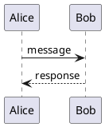
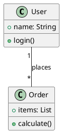
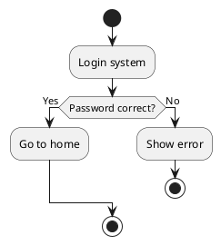
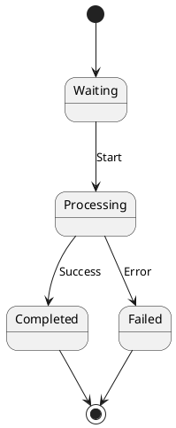
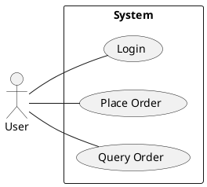
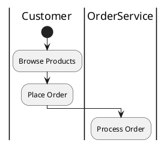

# AutoPlantUMLEdit

Auto-generate UML diagrams from natural language, one-click export to editable PPT/EMF with individually editable shapes in PowerPoint.

## Core Capabilities

- **Natural Language → PlantUML**: Generate PlantUML syntax from user requirements
- **One-click Export**: SVG → EMF → PPT, supports SVG/PNG/EMF/PPT formats
- **Fully Editable**: EMF/PPT can be ungrouped in PowerPoint for independent shape editing

## Trigger Conditions

Activate when user expresses:

- "Generate a... sequence/class/flowchart diagram"
- "Draw me a... architecture diagram"
- "Create a... state diagram"
- "I want to see... UML diagram"

## Usage Flow

1. Generate PlantUML syntax based on user requirements
2. Save as `{name}.puml` file
3. Run script to generate output

## Script Commands

```bash
python svg2emf.py <input.puml> [-f ppt|svg|png|emf] [-o <output>]
```

**Parameters:**

| Parameter | Description | Default |
|-----------|-------------|---------|
| `<input.puml>` | PlantUML source file | Required |
| `-f` | Output format | `ppt` |
| `-o` | Output file path | Same name .pptx |

**Examples:**

```bash
# Generate PPT (default)
python svg2emf.py sequence.puml

# Export SVG
python svg2emf.py sequence.puml -f svg

# Export PNG
python svg2emf.py sequence.puml -f png

# Export EMF (editable)
python svg2emf.py sequence.puml -f emf

# Specify output path
python svg2emf.py sequence.puml -o my_diagram.pptx
```

## PlantUML Syntax Reference

### Sequence Diagram



### Class Diagram



### Activity Diagram (Flowchart)



### State Diagram



### Use Case Diagram



## Output Format Guide

| Format | Description | PowerPoint Editable |
|--------|------------|---------------------|
| `.pptx` | Slide with embedded EMF | ✅ Ungroup to edit |
| `.emf` | Enhanced Metafile | ✅ Ungroup to edit |
| `.svg` | Vector image | ❌ Needs conversion |
| `.png` | Raster image | ❌ Not editable |

**Recommended Workflow:**
1. Generate `.pptx` format
2. Select the image in PowerPoint
3. Right-click → `Group` → `Ungroup` (may need to ungroup multiple times to fully separate all elements)
4. Edit each element independently

## ⚠️ Important Notes

**After generating PPT, you MUST tell the user the following:**

> "PPT generated! To edit each shape: Select the image → Right-click → Group → Ungroup. **Note: You may need to ungroup multiple times (Ctrl+Shift+G) to fully separate all elements and ensure each shape can be edited independently.**"

## Notes

1. Avoid Chinese characters, spaces, and special characters in `.puml` filenames
2. PlantUML syntax requires matching `@startuml` and `@enduml`
3. Output files are saved in the current working directory
4. **Inkscape and JDK must be installed and configured in PATH** (see dependency section below)
5. **Use system Python to run the script**: Ensure dependencies are installed via `pip install -r requirements.txt`

## ⚠️ Swimlane/Participant Names Must Be in English

Due to PlantUML encoding limitations, swimlane names and participant names must be in English. Activity descriptions and messages should use the user's language.



**Rules:**
- **Swimlane/Participant names**: Must be in English (e.g., Customer, OrderService)
- **Activity descriptions/messages**: Use user's language (if user speaks Chinese, use Chinese "浏览商品"; if English, use "Browse Products")
- **State names**: Use English (e.g., Active, Pending, Completed)

**Reason:** PlantUML has an encoding bug when handling non-English swimlane/participant names, producing SVGs with corrupted HTML entity references. This is a PlantUML limitation that cannot be resolved via configuration.

## Dependency Instructions

### External Dependencies Check

**Before using this skill, verify the following dependencies are installed:**

#### 1. Inkscape (Vector Conversion)

Inkscape is used to convert SVG to EMF format, it's the core dependency.

**Check if installed:**

```bash
# Run in command line
inkscape --version
```

**If not installed, follow these steps:**

1. Visit Inkscape download page: https://inkscape.org/release/
2. Download Windows installer (`.exe` or `.msi`)
3. Run the installer, **make sure to check "Add Inkscape to PATH"** during installation
4. After installation, reopen command line window and verify:

```bash
inkscape --version
```

**Version requirement:** Inkscape 1.0 or higher

**Important:** If not added to PATH during installation, you can add manually:
- Add `C:\Program Files\Inkscape\bin` to system PATH environment variable

#### 2. OpenJDK (Run PlantUML)

**Check if installed:**

```bash
java --version
```

**If not installed, follow these steps:**

1. Visit Adoptium download page: https://adoptium.net/zh-CN/temurin/releases?version=8
2. Download Windows x64 JDK 8 (.msi or .exe)
3. Run the installer
4. Configure environment variables:

| Variable | Value |
|----------|-------|
| `JAVA_HOME` | `C:\Program Files\Eclipse Adoptium\jdk-8.x.x.x-hotspot` (adjust to actual install path) |
| `PATH` (append) | `%JAVA_HOME%\bin` |

5. Verify installation:

```bash
java --version
```

### Python Dependencies

Install via pip:

```bash
pip install -r requirements.txt
```

**requirements.txt contents:**
- pillow
- python-pptx

## PlantUML Jar Download

**Important:** If `scripts/plantuml.jar` does not exist, the AI model should download it automatically.

**Download command:**

```bash
# Navigate to AutoPlantUMLEdit skill directory first
curl -L -o "scripts/plantuml.jar" "https://github.com/plantuml/plantuml/releases/download/v1.2026.2/plantuml-1.2026.2.jar"
```

**Or using PowerShell:**

```powershell
# Navigate to AutoPlantUMLEdit skill directory first
Invoke-WebRequest -Uri "https://github.com/plantuml/plantuml/releases/download/v1.2026.2/plantuml-1.2026.2.jar" -OutFile "scripts/plantuml.jar"
```

**Verify after download:**

```bash
java -jar scripts/plantuml.jar -version
```
