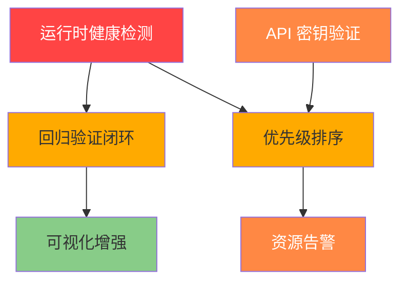

# 🚀 Autofix v6.0 改进提案

> **日期：** 2026-05-21
> **来源：** 对 `openclaw doctor` 实际运行输出的诊断审查

---

## 一、现状分析

当前 `openclaw doctor` 在 **配置静态扫描** 层面做得扎实，能检测出过期插件引用、模型配置缺失、消息工具缺失等问题。但存在以下结构性盲区：

### ✅ 已有的能力
- 配置文件完整性检查
- 安全状态扫描（渠道、密钥暴露）
- 技能/插件加载状态
- 孤立文件和过期引用发现

### ❌ 缺失的能力
- 运行时健康检测
- 性能与资源告警
- API 密钥有效性验证
- 问题优先级排序与分层报告
- 修复后回归验证闭环

---

## 二、改进项详细提案

### 1️⃣ 🔴 P0 — 运行时健康检测（Runtime Health Check）

**现状：** `doctor` 只读静态配置，不检查任何运行时状态。

**改进目标：** 增加对以下运行时指标的检测：

| 检测项 | 检测方式 | 期望输出 |
|--------|----------|---------|
| Gateway 进程状态 | `openclaw gateway status --json` | `service.runtime.status` + `rpc.ok` |
| 模型端点连通性 | 对配置的主要模型发一个轻量请求 | HTTP 200 / 连接失败信息 |
| 渠道消息通路 | 对已配置渠道做 dry-run 连通测试 | 通路正常 / 阻塞原因 |
| 日志异常扫描 | 读取近期 `error.log`，统计异常频率 | 最近 N 条错误摘要 |

**实现建议：**

```
Step 1: 运行 openclaw gateway status --json 获取实时状态
Step 2: 解析 service.runtime.status + rpc.ok
Step 3: 若状态异常 → 标注为 🔴 阻断级问题
Step 4: 扫描近期日志异常模式 → 生成统计摘要
```

**风险等级：** 🔴 阻断 — 无运行时信息的诊断是不完整的。

---

### 2️⃣ 🟠 P1 — API 密钥有效性验证（API Key Health Check）

**现状：** 配置中有各种 API key（Tavily、OpenAI、SearXNG 等），但 doctor 从不验证它们是否有效。

**改进目标：** 对已知 API 密钥做轻量级 dry-run 验证：

| 密钥类型 | 验证方式 | 开销 |
|----------|---------|------|
| OpenAI key | 发送一个 minimal chat completion（1 token） | 极低 |
| Tavily key | 调用 `tavily_search` 搜索空字符串 | 极低 |
| 自定义 provider | 尝试初始化连接 | 低 |

**输出示例：**

```
API 密钥健康检查
├─ openai key:                ✅ 有效（响应时间 320ms）
├─ tavily key:                ✅ 有效
├─ searxng instance:          ⚠️ 可连接，但返回 429（限流）
└─ custom provider key:       ❌ 401 Unauthorized
```

**风险等级：** 🟠 高风险 — 无效 key 会静默失败，排查困难。

---

### 3️⃣ 🟠 P2 — 性能与资源水位告警（Resource & Performance Baseline）

**现状：** 不关注系统资源消耗，日志无上限告警。

**改进目标：** 增加以下资源指标检测：

| 指标 | 检测方式 | 阈值 |
|------|---------|------|
| 磁盘用量 | 检查 OpenClaw 数据目录大小 | > 1GB 🟡 / > 5GB 🟠 |
| Gateway 内存 | 通过进程信息获取 | > 500MB 🟠 |
| Session 文件积压 | 统计 sessions 目录文件数与大小 | > 100 文件 🟡 |
| 日志文件大小 | 检查 logs 目录 | > 50MB 🟠 |

**输出示例：**

```
资源健康状态
├─ 磁盘用量:  ~/.openclaw 目录 847MB  🟡 接近阈值
├─ Gateway 内存:  312MB  🟢 正常
├─ sessions 文件数:  86  🟢 正常
└─ 日志文件:  23MB  🟢 正常
```

**风险等级：** 🟠 高风险 — 磁盘写满是常见的静默故障原因。

---

### 4️⃣ 🟡 P3 — 问题优先级排序与分层报告（Severity-Tiered Report）

**现状：** 所有发现的问题平铺展示，用户无法快速判断先处理哪个。

**改进目标：** 引入四级严重性标签，自动排序输出：

| 级别 | 标签 | 含义 | 建议行为 |
|------|------|------|---------|
| 🔴 **Critical** | 阻断级 | Gateway 不可用、模型连不上 | 立即修复 |
| 🟠 **High** | 高风险 | key 无效、渠道不通、资源不足 | 尽快修复 |
| 🟡 **Medium** | 可优化 | 配置警告、孤立文件、过期引用 | 计划修复 |
| 🟢 **Info** | 信息级 | Codex 遗留资产、技能缺失 | 知悉即可 |

**实现建议：**

```
诊断输出结构变更：
1. 顶部：严重问题摘要（只列 🔴 + 🟠）
2. 中部：详细信息（所有级别，按严重性排序）
3. 底部：修复建议（按严重性排序，并附对应命令）
4. 结尾：建议的修复顺序（Do First / Do Later / FYI）
```

**风险等级：** 🟡 可优化 — 不修复不影响功能，但影响体验。

---

### 5️⃣ 🟡 P4 — 修复后回归验证闭环（Post-Fix Regression Check）

**现状：** `doctor --fix` 执行修复后立即退出，**不验证修复是否成功**。

**改进目标：** `--fix` 执行完毕后自动再跑 `doctor`，输出 **Before / After 对比报告**：

```
修复前后对比
─────────────────────────────────
🔴 阻断级问题:  1 → 0  ✅ 全部解决
🟠 高风险问题:  3 → 1  ⚠️ 剩余 1 个需手动处理
🟡 可优化问题:  4 → 2  ✅ 部分解决
🟢 信息级问题:  2 → 2  — 无变化
─────────────────────────────────
剩余问题详情:
  🟠 [模型回退未配置] → 需手动编辑 openclaw.json
```

**风险等级：** 🟡 可优化 — 无此功能不产生错误，但有此功能可提升信任度。

---

### 6️⃣ 🟢 P5 — 诊断报告的 Canvas 可视化增强（Report Visualization）

**现状：** 已有 `canvas_report_generator.py`，但 v6.0 可以增强为交互式仪表盘。

**改进目标：** 生成包含以下组件的 HTML 报告：
- 严重性分布饼图
- 修复进度条（Before → After）
- 可折叠的详细问题列表
- 一键复制修复命令按钮

**风险等级：** 🟢 信息级 — 纯粹的用户体验提升。

---

## 三、版本规划

### v6.0-M1：运行时健康检测（P0）
**预估工时：** 2-3 小时
**交付物：**
- 新增 `scripts/runtime_health_check.py` 脚本
- 整合到 `MODULE_01_PreCheck.md` 流程
- 更新 `SKILL.md` 诊断步骤

### v6.0-M2：API 密钥验证 + 资源告警（P1+P2）
**预估工时：** 3-4 小时
**交付物：**
- 新增 `scripts/api_key_validator.py` 脚本
- 新增 `scripts/resource_monitor.py` 脚本
- 更新 `MODULE_01_PreCheck.md`

### v6.0-M3：优先级排序 + 回归验证（P3+P4）
**预估工时：** 2-3 小时
**交付物：**
- 重构 `doctor` 输出格式
- 新增 `--fix` 后回归验证逻辑
- 更新 `MODULE_03_ValidationAction.md`

### v6.0-M4：可视化增强（P5）
**预估工时：** 1-2 小时
**交付物：**
- 更新 `canvas_report_generator.py`
- 集成 Dashboard HTML 模板

---

## 四、实现优先级排序

```
立即（本周）
  ├─ P0: 运行时健康检测 ← 核心缺失
  └─ P3: 优先级排序     ← 无侵入性，改善体验

短期（下个迭代）
  ├─ P1: API 密钥验证    ← 快速见效
  └─ P2: 资源告警       ← 防患于未然

中长期
  ├─ P4: 回归验证       ← 需要 P0 作为先决条件
  └─ P5: 可视化增强     ← 锦上添花
```

---

## 五、各改进项之间的依赖关系



- **P0** 是最核心的基石，P4、P3 都依赖它
- **P1、P2** 可以并行开发，不依赖 P0
- **P5** 是独立的前端优化，可在任何阶段插入

---

## 六、预计成果

| 指标 | v5.5 现状 | v6.0 目标 |
|------|----------|----------|
| 检测项数 | ~8 项（静态配置） | ~15 项（静态 + 运行时） |
| 问题定位准确率 | 中（无运行时验证） | 高（多维度交叉验证） |
| 用户修复效率 | 需自行判断优先级 | 按严重性自动排序 |
| 修复可信度 | 无验证 | 自动回归验证 |
| 报告可读性 | 纯文本 | 分层 + 可视化 |

---

## 七、升级建议路径

**推荐方案：** 分 4 个里程碑逐步升级，每个里程碑独立可用。

```
M1 (2-3h) ────→ 运行时健康检测  ────→ 🔴 阻断问题全覆盖
                     ↓
M2 (3-4h) ────→ 密钥验证 + 资源告警 ──→ 🟠 风险问题全覆盖
                     ↓
M3 (2-3h) ────→ 优先级排序 + 回归验证 ──→ 完整诊断闭环
                     ↓
M4 (1-2h) ────→ 可视化仪表盘      ────→ 体验升级
```

每个里程碑均可独立交付并立即生效，无需等待全部完成。

---

> **下一步建议：** 从 **M1（运行时健康检测）** 开始实施，这是目前最显著的盲区，且投入产出比最高。
