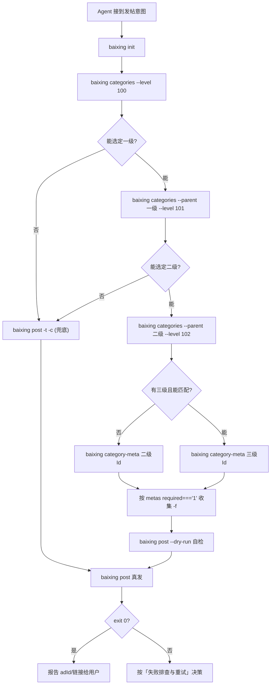

# baixing-agent-cli 使用说明（Agent）

百姓网 HTTP API 的薄 CLI，入口命令为 **`baixing`**（npm 包名 **`baixing-agent-cli`**）。若环境中还有 PHP 站内 CLI（如 `cli.php`），与本 npm 包**无关**——本包只调对外 HTTP 接口。

**能力边界**：CLI **不做**类目语义匹配、**不上传**图片、**不在本地校验** meta 与正则；这些由 Agent 推理或服务端返回决定。

## 前置条件

- **Node.js 18+**（`fetch`、`crypto.randomUUID`）

## 安装

**唯一对外安装方式**：从 **[npm](https://www.npmjs.com/package/baixing-agent-cli)** 安装（勿假定存在私有源码仓库）。

全局安装后命令名为 **`baixing`**：

```bash
npm install -g baixing-agent-cli
baixing --help
```

不需要全局安装时可用 **`npx`**（同样调用 **`baixing`**）：

```bash
npx baixing-agent-cli --help
```

## Agent 必须遵守的契约

### 调用形式

```text
baixing [全局选项] <子命令> [子命令选项] [子命令参数]
```

- 全局选项：**`-v` / `--verbose`**（调试信息打到 **stderr**，不改变 stdout JSON）。
- **API 根 URL**：内置默认 **`https://www.baixing.com`**。一般用法**不要**要求用户设置环境变量；仅在对接镜像/预发等场景才需要 **`BX_API_BASE_URL`** 或 **`init --base-url`**。优先级：**环境变量 `BX_API_BASE_URL` > 配置文件 `baseUrl` > 默认**。

### stdout / stderr

| 流 | 用途 |
|----|------|
| **stdout** | 成功时的主结果：`init` 成功时为一行 uuid；其余成功子命令（`post`、`posts`、`search`、`detail`、`categories`、`category-meta`）均为 **格式化 JSON**（`JSON.stringify(..., null, 2)`），可对**整段 stdout** `JSON.parse`。`post --dry-run` 亦为 JSON（含 `_baseUrl`）。 |
| **stderr** | 人类可读提示与错误；**`-v`** 时含 HTTP 方法与大致 URL。**不要**把 stderr 当 API 响应解析。 |

**建议**：成功路径只解析 **stdout**；失败时读 **stderr** 文本。

后端响应的 JSON 中，**布尔/数字常以字符串形式给出**（如 `required: "1"`、`level: "101"`、`maxlength: "30"`）。Agent 比较时优先用 `String(x) === "1"` 等显式串比较，避免类型坑。

### 退出码

| 码 | 含义 |
|----|------|
| **0** | 成功（含「已有 uuid 未 force 仍打印已有 uuid」）。 |
| **1** | 失败：参数、网络、非 2xx、JSON 解析失败，或业务 JSON 中 `code !== 0`。 |

**必须**用退出码判断成败，不能仅凭 stdout 是否非空。

### 稳定性与容错

- 优先使用**长选项**（如 `--dry-run`、`--base-url`）作为稳定契约。
- 响应 JSON 结构由服务端决定；解析时应容错未知字段。

## 推荐自动化流程

1. **`baixing init`** → 从 stdout 取 uuid（**已有** uuid 时 stderr 会提示、**exit 仍为 0**）。需要换新 uuid 时用 **`baixing init --force`**。
2. **类目检索（推荐两步走，避免一次拉全树）**：
   - **a)** `baixing categories --level 100` → 选定一级类目。
   - **b)** `baixing categories --parent <一级id> --level 101` → 选定二级（**底线粒度**）。
   - **c)** 若二级下可能还有三级：`baixing categories --parent <二级id> --level 102`。
3. **`baixing category-meta <最终选定id>`** → 解析 `data.metas[]` 中 `required === "1"` 的 `name` 集合，指导 `-f`。
4. **收集字段值** → `baixing post -t … -c … --category <id> -f name=value -f …`
   - **调试**：加 **`--dry-run`**，仅打印 payload（JSON），**不触网**。
5. **`baixing posts`** 或 **`baixing posts --uuid <id>`**。
6. **`baixing search <关键词...>`**（多词空格分隔；整句含空格时对参数加引号）。
7. 从 **`search` / `posts`** 的 **`data.items[].adId`** 取 ID，执行 **`baixing detail <adId>`**。

**无法定到二级类目**时直接 **`baixing post -t … -c …`**，**不传** `--category`，由后端兜底。

## 流程图（全链路）



### 类目匹配粒度

- **底线**：匹配到二级类目（`level=101`）即可发布。
- 选中的二级类目下若**有三级**（`level=102` 且 `parent === 二级 id`），尝试再匹配；**匹配不到合适的就回退用二级**，不强求三级。
- 二级类目下**没有三级**时直接用二级。
- 连二级也定不下来时省略 `--category`，让后端兜底。

### 类目检索的上下文预算策略

- **`baixing categories` 不加过滤**时可能返回**几百条**记录，单次塞进上下文浪费 token；优先使用 **`--level`** 与 **`--parent`**，把单次返回压到大约 **≤ 30 条**的量级再让模型选。
- 工作流应是 **自上而下两到三跳**，而不是「拉全表 + 本地/模型在海量列表里硬匹配」。
- **`--id <id>`** 用于已知 id 时**验证存在性**（成功时通常为 0 或 1 条）。

多进程/多租户：为不同进程设置不同 **`BX_CONFIG_PATH`**，避免互相覆盖 uuid 配置。

## Meta 字段使用指南

### 响应骨架（示意）

```json
{
  "code": 0,
  "data": {
    "categoryId": "huodong",
    "metas": [
      { "name": "title",         "controlType": "Input",      "required": "1" },
      { "name": "content",       "controlType": "Textarea" },
      { "name": "contact",       "controlType": "Input",      "required": "1", "pattern": "..." },
      { "name": "地区",           "controlType": "TreeSelect", "required": "1", "id": "context.city.objectId" },
      { "name": "image",         "controlType": "Image" },
      { "name": "allowChatOnly", "controlType": "Radio", "values": "0,1", "defaultValue": "0" }
    ]
  }
}
```

### 控件类型 → `-f` 用法

- **`Input` / `Textarea`**：`-f name=value`。若 meta 带 **`pattern`**（后端正则），不满足时 `neoPost` 往往返回 **`code !== 0`**。
- **`Radio`**：将 **`values`** 按 **`,`** 切分得到允许取值；不确定时用 **`defaultValue`**。例：`-f allowChatOnly=0`。
- **`TreeSelect`**（如「地区」）：传**城市/区域 id**（例：上海闵行 `-f 地区=m328`）。不传时后端可能对城市有兜底（例如默认 `m30`，实现可参考仓库内 `htdocs/controller/Fabu_Controller.php` 约 1094–1103 行）；Agent 仍应优先从用户描述还原合适区域 id。
- **`Image`**：当前 CLI **不支持上传图片**，**跳过此项**；只要 **`required !== "1"`**，省略一般仍可发帖。
- **特例**：`title` / `content` 即便出现在 `metas`，也**必须**用顶层 **`-t` / `-c`**；**不能** `-f title=…` / `-f content=…`（CLI 会拒绝，见包内 `parseFieldOption` 对保留字段的校验）。

### 必填字段填值兜底（仅当用户未明示时）

- **`contact`**：可暂用示例号 `13800001111`，但应优先向用户索取真实号码。
- **`价格`**：用户未提时可填 `0`；类目明显为出租等（如 `m37617`）时建议**明确询问**用户。
- **`地区`**：尽量从用户描述抽取地名再换成 id；拿不到可省略并依赖后端兜底。
- **`allowChatOnly`**：默认 **`0`**（私信 + 电话均可）。

## 失败排查与重试

退出码 **1** 时建议按下面顺序判断：

1. **stderr 含「未找到 uuid」** → 执行 **`baixing init`**（或传 **`--uuid`**），再重试。
2. **stderr 含「--field 解析失败」或「保留字段」** → 修正 `-f` 格式；**不要**用 `-f title=` / `-f content=` / `-f uuid=` / `-f category=`，改用 **`-t` / `-c` / `--uuid` / `--category`**。
3. **stdout 可解析为 JSON 且 `code !== 0`** → 读 **`message`**，常见对应：
   - **类目不存在**：`categories --id <id>` 校验 id；必要时改用二级 id 重试。
   - **meta 必填缺失**：重跑 **`category-meta`**，核对 `required === "1"` 的 `name` 是否都已提供（含 `-t`/`-c`）。
   - **`pattern` 不匹配**（如 `contact`）：对照 metas 里的 **`pattern`** 修正后重试。
4. **HTTP 非 2xx** 或 **stdout 不是合法 JSON**（解析错误、HTML/纯文本）：可能被网关/边缘拦截；加 **`-v`** 看 URL 与线索，可**最多再试 1 次**；仍失败则向用户说明，避免死循环重试。
5. **「能发就行」降级**：上述仍无法收敛时，可退化为 **`baixing post -t … -c …`** **不带** `--category`，让后端兜底为 **`qitazhuanrang`**（与用户预期类目不符时需说明）。

## 端到端示例（worked example）

对话假设：用户要在上海出一条二手 iPhone 15：九成新、4500 元、联系 13800001111。

```bash
baixing init

baixing categories --parent ershou --level 101
# stdout 节选（示意）：含 { "id": "shoujihaoma" }, { "id": "qitazhuanrang" }, …

baixing categories --parent shoujihaoma --level 102
# 假设得到 [{ "id": "m37501", "name": "iPhone" }, …]

baixing category-meta m37501
# 假定 data.metas 标明必填：title / content / contact / 价格 / 地区（以实际响应为准）

baixing post \
  -t "9 成新 iPhone 15 出售" \
  -c "九成新，功能正常，当面交易。" \
  --category m37501 \
  -f contact=13800001111 \
  -f 价格=4500 \
  -f 地区=m30 \
  --dry-run

baixing post \
  -t "9 成新 iPhone 15 出售" \
  -c "九成新，功能正常，当面交易。" \
  --category m37501 \
  -f contact=13800001111 \
  -f 价格=4500 \
  -f 地区=m30
```

发帖成功后 **stdout** 一般为 JSON；Agent 应向用户回报服务端给出的 **`data.id`**、**`data.url`**（或等价字段，名称以实际响应为准），并对未知字段保持容错。

## 子命令速查

| 子命令 | 作用 | 要点 |
|--------|------|------|
| **`init`** | 生成 UUID v4 写入配置 | **`--base-url` 可选**（默认即生产根 URL）；**`--force`**；已有 uuid 且无 `-f` 时 stderr 提示、stdout 仍为 uuid、退出 0 |
| **`categories`** | `GET /neo/category` | 客户端过滤：`--parent`、`--level`（一级 100 / 二级 101 / 三级 102）、`--id`；多条件按「与」组合 |
| **`category-meta`** | `GET /neo/category/meta?categoryId=...` | 参数 `categoryId` 必填，中文/字母/数字/下划线均可（如 `huodong`、`zhenghun`、`m35971`） |
| **`post`** | `POST /neo/fabu/neoPost` | **`-t`、`-c` 必填**；`--uuid`、`--category <id>`、可重复 `-f, --field name=value`（首个 `=` 切分；支持中文 key；**`-f` 不可传保留字段 title/content/uuid/category，请用顶层选项**）、`--dry-run` |
| **`posts`** | `GET /neo/queryByUuid` | `--uuid`、`-p/--page`、`-s/--size`（页码从 1） |
| **`search`** | `GET /neo/search` | 关键词为参数；无关键词则退出 1 |
| **`detail`** | `GET /neo/detail/<adId>` | `adId` 为非空数字串，来自列表里的 **`adId`** |

## 环境变量

| 变量 | 说明 |
|------|------|
| **`BX_API_BASE_URL`** | **可选**。未设置时使用默认 **`https://www.baixing.com`**。只有需要指向非生产根地址时才设置；设置后覆盖配置文件里的 `baseUrl`。Agent 默认流程中**不应**向用户索要此项。 |
| **`BX_CONFIG_PATH`** | **可选**（多实例/CI 时用）。配置文件**绝对路径**；未设置时默认 `~/.config/baixing-agent/config.json`（Windows 路径见 npm 包 README）。 |

## 完整文档

选项表、边界行为与发布说明见 [reference.md](reference.md)。
