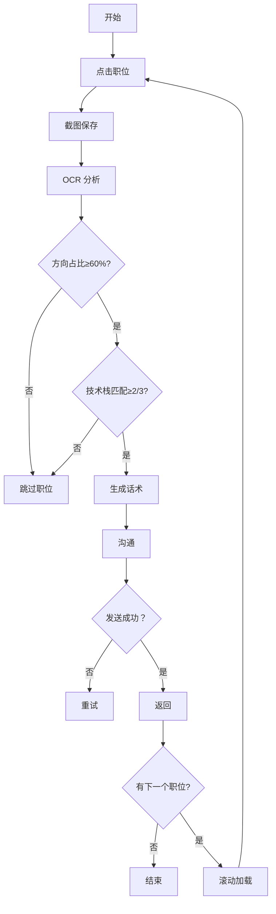

# Boss Automation - Boss 直聘职位沟通自动化技能

## 📋 概述

Boss Automation 是一个完整的 Boss 直聘职位沟通自动化技能，能够自动浏览职位列表、OCR 分析职位描述、智能匹配技术栈、自动生成沟通话术并发送消息。

基于 pyautogui 实现桌面自动化，支持多分辨率适配、坐标自动缩放、随机延迟模拟人工操作等功能。

## 🎯 核心功能

- ✅ **自动滚动** - 向下滚动职位列表加载新内容
- ✅ **自动点击** - 点击职位卡片查看详情
- ✅ **截图保存** - 截取职位描述区域并保存
- ✅ **OCR 识别** - 调用 ocr-local 技能提取技术关键词
- ✅ **智能匹配** - 技术方向占比分析（≥60%）和技术栈匹配（≥2/3）
- ✅ **话术生成** - 根据匹配度生成沟通话术
- ✅ **自动沟通** - 点击沟通按钮、粘贴话术、发送消息
- ✅ **浏览器控制** - 前进/后退、激活输入框等操作

## 📦 安装与依赖

### Python 依赖

```bash
pip install pyautogui>=0.9.5 pyperclip>=1.8.2 Pillow>=10.0.0
```

### Node.js 依赖

```bash
cd skills/ocr-local
npm install
```

### OCR 工具

本技能使用 `skills/ocr-local` 目录下的 OCR 脚本进行文字识别，支持：
- 简体中文（chi_sim）
- 繁体中文（chi_tra）
- 英文（eng）

## 🚀 快速开始

### 配置参数

编辑 `config.json` 修改：

```json
{
  "browser": {
    "url": "https://www.zhipin.com/web/geek/jobs"
  },
  "coordinates": {
    "resolution": [2560, 1440],
    "scale_multiplier": 1.0
  },
  "matching": {
    "threshold": 60
  }
}
```

### 运行流程

#### 方式一：自动循环模式

```bash
python skills/boss-automation/main.py
```

#### 方式二：CLI 命令行

```bash
python skills/boss-automation/cli.py start          # 开始自动处理
python skills/boss-automation/cli.py scroll         # 滚动一次
python skills/boss-automation/cli.py click          # 点击职位
python skills/boss-automation/cli.py screenshot     # 截图
python skills/boss-automation/cli.py ocr <image>    # OCR 识别
python skills/boss-automation/cli.py chat           # 执行沟通
python skills/boss-automation/cli.py back           # 返回职位列表
python skills/boss-automation/cli.py config         # 显示配置
python skills/boss-automation/cli.py test           # 测试坐标
```

### 独立函数调用

```python
from boss_automation import *

# 只执行点击和截图
click_job_item()
path = capture_screenshot()

# 自定义流程
click_chat_button()
send_chat_message("自定义消息")

# 处理单个职位
process_job()
```

## 📊 技术匹配策略

### 匹配标准

```
技术方向占比 >= 60%  AND  技术栈匹配数 >= 2/3
```

### 技术方向分类

| 方向 | 关键词示例 |
|------|---------|
| **前端** | 前端/页面/界面/Vue/React/Angular/HTML/CSS/TypeScript |
| **后端** | 后端/API/RESTful/Spring/Django/Flask/Go/Kubernetes/Docker |
| **数据** | 数据/数据库/SQL/NoSQL/Pandas/Spark/Hadoop/Flink/Redis |
| **算法** | 算法/模型/PyTorch/TensorFlow/Scikit-learn/OpenCV/ONNX/LLM/NLP/CV |
| **全栈** | 全栈/全端/MERN/MEAN/Next.js/NestJS/GraphQL |

### 技术栈关键词

| 类别 | 关键词 |
|------|--------|
| **语言** | Python/Java/Go/Rust/JavaScript/TypeScript/C++/C# |
| **框架** | PyTorch/TensorFlow/Spring/Django/FastAPI/Express/NestJS |
| **模型** | LLM/GPT/BERT/Transformers/Stable Diffusion/YOLO/OpenCV |

## 💬 话术生成策略

### 生成规则

1. **说明符合要求的内容** - 直接提及匹配的技术点
2. **技术方面适当夸大** - 了解→熟悉，不熟悉→了解
3. **模仿人类语言习惯** - 自然流畅的中文表达
4. **表达强烈应聘希望** - 体现求职诚意
5. **字数控制** - 40-60 字

### 示例话术

```
您好！对这个 AI 大模型岗位很感兴趣。我的大模型技术栈非常匹配：精通 PyTorch 训练优化，熟悉 SFT/RLHF，有 LangChain 构建 RAG 应用经验，能独立完成 LLM Agent 架构设计。对贵司技术方向契合！
```

## 📁 文件结构

```
boss-automation/
├── SKILL.md                    # 本技能文档
├── config.json                 # 主配置文件
├── chat_template.txt           # 话术模板
├── main.py                     # 主流程脚本
├── cli.py                      # CLI 命令行接口
└── boss_automation.py          # pyautogui 自动化函数
```

## 🔄 自动化流程（9 步循环）



## ⚙️ 配置说明

### 主要配置项

```json
{
  "browser": {
    "url": "目标页面 URL"
  },
  "screenshot": {
    "output_dir": "截图输出目录",
    "filename_prefix": "文件名前缀",
    "timestamp_format": "时间戳格式"
  },
  "scroll": {
    "amount": -155,
    "times": 1
  },
  "coordinates": {
    "resolution": [2560, 1440],
    "scale_multiplier": 1.0,
    "job_start": [888, 350],
    "screenshot": [1100, 300, 1800, 1250],
    "chat_button": [1765, 335],
    "chat_input": [1500, 1300]
  },
  "matching": {
    "threshold": 60,
    "core_skills": ["Python", "PyTorch", "LLM", "Agent"],
    "stack_matching": 2,
    "total_stack": 3
  },
  "delay": {
    "min_seconds": 1.0,
    "max_seconds": 3.0
  }
}
```

### 自定义分辨率

在 `config.json` 中修改：

```json
"coordinates": {
  "resolution": [1920, 1080],  // 自定义分辨率
  "scale_multiplier": 0.8       // 相对于基准 2560x1440 的缩放比例
}
```

## 🛠️ 高级用法

### 自定义话术模板

编辑 `chat_template.txt`：

```
您好！我对这个职位很感兴趣。我精通 Python、PyTorch 和大模型技术，有多年 LLM、Agent、Workflow 项目落地经验，熟悉 LangChain、LangGraph 等框架，能独立负责智能体平台架构设计和核心模块研发。对贵司的 AI Agent/智能体平台岗位非常匹配，希望能进一步沟通！
```

### 修改匹配阈值

```json
"matching": {
  "threshold": 70  // 修改为 70%
}
```

### 修改滚动参数

```json
"scroll": {
  "amount": -200,  // 滚动像素量
  "times": 2       // 滚动次数
}
```

## 📝 使用示例

### 示例 1：完整自动流程

```bash
python cli.py start
```

### 示例 2：手动控制流程

```python
from main import *

# 滚动一次
scroll_job_list()

# 点击职位
click_job_item()

# 截图
path = capture_screenshot()

# 执行沟通
click_chat_button()
send_chat_message()

# 返回
browser_go_back()
```

### 示例 3：自定义消息

```python
from main import *

click_chat_button()
send_chat_message("您好！我对这个岗位很感兴趣...")
```

### 示例 4：仅截图保存

```bash
python cli.py screenshot
```

### 示例 5：OCR 识别

```bash
python cli.py ocr screenshots/job_20260428_231512.png
```

## 🐛 故障排除

### 1. OCR 无法识别

- 确保 `skills/ocr-local` 已安装依赖：`npm install`
- 检查图像路径是否正确
- 确认 `tesseract.js` 已安装

### 2. 中文话术乱码

- 使用 `pyperclip` 复制（已在代码中自动处理）
- 确保文件编码为 UTF-8

### 3. 坐标偏移

- 在 `config.json` 中调整坐标值
- 或使用 `scale_multiplier` 自动缩放
- 运行 `python cli.py test` 查看缩放结果

### 4. 匹配度不达标

- 检查 `core_skills` 配置
- 调整 `matching.threshold` 阈值
- 修改话术模板中的技能描述

### 5. 页面加载慢

- 增加 `delay.min_seconds` 和 `delay.max_seconds`
- 检查网络连接
- 关闭其他占用 CPU 的程序

## 📜 License

MIT License

## 📞 技术支持

如有问题，请联系开发团队。
