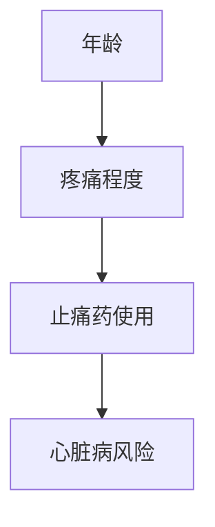
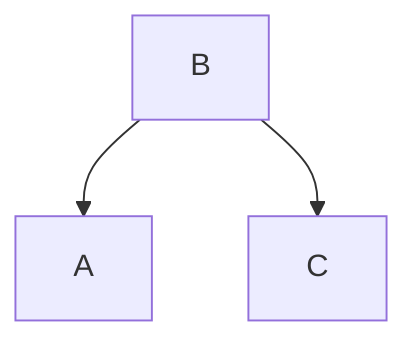
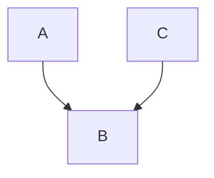
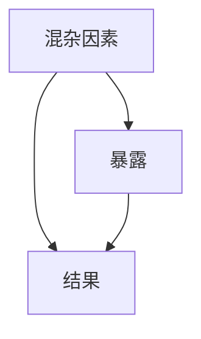
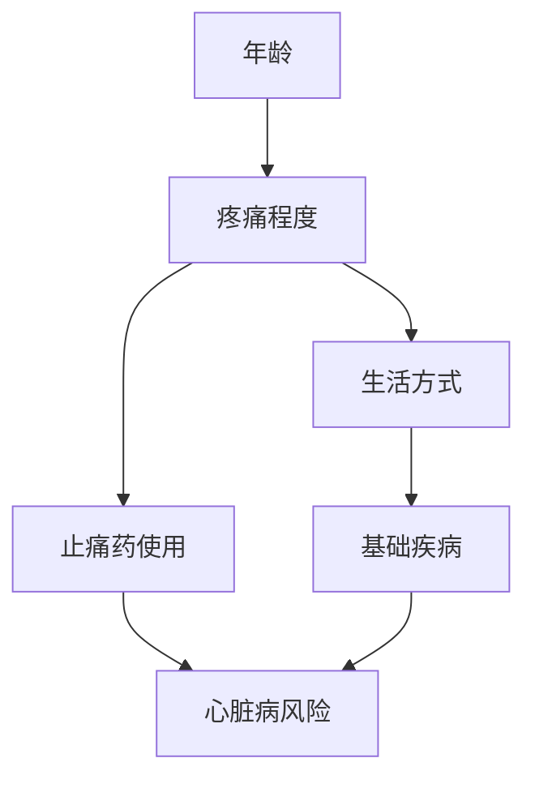
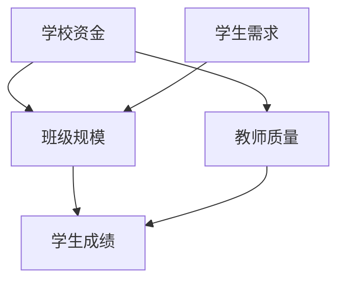

# 因果图绘制工具

## 快速开始

### 方式一：生成图片（适合公众号/文档插图）

```bash
python3 ~/.agents/skills/causal-diagram/scripts/generate_dag.py \
  --output causal_diagram.png \
  --title "因果图标题" \
  --nodes "年龄,疼痛程度,止痛药使用,心脏病风险" \
  --edges "年龄->疼痛程度,疼痛程度->止痛药使用,止痛药使用->心脏病风险"
```

### 方式二：生成 Mermaid 代码（适合飞书文档）

```python
# 直接在文档中使用 Mermaid 语法

```

## 参数说明

### generate_dag.py 脚本参数

| 参数 | 说明 | 示例 |
|------|------|------|
| `--output` | 输出文件路径 | `diagram.png` |
| `--title` | 图表标题 | `"案例1：止痛药与心脏病"` |
| `--nodes` | 节点列表（逗号分隔） | `"A,B,C,D"` |
| `--edges` | 边列表（逗号分隔，用 -> 表示方向） | `"A->B,B->C"` |
| `--layout` | 布局方式：`tb`（上下）、`lr`（左右） | `tb`（默认） |

## 常见因果图结构

### 1. 链式结构（Chain）

A → B → C：A 通过 B 影响 C


### 2. 分叉结构（Fork）

A ← B → C：B 同时影响 A 和 C



### 3. 对撞结构（Collider）

A → B ← C：A 和 C 共同影响 B



### 4. 混杂结构（Confounder）

存在共同原因影响暴露和结果



## 输出格式选择指南

| 场景 | 推荐格式 | 原因 |
|------|----------|------|
| 飞书云文档 | Mermaid | 可编辑、可复制、自动渲染 |
| 微信公众号 | PNG 图片 | 清晰美观、加载快 |
| 学术论文 | PNG/SVG | 高质量、可插入 Word |
| 在线演示 | Mermaid | 动态、可交互 |

## 示例工作流

### 示例1：分析止痛药与心脏病的关系

```bash
# 生成图片
python3 ~/.agents/skills/causal-diagram/scripts/generate_dag.py \
  --output painkiller_dag.png \
  --title "止痛药与心脏病风险" \
  --nodes "年龄,疼痛程度,生活方式,止痛药使用,基础疾病,心脏病风险" \
  --edges "年龄->疼痛程度,疼痛程度->生活方式,疼痛程度->止痛药使用,生活方式->基础疾病,止痛药使用->心脏病风险,基础疾病->心脏病风险"
```

Mermaid 版本：


### 示例2：班级规模与学生成绩



## 注意事项

1. **节点命名**：使用简短、清晰的名称，避免特殊字符
2. **边的方向**：用 `->` 表示因果方向，箭头从原因指向结果
3. **布局选择**：
   - `tb`（上下）：适合有明确因果层级的情况
   - `lr`（左右）：适合流程类因果图
4. **复杂图**：节点超过 8 个时，建议拆分为多个子图