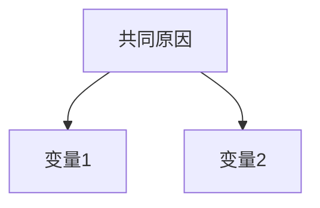
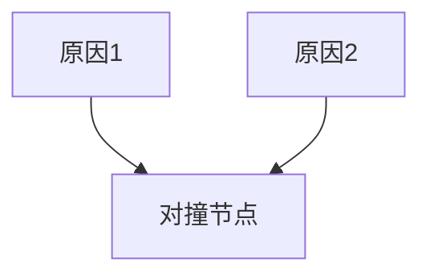
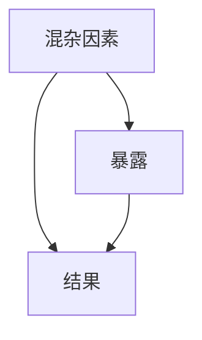
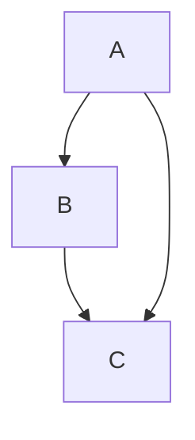
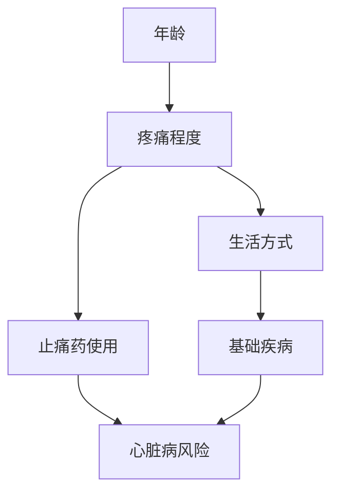
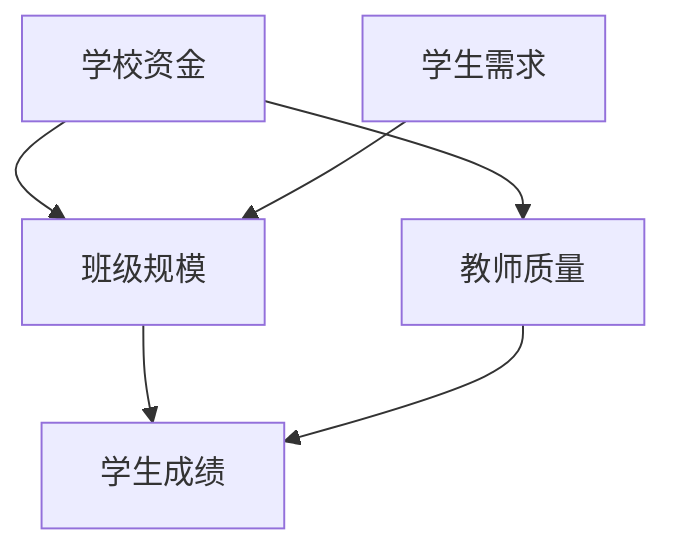
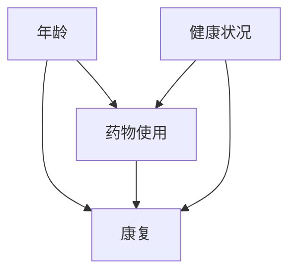

# 因果图 Mermaid 语法参考

## 基本语法

### 1. 定义图表类型

```mermaid
flowchart TB
    %% TB = Top to Bottom（上下布局）
    %% LR = Left to Right（左右布局）
    %% BT = Bottom to Top
    %% RL = Right to Left
```

### 2. 定义节点


### 3. 定义边（箭头）

```mermaid
flowchart TB
    A --> B      %% 实线箭头
    A -->|标签| B   %% 带标签的箭头
    A -.-> B     %% 虚线箭头
    A ==> B      %% 粗箭头
```

## 常见因果图模板

### 链式结构


### 分叉结构



### 对撞结构



### 混杂结构



### M 结构



## 样式定制

### 节点形状


### 颜色和样式


## 实际案例

### 案例1：止痛药与心脏病



### 案例2：班级规模与学生成绩



### 案例3：药物疗效研究



## 注意事项

1. **节点 ID 不能重复**：每个节点需要唯一的 ID（如 A, B, C）
2. **中文支持**：Mermaid 支持中文，但建议在方括号内使用
3. **布局选择**：
   - 因果层级明确 → `TB`（上下）
   - 时间序列 → `LR`（左右）
4. **复杂图拆分**：超过 10 个节点建议拆分为多个子图