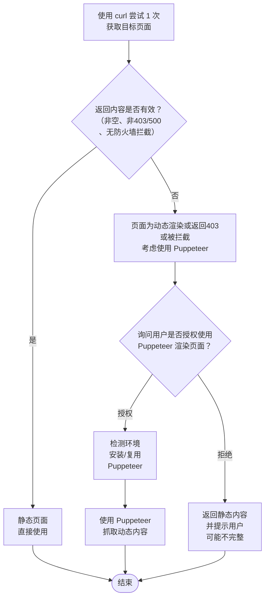

# CCF 活动信息查询

获取中国计算机学会（CCF）近期学术会议、认证考试、活动日程等信息。

**个性化推荐**：如果用户提供了兴趣偏好（如研究方向、技术领域等），根据用户兴趣从所有活动中筛选并推荐相关活动。

## 活动查询核心功能

### 1. API数据源
- **主要API端点**：`https://conf.ccf.org.cn/conf/v2/index/meeting/list.do`
- **请求方法**：POST
- **请求体格式**：
  ```json
  {
    "pageNo": 1,
    "pageSize": 50,
    "signupTimeState": "0",
    "sortType": "0"
  }
  ```
- 查找活动结束时间在一个月内的活动、查找未来三个月内举办的活动

### 2. 会议地址生成规则
从API返回的会议数据中，每个会议记录包含：

- id: 会议ID (meetingId)
- shortUrl: 短链接标识
- webUrl: 官方网站URL（如果有）

会议详情页面URL生成优先级：

- 如果 webUrl 不为空 → 使用 webUrl
- 如果 shortUrl 不为空 → 使用 https://ccf.org.cn/[shortUrl]
- 否则 → 使用 https://conf.ccf.org.cn/web/html7/index.html?globalId=[id]&type=1

### 3. 输出格式要求（强制执行）
- 必须使用表格格式（禁止无格式长文本）
- 会议地址列必须包含可点击的Markdown链接
- 链接格式：[会议地址](URL)

### 4. 特殊会议URL格式

| 会议类型 | URL格式 |
|----------|---------|
| CNCC | https://cncc[年份].ccf.org.cn |
| YEF（青年精英大会） | https://yef[年份].ccf.org.cn |
| ADL（学科前沿讲习班） | https://ccf.org.cn/ADL[编号] |
| NCCA（计算机应用大会） | https://ccf.org.cn/ncca[年份] |

### 查询时间范围
- 即将举办：未来三个月内（从今天到 +90 天）
- 刚刚结束：过去一个月内（从今天到 -30 天）

## 执行步骤

### 步骤1：收集用户偏好（可选）
如果用户提供了兴趣偏好，先收集并记录：

- 研究领域：如人工智能、数据挖掘、计算机网络、自然语言处理等
- 活动类型：如学术会议、认证考试、公益活动、培训讲习班等
- 参与目的：如学习新技术、获取认证、交流学术、企业合作等
- 时间偏好：如近期可参加、暑期、节假日等
- 地点偏好：如一线城市、高校所在地等

### 步骤2：调用CCF会议系统API获取数据

```bash
# 基础查询（无需用户输入）
curl -s -X POST "https://conf.ccf.org.cn/conf/v2/index/meeting/list.do" \
  -H "Content-Type: application/json" \
  -d '{"pageNo":1,"pageSize":50,"signupTimeState":"0","sortType":"0"}'
```

### 步骤3：解析API返回数据
从返回的JSON中提取 data.records 数组，每个记录包含：

- id: meetingId
- meetingTitle: 会议名称
- startTime/endTime: 时间戳
- province/city: 地点
- shortUrl: 短链接
- webUrl: 官方网站
- signupTimeState: 报名状态

### 步骤4：生成会议详情链接
根据上述优先级规则生成每个会议的详情页面URL。

### 步骤5：筛选和整理数据，区分活动状态
判断活动状态的逻辑：

- 当前日期在报名开始和结束时间之间 → 状态为 🟢 报名中
- 当前日期早于报名开始时间 → 状态为 🔵 即将开始
- 当前日期晚于活动结束时间 → 状态为 ⚪ 已结束

## 资源检索（CCF数字图书馆）
当用户想查询已结束活动的资源（视频、PPT、讲稿、专辑等）时使用。

### 架构说明
数字图书馆前端页面是用户看到的搜索界面，但**实际数据通过后端API返回JSON**。

- **用户页面地址** = 前端搜索入口URL（可发给用户点击打开）
- **后端API地址** = 实际数据接口（用于程序化查询，返回结构化JSON）

### ⚠️ 重要：区分页面URL和API端点
不要将页面URL当成API来调用。例如 `https://dl.ccf.org.cn/video/videoIndex.html?searWord=xxx` 是用户看到的视频搜索**页面**，它内部调用的是 `/video/getVideoList` 这个**后端API**。

---

### 1. 统一搜索 API（聚合页 `/V2/toSearchList.html`）

这是最常用的搜索入口，返回视频/讲稿/期刊/专辑等所有类型的聚合结果。

#### 1.1 搜索列表 `searchList.do`

```bash
# GET 请求，参数需 URL 编码
curl -G -sL "https://dl.ccf.org.cn/searchList.do" \
  -H "User-Agent: Mozilla/5.0 (Windows NT 10.0; Win64; x64)" \
  -H "Referer: https://dl.ccf.org.cn/V2/toSearchList.html" \
  --data-urlencode "page=1" \
  --data-urlencode "classen=-1" \
  --data-urlencode "searchText=大模型" \
  --data-urlencode "searchText2=" \
  --data-urlencode "sort=score desc" \
  --data-urlencode "pageNumber=30"
```

**参数说明：**

| 参数 | 类型 | 说明 |
|------|------|------|
| page | int | 页码，从1开始 |
| classen | int | 分类，-1=全部，其他值对应具体分类 |
| searchText | string | 搜索关键词（需URL编码） |
| searchText2 | string | 分面筛选条件（Solr语法，可选） |
| sort | string | 排序：`score desc`（相关度）/ `date desc`（时间） |
| pageNumber | int | 每页条数，默认30 |

**返回结构：** `dataRole[0]["search"]["data"]` 包含结果数组，`dataRole[0]["search"]["count"]` 为总数。

每条结果包含：`id`, `title`, `classEn`（类型：`audio_video`/`ppt`/`cccf`/`picture`/`qkwz` 等），`op_author`, `date`, `cover`, `view_count` 等。

#### 1.2 分面统计 `facetedStatistics.do`

```bash
# POST 请求，获取左侧筛选栏的分类统计
curl -s -X POST "https://dl.ccf.org.cn/facetedStatistics.do" \
  -H "User-Agent: Mozilla/5.0 (Windows NT 10.0; Win64; x64)" \
  -d "classen=-1" \
  --data-urlencode "searchText=大模型" \
  -d "searchText2="
```

#### 1.3 其他辅助接口

| 接口 | 方法 | URL | 说明 |
|------|------|-----|------|
| 热词推荐 | POST | `https://dl.ccf.org.cn/V2/getHotWords` | 获取周期内热门检索词 |
| 专辑搜索 | POST | `https://dl.ccf.org.cn/albumList/searchAlbum` | 搜索专辑（`searchword`, `pageNum`, `pageSize`） |

---

### 2. 视频专用搜索

**页面地址：** `https://dl.ccf.org.cn/video/videoIndex.html`（用户端）
**后端API：** `POST /video/getVideoList`（程序调用）

```bash
curl -s -X POST "https://dl.ccf.org.cn/video/getVideoList" \
  -H "User-Agent: Mozilla/5.0 (Windows NT 10.0; Win64; x64)" \
  -d "pageNum=1" \
  -d "pageSize=16" \
  --data-urlencode "searchTerm=大模型" \
  -d "sortRule=date" \
  -d "dataYear=" \
  -d "seriesText="
```

**参数说明：**

| 参数 | 说明 |
|------|------|
| pageNum | 页码 |
| pageSize | 每页条数（默认16） |
| searchTerm | 搜索关键词 |
| sortRule | 排序：`date` / `view_count` |
| dataYear | 年份筛选（如 `2025`） |
| seriesText | 系列筛选 |

**筛选条件接口：** `POST /video/getConditions`（无参数，返回 `dateYears` 年份列表等）

---

### 3. 讲稿/PPT 专用搜索

**页面地址：** `https://dl.ccf.org.cn/ppt/pptIndex.html`（用户端）
**后端API：** `POST /ppt/getPPTList`（程序调用）

```bash
curl -s -X POST "https://dl.ccf.org.cn/ppt/getPPTList" \
  -H "User-Agent: Mozilla/5.0 (Windows NT 10.0; Win64; x64)" \
  -d "pageNum=1" \
  -d "pageSize=16" \
  --data-urlencode "searchTerm=大模型" \
  -d "sortRule=date"
```

**参数同视频接口**（`pageNum`, `pageSize`, `searchTerm`, `sortRule`, `dataYear`, `seriesText`）。

**筛选条件接口：** `POST /ppt/getConditions`

---

### 4. 专辑搜索

**页面地址：**
- 会议专辑：`https://dl.ccf.org.cn/albumList/albumSecondary.html?selectType=hy`
- 专题专辑：`https://dl.ccf.org.cn/albumList/albumSecondary.html?selectType=zt`

**后端API（均为 GET，RESTful 路径参数）：**

| 接口 | URL模式 |
|------|---------|
| 会议专辑列表 | `GET /albumList/getMeetingAlbums/{year}/{series}/{keyword}/{sort}/{page}` |
| 会议专辑筛选条件 | `GET /albumList/getMeetingAlbumConditions` |
| 关键词专辑 | `GET /albumList/getKeyWordsAlbumList/{keyword}/{page}/{sort}` |
| 作者专辑 | `GET /albumList/getAuthorAlbumList/{keyword}/{page}/{sort}` |
| 专题专辑 | `GET /albumList/getSpecialAlbumList/{keyword}/{page}/{sort}` |

```bash
# 会议专辑搜索示例
curl -s "https://dl.ccf.org.cn/albumList/getMeetingAlbums/0/0/大模型/date/1"

# 关键词专辑搜索
curl -s "https://dl.ccf.org.cn/albumList/getKeyWordsAlbumList/大模型/1/date"
```

**注意：** 专辑接口路径中的中文关键词需 URL 编码。`0` 表示全部（不筛选年份/系列）。

---

### 5. 资源类型汇总

| 类型 | 中文名 | 用户页面地址（用户端） | 后端API（程序调用） |
|------|--------|--------------------------|---------------------|
| 🔍 统一搜索 | 全部 | `/V2/toSearchList.html?searchText=关键词` | `GET /searchList.do` |
| 📹 视频 | 视频 | `/video/videoIndex.html` | `POST /video/getVideoList` |
| 📝 讲稿 | 讲稿/PPT | `/ppt/pptIndex.html` | `POST /ppt/getPPTList` |
| 📚 会议专辑 | 会议专辑 | `/albumList/albumSecondary.html?selectType=hy` | `GET /albumList/getMeetingAlbums/...` |
| 📂 专题专辑 | 专辑 | `/albumList/albumSecondary.html?selectType=zt` | `GET /albumList/getKeyWordsAlbumList/...` |

---

### 6. 查询策略建议

**优先使用 `searchList.do`（统一搜索）** — 一次查询即可获取所有类型的结果，通过 `classEn` 字段区分资源类型。

当用户明确只需要某种类型（如"只看视频"或"只看讲稿"）时，再使用对应的专用API（`/video/getVideoList`、`/ppt/getPPTList` 等）。

**安全提示：** 所有用户输入的关键词在拼接到URL前必须URL编码，避免注入风险。

## 输出格式（强制要求）
【强制要求】必须严格按照以下格式输出，禁止输出无格式的列表或长文本！

### 状态判断规则

| 活动日期与当前日期比较 | 状态 | 必须输出的列 |
|------------------------|------|--------------|
| 活动在当前日期之后，且在报名期内 | 🟢 报名中 | 日期、活动名称、地点、报名截止、会议地址 |
| 活动在当前日期之后，报名尚未开始 | 🔵 即将开始 | 日期、活动名称、地点、状态 |
| 活动在当前日期之前已结束 | ⚪ 已结束 | 日期、活动名称、地点、视频链接、讲稿链接 |
### 输出模板
如果用户提供了兴趣偏好，在输出开头增加「为你推荐」板块：

```markdown
# CCF 近期活动概览

**查询日期：2026-05-06**

## 🎯为你推荐

> 根据你的兴趣偏好（XXX），为你筛选了以下活动：

| 日期 | 活动名称 | 地点 | 匹配原因 | 会议地址 |
|------|----------|------|----------|----------|
| 2026-XX-XX | 活动名称 | 地点 | 匹配"人工智能"领域 | [会议地址](https://ccf.org.cn/shortUrl) |
```

### 完整输出模板：

```markdown
# CCF 近期活动概览

**查询日期：2026-05-06**

## 🎯为你推荐

> 根据你的兴趣偏好（XXX），为你筛选了以下活动：

| 日期 | 活动名称 | 地点 | 匹配原因 | 会议地址 |
|------|----------|------|----------|----------|
| 2026-XX-XX | 活动名称 | 地点 | 匹配"XXX" | [会议地址](https://ccf.org.cn/shortUrl) |

## 🟢 正在报名中

| 日期 | 活动名称 | 地点 | 报名截止 | 会议地址 |
|------|----------|------|----------|----------|
| 2026-XX-XX | 活动名称 | 地点 | 2026-XX-XX | [会议地址](https://ccf.org.cn/shortUrl) |

## 🔵 即将举办（未开始报名）

| 日期 | 活动名称 | 地点 | 状态 |
|------|----------|------|------|
| 2026-XX-XX | 活动名称 | 地点 |   即将开始 |

## ⚪ 已结束

| 日期 | 活动名称 | 地点 | 视频回顾 | 讲稿下载 |
|------|----------|------|----------|----------|
| 2026-XX-XX | 活动名称 | 地点 | [查看视频](https://dl.ccf.org.cn/video/videoIndex.html?searWord=关键词) | [下载讲稿](https://dl.ccf.org.cn/ppt/pptIndex.html?searWord=关键词) |
```

## 关键要求（必须执行）
- 禁止输出长文本列表：不要输出无格式内容
- 必须判断状态：根据活动日期和当前日期判断

### 报名中的活动：
- 必须给出会议地址（可点击链接）
- 链接格式：[会议地址](URL)

### 已结束的活动：
- 必须自动去数字图书馆搜索资源
- 视频链接：https://dl.ccf.org.cn/video/videoIndex.html?searWord=活动名称
- 讲稿链接：https://dl.ccf.org.cn/ppt/pptIndex.html?searWord=活动名称

## 个性化推荐规则
当用户提供兴趣偏好时，必须执行：

### 收集用户偏好关键词：
- 研究领域：人工智能/机器学习/数据挖掘/计算机视觉/自然语言处理/网络安全/数据库/分布式系统/软件工程等
- 活动类型：学术会议/认证考试/公益活动/培训讲习班/竞赛等
- 其他：地点/时间/是否为CCF会员等

### 匹配活动：将用户关键词与活动主题进行匹配

| 活动 | 关键词 |
|------|--------|
| CCDE | 数字经济、AI+场景、产业数字化 |
| FCES | 计算机教育、教育改革、教学创新 |
| CCDM | 数据挖掘、机器学习、知识发现 |
| WISA | 信息系统、大数据、知识图谱 |
| NLPCC | 自然语言处理、中文计算、LLM |
| YEF | 青年科技、创新创业、前沿技术 |
| CNCC | 计算机大会、旗舰会议、综合 |
| ADL | 学科前沿、讲习班、培训 |
| GESP | 编程认证、青少年、等级考试 |
| CCF公益日 | 公益、技术公益、社会责任 |

### 推荐输出格式：
- 在输出最前方增加「为你推荐」板块
- 说明匹配原因（如"匹配'人工智能'领域"）
- 优先显示高匹配度的活动

## 重要URL汇总

| 类型 | URL |
|------|-----|
| CCF首页 | https://www.ccf.org.cn |
| 活动列表 | https://www.ccf.org.cn/Activities/Activities/ |
| 活动日历 | https://www.ccf.org.cn/ccf/eventcalendar/ch?SiteID=122 |
| 会议系统（报名） | https://conf.ccf.org.cn/conf/show.action?code=index |
| CCF新闻 | https://www.ccf.org.cn/Media_list/ |
| YEF大会 | https://yef.ccf.org.cn/ |
| CNCC | https://cncc.ccf.org.cn |
| FCES | https://ccf.org.cn/fces2026 |

## CCF认证查询

### 认证类型概览

| 认证缩写 | 全称 | 目标人群 | 官方网站 |
|----------|------|----------|----------|
| GESP | CCF编程能力等级认证 | 青少年编程学习者 | https://gesp.ccf.org.cn |
| PTA | CCF编程培训师资认证 | 编程教师/培训师 | https://pta.ccf.org.cn |
| LMCC | CCF大模型能力认证（青少年组/成人组） | 8-18岁青少年、18岁及以上成年人 | https://lmcc.ccf.org.cn |
| CSP | CCF软件能力认证 | 大学生/专业人士 | https://www.cspro.org |

### 查询方法

#### 1. 直接API查询（推荐）
对于GESP、PTA、LMCC认证，可直接访问其官方网站获取最新信息：

```bash
# GESP认证信息
web_fetch --url "https://gesp.ccf.org.cn" --extractMode markdown

# PTA认证信息  
web_fetch --url "https://pta.ccf.org.cn" --extractMode markdown

# LMCC认证信息
web_fetch --url "https://lmcc.ccf.org.cn" --extractMode markdown
```

#### 2. CSP认证特殊处理
CSP认证官网（cspro.org）需要特殊处理：

```bash
# 使用web_search获取CSP最新通知
web_search --query "CCF CSP 认证考试 报名时间 YYYY"

# 或直接访问CSP官网
web_fetch --url "https://www.cspro.org" --extractMode markdown
```

#### 3. 综合查询策略
当用户询问认证信息时，按以下优先级执行：

1. **检查是否有具体认证类型**（GESP/PTA/LMCC/CSP）
   - 如果有，直接查询对应官网
   - 如果没有，查询所有四种认证

2. **提取关键信息**：
   - 考试日期
   - 报名截止时间
   - 费用标准
   - 报名方式
   - 参与条件

3. **格式化输出**：
   - 使用表格展示各认证信息
   - 标注报名状态（ 🟢  正在报名 / 🔵 即将开始 / ⚪ 已结束）
   - 提供官方链接

### 认证查询最佳实践

#### 日期信息处理规范
1. **严格区分不同类型的日期**：
   - 报名开始时间
   - 报名截止时间  
   - 考试时间
   - 准考证下载时间
   - 成绩公布时间

2. **数据源优先级**：
   - 第一优先级：官方通知公告页面
   - 第二优先级：认证系统首页
   - 第三优先级：CCF主站相关页面

3. **验证逻辑**：
   - 报名截止日期 < 考试日期
   - 准考证下载时间 < 考试日期
   - 报名开始日期 < 报名截止日期

4. **错误预防措施**：
   - 避免将其他活动的日期误认为目标认证日期
   - 不要基于当前日期推测截止日期
   - 当日期信息模糊时，明确标注"待官方确认"

#### GESP认证数据结构
- 考试时间：每年4次（3月、6月、9月、12月）
- 等级划分：1-8级（C++/Python），1-4级（图形化）
- 年龄限制：6~18岁
- 费用：1级300元，2级320元，3级340元，4级360元，5级380元，6级400元，7级420元，8级440元

#### PTA认证数据结构
- 考试频率：每年2次
- 科目类型：P（编程能力）、T1（教学能力笔试）、T2（教学能力面试）
- 年龄限制：18周岁及以上
- 联合认证：与中国青少年科技教育工作者协会合作

#### LMCC认证数据结构
- **考试时间**：每次认证有2轮考试
- **年龄限制**：
  - 8-18周岁（[青少年组](https://lmcc.ccf.org.cn/101/1009/index.html)）
  - 18周岁以上（[成人组](https://lmcc.ccf.org.cn/101/1013/index.html)）
- **特色活动**：包含交流活动环节

#### CSP认证数据结构
- 考试频率：每年4次
- 年龄限制：18周岁及以上
- 考试形式：5道编程题，4小时，总分500分
- 费用差异：会员/非会员价格不同，团报/个人报名价格不同

### 输出模板

```markdown
# CCF认证考试报名信息汇总（查询日期：YYYY-MM-DD）

##   [认证名称]

**最新考试安排：**
- **第X次认证**：YYYY年MM月DD日
  - [具体时间安排]
- **报名时间**：[报名开始时间] - [报名截止时间]
- **费用标准**：[费用详情]
- **报名方式**：
  - 官网报名：[官方链接]
  - [其他报名方式]
- **参与条件**：[参与要求]

[重复以上结构为每个认证类型]

##   各认证官网链接

| 认证类型 | 官方网站 |
|----------|----------|
| GESP | [https://gesp.ccf.org.cn](https://gesp.ccf.org.cn) |
| PTA | [https://pta.ccf.org.cn](https://pta.ccf.org.cn) |
| LMCC | [https://lmcc.ccf.org.cn](https://lmcc.ccf.org.cn) |
| CSP | [https://www.cspro.org](https://www.cspro.org) |

## ⏰ 近期重要时间节点

- **[认证名称]报名**：[截止日期]（还有X天）
- **[认证名称]考试**：[考试日期]

> **温馨提示**：建议考生提前注册账号并熟悉报名流程，部分考点考位有限，建议尽早报名。
```

### 错误处理

1. **数据格式变更**：
   - 记录错误日志
   - 使用通用文本提取方法
   - 提示用户手动访问官网确认

2. **认证时间冲突**：
   - 优先显示最近的考试安排
   - 标注多个可选考试时间

3. **日期解析错误预防**：
   - **严禁混淆报名截止日期与考试日期**
   - **必须从官方公告中直接提取具体日期，不得基于上下文推测**
   - **当存在多个相关日期时，明确标注每个日期的含义（报名开始、报名截止、考试日期、准考证下载等）**
   - **验证日期逻辑合理性（报名截止日期必须早于考试日期）**
   - **如遇日期信息不完整，应明确告知用户并建议访问官网确认，而非做出假设**

## CCF竞赛查询

### 竞赛类型概览

| 竞赛缩写 | 全称 | 目标人群 | 官方网站 |
|----------|------|----------|----------|
| NOI | 全国青少年信息学奥林匹克竞赛 | 高中生（19岁以下） | https://www.noi.cn/ |
| CSP-J/S | CCF非专业级软件能力认证 | 小学生（12周岁及以上）/初中生/高中生 | https://www.noi.cn/ |
| CCSP | CCF大学生计算机系统与程序设计竞赛 | 在校大学生 | https://ccsp.ccf.org.cn/ |

### 查询方法

#### 1. NOI/CSP-J/S竞赛查询
NOI和CSP-J/S竞赛信息主要通过以下渠道获取（按优先级排序）：

```bash
# CCF官网活动日历（最可靠，包含精确时间）
web_fetch --url "https://www.ccf.org.cn/ccf/eventcalendar/ch?SiteID=122" --extractMode markdown

# 精确搜索CCF官网的NOI通知
web_search --query "site:ccf.org.cn \"NOI 2026\" 报名通知"

# NOI官网新闻（可能需要处理编码问题）
web_search --query "NOI 2026 竞赛时间 青岛"

# CSP-J/S信息
web_search --query "CSP-J/S 2026 非专业级软件能力认证 报名时间"
```

**NOI查询经验总结**：
- CCF官网活动日历通常包含最准确的竞赛时间和地点信息
- NOI官网有时存在编码问题，建议优先使用web_search
- 搜索时添加具体年份和月份可获得更精确结果
- 关注"报名截止时间"的精确到小时（如18:00）

#### 2. CCSP竞赛查询
CCSP竞赛信息通过专门的竞赛官网获取：

```bash
# CCSP官网信息
web_fetch --url "https://ccsp.ccf.org.cn/" --extractMode markdown

# 搜索CCSP最新通知
web_search --query "CCSP 2026 大学生计算机系统与程序设计竞赛 报名时间"
```

#### 3. 综合查询策略
当用户询问竞赛信息时，按以下优先级执行：

1. **检查是否有具体竞赛类型**（NOI/CSP-J/S/CCSP）
   - 如果有，直接查询对应官网
   - 如果没有，查询所有相关竞赛

2. **提取关键信息**：
   - 竞赛日期
   - 报名截止时间
   - 参赛条件
   - 报名方式
   - 费用标准（如适用）

3. **格式化输出**：
   - 使用表格展示各竞赛信息
   - 标注报名状态（ 🟢  正在报名 / 🔵 即将开始 / ⚪ 已结束）
   - 提供官方链接

### 数据解析规则

#### NOI竞赛数据结构
- **参赛对象**：高中阶段在校学生，年龄≤19周岁
- **竞赛体系**：CSP-S → NOIP → 省选 → NOI
- **组队要求**：每省1领队+5选手（含1女选手）
- **竞赛时间**：每年7月举行（2026年为7月18-24日）
- **费用政策**：选手零收费，指导教师4800元/人（CCF会员3800元/人）
- **报名截止**：通常为5月中旬（2026年为5月17日18:00）

#### NOI查询最佳实践
1. **官方信息源优先级**：
   - 第一优先级：NOI官网新闻栏目（https://www.noi.cn/xw/）
   - 第二优先级：各省NOI组织单位通知

2. **关键时间节点识别**：
   - 省选报名：通常1-2月
   - 省选考试：通常3月
   - 国赛报名：通常4-5月
   - 国赛举办：通常7月

3. **搜索关键词优化**：
   - 基础搜索："NOI 2026 报名通知"
   - 精确搜索："site:ccf.org.cn \"NOI 2026\" 竞赛时间"
   - 时间限定：添加具体月份如"2026年7月"

4. **信息验证要点**：
   - 确认主办单位为"中国计算机学会（CCF）"
   - 验证承办学校和地点信息
   - 核对报名截止时间的精确到小时
   - 确认费用政策是否为最新版本

#### CSP-J/S竞赛数据结构
- **CSP-J（入门级）**：面向小学生（12周岁及以上）、初中生，适合初次接触编程或竞赛经验较少的学生
- **CSP-S（提高级）**：面向初中生、高中生，适合有竞赛经验、希望进一步提升水平的学生
- **考试安排**：
  - 第一轮（初赛）：9月，笔试为主
  - 第二轮（复赛）：11月，上机编程
- **费用标准**：第一轮50元，第二轮J组260元/S组480元

#### CCSP竞赛数据结构
- **参赛对象**：在校大学生（本科/研究生）
- **资格要求**：CSP认证成绩优秀者优先
- **竞赛时间**：每年10月
- **竞赛形式**：12小时高强度编程竞赛
- **竞赛内容**：算法、数据结构、操作系统、计算机网络等

### 输出模板

```markdown
# CCF竞赛报名信息汇总（查询日期：YYYY-MM-DD）

##   [竞赛名称]

**最新竞赛安排：**
- **竞赛时间**：YYYY年MM月DD日
  - [具体时间安排]
- **报名时间**：[报名开始时间] - [报名截止时间]
- **参赛条件**：[参与要求]
- **报名方式**：
  - 官网报名：[官方链接]
  - [其他报名方式]
- **费用标准**：[费用详情，如适用]

[重复以上结构为每个竞赛类型]

##   各竞赛官网链接

| 竞赛类型 | 官方网站 |
|----------|----------|
| NOI | [https://www.noi.cn/](https://www.noi.cn/) |
| CSP-J/S | [https://www.noi.cn/](https://www.noi.cn/) |
| CCSP | [https://ccsp.ccf.org.cn/](https://ccsp.ccf.org.cn/) |

## ⏰ 近期重要时间节点

- **[竞赛名称]报名**：[截止日期]（还有X天）
- **[竞赛名称]竞赛**：[竞赛日期]

> **温馨提示**：建议参赛者提前准备相关材料，关注官方通知，部分竞赛名额有限，建议尽早报名。
```

### 错误处理

1. **数据格式变更**：
   - 记录错误日志
   - 使用通用文本提取方法
   - 提示用户手动访问官网确认

2. **竞赛时间冲突**：
   - 优先显示最近的竞赛安排
   - 标注多个可选竞赛时间

## 注意事项
- 部分网站使用JavaScript动态加载，直接curl只能获取部分数据
- 如需获取完整数据，可能需要使用浏览器渲染工具
- 如果curl无法获取，尝试添加更多Header：curl -s -L -H "User-Agent: Mozilla/5.0 (Windows NT 10.0; Win64; x64) AppleWebKit/537.36"
- 会议名称需链接到详情页
- 标注最后更新时间

## 网页动态内容获取流程
当需要获取 CCF 网页的动态内容（如 JavaScript 渲染的页面）时，按以下流程执行：

决策流程



### 判断是否需要 Puppeteer

| curl 返回结果 | 处理方式 |
|---------------|----------|
| 状态码 200，内容长度 > 500 字符 | ✅ 静态页面，直接使用 |
| 状态码 403 / 401 / 500 | ⚠️ 可能被反爬或服务器错误，尝试 Puppeteer |
| 出现页面加载的滚顶条或出现被拦截的信息 | ⚠️ 可能被防火墙拦截，尝试 Puppeteer |
| 状态码 200，内容极短（< 500 字符）或为空 | ⚠️ 可能为动态渲染页面，尝试 Puppeteer |
| 超时或连接失败 | ⚠️ 网络问题，提示用户后重试 |

> **注意**：仅在浏览器自动化功能确实需要时才考虑使用 Puppeteer。

### 安全要求

- **用户明确授权**：安装前必须获得用户的明确同意，禁止静默安装。脚本仅提供检测和安装指南，实际安装由用户手动执行命令完成
- **本地安装**：使用 `scripts/ensure_puppeteer.js` 脚本进行环境检测，安装命令由用户手动执行，确保仅安装到当前项目目录，不修改全局 Node/npm 环境
- **固定版本号**：脚本内置固定版本 `puppeteer@24.15.0`，输出的安装命令使用固定版本，禁止安装未固定版本
- **优先复用**：脚本优先检测并使用用户环境中已存在的 Puppeteer 和系统浏览器，避免重复安装
- **禁止自动执行**：脚本不自动执行任何安装命令，仅输出手动安装指南，所有安装操作需用户手动确认和执行
- **禁止第三方脚本**：仅使用项目自带的 `scripts/ensure_puppeteer.js` 脚本进行环境检测


## CCF定时任务自动化

### 定时任务概述
CCF定时任务功能允许用户自动定期获取CCF新闻、活动等信息，支持个性化推荐和智能提醒。

### 定时任务类型

#### 1. CCF新闻与活动摘要
- **执行频率**：根据用户需求配置（可选择每天、每周或其他频率）
- **通知时间**：根据用户偏好设置具体通知时间
- **内容范围**：CCF新闻 + 近期活动 + 个性化推荐
- **适用场景**：希望定期了解CCF动态的用户

#### 2. 活动汇总报告
- **执行频率**：根据用户需求配置（通常为每周，也可自定义）
- **通知时间**：根据用户偏好设置具体通知时间
- **内容范围**：活动安排 + 新闻回顾 + 未来预告 + 报名提醒
- **适用场景**：需要全面了解CCF活动安排的用户

#### 3. 认证/竞赛报名提醒
- **执行频率**：根据用户关注的认证/竞赛类型和需求配置
- **通知时间**：根据用户偏好设置具体通知时间
- **内容范围**：根据用户关注的活动类型（如NOI/CSP/CCSP/GESP/PTA/LMCC等）提供相应的报名截止提醒
- **适用场景**：关注特定认证或竞赛报名的用户

### 定时任务生成方法

#### 1. 使用cron工具创建任务（根据用户需求自定义）
```javascript
// 示例：自定义频率和时间的CCF新闻摘要任务
cron.add({
  name: "CCF新闻摘要-自定义",
  // 根据用户需求设置cron表达式
  // 每天9点: "0 9 * * *"
  // 每周一10点: "0 10 * * 1"  
  // 每周三/五8点: "0 8 * * 3,5"
  schedule: { kind: "cron", expr: "<用户自定义的cron表达式>", tz: "Asia/Shanghai" },
  payload: { 
    kind: "systemEvent", 
    text: "⏰ CCF新闻摘要时间到了！请根据用户偏好（研究领域、活动类型、地理位置、可参与时间）查询相关内容..."
  },
  sessionTarget: "main"
})

// 示例：自定义认证/竞赛关注范围
cron.add({
  name: "CCF认证竞赛提醒-自定义",
  schedule: { kind: "cron", expr: "<用户自定义的cron表达式>", tz: "Asia/Shanghai" },
  payload: { 
    kind: "systemEvent", 
    text: "🎯 CCF认证/竞赛提醒时间到了！请根据用户关注的认证/竞赛类型（如GESP/LMCC/CSP/NOI/CCSP/PTA等）检查报名截止日期..."
  },
  sessionTarget: "main"
})
```

#### 2. 用户需求收集模板
在创建定时任务前，应收集以下用户信息：

```markdown
## 用户定时任务需求

### 执行频率偏好
- [ ] 每天
- [ ] 每周（周几：______）
- [ ] 每月（几号：______）
- [ ] 自定义频率：_____________

### 通知时间偏好
- 希望在每天 ______ 点收到通知
- 时区：Asia/Shanghai（默认）

### 内容关注范围
- [ ] CCF新闻
- [ ] 学术会议（CNCC/YEF/ADL等）
- [ ] 认证考试（GESP/PTA/LMCC/CSP）
- [ ] 竞赛活动（NOI/CCSP等）
- [ ] 技术论坛
- [ ] 其他：_____________

### 个性化偏好
- 研究领域：_________________
- 活动类型：_________________
- 地理位置：_________________
- 可参与时间：_______________
```

#### 2. 用户偏好集成
根据用户提供的偏好或历史聊天记录总结用户兴趣方向：（以下为示例）

```markdown
## 技术兴趣（用于活动推荐）
- **研究领域**: 人工智能、自然语言处理、大模型
- **偏好活动类型**: 讲习班、CNCC、技术论坛
- **常驻城市**: 北京
- **可参与时间**: 周末、节假日

## 个性化设置
- 自动推荐匹配兴趣的活动：是
- 自动检索已结束活动资源：是
```

#### 3. 个性化推荐规则
- **研究领域匹配**：优先推荐用户关注领域方向的活动
- **活动类型偏好**：优先推荐用户指定的讲习班、CNCC、技术论坛等活动
- **地理偏好**：优先推荐用户所在地区及周边地区活动
- **时间偏好**：标注适合周末参加的活动

### 定时任务管理命令

#### 查看所有任务
```bash
cron list
```

#### 删除特定任务
```bash
cron remove --jobId <任务ID>
```

#### 更新任务配置
```bash
cron update --jobId <任务ID> --patch '{"schedule":{"expr":"新的cron表达式"}}'
```

#### 禁用/启用任务
```bash
# 禁用
cron update --jobId <任务ID> --patch '{"enabled":false}'
# 启用
cron update --jobId <任务ID> --patch '{"enabled":true}'
```

### 输出格式规范

定时任务的标准输出格式：

```markdown
# CCF [日期] 活动概览

## 🎯 为您推荐
> 根据您的兴趣偏好（xxx），为您筛选了以下活动：

| 日期 | 活动名称 | 地点 | 匹配原因 | 状态 |
|------|----------|------|----------|------|

## 📰 今日新闻
[今日CCF官方新闻]

## 🟢 正在报名中
[报名中的活动列表]

## 🔵 即将开始
[即将开始的活动列表]

## ⏰ 重要提醒
- [认证/竞赛报名截止提醒]
```

### 跨平台兼容性
- **统一调度机制**：不依赖操作系统原生定时器
- **标准cron语法**：在Windows/Linux/macOS上使用相同的cron表达式
- **时区支持**：支持任意IANA时区（如Asia/Shanghai）
- **自动恢复**：OpenClaw重启后定时任务自动恢复
- **无需特殊权限**：不需要管理员/root权限

## 数据真实性约束（强制执行）

**最高优先级规则**：所有输出内容必须严格基于API返回数据或网页的实际内容：

- 不得凭空创造不存在的会议、认证或竞赛
- 不得猜测或推断活动时间，必须使用原始数据中的日期
- 不得自行补充API中不包含的地点信息
- 不得自行构造未经数据源确认的URL（除模板定义的生成规则外）