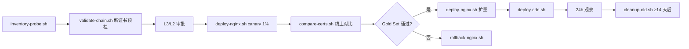

# L1 · 执行层 Review 模板

> **使用说明**：Agent 基于 L2 已批准的策略，生成分步脚本 + review 引导文档。  
> **硬约束**：总 review 时间 ≤ 30 min。核心是**让运维能快速定位每个脚本的关注点**，而不是读全部代码。

---

## 模板正文

```markdown
# 🔧 证书更换方案 - 执行层 Review
> 版本: v{{N}} · 对应 L2: [link] · 预计 review: 30 min

## 📑 脚本清单与 Review 优先级

> 按"🔴 高危必读 → 🟡 重要 → 🟢 只读放心"的顺序排列，运维可按优先级分配精力。

| # | 脚本 | 安全等级 | 行数 | Review 用时 | 关注点数 | 配套回滚 |
|---|------|---------|------|------------|---------|---------|
| 1 | `readonly/inventory-probe.sh` | 🟢 只读 | 45 | 3 min | 2 | - |
| 2 | `readonly/validate-chain.sh` | 🟢 只读 | 38 | 3 min | 2 | - |
| 3 | `readonly/compare-certs.sh` | 🟢 只读 | 52 | 4 min | 3 | - |
| 4 | `changeset/deploy-nginx.sh` | 🔴 变更 | 68 | 10 min | 3 | ✅ rollback-nginx.sh |
| 5 | `changeset/deploy-cdn.sh` | 🔴 变更 | 55 | 8 min | 3 | ✅ rollback-cdn.sh |
| 6 | `changeset/cleanup-old.sh` | 🟡 延迟删除 | 30 | 2 min | 1 | 不可回滚（见下） |

**合计 review 时间预算**：30 min。若超过，Agent 必须拆分交付。

---

## 🔴 高危脚本详解（必读）

### 脚本 4：deploy-nginx.sh

#### 👀 Review 关注点（3 条，预计 10 min）

1. **第 23-28 行**：证书文件路径是否正确？
   - 当前值：`/etc/nginx/certs/{{domain}}.pem`
   - 风险：路径错写会导致 nginx reload 失败
   
2. **第 42-48 行**：nginx reload 前的 `-t` 检查是否完整？
   - 是否覆盖所有 server block？
   - 失败时是否 fail-fast？

3. **第 55-60 行**：部署后验证命令是否匹配 L2 定义的 Gold Set？
   - 是否检查证书指纹？
   - 是否检查 SAN 完整性？

#### ⚠️ 可跳过 Review 的行号
- 第 1-15 行：标准 header + set 选项
- 第 65-80 行：结果格式化输出（纯展示）

#### 🔁 幂等性说明
本脚本通过以下机制保证幂等：
1. 使用 `$RUN_ID` 目录隔离每次执行的 state
2. 每步执行前检查 `.done` 标记
3. 证书文件写入用原子 `mv`，不用 `cp`

#### ⏪ 回滚方案
配套脚本：`changeset/rollback-nginx.sh`
- 回滚耗时：< 30 秒
- 回滚前置条件：旧证书文件仍在 `/etc/nginx/certs/OLD/` 目录
- 自动回滚触发：由外部监控决定，本脚本不判断

---

### 脚本 5：deploy-cdn.sh

（格式同上）

---

### 脚本 6：cleanup-old.sh

#### ⚠️ 特别警告
**此脚本删除旧证书文件，不可回滚。**  
执行前置条件（脚本内硬检查）：
- [ ] 新证书全量上线 ≥ `{{14}}` 天
- [ ] 所有监控点返回新指纹
- [ ] 距旧证过期仍有 ≥ 14 天

#### 👀 Review 关注点（1 条）
1. **第 15-20 行**：前置条件检查是否可以被环境变量绕过？（不应该可以）

---

## 🟢 只读脚本简述（可快速过）

这些脚本仅执行 `openssl` / `grep` / HTTP GET 等只读操作，review 时只需关注：
- 是否真的不写任何生产资源？
- 输出是否可能包含敏感信息（私钥 / 内网 IP）？

详细见各脚本头部注释。

---

## 📋 执行顺序与前置条件



**硬门禁**：
- 每步之间必须人工确认后执行（不允许 pipeline 串起来自动跑）
- 任何 ❌ 失败立即停止并告警

---

## 🧪 执行前自验证清单

运维工程师在 apply 前的自检：

- [ ] 所有脚本都在**测试环境**或**灰度环境**跑过一次成功
- [ ] 所有脚本的**回滚脚本**也在测试环境跑过
- [ ] `{{RUN_ID}}` 命名规则明确（建议 `YYYYMMDD-HHMM-人名`）
- [ ] 审批截图 / 工单号 已关联
- [ ] 告警系统已订阅证书相关指标
- [ ] 回滚所需的**旧证书备份**已确认可用
- [ ] 变更窗口已通告相关团队

---

## ⚙️ 变量配置清单

以下变量**禁止硬编码**在脚本里，必须由运维在执行前注入：

```bash
export DOMAIN="{{}}"
export NEW_CERT_PATH="{{}}"
export NEW_KEY_PATH="{{}}"
export OLD_CERT_BACKUP_DIR="{{}}"
export RUN_ID="{{YYYYMMDD-HHMM-operator}}"
export APPROVAL_TICKET="{{}}"
```

---

## ✍️ Review 决议（运维填写）

- [ ] 批准执行
- [ ] 批准但需调整：{{}}
- [ ] 打回，原因：{{}}

签字：{{运维工程师}} · 日期：{{}}
```

---

## 生成时的硬性规则

1. **脚本清单表必须给出精确的 review 用时**，总和不能超过 30 min。
2. **每个 🔴 脚本的 Review 关注点必须 ≤ 3 条，每条带行号**。
3. **每个 🔴 脚本必须有配套 rollback 脚本**（cleanup 类除外，但必须标"不可回滚"）。
4. **执行顺序必须给 mermaid 图**，让运维一眼看清依赖。
5. **所有生产值必须用变量**，模板里的 `{{}}` 占位符不允许被 Agent 填成具体值（除非用户明确提供）。
6. **禁止出现**：`curl | bash`、`rm -rf` 无过滤、`kubectl apply` 无 dry-run、硬编码密码。

---

## Review Checklist（运维自检）

L1 读者 review 完后应能回答：

- [ ] 每个变更脚本**失败**了我知道怎么处理吗？
- [ ] 每个变更脚本**中途中断**了再跑会出问题吗？
- [ ] 每个变更脚本的**回滚**我跑过一次吗？
- [ ] 变量都**填完**了吗？有没有 `{{}}` 漏掉？
- [ ] 告警我**订阅**了吗？

如果任一答不上来，不允许 apply。
