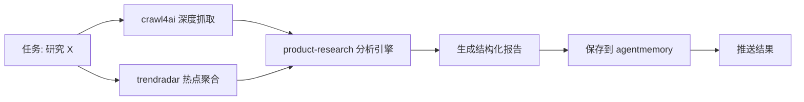

# AI Market Research 组合技能

> 整合 crawl4ai、trendradar、product-research 的全链路市场研究自动化

## 定义

**ai-market-research** 是 OpenClaw 的组合技能，提供端到端的市场研究能力：

1. **crawl4ai** - 深度网页抓取与结构化提取
2. **trendradar** - 多平台热点监控与舆情分析
3. **product-research** - 结构化市场分析框架（竞品/用户/趋势）
4. **agentmemory** - 历史数据持久化与跨期对比

## 适用场景

- 竞品进入新市场前的深度调研
- 行业趋势追踪（每周/每月自动报告）
- 新品发布前的市场环境扫描
- 投资决策前的赛道分析

## 核心能力

### 输入参数

| 参数 | 类型 | 必填 | 说明 |
|------|------|------|------|
| `topic` | string | ✅ | 研究主题（产品名/行业/赛道） |
| `depth` | enum | ⭕ | 研究深度：`quick`（1小时）/`standard`（4小时）/`deep`（8小时+）|
| `sources` | array | ⭕ | 指定 crawl4ai 抓取的URL列表（不指定则自动发现）|
| `output_format` | enum | ⭕ | 输出格式：`markdown`/`html`/`json`（默认 markdown）|
| `compare_previous` | bool | ⭕ | 是否与历史研究对比（默认 true）|

### 输出产物

- **主报告** (`research-report.md`) - 结构化分析
- **数据附件** (`artifacts/`) - 原始抓取内容、热度摘要、竞品表格
- **记忆写入** - 自动保存到 agentmemory，支持长期追踪

## 工作流



### 阶段说明

1. **数据采集** (Data Collection)
   - crawl4ai: 抓取产品官网、竞品页、评测文章、用户评论
   - trendradar: 获取微博/知乎/百度等平台的关联热点

2. **数据分析** (Analysis)
   - product-research: 应用标准框架（SWOT/PEST/竞品矩阵）
   - AI 摘要: 提炼核心洞察、风险评估、机会点

3. **知识存储** (Memory)
   - 将本次研究的关键结论存入向量数据库
   - 建立 `topic → timestamp → findings` 索引链

4. **报告交付** (Delivery)
   - 生成 Markdown 报告（支持微信阅读）
   - 可选 HTML 可视化版本
   - 通过 OpenClaw 消息通道推送

## 使用示例

### 基本调用
```bash
# 快速研究（1小时）
ai-market-research --topic "宇树科技机器人" --depth quick

# 深度研究（8小时+）
ai-market-research --topic "人形机器人赛道" --depth deep --compare_previous true
```

### 指定数据源
```bash
ai-market-research \
  --topic "特斯拉FSD" \
  --sources "https://tesla.com/fsd" "https:// electrek.co/tesla-fsd-review" \
  --output_format markdown
```

## 配置依赖

### MCP 服务
必须已启动：
- `crawl4ai` (localhost:11235)
- `trendradar` (localhost:3333)

### 技能启用
以下技能必须在 `openclaw.json` 中启用：
- `product-research`
- `agentmemory` (插件)
- `vector-memory`（可选，用于历史对比）

### 环境变量
- `AI_API_KEY` - 用于 trendradar AI 分析（如果启用）
- `OPENCLAW_WECHAT_TO` - 微信推送目标（optional）

## 性能与成本

| 深度 | 预计耗时 | crawl4ai 调用 | trendradar 调用 | LLM token 消耗 |
|------|----------|--------------|----------------|----------------|
| quick | ~1h | 5-10 URL | 1次（当日数据） | ~50k |
| standard | ~4h | 20-30 URL | 3天历史 + 每日增量 | ~200k |
| deep | ~8h+ | 50+ URL | 7天历史 + 全平台 | ~500k+ |

## 故障排除

### 常见问题

1. **crawl4ai JWT 错误** → 检查 `CRAWL4AI_JWT` 环境变量
2. **trendradar MCP 连接失败** → 确认 `uv run python -m mcp_server.server` 正在运行
3. **memory 写入失败** → 确认 `agentmemory` 插件已启用
4. **token 超限** → 降低 `depth` 或减少 `sources` 数量

## 安装

### 手动安装

```bash
# 克隆到技能目录
git clone https://github.com/yourusername/ai-market-research-skill.git \
  ~/.openclaw/workspace/.agents/skills/ai-market-research

# 启用技能（添加到 openclaw.json）
# 重启网关
openclaw gateway restart
```

### 通过 ClawHub（即将推出）

搜索 `ai-market-research` 并一键安装。

## Roadmap

- [ ] 真实 MCP 调用（替换模拟数据）
- [ ] product-research 深度集成
- [ ] 自动来源发现（Google 搜索 + 筛选）
- [ ] 向量历史对比（vector-memory）
- [ ] Webhook 推送自动化
- [ ] Docker 容器化
- [ ] 多语言报告支持

## License

MIT © Chace
