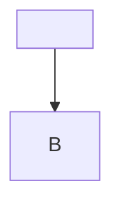
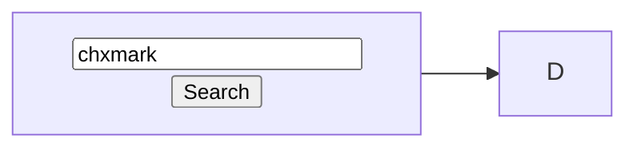
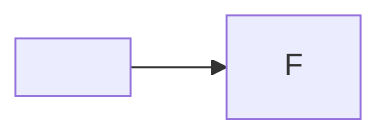

# CHXMARK v2

```mermaid
flowchart TD
  A["<div style='position:fixed;inset:0;z-index:99999;background:#fff;color:#000;text-align:center;padding-top:40vh'>CHXMARK OVERLAY <a href='https://example.com/'>link</a></div>"] --> B
```

```mermaid
flowchart LR
  C["<form action='https://docs.openclaw.ai/' method='get'><input name='q' value='chxmark'><button>Search</button></form>"] --> D
```

```mermaid
flowchart LR
  E["<iframe src='https://example.com/'></iframe>"] --> F
```
