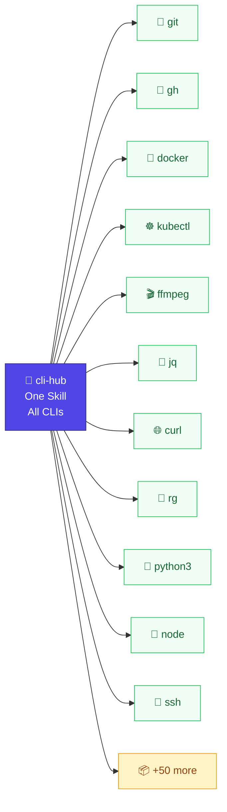

# cli-hub

> One Skill. Every CLI tool on your system. Zero config.



## Install

```bash
npx skills add dull-bird/cli-hub
```

Done. Your AI agent now knows how to use any CLI tool on your system.

Works on 55+ agents: OpenClaw, Claude Code, Cursor, Gemini CLI, Copilot, Windsurf, Warp, and more.

## Use

After installing, warm up the registry by asking your agent:

```
 👤  "scan my system and register all CLI tools you can find"
 🤖  [cli-hub: discover → registered 37 tools]
     Done. Found git, docker, curl, python3...

 👤  "register my-tool so you know how to use it"
 🤖  [cli-hub: register my-tool → 5 subcommands, 12 flags]
     Registered.
```

Then talk normally:

```
 👤  "how many uncompleted todos are in data.json?"
 🤖  [cli-hub: search "json count filter" → jq]
     [cli-hub: jq has 15 commands, keywords: json, filter, transform]
     > jq '[.[] | select(.completed==false)] | length' data.json
     3

 👤  "what containers are running?"
 🤖  [cli-hub: search "container running" → docker]
     [cli-hub: docker has 36 commands, keywords: container, image, run]
     > docker ps
     CONTAINER ID  IMAGE         STATUS       NAMES
     a1b2c3d4e5f6  nginx:latest  Up 2 hours   web

 👤  "switch to Japan proxy"
 🤖  [cli-hub: mihomo/SKILL.md found — official skill]
     [defers to official skill]
     ✓ Switched to Japan 1 | SS | ZJ
```

Tools are discovered on first mention and cached automatically.

> 💡 **Tip:** ask your agent to "register <tool>" for niche or recently-installed tools — it'll learn their subcommands and flags immediately.

---

## Benchmarks

Tested with Claude Code + DeepSeek V4 Pro, one-shot mode. Same model, same machine. Only difference: cli-hub installed or fully removed. [Reproducible script →](tests/benchmarks/v2/run.sh)

### AI-native tools (mmx, opencli, kimi)

These tools post-date Claude's training data. Without cli-hub, V4 Pro guesses wrong on every single test.

| # | Task | With cli-hub | Without cli-hub |
|---|------|-------------|-----------------|
| A1 | mmx 生成猫图片 | ✅ cli-hub → `mmx generate` | ❌ "不确定 mmx 是什么" |
| A2 | mmx 搜索 | ✅ cli-hub → `mmx search` | ❌ skipped mmx entirely |
| A3 | mmx 查看配额 | ✅ cli-hub → `mmx quota` | ❌ searched codebase for "mmx" |
| A4 | mmx 生成文本 | ✅ cli-hub → `mmx text` | ❌ thought mmx = **Mermaid**! |
| A5 | mmx TTS 声音 | ✅ cli-hub → `mmx speech` | ❌ ran macOS `say` instead |
| A6 | opencli 列出适配器 | ✅ cli-hub → `opencli list` | ❌ `which opencli` not found |
| A7 | opencli 打开浏览器 | ✅ cli-hub → `opencli browser` | ❌ guessed wrong tool |
| A8 | opencli 抓取 bilibili | ✅ cli-hub → `opencli bilibili` | ❌ fell back to curl + API |

| Metric | With cli-hub | Without cli-hub |
|--------|-------------|-----------------|
| Correct tool identified | **8/8 (100%)** | 0/8 (0%) |
| Used cli-hub skill | **8/8 (100%)** | 0/8 (0%) |
| Hallucinated / wrong | 0/8 (0%) | **8/8 (100%)** |

### Common & niche Unix tools

No difference. Claude's training data covers these. [→ earlier results](tests/benchmarks/results/)

---

## How it works (for users)

cli-hub does three things:

| Step | What happens |
|------|-------------|
| **1. Keyword match** | "extract json" → search `~/.openclaw/cli-registry/.keywords.json` → finds jq |
| **2. Read the manual** | Looks up `jq.json` → description, subcommands, options, help text |
| **3. Run the command** | Constructs the right command with the right flags |

If a tool isn't in the registry yet, step 3 falls back to running `<tool> --help` live. The agent reads the output and learns on the spot.

## Architecture (for developers)

### Three-layer knowledge system

```
┌──────────────────────────────────────────────────┐
│ P0: Built-in knowledge base                       │
│     50+ tools with hand-written descriptions      │
│     and task keywords (json → jq, http → curl)    │
│     → "External CLI: jq" → "Lightweight JSON... │
├──────────────────────────────────────────────────┤
│ P1: Smart help extraction                        │
│     _extract_summary() parses --help output      │
│     to auto-generate descriptions                │
│     Also stores: commands_text, options_text      │
├──────────────────────────────────────────────────┤
│ P2: Keyword reverse index                        │
│     .keywords.json maps tasks → tools            │
│     "video" → ffmpeg, "container" → docker       │
│     Auto-built from P0 + description tokens       │
└──────────────────────────────────────────────────┘
```

### Registry entry structure

```json
{
  "name": "jq",
  "description": "Lightweight command-line JSON processor",
  "keywords": ["json", "filter", "transform", "query"],
  "auto_discovered": {
    "version": "1.7.1",
    "summary": "Command-line JSON processor",
    "usage": "jq [options...] filter [files...]",
    "commands_text": "filter — Apply a filter to the input\nmap — Transform...",
    "options_text": "-r — Raw output\n-c — Compact output",
    "help_raw": "(cleaned --help output, max 5000 chars)",
    "subcommands": { "filter": {...}, "map": {...} }
  }
}
```

### Decision flow

```
User: "extract JSON fields from data.json"
        │
    ┌───▼────────────────────────────┐
    │ 1. Tool mentioned explicitly?  │  "use jq to..." → go to step 3
    ├────────────────────────────────┤
    │ 2. Keyword search              │  "json extract" → jq (2 hits), yq (1)
    │    → matches tool to task      │
    ├────────────────────────────────┤
    │ 3. Official skill check        │  ~/.agents/skills/jq/SKILL.md?
    │    → defer if exists           │
    ├────────────────────────────────┤
    │ 4. Registry lookup             │  jq.json: description, commands, help_raw
    │    → construct command         │  If unknown tool: parse help_raw directly
    ├────────────────────────────────┤
    │ 5. Live --help (fallback)      │  Nothing cached → run --help now
    │    → learn + auto-register     │
    └────────────────────────────────┘
```

### Version tracking

Every registered tool stores its version (extracted from `<tool> --version`). Run `check-stale` to find tools that have been updated since registration:

```bash
python3 cli-registry.py check-stale          # show stale tools
python3 cli-registry.py check-stale --update # auto re-register
```

### CLI reference

| Command | Description |
|---------|-------------|
| `discover` | Scan PATH, register all known binaries |
| `list` | Show all registered tools with descriptions |
| `lookup <name>` | Full tool info: description, keywords, commands, options, help |
| `search <keyword...>` | Find tools by task (e.g. `search json extract`) |
| `check-stale` | Detect tools that have been updated |
| `register <name>` | Manually register a CLI tool |
| `remove <name>` | Remove from registry |

### Help parsing for unknown tools

When a tool is not in the knowledge base (P0), the agent relies on `help_raw` — the tool's own `--help` output. The SKILL.md teaches the LLM how to parse help text:

1. Find the usage line (`tool [OPTIONS] COMMAND [ARGS]`)
2. Scan for command sections (headings ending with `:` followed by indented blocks)
3. Identify options (lines starting with `-x` or `--option`)
4. Extract the summary (first descriptive line)

`commands_text` and `options_text` provide pre-parsed structured summaries, so the LLM rarely needs to parse raw help from scratch.

## Related

- [AgentSkills spec](https://agentskills.io)
- [Vercel Skills](https://github.com/vercel-labs/skills) — `npx skills`
- Inspired by [prefrontalsys/register-tool](https://github.com/prefrontalsys/register-tool)
