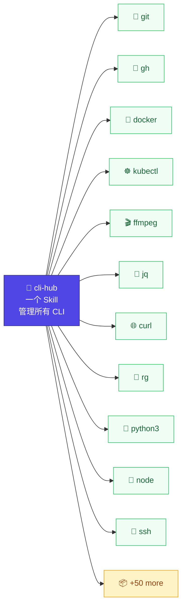

# cli-hub

> 一个 Skill。系统里所有 CLI 工具。零配置。



## 安装

```bash
npx skills add dull-bird/cli-hub
```

搞定。你的 AI Agent 从此知道怎么用系统里任何 CLI 工具。

兼容 55+ Agent：OpenClaw、Claude Code、Cursor、Gemini CLI、Copilot、Windsurf、Warp 等。

## 使用

安装后，用自然语言让 Agent 预热：

```
 👤  "扫描我的系统，把所有能找到的 CLI 工具都注册一下"
 🤖  [cli-hub: discover → 注册了 37 个工具]
     完成了。找到了 git, docker, curl, python3...

 👤  "注册一下 my-tool，让你知道怎么用它"
 🤖  [cli-hub: register my-tool → 5 个子命令, 12 个参数]
     已注册。
```

然后正常说话就行：

```
 👤  "统计 data.json 里还有几个没完成的待办"
 🤖  [cli-hub: 搜索 "json count filter" → jq]
     [cli-hub: jq 有 15 条命令, 关键词: json, filter, transform]
     > jq '[.[] | select(.completed==false)] | length' data.json
     3

 👤  "看看 docker 在跑什么容器"
 🤖  [cli-hub: 搜索 "container running" → docker]
     [cli-hub: docker 有 36 条命令, 关键词: container, image, run]
     > docker ps
     CONTAINER ID  IMAGE         STATUS       NAMES
     a1b2c3d4e5f6  nginx:latest  Up 2 hours   web

 👤  "切到日本节点"
 🤖  [cli-hub: mihomo/SKILL.md 存在 — 官方 Skill]
     [交给官方 Skill 处理]
     ✓ 已切换到 日本 1 | SS | ZJ
```

工具在首次提到时自动发现并缓存。

> 💡 **提示：** 对 Agent 说"注册一下 <tool>"，小众或刚装的工具立即拿到完整信息。

---

## 实测对比

使用 Claude Code + DeepSeek V4 Pro，一次性模式。同一模型，同一机器，唯一区别是 cli-hub 装或删。[可复现脚本 →](tests/benchmarks/v2/run.sh)

### AI 原生工具（mmx, opencli, kimi）

这些工具在 Claude 训练数据截止之后才出现。没有 cli-hub，V4 Pro 每个测试都猜错。

| # | 任务 | 有 cli-hub | 无 cli-hub |
|---|------|-----------|-----------|
| A1 | mmx 生成猫图片 | ✅ cli-hub → `mmx generate` | ❌ "不确定 mmx 是什么" |
| A2 | mmx 搜索 | ✅ cli-hub → `mmx search` | ❌ 完全跳过 mmx |
| A3 | mmx 查看配额 | ✅ cli-hub → `mmx quota` | ❌ 在代码库里搜 "mmx" |
| A4 | mmx 生成文本 | ✅ cli-hub → `mmx text` | ❌ 以为 mmx = **Mermaid**！ |
| A5 | mmx TTS 声音 | ✅ cli-hub → `mmx speech` | ❌ 跑去调 macOS `say` |
| A6 | opencli 列出适配器 | ✅ cli-hub → `opencli list` | ❌ `which opencli` 找不到 |
| A7 | opencli 打开浏览器 | ✅ cli-hub → `opencli browser` | ❌ 猜了错误命令 |
| A8 | opencli 抓取 bilibili | ✅ cli-hub → `opencli bilibili` | ❌ 退化为 curl + API |

| 指标 | 有 cli-hub | 无 cli-hub |
|------|-----------|-----------|
| 正确识别工具 | **8/8 (100%)** | 0/8 (0%) |
| 使用了 cli-hub | **8/8 (100%)** | 0/8 (0%) |
| 幻觉/错误 | 0/8 (0%) | **8/8 (100%)** |

### 常见及冷门 Unix 工具

没有区别。Claude 训练数据里都有。[→ 早期测试结果](tests/benchmarks/results/)

---

## 原理（用户视角）

cli-hub 做三件事：

| 步骤 | 说明 |
|------|------|
| **1. 关键词匹配** | "提取 json" → 查 `~/.openclaw/cli-registry/.keywords.json` → 找到 jq |
| **2. 查手册** | 查 `jq.json` → 描述、子命令、参数、help 原文 |
| **3. 执行命令** | 拼出正确命令 + 参数，运行 |

如果工具还没注册，第 3 步退化为现场跑 `--help`，Agent 读完输出后当场学习。

## 架构（开发者视角）

### 三层知识系统

```
┌──────────────────────────────────────────────────┐
│ P0: 内建知识库                                     │
│     50+ 工具，手写描述 + 任务关键词                   │
│     （json → jq, http → curl, container → docker）│
├──────────────────────────────────────────────────┤
│ P1: 智能 help 提取                                │
│     _extract_summary() 解析 --help 输出            │
│     生成: summary, commands_text, options_text    │
├──────────────────────────────────────────────────┤
│ P2: 关键词反向索引                                 │
│     .keywords.json 映射 任务词 → 工具名             │
│     "video" → ffmpeg, "container" → docker       │
│     从 P0 + 描述分词自动构建                        │
└──────────────────────────────────────────────────┘
```

### 注册表条目结构

```json
{
  "name": "jq",
  "description": "命令行 JSON 处理器 — 过滤、转换、查询 JSON 数据",
  "keywords": ["json", "filter", "transform", "query"],
  "auto_discovered": {
    "version": "1.7.1",
    "summary": "Command-line JSON processor",
    "usage": "jq [options...] filter [files...]",
    "commands_text": "filter — 应用过滤器\nmap — 转换数组元素...",
    "options_text": "-r — 原始输出\n-c — 紧凑输出",
    "help_raw": "(清洗后的 --help 全文, 最多 5000 字符)",
    "subcommands": { "filter": {...}, "map": {...} }
  }
}
```

### 决策流程

```
用户: "提取 JSON 里的字段"
        │
    ┌───▼────────────────────────────┐
    │ 1. 明确提到了工具名？            │  "用 jq 提取..." → 跳步骤 3
    ├────────────────────────────────┤
    │ 2. 关键词搜索                   │  "json extract" → jq (匹配2), yq (1)
    │    → 匹配任务到工具              │
    ├────────────────────────────────┤
    │ 3. 检查官方 Skill              │  ~/.agents/skills/jq/SKILL.md?
    │    → 有则交给它                 │
    ├────────────────────────────────┤
    │ 4. 查注册表                     │  jq.json: 描述, 命令, help_raw
    │    → 构造命令                   │  未知工具则直接解析 help_raw
    ├────────────────────────────────┤
    │ 5. 现场 --help（兜底）          │  什么都没缓存 → 现场跑 --help
    │    → 学习 + 自动注册            │
    └────────────────────────────────┘
```

### 版本追踪

每个注册工具存储版本号（从 `<tool> --version` 提取）。`check-stale` 检测已过期的工具：

```bash
python3 cli-registry.py check-stale          # 列出过期工具
python3 cli-registry.py check-stale --update # 自动重注册
```

### 脚本命令

| 命令 | 说明 |
|------|------|
| `discover` | 扫描 PATH，注册所有已知工具 |
| `list` | 列出已注册工具及描述 |
| `lookup <名称>` | 完整信息：描述、关键词、命令、选项、help |
| `search <关键词>` | 按任务搜索工具（如 `search json extract`） |
| `check-stale` | 检测已更新的工具 |
| `register <名称>` | 手动注册 CLI 工具 |
| `remove <名称>` | 从注册表移除 |

### 未知工具的 help 解析

对于不在知识库（P0）中的工具，Agent 依赖 `help_raw`。SKILL.md 教会了 LLM 如何解析 help 输出：

1. 找到 usage 行（`tool [OPTIONS] COMMAND [ARGS]`）
2. 扫描命令区块（以 `:` 结尾的标题 + 缩进块）
3. 识别选项（`-x` 或 `--option` 开头的行）
4. 提取描述（第一个非 flag 的实质句子）

`commands_text` 和 `options_text` 提供了预解析的结构化摘要，大部分情况下 LLM 不需要从零解析原始 help。

## 相关链接

- [AgentSkills 规范](https://agentskills.io)
- [Vercel Skills](https://github.com/vercel-labs/skills) — `npx skills`
- 灵感来源：[prefrontalsys/register-tool](https://github.com/prefrontalsys/register-tool)
