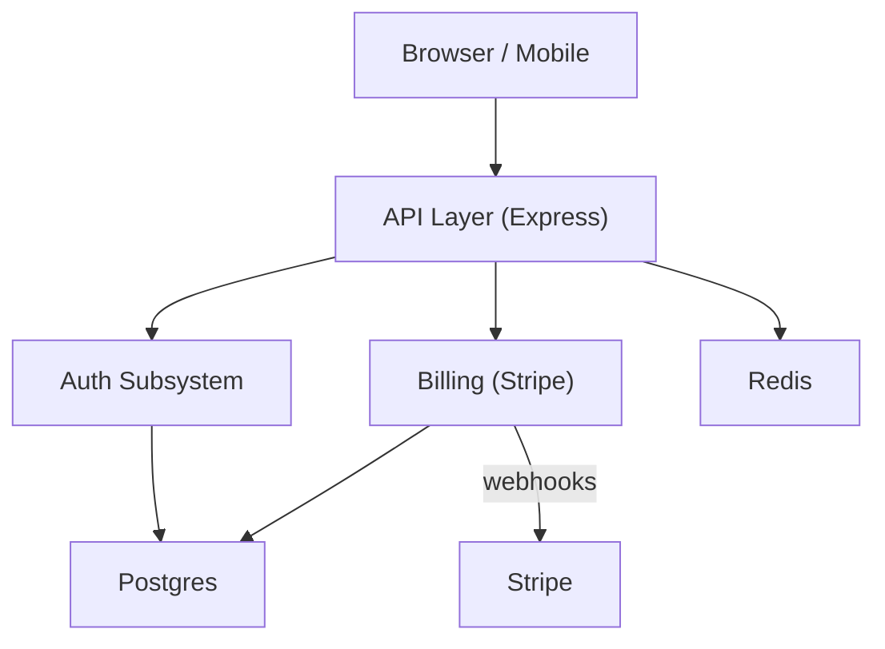

# Architecture Document Template

Location: `/docs/architecture.md` or `/backend/docs/architecture.md`

One file per project. This is the entry point for any developer or AI encountering the
codebase for the first time. It must be accurate and complete — not aspirational.

---

## Template

```markdown
# [Project Name] — Architecture

> [2–3 sentence system overview. What does this product do? Who uses it? What does it NOT do?]

---

## Subsystems

| Subsystem | Summary | Doc |
|---|---|---|
| Auth | JWT-based authentication and session management | [auth.md](./auth.md) |
| Billing | Stripe integration, subscription lifecycle, webhook handling | [billing.md](./billing.md) |
| API Layer | Express routing, middleware stack, request validation | [api-layer.md](./api-layer.md) |
| Data Layer | Postgres access via Prisma, query patterns, migrations | [data-layer.md](./data-layer.md) |

(Every subsystem that has a `.md` file must be listed here. No orphan docs.)

---

## High-Level Diagram

Show how subsystems relate to each other and to external systems. Mermaid preferred.



---

## Tech Stack

| Layer | Technology | Notes |
|---|---|---|
| Runtime | Node.js 20 | |
| Framework | Express 4 | |
| Database | PostgreSQL 15 | via Prisma ORM |
| Cache | Redis 7 | sessions + rate limit counters |
| Auth | JWT (jsonwebtoken) | 15-min tokens, 7-day refresh |
| Queue | BullMQ | email + async jobs |
| Hosting | AWS ECS | containerised, one service per environment |
| CI/CD | GitHub Actions | deploy on merge to main |

---

## Cross-Cutting Concerns

These patterns apply everywhere. Document them here once rather than repeating in every
subsystem doc.

### Authentication
All protected routes use `requireAuth` middleware (`src/middleware/requireAuth.js`).
Tokens are validated via `tokenService.verifyToken`. Unauthenticated requests receive 401.

### Error Handling
All thrown errors propagate to the global error handler at `src/middleware/errorHandler.js`.
Services throw typed errors (`AppError`, `ValidationError`, `NotFoundError`) defined in
`src/lib/errors.js`. Routes do not catch — they let errors bubble.

### Validation
Request bodies are validated with Zod schemas defined in `src/schemas/`. Validation happens
in route handlers before any service call. Invalid requests receive 400 with a structured
error body.

### Configuration
All environment variables are loaded and validated at startup in `src/config/env.js`.
The app exits immediately if required vars are missing. No `process.env` access outside
this file.

### Logging
Structured JSON logging via `src/lib/logger.js` (wraps pino). Log levels: error, warn,
info, debug. All request logs include `requestId` for tracing. Never log PII.

### Testing
Unit tests co-located with source (`*.test.js`). Integration tests in `/tests/integration/`.
Test DB is a separate Postgres instance seeded via `tests/seed.js`. Run with `npm test`.

---

## Findings

System-level issues that don't belong to a single subsystem.

- **[ISSUE]** No distributed tracing — requestId is only logged, not propagated to
  downstream services.
- **[REVIEW]** Redis used for both caching and rate limiting — consider splitting concerns
  if load increases.
```

---

## Instructions for AI agents

1. **The subsystem table is a contract.** Every `.md` in `/docs/` must appear in the table.
   Every table entry must have a real file. Never list a subsystem without a doc, and never
   have a doc without a table entry.

2. **The diagram must reflect actual data flow.** Do not draw aspirational architecture.
   If two subsystems don't actually talk to each other, don't draw an arrow.

3. **Cross-cutting concerns belong here, not in subsystem docs.** If auth works the same
   way across every route, document it once here. Subsystem docs reference it.

4. **Tech stack must list what is actually in use**, not what was planned or what the
   boilerplate shipped with. Verify against `package.json`, `requirements.txt`, or
   equivalent.

5. **Update this file** when:
   - A new subsystem is added or removed
   - The tech stack changes
   - A cross-cutting concern changes (new auth pattern, new error format, etc.)
