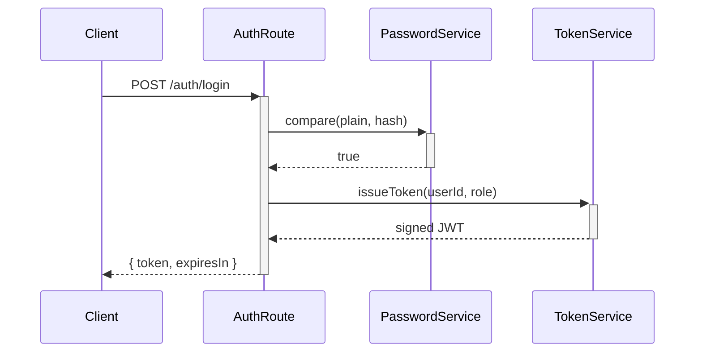

# Subsystem Documentation Template

Use this template for every subsystem doc. One file per subsystem. Populate every section —
do not leave placeholders. If a section genuinely doesn't apply, write "N/A" and one sentence
explaining why.

---

## Template

```markdown
# [Subsystem Name]

> One sentence: what this subsystem does and why it exists.

---

## Overview

### Purpose
What problem does this subsystem solve? Who/what depends on it?

### Responsibilities
- Responsibility 1
- Responsibility 2
- Responsibility 3

(Keep this list tight. If it exceeds ~6 items, the subsystem may need splitting.)

### Boundaries
What this subsystem does NOT handle. What is explicitly delegated elsewhere and where.

---

## File Map

Full relative paths from project root. Group by role if helpful.

| File | Role |
|---|---|
| `src/services/auth/tokenService.js` | Issues, validates, refreshes JWTs |
| `src/services/auth/passwordService.js` | Hashing and comparison via bcrypt |
| `src/routes/auth.js` | HTTP layer — delegates to services |
| `src/middleware/requireAuth.js` | Route guard — validates token on each request |

---

## Components

Brief but complete description of each file. Follow this format for each:

### `src/services/auth/tokenService.js`
Issues and validates JWTs. All token logic lives here so routes stay thin.
Key exports: `issueToken`, `verifyToken`, `refreshToken`.
Depends on: `config/env` for JWT_SECRET and TOKEN_TTL.

### `src/routes/auth.js`
Defines `/auth/login`, `/auth/logout`, `/auth/refresh`. Thin layer — validates input
then delegates to tokenService and passwordService.

(One entry per file. Keep each under 4 sentences.)

---

## Execution Flow

Step-by-step trace of the primary happy path through this subsystem. Be specific about
which functions are called, not just which files.

### [Primary Flow Name, e.g. "Login Request"]

1. `POST /auth/login` received by `src/routes/auth.js → loginHandler`
2. `loginHandler` calls `passwordService.compare(plaintext, hash)`
3. On match, calls `tokenService.issueToken(userId, role)` → returns signed JWT
4. Response: `{ token, expiresIn }` with 200

### [Secondary Flow Name, e.g. "Token Refresh"]

1. `POST /auth/refresh` hits `src/routes/auth.js → refreshHandler`
2. Calls `tokenService.verifyToken(oldToken)` — throws if expired beyond refresh window
3. Calls `tokenService.refreshToken(oldToken)` → new JWT
4. Response: `{ token, expiresIn }` with 200

---

## Diagram

Mermaid or ASCII. Show the request path and key function calls. Keep it to the happy path
unless failures have meaningfully different paths.



---

## Design Decisions

Document the non-obvious choices. Not "we used bcrypt" — document *why* bcrypt over
alternatives if there was a real tradeoff, or document constraints that drove architecture.

- **15-minute token TTL**: Short window limits exposure from token theft without requiring
  constant re-login; paired with 7-day refresh window.
- **Service layer separation**: Routes contain zero business logic so they can be tested
  independently and swapped without touching auth logic.

---

## Gotchas

Things that will bite someone unfamiliar with this subsystem. Be direct.

- `verifyToken` throws on expiry — callers must wrap in try/catch or the request will 500.
- `passwordService.compare` is async even though it looks synchronous — missing `await`
  will always return truthy and bypass auth entirely.
- `requireAuth` middleware must be applied *before* body-parser on protected routes or
  the token is read before the body is populated.

---

## Findings

Honest assessment of the current state. This section is mandatory and must be kept current.

- **[ISSUE]** `src/routes/auth.js` has no rate limiting on `/login` — brute force risk.
- **[REVIEW]** Refresh token is stateless — revocation requires token blacklist or short TTL.
- **[CLEAN]** No duplication found.
```

---

## Instructions for AI agents

When filling out a subsystem doc:

1. **File Map must be exhaustive.** Every file that belongs to this subsystem, no exceptions.
   If a utility is shared across subsystems, note it with "(shared)" and document it in the
   subsystem where it primarily lives.

2. **Execution Flow must be function-level, not file-level.** "The auth service handles login"
   is useless. "loginHandler calls passwordService.compare then tokenService.issueToken" is
   the standard.

3. **Gotchas must be genuinely dangerous.** Do not list obvious things. List the things that
   would take a new developer more than 30 minutes to debug.

4. **Findings must be honest.** Do not write "no issues found" unless you have actually
   verified there are none. If you haven't fully audited, write "not fully audited."

5. **Do not describe what code used to do.** Only describe what it does right now. If you
   can't verify a claim against live code, do not write it.
