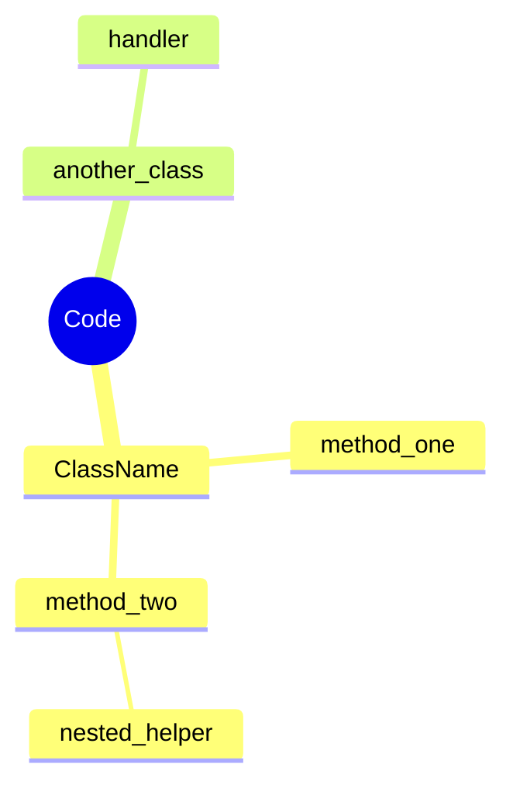

# Code to Mindmap

Use when (1) user pastes source code and wants to visualize it as a mind map, node graph, or tree diagram. (2) user says "show this as a mindmap", "draw the architecture", "make a flowchart of this code", or "visualize the structure". (3) user wants to understand an unfamiliar codebase by seeing its structure visually.

## Core Position

This skill solves the specific problem of: *code structure is hard to grasp from raw text — a visual map reveals relationships, hierarchy, and architecture at a glance.*

This skill IS NOT:
- A code documentation tool — it produces visual diagrams, not written docs
- A UML class diagram tool — use PlantUML for detailed class relationships
- A code formatter — it does not change source code

This skill IS activated ONLY when: source code + visualization intent are both present.

## Modes

### `/code-to-mindmap`

**Default mode.** Parses source code and outputs a Mermaid-compatible mindmap or graph.

When to use: User provides code and wants a visual structure diagram.

### `/code-to-mindmap/hierarchy`

Outputs a tree showing file/folder hierarchy without analyzing imports.

When to use: User wants to see project structure, not code relationships.

## Execution Steps

### Step 1 — Parse the Code Structure

1. Receive source code (single file, snippet, or multi-file content)
2. Detect language and framework:
   - Python: parse `def`, `class`, `import`, `async def`
   - JavaScript/TypeScript: parse `function`, `const`, `class`, `import`, `export`
   - Go: parse `func`, `type`, `struct`, `package`
   - General: detect class definitions, function definitions, module-level declarations
3. Identify:
   - Entry points (`main`, `app`, `index`)
   - Class/struct names and their methods
   - Top-level functions
   - Cross-file dependencies (import/require statements)
4. Build a hierarchical tree: modules → classes → methods → nested logic

### Step 2 — Select Diagram Type

| Code Shape | Diagram Type |
|---|---|
| Single file, class-heavy | Mindmap (center = class, branches = methods) |
| Multi-file, import dependencies | Graph (nodes = files, edges = imports) |
| Hierarchical directory | Tree / flowchart |
| State machine or flow | State diagram |
| Call graph (who calls whom) | Flowchart / directed graph |

### Step 3 — Generate Diagram

Output as Mermaid `mindmap` or `graph LR` format:

For large codebases (>20 nodes), summarize: show top-level structure only, note that deeper nodes exist.

### Step 4 — Validate

- All detected classes/functions appear as nodes
- Root/entry point is clearly marked as the center
- No fabricated nodes (only from actual code)
- Mermaid syntax is valid and renderable

## Mandatory Rules

### Do not

- Do not make up method names, class names, or relationships not in the code
- Do not render >30 nodes in a single diagram (split into sub-diagrams)
- Do not replace source code comments with diagram comments
- Do not activate for pseudo-code or algorithm descriptions without actual code

### Do

- Use the language's actual syntax to detect structure
- Label nodes with function signatures for disambiguation (e.g., `calculate_sum(nums: list) -> int`)
- Mark external library calls differently from project-internal calls
- Preserve the root entry point as the diagram center

## Quality Bar

**A good output:**
- Every class and function in the provided code appears as a labeled node
- Relationships (calls, imports, inheritance) are represented as edges
- The diagram is valid Mermaid and renders correctly
- Entry points are visually distinct (center or top)

**A bad output:**
- Adds classes or methods not in the source code
- Renders >30 nodes making the diagram unreadable
- Misrepresents call direction (A calls B shown as B calls A)
- Output is not valid Mermaid syntax

## Good vs. Bad Examples

| Scenario | Bad Output | Good Output |
|---|---|---|
| Single Python class | All methods listed flat with no hierarchy | Center = class name, methods as child nodes |
| Multi-file project | One giant diagram with 50 nodes | Multiple sub-diagrams per module |
| Imported standard library | Treated as internal dependencies | Marked differently (dashed border) |
| Anonymous/lambda functions | Omitted | Listed as "anonymous / lambda" |

## References

- `references/` — Mermaid mindmap syntax guide, language-specific parsing patterns, code architecture patterns
- `scripts/render.py` — Render Mermaid diagram to PNG/SVG