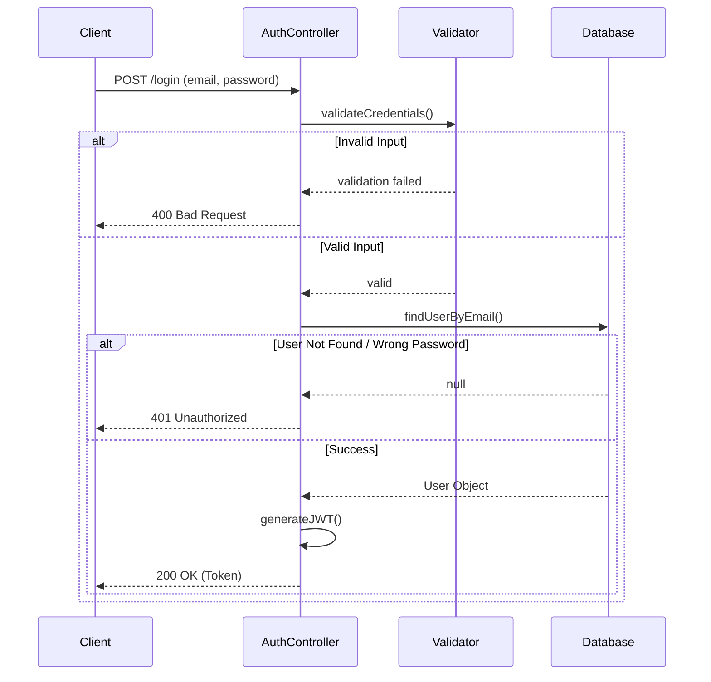
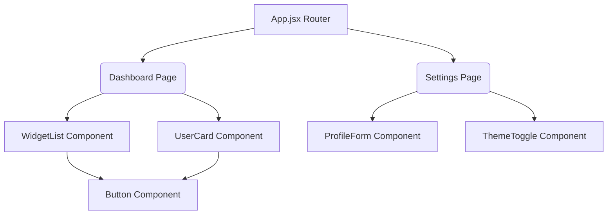

# Usage Examples & Workflows

This document provides examples of how to interact with the Auto Architect skill and the expected outputs.

## Example 1: Generating a Sequence Diagram for an API

**User Prompt:**
> "Please analyze this `authController.js` file and generate a sequence diagram for the login flow.
> [User pastes the authController.js code here]"

**Bot Expected Output:**
Based on the provided `authController.js`, here is the architectural breakdown and sequence diagram of the login flow:

### Architectural Summary
- The client sends credentials to the `/login` endpoint.
- The controller validates the input using the `Validator` utility.
- It then queries the `Database` to check if the user exists.
- If valid, a JWT token is generated and returned to the client.

### Diagram

---

## Example 2: Mapping a Component Architecture

**User Prompt:**
> "I have a React application. Here is the list of files in my `src/components` and `src/pages` directories. Can you create a flowchart showing how these pages and components are structured?"

**Bot Expected Output:**
Based on your directory structure, here is the component hierarchy flowchart:

### Diagram

