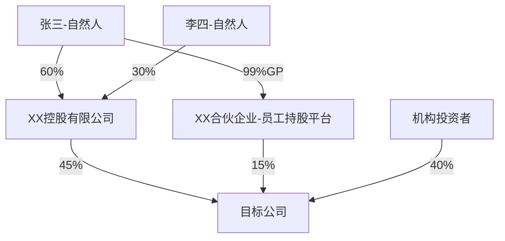

# Corporate Banker Digital Employee / 对公客户经理数字员工

> **⚠️ SECURITY NOTICE / 安全声明**
> - **Type:** Educational reference / analytical framework ONLY
> - **No executable code, scripts, or binaries are included in this skill**
> - **No persistent storage, network calls, background execution, or credential collection**
> - **All outputs are for reference only and require human review before real-world application**
> - **This skill does NOT provide financial, legal, or insurance advice**
> - **Users must exercise their own judgment and consult qualified professionals**
>
> **⚠️ 数据安全警告**
> - 本技能仅提供参考框架和分析建议，**不执行任何代码或脚本**
> - 不会自动访问、存储或处理用户的任何业务数据或个人身份信息（PII）
> - 所有输出仅为方法论参考，实际决策需由具备相应资质的专业人员作出

## Skill Overview / 技能概览

对公客户经理数字员工，集成以下8项核心能力模块：

1. **Module 1: 拜访前准备计划**
2. **Module 2: 财务报表分析**
3. **Module 3: 信贷尽职调查**
4. **Module 4: 行业风险分析**
5. **Module 5: 股权穿透分析**
6. **Module 6: 拜访备忘录**
7. **Module 7: 产品路演**
8. **Module 8: 授信申请提交**

---


---

## Module 1: 拜访前准备计划

# 访前规划 (Pre-Visit Planning)

## 目标角色 (Target Role)

- **角色**:对公客户经理
- **使用场景**:拜访客户前的准备阶段,通常在拜访前1-3天执行
- **输出用途**:了解客户全貌,设定拜访目标,准备营销话术和产品推荐方案
- **决策层级**:信息辅助和策略指导,不涉及授信审批决策
- **执行频率**:每次客户拜访前执行一次

---

## 数据接入 (Data Sources)

### 必需数据
| 数据项 | 来源 | 获取方式 | 敏感级别 |
|--------|------|---------|----------|
| 客户基本信息 | 行内客户信息系统 | API: /api/customer/basic | 内部 |
| 存款与AUM数据 | 核心银行系统 | API: /api/customer/deposits | 内部 |
| 授信使用情况 | 信贷管理系统 | API: /api/customer/credit | 机密 |
| 交易流水 | 核心银行系统 | API: /api/customer/transactions | 机密 |
| 历史尽调/拜访记录 | 影像档案系统 | 文件读取 | 内部 |
| 风险预警信息 | 风险预警系统/外部工商司法平台 | API/爬虫 | 公开/内部 |
| 行业动态 | 行研知识库/外部资讯 | 检索/联网搜索 | 公开 |

### 数据脱敏规则
- 个人身份证号:显示前3后4,中间用 * 替代
- 银行账号:仅显示后4位
- 联系方式:不在输出中出现
- 客户敏感财务数据:仅在内部报告中使用,不得外传

### 降级策略
- 如果风险预警数据不可用:标注"未纳入风险预警维度",其余分析继续
- 如果历史拜访记录缺失:标注"无历史拜访记录",基于公开信息生成首次拜访策略
- 如果行业数据源超时:使用公开信息简要分析,并明确标注"行业分析基于公开信息"
- 如果客户财务数据仅有1年:标注"数据不足,趋势分析不可用",仅做静态分析
- 如果客户360系统不可用:标注"客户基础数据未核验",基于客户经理口述信息继续
- 如果影像档案系统不可用:标注"历史文档未查阅",提示客户经理手动提供关键信息

---

## 执行流程 (Workflow)

### 步骤 0:数据确认与验证

列出输入参数:客户名称、拜访日期、拜访目的、特殊关注点。
确认数据时间范围(近3/6/12个月)和行业分类代码有效性。
运行 `scripts/validate_visit_plan.py` 检查输入参数完整性。

- ✅ 验证通过 → 进入步骤 1
- ❌ 验证失败 → 返回缺失清单,要求用户补充

> 📋 数据来源:`user_upload`(用户提供客户信息)

### 步骤 1:获取客户核心数据

查询客户360全景视图,获取:
- 存款规模与结构(活期/定期/理财占比)
- 授信总额与使用情况(已用额度、剩余额度、担保方式)
- 近期交易流水(近3/6/12个月流水变化趋势、季节性特征、异常波动)

不得跳过数据获取步骤,所有数字必须展示计算过程。

> 📋 数据来源:`system_api`(行内客户信息系统)
> 📋 执行主体:`ai`
> 📋 确认机制:`none`

### 步骤 2:枚举客户档案文件

列出该客户在影像系统和文件存储中的所有可用文档清单:
- 尽调报告(最近1-2次)
- 拜访记录(最近3次)
- 授信批复摘要
- 财务报表
- 其他相关文件(合同、发票等)

> 📋 数据来源:`system_api`(影像档案系统)
> 📋 执行主体:`ai`
> 📋 确认机制:`none`

### 步骤 3:读取关键历史文件

优先阅读以下文件内容:
- 最近一次尽调报告(关注风险点和授信建议)
- 上次拜访记录(关注承诺跟进状态和客户反馈)
- 上次授信批复摘要(关注批复条件和附加要求)
- 如用户指定了特定文件,优先读取这些文件

不得跳过历史文件读取步骤,必须提取关键信息用于后续分析。

> 📋 数据来源:`system_api`(文件内容读取接口)
> 📋 执行主体:`ai`
> 📋 确认机制:`none`

### 步骤 4:获取风险预警信号

查询该客户近90天内的风险预警记录:
- 司法风险:被执行人、失信被执行人、股权冻结、限制消费令
- 经营风险:经营异常名录、行政处罚、欠税公告
- 舆情风险:负面新闻报道、行业政策变化影响

如发现任何风险信号,必须在后续报告开头显著标注,不得忽略继续。

> 📋 数据来源:`system_api`(风险预警系统)或外部工商/司法数据平台
> 📋 执行主体:`ai`
> 📋 确认机制:`none`

### 步骤 5:获取行业背景信息

检索该客户所属行业的近期动态:
- 行业政策变化(近3个月内)
- 市场景气度指数
- 竞争格局变化
- 原材料价格波动(如适用)
- 重点关注近3个月内信息

查阅 `references/industry-classification.md` 获取精确行业分类特征。

> 📋 数据来源:`reference`(行内行业知识库)或联网搜索
> 📋 执行主体:`ai`
> 📋 确认机制:`none`

### 步骤 6:综合研判拜访诉求

整合以上数据,从4个维度分析,识别本次拜访的核心类型:

**客户基本面维度**:
- 企业规模、行业分类(GB/T 4754-2017 细化至小类)、经营年限、股权结构
- 主要股东/实控人背景与信用情况
- 与本行关系:首贷时间、合作年限、主办行/非主办行判断
- 存款变化趋势、授信到期时间

**近期动态维度**:
- 交易流水变化趋势、异常波动
- 风险预警信号
- 财务核心指标变化(营收、利润、负债率)
- 行业政策变化对市场景气度的影响

**营销机会维度**:
- 授信到期续贷时间节点
- 新增融资需求(投资扩产/并购/补充流动资金)
- 存款提升空间(临时性资金沉淀/薪资代发/供应链资金)
- 中间业务机会(结算开户/票据/外汇/理财/资产管理)
- 供应链上下游连带开发机会

**关系状态维度**:
- 与决策人(董事长/CFO/财务总监)关系深度评估
- 与竞争行的业务分布情况
- 历史拜访记录与承诺跟进状态
- 客户满意度与潜在不满点

**拜访类型判断**:
- 首次拜访
- 定期维护
- 续贷跟进
- 风险排查
- 营销推进

### 步骤 7:个性化策略生成

根据拜访类型和客户特点,选择差异化策略模板:

查阅 `references/visit-strategy-guide.md` 获取拜访策略指南。

| 拜访类型 | 侧重点 | 关键数据重点 |
|---------|--------|-------------|
| 续贷跟进 | 授信到期节点、资金缺口分析、担保物状态 | 到期时间、流水健康度、利率市场行情 |
| 风险排查 | 风险信号核实、经营实际状况、还款来源 | 司法记录、流水变化、应收账款回款 |
| 新增营销 | 需求挖掘、竞争行分布、决策链条 | 近期资金用途、资本支出计划 |
| 关系维护 | 满意度、潜在不满、交叉营销机会 | AUM变化、中间业务量变化 |
| 首次拜访 | 基础信息收集、关系建立、需求摸排 | 行业背景、企业公开信息 |

按客户具体情况调整输出内容,生成完整的访前规划报告。

> 📋 执行主体:`ai`
> 📋 确认机制:`inform`(生成后通知客户经理确认)

### 步骤 8:报告格式化输出

使用 `assets/visit-plan-template.md` 模板格式化输出。
确保所有章节完整,数据标注来源和日期。
风险提示(如有)必须置于报告开头显著位置。

- ✅ 格式完整 → 进入步骤 9
- ❌ 格式缺失 → 补充缺失章节后重新输出

### 步骤 9:最终验证与交付

运行 `scripts/validate_visit_plan.py` 验证输出报告合规性:
- 检查必需章节完整性
- 验证主目标数量(1-3个)
- 检查行业分类精确度(中类或小类)
- 验证风险前置(如有风险信号)
- 检查数据时效性标注

- ✅ 验证通过 → 输出最终报告
- ❌ 验证失败 → 修复问题后重新验证

> 📋 执行主体:`ai`
> 📋 确认机制:`confirm`(需客户经理确认后交付)

---

## 输出格式 (Output Format)

使用 `assets/visit-plan-template.md` 模板。
报告必须包含以下章节:

```
# 访前规划报告

**客户名称**:[企业全称]
**拜访日期**:[建议日期或用户指定日期]
**规划生成时间**:[当前日期]
**本次拜访类型**:[首次拜访 / 定期维护 / 续贷跟进 / 风险排查 / 营销推进]

---

## ⚠️ 风险提示(如无风险信号则省略此节)

> [醒目标注近期风险信号,如:XX公司已被列入失信被执行人名单(日期),建议拜访前与风险部门确认处置预案]

---

## 一、客户基本面回顾

### 基础信息
| 项目 | 内容 |
|------|------|
| 行业分类 | [GB/T 4754-2017 细化至小类] |
| 企业规模 | [大型/中型/小型/微型] |
| 实控人 | [姓名 + 简述背景] |
| 与本行关系 | [合作年限 / 主办行状态] |

### 授信与存款现状
| 项目 | 金额/情况 | 备注 |
|------|-----------|------|
| 授信总额 | | |
| 已用额度 | | |
| 最近到期时间 | | |
| AUM规模 | | 近6个月变化趋势 |

---

## 二、近期动态分析

### 经营动态
[基于流水变化和财务数据的客观描述,包含具体数字和时间节点]

### 行业背景
[该行业近期1-2个关键动态,说明对该企业的潜在影响]

### 风险信号扫描
[列出所有司法、舆情、经营异常信号;如无则标注"未发现异常信号(截止日期)"]

---

## 三、本次拜访目标

**主目标**(必须完成):
1. [具体、可量化的目标,例如:确认XX贷款续贷意向,了解资金缺口规模]

**次目标**(争取完成):
2. [次要目标]
3. [次要目标(可选)]

**信息收集任务**:
- [需要了解的关键信息,例如:新项目投资进度、竞争行报价水平]

---

## 四、材料准备清单

### 需携带材料
- [ ] [具体材料名称,例如:最新授信产品方案(含利率区间)]
- [ ] [...]

### 需提前确认
- [ ] [内部状态确认事项,例如:XX存量授信的风险部意见]
- [ ] [...]

### 需预约/准备
- [ ] [拜访前需完成的准备事项]

---

## 五、沟通策略

### 开场建议
[根据关系深度和拜访目的,给出具体的开场话术建议,1-3句]

### 核心沟通要点
1. **[话题一]**:[具体沟通策略和预期引导方向]
2. **[话题二]**:[...]
3. **[话题三]**:[...]

### 敏感话题应对
| 可能触及的敏感点 | 建议应对策略 |
|-----------------|-------------|
| [如:竞争行的更低利率] | [如:强调综合服务价值和关系稳定性] |

### 预期成果与下一步
- **本次拜访期望产出**:[例如:获得续贷授权/获得财务报告/确认追加担保意向]
- **建议下一步行动**:[例如:一周内发送授信方案 / 安排总行专家团队上门交流]
- **建议跟进时间节点**:[...]
```

所有数据标注:数据来源 + 数据日期 + 是否最新数据。

本输出可被 visit-memo 和 submit-credit-application 解析使用,关键字段包括:
- 客户名称(string)
- 拜访类型(enum:首次拜访/定期维护/续贷跟进/风险排查/营销推进)
- 主目标(array[string],1-3个)
- 风险提示(array[string],可选)

输出必须包含免责声明,引用 `shared/disclaimer-template.md` 模板。

---

## 合规约束 (Constraints)

1. **禁止收益承诺**:任何情况下不得给出"预计可获得X万存款"或"保证成功营销"等承诺性表述。
2. **禁止数据猜测**:缺失数据 = 向用户索要或在报告中标注"数据缺失",严禁用行业平均值替代实际数据。
3. **数据时效性**:如果数据超过 6 个月,必须在报告开头醒目标注"⚠️ 数据可能已过时"。
4. **风险前置**:如发现风险信号,必须在报告开头以醒目方式标注,不得隐没在正文中。
5. **目标明确**:每次拜访必须设定1-3个主目标,不得泛泛罗列。
6. **个性化**:报告内容须体现该客户的具体特征,禁止套用通用模板词句。
7. **禁止越权建议**:本 Skill 仅提供拜访策略建议,不涉及授信审批决策或额度批准。
8. **禁止跳过步骤**:不得跳过 Workflow 中的任何步骤,必须按顺序执行。
9. **红线执行强制**:如触发任何红线(R1-R3),必须在报告开头显著标注并暂停后续分析。

### 金融合规红线

**R1:禁止虚假营销** - 不得夸大产品收益、隐瞒产品风险、或编造不存在的营销政策。违反此条将导致监管处罚。

**R2:禁止泄露客户隐私** - 不得在报告中包含未脱敏的身份证号、完整银行账号、联系方式等敏感个人信息。违反此条将违反《个人信息保护法》。

**R3:禁止隐瞒重大风险** - 如发现客户已被列入失信被执行人、重大诉讼、或经营异常,必须在报告开头醒目标注,不得因营销目的而淡化风险。违反此条将违反审慎经营原则。

---

## 审计追踪 (Audit Trail)

每次访前规划结束后,生成审计日志 `audit/{客户简称}_{日期}_audit.json`:

```json
{
  "skill_name": "pre-visit-plan",
  "skill_version": "2.0.0",
  "execution_time": "2026-05-05T10:30:00+08:00",
  "input_params": {
    "customer_name": "XX企业",
    "visit_date": "2026-05-08",
    "visit_purpose": "续贷跟进"
  },
  "model": "claude-opus-4-7",
  "operator": "张三(工号:10086)",
  "steps": [
    {
      "step": "数据确认与验证",
      "executor": "ai",
      "data_source": {"type": "user_upload"},
      "result": "pass"
    },
    {
      "step": "获取客户核心数据",
      "executor": "ai",
      "data_source": {"type": "system_api", "system": "客户360系统"},
      "result": "pass"
    },
    {
      "step": "获取风险预警信号",
      "executor": "ai",
      "data_source": {"type": "system_api", "system": "风险预警系统"},
      "result": "pass"
    },
    {
      "step": "生成访前规划报告",
      "executor": "ai",
      "data_source": {"type": "context"},
      "confirmation": {"type": "confirm", "confirmed_by": "张三(工号:10086)", "confirmed_at": "2026-05-05T10:35:00+08:00"},
      "result": "pass"
    }
  ],
  "warnings": ["部分财务数据超过3个月"],
  "references_used": ["references/visit-strategy-guide.md", "references/industry-classification.md"]
}
```

**审计日志保留期限**:至少 3 年。

---

## 踩坑记录 (Gotchas)

### #1:行业分类过于宽泛
- **症状**:行业背景分析仅写"制造业"或"批发零售业",缺乏针对性
- **原因**:未将 GB/T 4754-2017 分类细化至中类或小类
- **解决**:始终查询客户精确行业代码,对照 `references/industry-classification.md` 获取细分行业特征

### #2:历史拜访记录被忽略
- **症状**:生成的拜访策略与上次拜访承诺脱节,重复询问已知信息
- **原因**:未优先读取影像系统中的历史拜访记录和尽调报告
- **解决**:Workflow 步骤3必须执行,读取最近3次拜访记录和最近1次尽调报告

### #3:风险信号埋没在正文中
- **症状**:客户已被列入失信被执行人,但风险提示未放在报告开头
- **原因**:生成报告时未按优先级排序内容
- **解决**:风险信号扫描完成后,如有任何异常,必须在报告开头单独成节标注

### #4:拜访目标过于模糊
- **症状**:目标写成"了解客户情况"或"推进业务合作",无法验证是否达成
- **原因**:未将目标具体化和可量化
- **解决**:每个主目标必须包含具体动作和可验证结果,例如"确认XX贷款续贷意向并了解资金缺口规模"

### #5:数据时效性未标注
- **症状**:使用了6个月前的财务数据,但未在报告中标注数据可能过时
- **原因**:未检查数据时间戳和时效性
- **解决**:步骤0数据确认时必须验证数据时间范围,超期数据必须在报告开头醒目标注

---

## 示例 (Examples)

### 示例1:续贷跟进拜访

**用户输入**:
```
请为XX制造企业的拜访生成访前规划报告。客户授信5000万将于2026-06-15到期,需要跟进续贷事宜。拜访日期:2026-05-10。
```

**Skill 执行流程**:
1. 步骤0:验证输入参数(客户名称、拜访日期、拜访目的)
2. 步骤1:查询客户360数据 → 获取授信使用情况、存款变化、流水趋势
3. 步骤2-3:读取历史文件 → 获取上次尽调报告和批复摘要
4. 步骤4:风险扫描 → 未发现异常信号
5. 步骤5:行业分析 → 制造业近期政策利好
6. 步骤6-7:生成报告 → 拜访类型识别为"续贷跟进",重点突出续贷时间节点和资金缺口分析
7. 步骤8-9:格式化输出并验证 → 输出最终报告

**输出要点**:
- 主目标:确认续贷意向、了解最新资金需求、收集最新财务报表
- 风险提示:无
- 材料准备:最新授信产品方案、利率对比分析
- 沟通策略:从客户经营亮点切入,自然过渡到续贷话题

### 示例2:风险排查拜访

**用户输入**:
```
客户YY贸易公司近期有逾期记录,请生成风险排查拜访的访前规划。
```

**Skill 执行流程**:
1. 步骤0:验证输入参数
2. 步骤1:查询客户360数据 → 发现授信逾期30天
3. 步骤4:风险扫描 → 发现2条被执行记录
4. 步骤3:读取历史文件 → 上次拜访记录显示客户经营正常
5. 步骤6-7:生成报告 → 拜访类型识别为"风险排查",风险提示置顶
6. 步骤8-9:格式化输出并验证 → 输出最终报告

**输出要点**:
- ⚠️ 风险提示:置顶显示逾期记录和被执行信息
- 主目标:核实逾期原因、了解还款计划、评估风险等级
- 沟通策略:直接但不过度施压,重点了解真实经营状况

---

## 非功能范围 (Out of Scope)

- 本 Skill 不处理授信审批决策,仅提供拜访策略建议
- 本 Skill 不生成拜访后报告(请使用 visit-memo Skill)
- 本 Skill 不直接修改客户数据或提交授信申请
- 本 Skill 不处理个人信贷/零售业务
- 本 Skill 不执行实时数据查询(依赖预加载的客户360数据)
- 如果用户请求以上内容,明确告知并建议合适的 Skill 或联系相应部门


---

## Module 2: 财务报表分析

# 财务报表深度分析(Financial Report Analysis)

## 目标角色 (Target Role)

- **角色**:对公客户经理、信贷审批官、风险经理
- **使用场景**:贷前尽调财务分析、年度贷后检视、大额授信审批、重组/展期评估
- **输出用途**:生成结构化财务健康评估报告,为授信决策和投资决策提供数据支撑
- **决策层级**:信贷审批核心参考材料,风险等级 high,需信贷审批官复核
- **执行频率**:每次授信申请前执行一次,贷后每年至少执行一次

## 数据接入 (Data Sources)

### 必需数据
| 数据项 | 来源 | 获取方式 | 敏感级别 |
|--------|------|---------|----------|
| 财务报表三表 | 用户上传/公开披露 | 文件读取(PDF/Excel) | 内部 |
| 报表附注 | 用户上传/公开披露 | 文件读取 | 内部 |
| 审计报告 | 用户上传/公开披露 | 文件读取 | 内部 |
| 行业财务基准 | Wind/同花顺 | API/数据订阅 | 公开 |
| 历史财务分析报告 | 行内影像档案系统 | API: /api/reports/list | 内部 |

### 数据脱敏规则
- 客户身份证号:显示前3后4,中间用 * 替代
- 银行账号:仅显示后4位
- 客户商业机密信息(如核心客户名单、供应商明细):在报告中使用"某客户/某供应商"代替
- 敏感财务数据(如未公开业绩):仅在内部报告中使用,不得外传
- 关联方信息:在内部报告中标注全名,对外报告使用"关联方A/B/C"

### 降级策略
- 如果审计报告不可用:标注"审计意见未核实",基于财报继续分析,但降低信用评级
- 如果报表附注缺失:标注"附注未提供,部分科目明细无法核实",仅分析三表数据
- 如果行业基准数据不可用:标注"行业对标数据未获取",仅做纵向趋势分析
- 如果历史财务报告不可用:标注"无历史报告对比",仅做本期静态分析
- 如果财务数据仅有1年:标注"数据不足,趋势分析不可用",仅做单期分析
- 如果系统不可用(Wind/同花顺):使用最近一次下载的行业基准数据(标注数据日期)

---

## 执行流程 (Workflow)

### 步骤 0:数据确认与验证

列出输入参数:企业名称、股票代码(如有)、报告期、分析场景(贷前尽调/贷后检视/风险预警)。
确认数据时间范围(近3-5年)和会计准则(企业会计准则/国际财务报告准则)。
运行 `scripts/validate_financial_report.py` 检查输入参数完整性和三表勾稽关系。

- ✅ 验证通过 → 进入步骤 1
- ❌ 验证失败 → 返回缺失清单,要求用户补充(如"请提供2021-2023年完整三表")

> 📋 数据来源:`user_upload`(用户上传财报)

### 步骤 1:数据收集与质量评估

确认财务数据来源,执行数据质量初筛:
- 审计意见类型(标准无保留/带强调段/保留意见/否定意见/无法表示意见)
- 会计政策是否变更(变更影响量化)
- 合并报表范围是否变化
- 重大会计估计变更识别

如数据不完整,主动向用户索要:
- 近3-5年完整三表(资产负债表、利润表、现金流量表)
- 报表附注(重要科目明细)
- 审计报告(尤其关注审计意见)

不得跳过数据质量评估步骤。如触发审计意见为非标意见,必须在报告开头显著标注。

- ✅ 数据完整 → 进入步骤 2
- ⚠️ 部分缺失 → 标注缺失项,继续分析但降低置信度
- ❌ 数据严重缺失(仅1年或缺少核心报表) → 输出"数据不足,无法完成分析"报告

> 📋 数据来源:`user_upload` 或 `reference`(公开披露)

### 步骤 2:盈利能力深度分析

**核心盈利指标计算**(查阅 `references/financial-indicators-calculation.md`):
- 毛利率、核心利润率、净利率
- ROE、ROA、ROIC

**盈利质量评估**:
- 核心利润占比(>80%为优)
- 非经常性损益占比
- 收现比(>1为优)
- 净现比(>1为优)

**盈利能力拆解**:
- 毛利率变动归因:量价拆分
- 费用率变动归因
- 利润率变动的可持续性判断

不得跳过任何盈利质量评估步骤。所有数字必须展示计算过程。如收现比或净现比 < 0.5 连续2年,必须标注"利润含金量低"。

- ✅ 数据完整 → 进入步骤 3
- ⚠️ 部分数据缺失 → 标注"某指标无法计算",继续分析

> 📋 数据来源:`context`(用户上传财报)

### 步骤 3:资产负债表深度分析

**资产质量评估**:
- 应收账款:账龄分析 + 坏账准备充分性 + 前五大客户集中度
- 存货:库龄分析 + 跌价准备 + 与营收匹配度
- 商誉:占净资产比例 + 减值测试假设合理性
- 固定资产:折旧政策 + 成新率 + 产能利用率
- 在建工程:工期合理性 + 是否存在长期挂账

**负债结构分析**:
- 有息负债率、短长期债务比例
- 经营性负债 vs 金融性负债
- 表外负债(担保、租赁、应付票据等)

**资产负债匹配度**:
- 流动比率 & 速动比率
- 营运资本趋势
- 期限错配风险

不得跳过任何核心资产分析步骤。如其他应收款/净资产 > 20%,必须标注"可能存在关联方资金占用"风险。

- ✅ 数据完整 → 进入步骤 4
- ⚠️ 附注缺失 → 标注"附注未提供,部分科目明细无法核实"

> 📋 数据来源:`context`(用户上传财报)

### 步骤 4:现金流深度分析

**经营现金流分析**:
- 经营现金流与净利润的差异分析(逐项调节)
- 自由现金流 = 经营现金流 - 资本开支

**投资现金流分析**:
- 资本开支规模及方向
- 资本开支 vs 折旧摊销
- 并购支出的合理性

**筹资现金流分析**:
- 融资方式选择(股权 vs 债权)
- 分红率及稳定性
- 回购行为

**现金流组合信号识别**(查阅 `references/cashflow-pattern-guide.md`)

不得跳过现金流质量分析。如经营现金流连续3年为负且有息负债持续增加,必须触发红线 R2。

- ✅ 数据完整 → 进入步骤 5
- ⚠️ 现金流量表缺失 → 标注"现金流量表未提供,无法分析现金流质量"

> 📋 数据来源:`context`(用户上传财报)

### 步骤 5:杜邦分析与驱动力拆解

**经典三因素杜邦**:
```
ROE = 净利率 × 总资产周转率 × 权益乘数
```

**五因素杜邦拆解**(更精细):
```
ROE = 税负系数 × 利息负担系数 × 经营利润率 × 资产周转率 × 权益乘数
```

**变动归因分析**:
- ROE同比变动
- 三因素各贡献(连环替代法或差额分析法)
- 核心驱动因素识别与可持续性判断

不得跳过杜邦分析步骤。必须展示连环替代法的计算过程,识别核心驱动因素。

- ✅ 数据完整 → 进入步骤 6
- ⚠️ 部分数据缺失 → 标注"某因素无法拆解",继续分析

> 📋 数据来源:`context`(用户上传财报)

### 步骤 6:财务预警与粉饰识别

**财务粉饰常见手段识别**(查阅 `references/fraud-detection-guide.md`):
- 收入端:提前确认收入、渠道压货、关联方交易虚增
- 成本端:费用资本化、少计折旧/减值
- 利润端:非经常性损益平滑、公允价值操纵
- 现金流端:将筹资现金流包装为经营现金流

**关键预警信号扫描**(出现3个以上需高度警惕):
- 应收账款增速 >> 营收增速
- 净现比 < 0.5 连续2年以上
- 存货周转天数持续延长
- 商誉 / 净资产 > 30%
- 在建工程长期不转固
- 其他应收款异常增大
- 频繁变更会计政策/估计
- 存贷双高

**红线条件自检**(8条一票否决条件 R1-R8):
逐一核查8条红线,如触发任何红线,必须在报告开头显著标注。

不得跳过红线自检步骤。必须逐条核查 R1-R8,不得遗漏。

- ✅ 无红线触发 → 进入步骤 7
- ⚠️ 触发1-2条红线 → 标注红色警示,继续分析
- ❌ 触发3条以上红线 → 标注"建议暂停授信决策",进入步骤 7

> 📋 数据来源:`context`(用户上传财报)

### 步骤 7:估值参考(如需要)

**相对估值**:
- PE(TTM & Forward) vs 历史分位数 vs 行业平均
- PB vs ROE匹配度
- EV/EBITDA 跨公司可比性

**绝对估值(概要框架)**:
- DCF核心假设:永续增长率、WACC
- 自由现金流预测逻辑

> 📋 数据来源:`reference`(行业估值数据库)

### 步骤 8:三表勾稽关系验证

执行三表勾稽验证:
- 资产负债表期末与期初差 = 现金流量表期末现金
- 利润表净利润与资产负债表权益变动匹配
- 现金流量表经营现金流与利润表净利润调节一致

如勾稽关系不一致,必须标注"三表数据存在不一致,请核实数据来源"。

- ✅ 勾稽关系一致 → 进入步骤 9
- ❌ 勾稽关系不一致 → 标注不一致项,要求用户核实

> 📋 数据来源:`context`(用户上传财报)

### 步骤 9:生成财务分析报告

使用 `assets/financial-report-template.md` 模板,生成结构化财务健康评估报告。

报告必须包含以下章节:
1. 公司概况与分析框架
2. 盈利能力分析(含驱动力拆解、质量评估、可持续性判断)
3. 资产质量分析(核心资产、应收账款、存货、商誉)
4. 负债与偿债能力(结构分析、偿债压力、期限匹配)
5. 现金流分析(三大现金流概览、经营现金流质量、自由现金流)
6. 杜邦分析(ROE三因素拆解、变动归因、同业对标)
7. 财务预警扫描(异常信号清单、勾稽关系验证、盈余管理迹象)
8. 综合评价与建议(财务健康度、核心优势与风险、跟踪指标、决策参考)

所有数据标注:数据来源 + 报告期 + 是否经审计。
报告末尾必须包含免责声明(引用 `shared/disclaimer-template.md`)。

> 📋 确认机制:`inform`(生成后通知客户经理确认)

---

## 输出格式 (Output Format)

使用 `assets/financial-report-template.md` 模板。
报告必须包含以下章节:

1. 公司概况与分析框架
2. 盈利能力分析(含驱动力拆解、质量评估、可持续性判断)
3. 资产质量分析(核心资产、应收账款、存货、商誉)
4. 负债与偿债能力(结构分析、偿债压力、期限匹配)
5. 现金流分析(三大现金流概览、经营现金流质量、自由现金流)
6. 杜邦分析(ROE三因素拆解、变动归因、同业对标)
7. 财务预警扫描(异常信号清单、勾稽关系验证、盈余管理迹象)
8. 综合评价与建议(财务健康度、核心优势与风险、跟踪指标、决策参考)

所有数据标注:数据来源 + 报告期 + 是否经审计。

**下游兼容性**:本输出可被 `submit-credit-application` 解析使用,关键字段包括:
- 财务健康评级(字符串:优秀/良好/一般/警示/危险)
- 核心财务指标(表格:ROE、毛利率、净利率、资产负债率、DSCR等)
- 红线触发清单(数组:如触发,列出 R1-R8 编号)
- 审计意见类型(字符串:标准无保留/带强调段/保留意见/否定意见/无法表示意见)

**免责声明**:报告末尾必须引用 `shared/disclaimer-template.md`,确保包含"本分析不构成投资建议"等必要声明。

---

## 约束条件 (Constraints)

1. **数据可溯源性**:所有结论须明确标注数据来源(年报/季报/审计报告/附注),引用具体页码或科目
2. **不确定性显式标注**:对数据缺失、口径不一致或无法核实的科目,须以"待核实/数据缺失"显式标注,禁止推测填充
3. **时效性要求**:所有财务数据须标注报告期,分析结论须覆盖近3年(信贷场景要求近5年),跨期对比须统一口径
4. **量化结论优先**:所有风险定性判断(如"盈利能力下降")须附具体量化指标(如"毛利率3年累计下滑8.2pct"),禁止仅凭定性描述下结论
5. **中立审慎立场**:对乐观数据保持审慎,对正面解读提供反向验证,避免管理层叙事主导分析结论
6. **三表勾稽验证**:资产负债表期末与期初差 = 现金流量表期末现金;利润表净利润与资产负债表权益变动匹配
7. **行业对标**:ROE、毛利率、资产负债率等核心指标须提供行业均值参考
8. **禁止跳过步骤**:不得跳过 Workflow 中的任何步骤,特别是数据质量评估、盈利质量评估、红线自检、勾稽验证
9. **红线执行强制**:如触发任何红线(R1-R8),必须在报告开头显著标注,并建议暂停授信决策

### 金融合规红线(一票否决)

以下情况须在报告摘要中以**红色警示**标注,并建议暂停授信决策,待核实后重新评估:

- **R1:审计意见为否定意见或无法表示意见** — 财务数据可靠性存疑,不得作为授信依据
- **R2:经营现金流连续3年为负,且有息负债持续增加** — 企业造血能力缺失,依赖借新还旧
- **R3:其他应收款 / 净资产 > 30%,且主要对手方为关联企业** — 可能存在关联方资金占用
- **R4:货币资金余额 > 总负债20% 但同时借有大量短期有息负债(存贷双高)** — 资金可能受限或被挪用
- **R5:应收账款增速连续2年超营业收入增速超过50个百分点** — 可能存在虚增收入或回款恶化
- **R6:重大在建工程长期(>3年)未转固,且无合理建设周期说明** — 可能隐藏费用或项目停滞
- **R7:商誉占净资产比例 > 50%,且减值测试关键假设明显乐观** — 存在重大减值风险
- **R8:最近1年内实际控制人或主要股东股权高比例质押(> 80%)且无补救措施** — 实控人资金链紧张

---

## 分析原则

- **实质重于形式**:穿透会计处理看经营实质,关注现金流而非仅看利润
- **横纵对比**:纵向看趋势变化,横向对标同业,在比较中发现问题
- **异常驱动**:重点关注异常波动的科目,分析其背后的业务逻辑
- **保守审慎**:对乐观数据持审慎态度,对风险信号保持高度敏感
- **勾稽验证**:通过报表间的勾稽关系交叉验证数据合理性
- **量化结论**:所有定性判断需有定量数据支持

## 信贷场景专属关注点

> 本技能同时服务于投资分析和信贷授信两类场景。当用于银行贷前/贷后尽调时,以下维度具有更高优先级:

| 维度 | 信贷关注重点 | 典型风险信号 |
|------|------------|------------|
| 还款能力 | 经营现金流能否覆盖年度还本付息(DSCR ≥ 1.2) | DSCR < 1.0 且连续2年;自由现金流为负 |
| 资产变现能力 | 担保物对应账面资产的流动性与变现折扣 | 应收账款账龄 > 1年占比超30%;存货跌价准备不足 |
| 关联资金占用 | 其他应收款、预付款中是否存在向关联方的资金输送 | 其他应收款/净资产 > 20%;前五大预付对象为关联方 |
| 财务杠杆 | 有息负债/EBITDA 是否超过行业容忍上限 | 有息负债/EBITDA > 5× 或有息负债率 > 60% |
| 盈余操纵 | 利润含金量(净现比)和收入真实性(收现比) | 净现比 < 0.5 连续2年;应收增速超收入增速50pct以上 |
| 抗压能力 | 极端情景下(收入下降30%)偿债能力是否仍可支撑 | 压力测试下利息保障倍数 < 1.5 |

---

## 审计追踪 (Audit Trail)

每次财报分析结束后,生成审计日志 `audit/{企业简称}_{日期}_audit.json`:

```json
{
  "skill_name": "financial-report-analysis",
  "skill_version": "2.0.0",
  "execution_time": "2026-05-05T10:30:00+08:00",
  "input_params": {
    "company_name": "XX股份",
    "stock_code": "600XXX",
    "report_period": "2023年报",
    "analysis_depth": "全面(Step 0-9)",
    "analysis_scenario": "贷前尽调"
  },
  "operator": "客户经理姓名(工号:XXX)",
  "steps": [
    {
      "step": "数据确认与验证",
      "executor": "ai",
      "data_source": {"type": "user_upload", "files": ["2023年报.pdf"]},
      "result": "pass",
      "validation_script": "validate_financial_report.py"
    },
    {
      "step": "数据收集与质量评估",
      "executor": "ai",
      "data_source": {"type": "user_upload", "files": ["2023年报.pdf"]},
      "result": "pass",
      "audit_opinion": "标准无保留意见"
    },
    {
      "step": "盈利能力深度分析",
      "executor": "ai",
      "data_source": {"type": "context"},
      "result": "pass"
    },
    {
      "step": "财务预警扫描",
      "executor": "ai",
      "data_source": {"type": "context"},
      "result": "pass",
      "red_flags_triggered": []
    },
    {
      "step": "三表勾稽关系验证",
      "executor": "ai",
      "data_source": {"type": "context"},
      "result": "pass",
      "reconciliation_status": "一致"
    },
    {
      "step": "生成财务分析报告",
      "executor": "ai",
      "confirmation": {"type": "inform", "notified_to": "客户经理姓名", "notified_at": "2026-05-05T10:35:00+08:00"},
      "result": "pass"
    }
  ],
  "warnings": ["部分附注数据缺失"],
  "references_used": ["references/financial-indicators-calculation.md", "references/fraud-detection-guide.md"]
}
```

**审计日志保留期限**:至少 3 年。

---

## 踩坑记录 (Gotchas)

### #1:只看利润不看现金流
- **症状**:利润表显示盈利增长,但经营现金流为负
- **原因**:未严格执行盈利质量评估(收现比/净现比)
- **解决**:每次分析必须计算收现比和净现比,< 0.5 连续2年须标注"利润含金量低"

### #2:行业对标缺失
- **症状**:分析报告仅做纵向趋势对比,未与同业对标
- **原因**:未获取行业基准数据或忽略此步骤
- **解决**:必须获取行业均值,ROE、毛利率、资产负债率等核心指标须标注"行业均值:X%"

### #3:红线信号被淹没在正文中
- **症状**:8条红线条件触发,但未在报告摘要中醒目标注
- **原因**:未在步骤6完成后执行红线自检
- **解决**:每次分析完成后必须自查8条红线,触发须在摘要显著位置以红色警示标注

### #4:三表勾稽关系未验证
- **症状**:资产负债表与现金流量表数据不一致,但未发现
- **原因**:未执行三表勾稽验证
- **解决**:资产负债表期末与期初差 = 现金流量表期末现金;利润表净利润与资产负债表权益变动匹配

### #5:附注信息被忽略
- **症状**:仅分析三表主表,未关注附注中的重大事项、或有负债、承诺事项
- **原因**:未要求用户提供附注或未仔细阅读
- **解决**:必须索要附注,重点关注关联方交易、或有负债、会计政策变更

---

## 示例 (Examples)

### 示例1:贷前尽调财务分析

**用户输入**:
```
请分析XX制造2023年年报,用于贷前尽调。授信额度5000万,期限1年。
```

**Skill 执行流程**:
1. 数据确认 → 验证输入参数完整性,运行 validate_financial_report.py
2. 数据收集 → 获取2021-2023年三表 + 审计报告 + 附注
3. 数据质量评估 → 审计意见:标准无保留,会计政策无重大变更
4. 盈利能力分析 → 毛利率28.5%(行业均值25.2%),净现比1.2(盈利质量良好)
5. 资产负债表分析 → 有息负债率35%(< 40%安全阈值),流动比率1.8
6. 现金流分析 → 经营现金流持续为正,自由现金流2023年转负(扩产投资)
7. 杜邦分析 → ROE 15.2%,核心驱动:净利率提升(非财务杠杆)
8. 红线扫描 → 未触发
9. 勾稽验证 → 三表勾稽关系一致
10. 生成报告 → 财务健康评级:良好

**输出要点**:
- 核心结论:盈利质量良好,现金流健康,具备5000万授信还款能力
- 风险提示:2023年自由现金流为负(扩产投资),需关注投产进度
- 建议:可批准授信,建议追加厂房抵押

### 示例2:风险预警财务分析

**用户输入**:
```
XX贸易公司近期有逾期记录,请分析其2023年财报,评估风险。
```

**Skill 执行流程**:
1. 数据确认 → 验证输入参数完整性
2. 数据收集 → 获取2021-2023年三表 + 审计报告
3. 数据质量评估 → 审计意见:带强调段的无保留意见(持续经营存在不确定性)
4. 盈利能力分析 → 毛利率5.2%(行业均值8.5%),净现比0.3(利润含金量低)
5. 资产负债表分析 → 有息负债率68%(> 60%红线),流动比率0.9(< 1.5)
6. 现金流分析 → 经营现金流连续2年为负,筹资现金流为正(借新还旧)
7. 杜邦分析 → ROE -2.5%(亏损),核心拖累:经营利润率转负
8. 红线扫描 → 触发R2(经营现金流连续3年为负+有息负债增加)、R5(应收增速超营收增速60pct)
9. 勾稽验证 → 三表勾稽关系一致
10. 生成报告 → 财务健康评级:警示

**输出要点**:
- ⚠️ 红色警示:触发R2、R5两条红线,建议暂停授信决策
- 核心结论:企业造血能力缺失,依赖借新还旧,应收回款恶化
- 建议:待核实应收账龄和关联方资金占用情况后重新评估

---

## 非功能范围 (Out of Scope)

- 本 Skill 不处理授信审批决策,仅提供财务分析数据支撑
- 本 Skill 不生成授信申请报告(请使用 submit-credit-application Skill)
- 本 Skill 不直接修改客户数据或提交授信申请
- 本 Skill 不处理个人信贷/零售业务财务分析
- 本 Skill 不进行市场调研或行业宏观分析(请使用 credit-industry-analysis Skill)
- 本 Skill 不执行自动化财务数据抓取(需用户上传或手动提供)
- 如果用户请求以上内容,明确告知并建议合适的 Skill 或联系相应部门

---


---

## Module 3: 信贷尽职调查

# 企业信贷尽职调查

当用户要求对企业客户进行尽调分析时，按以下步骤系统性执行。

## 目标角色 (Target Role)

- **角色**：对公客户经理、信贷审批官
- **使用场景**：新客户首贷、存量客户续贷、追加授信前的贷前调查阶段
- **输出用途**：系统性评估企业信用风险，为授信审批决策提供依据
- **决策层级**：核心决策支持文件，直接影响授信审批结果
- **执行频率**：每次授信申请前执行一次

## 数据接入 (Data Sources)

### 必需数据
| 数据项 | 来源 | 获取方式 | 敏感级别 |
|--------|------|---------|----------|
| 企业工商基本信息 | ECIF系统/工商数据API | API: /api/enterprise/basic | 公开 |
| 近三年财务报表 | 用户上传/信贷系统 | 文件上传或影像系统API | 内部 |
| 企业征信报告 | 人行征信系统 | 需人工授权后API获取 | 机密 |
| 法定代表人征信 | 人行征信系统 | 需人工授权后API获取 | 机密 |
| 上下游合同 | 影像档案系统 | API: /api/documents/list | 内部 |
| 水电发票/完税凭证 | 用户上传/影像系统 | 文件上传 | 内部 |
| 银行流水 | 核心系统/用户上传 | API或文件上传 | 机密 |
| 行业研究报告 | 行内知识库/外部数据源 | API或references/ | 公开 |

### 数据脱敏规则
- 个人身份证号：显示前3后4，中间用 * 替代
- 银行账号：仅显示后4位
- 法定代表人个人征信：仅展示汇总信息，不展示明细
- 客户商业机密信息（如核心客户名单）：在对外报告中使用"某客户"代替

### 降级策略
- 如果征信数据不可用：标注"未纳入征信维度"，其余分析继续，但须在风险提示中说明
- 如果财务报表仅有1年：标注"数据不足，趋势分析不可用"，仅做静态分析
- 如果合同/发票/流水缺失：标注"经营真实性验证不完整"，但须在报告中显著提示风险
- 如果行业数据不可用：使用 references/ 中的行业基准数据，并明确标注数据来源

## 执行流程 (Workflow)

> 监管依据：《商业银行授信工作尽职指引》、《贷款风险分类指引》（五级分类）、
> 《商业银行法》第35条贷款审查要求、人民银行《征信业管理条例》、
> 银监会《流动资金贷款管理暂行办法》

**执行模式**：步骤门控型（Step-Gated Workflow）

### 步骤 0：数据确认与验证

在开始任何分析之前，必须执行以下数据确认步骤：

1. 读取并列出所有输入数据文件（财务报表、合同、发票、流水、征信报告等）
2. 确认数据的时间范围（最近三年）和会计准则（CAS/IFRS）
3. 运行 `scripts/validate_due_diligence.py` 验证数据完整性
4. 仅在验证通过后开始分析

**门控条件**：
- ✅ 验证通过 → 进入步骤 1
- ❌ 验证失败 → 停止分析，向用户报告具体缺失项，请求提供补充数据
- ⚠️ 部分数据缺失 → 标注缺失项，继续执行但须在最终报告中显著提示

> 📋 数据来源：`user_upload`（用户上传文件）+ `system_api`（ECIF系统）

### 步骤 1：档案与文件清单枚举

查询企业工商基本信息档案，列出影像系统和文件存储中的所有可用文档，建立分析素材清单。

**门控条件**：
- ✅ 文件清单完整（≥5类文档）→ 进入步骤 2
- ⚠️ 文件清单不完整（3-4类文档）→ 标注缺失文档类型，进入步骤 2 但最终报告须提示"尽调材料不完整"
- ❌ 文件清单严重不足（<3类文档）→ 出具材料缺失清单，暂停分析，等待补充

> 📋 数据来源：`system_api`（ECIF系统 + 影像档案系统）

### 步骤 2：企业基本情况分析

查询企业工商信息，重点关注：
- 注册资本与实缴比例（实缴比例 < 20% 须标注）
- 成立年限（< 2年为高风险信号）
- 经营范围与实际业务是否匹配
- 法定代表人变更历史（近2年有变更须说明原因）
- 公司规模（员工人数、社保缴纳人数）、历史沿革
- 公司章程核心条款（重大决策机制、股东权利约定）

**门控条件**：
- ✅ 工商数据完整 → 进入步骤 3
- ⚠️ 部分字段缺失 → 标注缺失项，进入步骤 3
- ❌ 无法获取工商数据 → 标注"工商数据不可用，降级使用公开信息"，进入步骤 3

> 📋 数据来源：`system_api`（ECIF系统/工商数据API）

### 步骤 3：公司治理与管理团队评估

评估企业管理层稳定性与治理结构：
- 高管团队构成：法定代表人、总经理、财务负责人的任职年限、学历背景、行业经验
- 近2年高管变更情况（频繁变更为风险信号）
- 实际控制人个人信用状况：是否有个人负债、诉讼、失信记录
- 股权集中度判断：高度集中（单一控股 > 80%）或高度分散（无实控人）均须说明风险

不得跳过本步骤，即使高管信息看起来正常，也必须完整评估并输出结论。

### 步骤 4：关联关系与集团架构梳理

梳理关联企业网络，识别关联风险传导链：
- 列出同一实控人下的关联企业清单（含持股比例、主营业务、成立时间）
- 分析关联企业间是否存在互保/联保关系
- 核查是否存在向关联方的资金占用（其他应收款异常）
- 集团架构下的母子公司债务隔离情况

**关联风险判断标准**（查阅 `references/risk-rating-policy.md` 获取完整标准）：
- 其他应收款/净资产 > 20%：疑似关联占款
- 关联担保链 ≥ 3 家：存在风险传染风险
- 关联企业有逾期/失信记录：须在报告中显著标注

必须列出所有关联企业，不得遗漏。关联企业有逾期/失信记录须显著标注。

### 步骤 5：行业与市场环境分析

判断企业所处行业的信贷适宜性：
- 行业生命周期位置（初创/成长/成熟/衰退）
- 是否属于限制类/淘汰类产业（查阅 `references/industry-analysis-guide.md` 对照发改委《产业结构调整指导目录》）
- 行业竞争格局及该企业的竞争位置
- 主要下游客户集中度（前5大客户占比 > 60% 为高集中度风险）
- 行业季节性特征对资金需求的影响

查阅 `references/industry-analysis-guide.md` 获取行业信贷适宜性评估框架和财务基准数据。

必须将企业行业分类细化至 GB/T 4754-2017 中类或小类，不得仅写"制造业"等宽泛分类。

### 步骤 6：生产经营与业务真实性验证

> ⚠️ 本章为核心反欺诈章节，须通过多维度交叉验证判断经营真实性，不得跳过。

**合同核查**：
- 提取上下游合同信息（合同主体、金额、执行周期、付款方式）
- 验证合同金额与申报营收的匹配度（偏差 > 30% 须标注）
- 核查合同对手方是否为关联方（关联交易虚增收入风险）

**水电发票与完税凭证核查**：
- 提取水电费发票明细（月均用电量与申报产能/面积比对）
- 提取完税凭证（实际纳税额与申报收入的税负率验证）
- 行业税负率参考（查阅 `references/industry-analysis-guide.md`）：制造业增值税税负率一般 1%-3%，明显偏低须核查

**生产经营综合验证**：
- 将合同金额 × 大致单价 与营业收入交叉验算
- 将电费/水费用量与申报产能交叉验算
- 将税负率与行业均值对比，识别异常
- 结合银行流水资金进出规律验证经营活跃度

**门控条件**：
- ✅ 交叉验证通过（偏差 < 30%）→ 进入步骤 7
- ⚠️ 部分验证异常（偏差 30%-50%）→ 标注异常项，进入步骤 7 但最终报告须高亮
- ❌ 重大异常（偏差 > 50% 或核心数据缺失）→ 触发红线 D4，标注"生产经营真实性验证发现重大异常"，建议暂停授信

> 📋 数据来源：`user_upload`（用户上传合同、发票、流水）

### 步骤 7：财务状况分析

获取并阅读近三年财务材料，开展量化分析：

**资产结构分析**：
- 流动资产/非流动资产比例及行业适宜性
- 应收账款账龄结构（> 1年占比超 30% 为异常）
- 存货构成及跌价风险

**负债结构分析**：
- 有息负债率（> 60% 为高风险）
- 短长期债务比例及偿债压力时间分布
- 是否存在隐性负债（票据、担保）

**现金流量分析**：
- 经营现金流是否持续为正
- 净现比（经营现金流/净利润，< 0.5 连续2年为预警信号）
- 自由现金流 = 经营现金流 - 资本开支

**盈利能力分析**：
- 毛利率、净利率近三年趋势
- 与行业均值对比（查阅 `references/industry-analysis-guide.md`，需注明数据来源或置信区间）

**偿债能力分析**：
- 流动比率（> 1.5 为安全）、速动比率（> 1.0 为安全）
- DSCR（债务偿还覆盖率）= 经营现金流 / 年度还本付息（≥ 1.2 为达标）
- 利息保障倍数（> 3 为安全）

运行 `scripts/validate_due_diligence.py` 验证财务报表勾稽关系并自动计算核心指标。

所有数字必须展示计算过程，不得直接给出结论。如果某指标与预期不符，必须停下来分析原因，不得忽略继续。

> 📋 数据来源：`user_upload`（用户上传财务报表）

### 步骤 8：主体资信与融资状况核查

**企业征信核查**：
- 在贷余额总量及各行明细
- 逾期记录（近2年内有逾期须标注类型和金额）
- 担保情况（被担保主体的信用状况）
- 是否存在多头借贷信号（近6个月新增贷款笔数 ≥ 3 家为预警）

**法定代表人个人征信**：
- 个人贷款及信用卡余额
- 个人逾期记录
- 名下企业的关联负债

**主要股东资信**：
- 持股 > 20% 的股东征信状况
- 通过流水明细核查股东向企业的资金往来

**门控条件**：
- ✅ 征信数据完整 → 进入步骤 9
- ⚠️ 部分征信数据缺失 → 标注缺失项，进入步骤 9
- ❌ 征信数据不可用 → 标注"未纳入征信维度"，进入步骤 9 但须在风险提示中说明

> 📋 数据来源：`system_api`（人行征信系统）
> 📋 确认机制：`confirm`（需客户经理确认已获取客户征信授权）

### 步骤 9：风险评估与授信建议生成

**风险综合研判**：
- 汇总前八章识别的风险点，按"高/中/低"分级
- 行业周期位置对还款能力的影响
- 客户集中度风险（前5大客户流失情景下的现金流冲击）
- 实际控制人个人风险（道德风险、经营能力）
- 关联企业风险传导路径

**第一还款来源分析**：
- 明确第一还款来源（主营业务收入/资产处置/再融资）
- 量化测算：年度经营现金流 vs 年度还本付息需求
- 现金流压力情景：收入下降 20% 时 DSCR 是否仍 ≥ 1.0

**经营情况预测（未来三年）**：
- 基于历史增长率和行业趋势预测收入/利润
- 明确预测假设（GDP增速/行业景气/客户续约情况）
- 给出乐观/中性/悲观三情景的还款能力判断

**风险缓释措施建议**：
- 担保方式建议（抵押/质押/保证，含担保物估值参考）
- 贷款结构建议（流贷/固贷/分期，与资金用途匹配）
- 监控措施建议（还款账户、资金用途监控、定期报表）

**综合授信建议**：
- 建议授信额度（附测算逻辑：以年度净经营现金流的 X 倍为参考）
- 建议期限与利率区间
- 附加条件（如：首贷须提供抵押物；追加授信须提供最新财报）
- 贷款投放后预期带来的业务贡献和客户价值

查阅 `references/risk-rating-policy.md` 获取风险等级划分标准。

**门控条件**：
- ✅ 风险评级完成 → 输出完整尽调报告
- ⚠️ 触发部分红线（D5-D7）→ 输出报告但须标注"有条件推荐"
- ❌ 触发核心红线（D1-D4）→ 出具否决意见，说明原因，建议暂停授信

> 📋 执行主体：`ai→human`（AI生成初评 → 信贷审批官确认）
> 📋 确认机制：`approve`（需信贷审批官角色权限）

## 合规约束 (Constraints)

1. **禁止收益承诺**：任何情况下不得给出"预计可获得X万存款"或"保证成功"等承诺性表述。
2. **禁止数据猜测**：缺失数据 = 向用户索要或在报告中标注"数据缺失/待核实"，严禁用行业平均值替代实际数据。
3. **实质重于形式**：对企业提供的财务数据，须通过流水、发票、合同等交叉验证，不得仅凭报表数字下结论。
4. **多源交叉验证**：核心结论须有两个以上独立信息源支撑，单一来源数据须标注"待核实"。
5. **量化优先**：所有风险判断须附量化指标（如"应收账款周转天数72天，超行业均值45天"），禁止纯定性表述。
6. **还款来源第一性**：报告核心逻辑围绕"第一还款来源是否充分、稳定、可持续"展开，而非仅评价企业优劣。
7. **数据时效性**：如果数据超过 6 个月，必须在报告开头醒目标注"⚠️ 数据可能已过时"。
8. **禁止越权建议**：本 Skill 仅提供尽调分析和授信建议，最终审批决策须由信贷审批官作出。
9. **客户信息保密**：严禁向未授权人员透露客户敏感信息，征信报告仅限授权范围内使用。
10. **禁止跳过步骤**：不得跳过任何步骤，即使中间步骤的结果"看起来正常"。所有数字必须展示计算过程。
11. **一票否决执行**：触发 D1-D4 红线时，必须出具否决意见，不得继续推荐授信。

## 审计追踪 (Audit Trail)

每次尽职调查结束后，生成审计日志 `audit/{企业简称}_{日期}_audit.json`：

```json
{
  "skill_name": "credit-due-diligence",
  "skill_version": "1.0.0",
  "execution_time": "2026-05-05T10:30:00+08:00",
  "input_params": {
    "enterprise_name": "企业名称",
    "due_diligence_purpose": "首贷/续贷/追加授信",
    "analysis_depth": "快速/标准/重点核查"
  },
  "operator": "客户经理姓名（工号：XXX）",
  "steps": [
    {
      "step": "档案与文件清单枚举",
      "executor": "ai",
      "data_source": {"type": "system_api", "system": "ECIF系统 + 影像档案系统"},
      "result": "pass",
      "files_count": 15
    },
    {
      "step": "主体资信与融资状况核查",
      "executor": "ai",
      "data_source": {"type": "system_api", "system": "人行征信系统"},
      "confirmation": "confirm",
      "result": "pass"
    }
  ],
  "red_lines_triggered": ["D1", "D3"],
  "warnings": ["经营真实性验证不完整", "财务报表仅有2年数据"],
  "references_used": ["references/industry-analysis-guide.md", "references/risk-rating-policy.md"]
}
```

**审计日志保留期限**：至少 5 年。

## 一票否决条件 (Red Lines)

> 以下任一条件成立，须在报告摘要中**红色警示**标注，并建议暂停授信，待核实后重新评估。

| 编号 | 红线信号 | 判断依据 |
|------|---------|--------|
| D1 | 企业或实控人在征信系统有未结清逃废债、法院强制执行记录 | 征信报告 + 法院被执行人名单 |
| D2 | 企业属于《产业结构调整指导目录》淘汰类或严格限制类 | 发改委现行产业目录 |
| D3 | 经营现金流连续3年为负，且有息负债持续增加 | 现金流量表 + 负债明细 |
| D4 | 生产经营真实性验证发现重大异常（如税负率严重偏低、流水与合同严重不匹配） | 步骤6交叉验证结果 |
| D5 | 关联方存在大额未偿还逾期，且与申请企业有互保关系 | 征信报告 + 担保链核查 |
| D6 | 存贷双高（货币资金余额 > 总负债20%，同时持有大额短期借款） | 资产负债表核查 |
| D7 | 实际控制人近1年内高比例股权质押（> 80%）且无补救措施 | 工商股权质押登记 |

## 踩坑记录 (Gotchas)

### #1：行业分类过于宽泛
- **症状**：行业分析仅写“制造业”，缺乏针对性
- **原因**：未将 GB/T 4754-2017 分类细化至中类或小类
- **解决**：始终查询企业精确行业代码，对照 `references/industry-analysis-guide.md` 获取细分行业特征

### #2：经营真实性验证不完整
- **症状**：仅有财务报表，无合同/发票/流水，但仍给出“经营正常”结论
- **原因**：未严格执行步骤6的交叉验证要求
- **解决**：步骤6为必执行章节，仅有报表而无发票/合同/流水时须在报告中标注“真实性验证不完整”

### #3：财务指标计算错误
- **症状**：DSCR、净现比等关键指标计算错误或遗漏
- **原因**：手工计算容易出错，或未理解公式含义
- **解决**：运行 `scripts/validate_financials.py` 自动计算六大核心财务指标

### #4：关联风险传导被忽视
- **症状**：仅分析申请企业本身，未识别关联企业的风险传导
- **原因**：未深入梳理关联担保链和资金往来
- **解决**：步骤4必须列出所有关联企业，分析互保关系和资金占用，关联企业有逾期/失信记录须显著标注

### #5：授信建议缺乏测算依据
- **症状**：建议额度仅凭经验给出，无明确测算逻辑
- **原因**：未按照第一还款来源量化测算
- **解决**：授信建议必须附测算逻辑（如“以年度净经营现金流的 X 倍为参考”），不得仅凭经验给出数字

## 示例 (Examples)

### 示例1：新客户首贷尽调

**用户输入**：
```
请对“XX制造有限公司”进行尽职调查。企业成立于2020年，申请首贷3000万元流贷。
```

**Skill 执行流程**：
1. 枚举档案和文件 → 获取工商档案、2年财务报表、上下游合同、银行流水
2. 工商分析 → 成立年限2年（高风险信号），实缴比例80%
3. 公司治理 → 高管团队稳定，实控人无不良记录
4. 关联关系 → 发现2家关联企业，存在互保关系
5. 行业分析 → 属于C3229有色金属压延加工，行业成熟期
6. 经营真实性验证 → 合同金额与营收匹配，税负率正常
7. 财务分析 → DSCR=1.3达标，但经营现金流波动较大
8. 征信核查 → 无逾期记录，无多头借贷
9. 风险评估 → 触发红线D7（实控人股权质押70%）

**输出要点**：
- 核心结论：企业基本面良好，但成立年限短、实控人股权质押比例高
- 红线预警：触发D7（股权质押70%）
- 授信建议：有条件推荐2000万元，要求实控人提供抵押物

### 示例2：存量客户续贷尽调

**用户输入**：
```
请对“YY科技有限公司”进行续贷尽调。存量授信5000万即将到期，申请续贷。
```

**Skill 执行流程**：
1. 读取上次尽调报告进行对比
2. 财务趋势分析 → 营收增长15%，但净利润下降5%
3. 风险信号变化 → 新增1笔小额逾期（已结清）
4. 经营真实性验证 → 水电用量与产能匹配
5. 征信核查 → 近6个月新增2笔贷款（多头借贷预警）

**输出要点**：
- 核心结论：企业经营正常，但需关注净利润下滑和多头借贷信号
- 红线预警：无
- 授信建议：审慎推荐续贷5000万，要求提供最新财务报表和资金用途说明

## 非功能范围 (Out of Scope)

- 本 Skill 不处理贷后管理报告（请使用贷后管理 Skill）
- 本 Skill 不直接进行风险分类调整（五级分类）
- 本 Skill 不处理不良资产处置
- 本 Skill 不处理个人信贷/零售业务尽调
- 如果用户请求以上内容，明确告知并建议合适的 Skill 或联系相应部门

## 输出格式 (Output Format)

生成的尽调报告必须包含以下章节，且输出格式必须是结构化的，以便下游 Skill（submit-credit-application、credit-approval-decision）可靠解析：

### 1. 核心结论
- 2-3句话概括企业整体信用评估结论
- 风险等级：[AAA/AA/A/BBB/BB/B/CCC/CC/C]
- 授信建议：[积极推荐/推荐/审慎推荐/有条件推荐/建议暂缓/禁止授信]

### 2. 企业基本情况
| 字段 | 值 | 数据来源 |
|------|-----|---------|
| 企业名称 | | 工商数据 |
| 成立年限 | | 工商数据 |
| 注册资本 | | 工商数据 |
| 实缴比例 | | 工商数据 |
| 行业分类 | | GB/T 4754-2017 |

### 3-8. 详细分析章节
（按 Workflow 步骤 2-8 展开，每章须包含量化指标、数据来源标注、风险信号）

### 9. 风险评估与授信建议

**主要风险点**：
| 风险类型 | 风险等级 | 具体描述 |
|---------|---------|---------|

**红线核查结果**：
| 红线编号 | 是否触发 | 说明 |
|---------|---------|------|
| D1 | ✅/❌ | |
| D2 | ✅/❌ | |
| ... | ... | |

**第一还款来源分析**：
- 还款来源：[主营业务收入/资产处置/再融资]
- 年度经营现金流：[数值]
- 年度还本付息：[数值]
- DSCR：[数值]

**综合授信建议**：
- 建议额度：[数值]万元
- 建议期限：[数值]个月
- 建议利率：[区间]
- 测算依据：[具体逻辑]
- 附加条件：[如有]

**免责声明**：（引用 `assets/disclaimer-template.md` 或 `shared/disclaimer-template.md`）

---

**模板引用**：详见 `assets/due-diligence-report-template.md`

**质量要求**：
1. 八章全覆盖：完整报告须包含全部9章（步骤0-9），缺少任意章节须说明跳过原因
2. 经营真实性验证不可跳过：步骤6为必执行章节
3. 财务指标量化全覆盖：六大核心财务指标须逐项计算
4. 红线自检：输出前须对7条红线（D1-D7）逐项核查
5. 数据来源显式标注：每个关键结论须标注数据来源
6. 还款来源量化：须给出具体数值，不得仅定性描述
7. 下游兼容性：关键字段使用表格/JSON格式，确保下游 Skill 可解析


---

## Module 4: 行业风险分析

# 行业分析（Industry Analysis）

## 目标角色 (Target Role)

- **角色**：对公客户经理、信贷审批官、行业研究员、风险经理
- **使用场景**：贷前行业准入评估、授信政策年度调整、特定客户行业背景分析、不良贷款成因分析、新兴行业准入研究
- **输出用途**：生成结构化行业深度分析报告，为授信决策和行业理解提供专业研究支持
- **决策层级**：信贷审批核心参考材料，风险等级 medium，须信贷审批官复核
- **执行频率**：每次授信申请前执行一次，授信政策年度调整时执行一次

## 数据接入 (Data Sources)

### 必需数据
| 数据项 | 来源 | 获取方式 | 敏感级别 |
|--------|------|---------|----------|
| 行业统计数据 | 国家统计局/行业协会 | API/文件读取 | 公开 |
| 上市公司财务数据 | Wind/同花顺/年报 | API/文件读取 | 公开 |
| 产业政策文件 | 发改委/工信部/财政部 | 文件读取 | 公开 |
| 产能利用率数据 | 工信部/行业协会 | API/文件读取 | 公开/内部 |
| 历史行业分析报告 | 行内知识库 | 文件读取 | 内部 |

### 数据脱敏规则
- 企业内部未公开财务数据：仅在内部报告中使用，不得外传
- 客户商业机密信息（如核心技术参数）：在对外报告中使用"某技术"代替
- 敏感政策文件（未公开）：仅在内部记录中标注，不对外披露
- 第三方商业数据：标注来源机构，不得擅自传播
- 行业集中度数据：使用区间值（如"CR5=40%-50%"）而非精确值

### 降级策略
- 如果 Wind/同花顺数据不可用：标注"行业财务数据未纳入"，基于公开数据继续分析
- 如果行业协会数据不可用：标注"行业统计数据缺失"，使用国家统计局数据替代
- 如果历史行业报告不可用：标注"无历史对比数据"，仅做当期分析
- 如果产能利用率数据不可用：标注"产能数据未核实"，基于企业调研数据估算
- 如果政策文件仅有1年：标注"政策历史数据不足"，仅做当期政策分析

---

## 约束条件 (Constraints)

> 监管依据：银监会《商业银行授信工作尽职指引》、人民银行《贷款通则》、
> 国家统计局《国民经济行业分类》（GB/T 4754-2017）、
> 发改委《产业结构调整指导目录》（现行版）、
> 工信部《重点行业领域产能过剩预警机制》

1. **行业边界清晰化**：分析前须明确界定行业口径（按 GB/T 4754-2017 四位代码），避免将相邻赛道混同分析
2. **数据时效性要求**：定量数据须注明来源和截止日期，超过2年的数据须标注"历史参考"并提示可能已失效
3. **观点与事实分离**：客观事实（有来源数据支撑）与分析师推断（基于逻辑推演）须用不同措辞区分（推断用"预计/判断/估计"）
4. **量化结论优先**：所有方向性判断（如"竞争激烈/市场向好"）须附具体量化指标（如"CR5=47%，HHI=980"），禁止纯定性表述
5. **风险均衡呈现**：对存在争议的行业趋势，须同时呈现乐观与悲观依据，避免单一视角误导信贷决策
6. **数据来源分级**：一级来源（国家统计局/央行/上市公司公告）> 二级来源（行业协会）> 三级来源（商业研报），三级来源须标注机构及发布日期
7. **情景分析差异性**：乐观/中性/悲观三情景的核心假设须有实质差异（增速区间至少相差5pct），禁止伪情景分析
8. **禁止跳过步骤**：不得跳过任何分析步骤，即使中间结果"看起来正常"。所有数字必须展示计算过程。
9. **红线执行强制**：如触发6条行业红线（I1-I6）中任何一条，必须在报告开头显著标注，不得隐藏在正文中。

### 金融合规红线

**I1：淘汰类行业** - 行业属于《产业结构调整指导目录》淘汰类或明确限制新增产能类，必须暂停授信  
**I2：严重产能过剩** - 行业产能利用率 < 60% 且连续2年持续下降，必须暂停授信  
**I3：行业集体亏损** - 行业近3年头部企业集体亏损，且无明确去产能政策支撑，必须标注高风险  
**I4：技术颠覆风险** - 行业面临重大技术替代风险，主流技术路线预计5年内被颠覆，必须标注高风险  
**I5：监管政策收紧** - 行业存在系统性监管政策收紧，且对应企业合规改造成本超过盈利中枢，必须暂停授信  
**I6：补贴退坡风险** - 行业下游高度依赖单一政策驱动（补贴），政策已出现明确退坡信号，必须标注高风险

---

## 信贷场景专属关注点

> 本技能兼顾投研分析与银行信贷两类场景。当用于贷前行业准入评估、授信政策制定或行业风险排查时，以下维度须优先输出：

| 维度 | 信贷关注重点 | 典型风险信号 |
|------|------------|------------|
| 行业准入合规性 | 是否属于限制类/淘汰类产业，是否触发环保或安全生产一票否决 | 列入发改委《产业结构调整指导目录》限制类或淘汰类 |
| 产能周期位置 | 当前处于扩张期还是过剩出清期，影响企业现金流可持续性 | 行业产能利用率 < 70%；在建产能 / 现有产能 > 30% |
| 政策敏感度 | 行业是否依赖政策补贴，政策退坡风险对利润的影响量化 | 补贴占利润总额 > 30%；政策窗口期 ≤ 1年 |
| 竞争格局稳定性 | 行业集中度变化方向，龙头压价或混战是否侵蚀中小企业利润 | CR5 < 20% 且持续下降；价格战持续超2年 |
| 周期波动幅度 | 行业景气波动对企业收入/利润的传导强度，影响还款来源稳定性 | 历史周期谷底营收降幅 > 30%；价格弹性系数 > 2 |
| 下游集中度风险 | 主要终端客户集中度是否过高，单一客户依赖形成信贷传染链 | 前三大客户营收占比 > 50% 为行业普遍现象 |

---

## 执行流程 (Workflow)

### 步骤 0：数据确认与验证

列出输入参数：行业名称、GB/T 4754-2017 行业代码、地理范围、分析目的。
确认数据时间范围和政策文件有效期。
运行 `scripts/validate_industry.py` 检查输入参数完整性。

- ✅ 验证通过 → 进入步骤 1
- ❌ 验证失败 → 返回缺失清单，要求用户补充

> 📋 数据来源：`user_upload`（用户提供行业信息）

### 步骤 1：明确分析范围与框架选择

确认以下信息：
- 目标行业及细分领域（明确行业边界，按 GB/T 4754-2017 四位代码界定）
- 分析的地理范围（中国/全球/特定区域）
- 分析时间维度（当前状态 or 未来预测）
- 分析目的（贷前行业准入/授信政策制定/行业风险排查）

根据行业特征选择分析框架组合：
- 传统制造业 → 重点用产业链分析 + 成本曲线 + 产能周期
- 科技行业 → 重点用技术成熟度曲线 + 渗透率 S 曲线 + 创新扩散模型
- 消费行业 → 重点用消费者画像 + 渠道分析 + 品牌力评估
- 周期性行业 → 重点用供需分析 + 库存周期 + 价格弹性

查阅 `references/industry-analysis-guide.md` 获取行业分析框架选择指南。

- ✅ 框架选择完成 → 进入步骤 2
- ❌ 行业边界过泛（如"制造业"） → 提示用户细化至中类或小类

> 📋 数据来源：`user_upload`（用户提供）

### 步骤 2：行业概况与定量刻画

**市场规模测算**（需给出具体数字和测算逻辑）
- 自上而下：TAM（总可及市场）→ SAM（可服务市场）→ SOM（可获得市场）
- 自下而上：终端需求量 × 单价 = 市场空间
- 交叉验证：供给侧产能 vs 需求侧消费量

**行业生命周期精确定位**
- 导入期特征：渗透率<5%，技术路线未定，亏损普遍
- 成长期特征：渗透率 5%-30%，增速>20%，龙头开始显现
- 成熟期特征：渗透率>50%，增速<10%，集中度提升
- 衰退期特征：负增长，产能出清，替代品兴起

**关键行业指标追踪**
- 确定该行业的 3-5 个核心先行指标
- 分析这些指标的当前状态和变化方向
- 判断行业所处景气周期位置

不得跳过任何测算步骤，所有数字必须展示计算过程。

- ✅ 数据完整 → 进入步骤 3
- ⚠️ 部分数据缺失 → 标注"数据缺失"，基于可用数据继续

> 📋 数据来源：`reference`（国家统计局/行业协会）

### 步骤 3：产业链深度拆解

梳理完整产业链结构，重点分析价值分配：

```
上游（原材料/核心零部件）— 毛利率？壁垒？集中度？
    ↓ [成本传导机制]
中游（制造/加工/集成）— 毛利率？壁垒？集中度？
    ↓ [渠道/定价模式]
下游（渠道/终端应用/消费者）— 毛利率？壁垒？集中度？
```

**价值链利润池分析**
- 各环节毛利率水平对比
- 利润向哪个环节集中？为什么？
- 未来利润会如何迁移？

**关键瓶颈与卡脖子环节**
- 技术壁垒最高的环节
- 供给最紧张的环节
- 国产替代进展及时间表

**上下游博弈关系**
- 议价权归属分析（集中度、转换成本、差异化程度）
- 成本传导能力（涨价能否传导到下游？时滞多久？）

- ✅ 产业链结构清晰 → 进入步骤 4
- ⚠️ 部分环节数据不足 → 标注"未核实"，基于调研数据估算

> 📋 数据来源：`reference`（上市公司年报/招股说明书）

### 步骤 4：竞争格局深度分析

**波特五力定量评估**（每项 1-5 分打分并说明理由）

| 竞争力量 | 强度评分 | 关键驱动因素 |
|----------|----------|--------------|
| 现有竞争者 | /5 | |
| 潜在进入者 | /5 | |
| 替代品威胁 | /5 | |
| 供应商议价 | /5 | |
| 买方议价 | /5 | |

**市场集中度演变**
- CR3/CR5/CR10 近 5 年变化趋势
- HHI 指数及其含义
- 集中度提升/下降的驱动力

**竞争要素分析**
- 该行业竞争的核心维度是什么？（成本/技术/品牌/渠道/规模/速度）
- 各梯队玩家的竞争策略差异
- 是否存在"赢家通吃"或"差异化共存"的格局

**主要玩家深度对标**
- 战略定位差异
- 核心竞争力对比（技术、成本、品牌、渠道、客户）
- 财务指标对比（营收、利润率、ROE、研发投入）
- 潜在并购整合机会

必须给出 CR3/CR5 及 HHI 量化指标，无数据时须说明原因并给出估算区间。

- ✅ 竞争格局量化完成 → 进入步骤 5
- ⚠️ 集中度数据不足 → 标注"数据缺失"，给出估算区间

> 📋 数据来源：`reference`（Wind/同花顺/上市公司公告）

### 步骤 5：PEST 宏观环境分析

**Political（政策环境）**
- 产业政策方向（鼓励/限制/中性）
- 具体政策文件及影响量化
- 监管趋势判断
- 地缘政治影响（如适用）

**Economic（经济环境）**
- 与宏观经济周期的相关性（β值）
- 利率/汇率敏感度
- 居民收入与消费结构变化的影响

**Social（社会环境）**
- 人口结构变化的影响
- 消费习惯/生活方式变迁
- ESG/碳中和等社会趋势影响

**Technological（技术环境）**
- 关键技术路线及成熟度
- 技术迭代节奏与代际切换风险
- 颠覆性技术出现的可能性

- ✅ PEST 分析完成 → 进入步骤 6
- ⚠️ 政策文件仅有 1 年 → 标注"政策历史数据不足"，仅做当期分析

> 📋 数据来源：`reference`（发改委/工信部/财政部政策文件）

### 步骤 6：供需分析与景气判断

**供给侧分析**
- 现有产能及利用率
- 在建/拟建产能及投产时间表
- 产能扩张的资本开支周期
- 供给弹性（产能扩张的难度和时间）

**需求侧分析**
- 终端需求驱动力拆解
- 需求增长的可持续性评估
- 需求弹性（价格敏感度）
- 潜在需求替代风险

**供需平衡表推演**
- 未来 2-3 年供需缺口测算
- 价格趋势判断
- 行业盈利中枢变化方向

- ✅ 供需分析完成 → 进入步骤 7
- ⚠️ 产能数据未核实 → 标注"产能数据未核实"，基于企业调研数据估算

> 📋 数据来源：`reference`（工信部/行业协会产能数据）

### 步骤 7：驱动因素与风险矩阵

**增长驱动因素**（按影响力排序）
- 量化每个驱动因素贡献的增量空间
- 评估每个因素的确定性和持续性
- 区分短期催化剂和长期驱动力

**风险矩阵**（按概率×影响程度评估）

| 风险类型 | 发生概率 | 影响程度 | 应对策略 |
|----------|----------|----------|----------|
| | 高/中/低 | 高/中/低 | |

- ✅ 风险矩阵完成 → 进入步骤 8

> 📋 数据来源：`context`（步骤 1-6 分析结果）

### 步骤 8：发展趋势预判与红线核查

**短期趋势（1-2 年）**
- 基于现有数据的线性外推
- 即将落地的政策/产品/产能的影响
- 短期催化剂/风险事件

**中期趋势（3-5 年）**
- 结构性变化的展开路径
- 渗透率提升曲线
- 竞争格局终局推演

**长期趋势（5-10 年）**
- 技术范式转移可能性
- 商业模式创新方向
- 行业终极形态畅想

**情景分析**
- 乐观情景：假设条件 + 对应市场规模 + 增速
- 中性情景：假设条件 + 对应市场规模 + 增速
- 悲观情景：假设条件 + 对应市场规模 + 增速

三情景的增速区间至少相差 5pct，核心假设须有实质差异，禁止伪情景分析。

**红线核查**
- 逐项检查 6 条行业红线（I1-I6），查阅 `references/industry-analysis-guide.md` 获取红线判断标准
- 如触发任何红线，须在报告开头显著标注

- ✅ 红线核查完成 → 生成最终报告
- ⚠️ 触发红线 → 在报告开头单独成节标注，进入步骤 9

> 📋 数据来源：`context`（步骤 1-7 分析结果）
> 📋 确认机制：`inform`（生成后通知信贷审批官确认）

### 步骤 9：输出最终报告

使用 `assets/industry-analysis-template.md` 模板生成结构化报告。
所有数据标注：数据来源 + 数据日期 + 是否最新数据。
报告末尾附加免责声明，引用 `shared/disclaimer-template.md`。

- ✅ 报告生成完成 → 结束
- ❌ 报告格式校验失败 → 返回步骤 8 修正

> 📋 执行主体：`ai`
> 📋 确认机制：`inform`（通知用户报告已生成）

---

## 输出格式 (Output Format)

使用 `assets/industry-analysis-template.md` 模板。
报告必须包含以下章节：

1. 行业概况（行业定义与分类、生命周期定位、市场规模与增速、核心跟踪指标）
2. 产业链分析（产业链全景图、价值链利润池分布、上下游分析、关键瓶颈与国产替代）
3. 竞争格局（市场集中度与演变趋势、竞争要素与核心壁垒、主要企业深度对标、波特五力定量评估）
4. 宏观环境（PEST：政策/经济/社会/技术）
5. 供需分析（供给侧现状与展望、需求侧驱动力拆解、供需平衡表与价格趋势）
6. 驱动因素与风险（增长驱动力、风险矩阵、敏感性分析）
7. 发展趋势与展望（短期/中期/长期趋势、三种情景分析）
8. 结论与建议（行业评级、推荐关注的细分赛道、关键假设与风险提示）

所有数据标注：数据来源 + 数据日期 + 是否最新数据。

**免责声明**：报告末尾必须引用 `shared/disclaimer-template.md` 模板，确保包含"不构成投资建议"等必要声明。

**下游兼容性**：本输出可被 credit-due-diligence 和 submit-credit-application Skill 解析使用。关键输出字段（行业评级、红线触发状态、产能利用率）采用结构化表格格式，禁止仅放在自然语言段落中。

---

## 审计追踪 (Audit Trail)

每次行业分析结束后，生成审计日志 `audit/{行业简称}_{日期}_audit.json`：

```json
{
  "skill_name": "credit-industry-analysis",
  "skill_version": "2.0.0",
  "execution_time": "2026-05-05T10:30:00+08:00",
  "input_params": {
    "industry_name": "XX行业",
    "gb_code": "C3985（电子元件及组件制造）",
    "geo_scope": "中国",
    "analysis_purpose": "贷前行业准入评估"
  },
  "operator": "客户经理姓名（工号：XXX）",
  "steps": [
    {
      "step": "数据确认与验证",
      "executor": "ai",
      "data_source": {"type": "user_upload"},
      "result": "pass"
    },
    {
      "step": "明确分析范围与框架选择",
      "executor": "ai",
      "data_source": {"type": "user_upload"},
      "result": "pass"
    },
    {
      "step": "发展趋势预判与红线核查",
      "executor": "ai",
      "data_source": {"type": "context"},
      "red_lines_triggered": ["I2：严重产能过剩"],
      "confirmation": {"type": "inform", "notified_to": "信贷审批官", "notified_at": "2026-05-05T10:55:00+08:00"},
      "result": "pass"
    }
  ],
  "red_lines_triggered": ["I2"],
  "warnings": ["部分数据超过2年，已标注历史参考"],
  "references_used": ["references/industry-analysis-guide.md"]
}
```

**审计日志保留期限**：至少 3 年。

---

## 踩坑记录 (Gotchas)

### #1：行业边界过泛
- **症状**：分析"制造业"或"批发零售业"，缺乏针对性
- **原因**：未将 GB/T 4754-2017 分类细化至中类或小类
- **解决**：始终查询客户精确行业代码，对照 `references/industry-analysis-guide.md` 获取细分行业特征

### #2：市场规模测算逻辑不透明
- **症状**：仅引用第三方研报数字，未说明测算口径和假设
- **原因**：未严格执行 TAM/SAM/SOM 或供需双侧测算
- **解决**：必须列出公式和假设，禁止仅引用第三方数字而不说明口径

### #3：红线信号被淹没在正文中
- **症状**：行业产能利用率 < 60%，但红线提示未放在报告开头
- **原因**：生成报告时未按优先级排序内容
- **解决**：红线核查完成后，如有任何触发，必须在报告开头单独成节标注

### #4：情景分析无差异
- **症状**：乐观/中性/悲观三情景的增速假设仅相差1-2pct
- **原因**：未设定实质差异的核心假设
- **解决**：三情景的增速区间至少相差5pct，核心假设须有实质差异

### #5：竞争格局未量化
- **症状**：仅描述"竞争激烈"，未给出 CR5、HHI 等量化指标
- **原因**：未严格执行竞争格局量化要求
- **解决**：CR3/CR5 及 HHI 为必选指标，无数据时须说明原因并给出估算区间

---

## 示例 (Examples)

### 示例1：贷前行业准入评估（正常案例）

**用户输入**：
```
请为光伏组件制造行业生成行业深度分析报告，用于贷前行业准入评估。地理范围：中国。分析目的：判断是否纳入授信准入行业。
```

**Skill 执行流程**：
1. 明确行业边界 → GB/T 4754-2017：C3825（太阳能光伏电池及组件制造）
2. 行业概况 → 市场规模、生命周期定位（成长期）、核心指标追踪
3. 产业链分析 → 上游硅料、中游电池片、下游电站
4. 竞争格局 → CR5=52%，HHI=1150，集中度提升
5. 供需分析 → 产能利用率 75%，在建产能 / 现有产能 = 25%
6. 红线核查 → 未触发 I1-I6

**输出要点**：
- 行业评级：推荐准入
- 核心逻辑：行业处于成长期，集中度提升，产能利用率健康
- 风险提示：关注技术迭代风险（N型电池替代P型）

### 示例2：行业风险预警（触发红线案例）

**用户输入**：
```
请分析钢铁行业当前状况，用于授信政策年度调整。重点关注产能过剩情况。
```

**Skill 执行流程**：
1. 明确行业边界 → GB/T 4754-2017：C3120（炼钢）
2. 行业概况 → 市场规模、生命周期定位（成熟期）、产能利用率 58%
3. 供需分析 → 在建产能 / 现有产能 = 35%，供需缺口扩大
4. 红线核查 → 触发 I2（产能利用率 < 60% 且连续2年下降）

**输出要点**：
- ⚠️ 红线警示：触发 I2（严重产能过剩）
- 行业评级：限制准入
- 核心逻辑：产能利用率持续下降，在建产能仍高，供需失衡
- 建议：暂停新增授信，存量客户逐步压降

---

## 非功能范围 (Out of Scope)

- 本 Skill 不处理企业财务数据分析（请使用 financial-report-analysis Skill）
- 本 Skill 不处理股权穿透分析（请使用 equity-penetration-analysis Skill）
- 本 Skill 不生成产品营销方案（请使用 product-roadshow Skill）
- 本 Skill 不处理个人信贷行业咨询
- 本 Skill 不直接修改客户数据或提交授信申请
- 如果用户请求以上内容，明确告知并建议合适的 Skill 或联系相应部门


---

## Module 5: 股权穿透分析

# 股权穿透图及关联方分析(Equity Penetration Analysis)

## 目标角色 (Target Role)

- **角色**:对公客户经理、信贷审批官、风险经理
- **使用场景**:贷前股权尽调、集团授信穿透、股权质押贷款、IPO/重组前尽调、贷后风险排查
- **输出用途**:生成结构化股权穿透及关联方分析报告,为授信决策和风险评估提供股权与控制权维度的专业支持
- **决策层级**:信贷审批核心参考材料,风险等级 high,需信贷审批官复核
- **执行频率**:每次授信申请前执行一次,贷后风险排查按需执行

## 数据接入 (Data Sources)

### 必需数据
| 数据项 | 来源 | 获取方式 | 敏感级别 |
|--------|------|---------|----------|
| 工商登记信息 | 国家企业信用信息公示系统/天眼查/企查查 | API/爬虫 | 公开 |
| 企业年报/招股说明书 | 证监会/交易所公告 | 文件读取 | 公开 |
| 征信系统记录 | 人行征信/法院被执行人名单 | API | 内部/敏感 |
| 行内关联交易记录 | 行内关联交易登记系统 | API | 机密 |
| 历史尽调报告 | 影像档案系统 | 文件读取 | 内部 |

### 数据脱敏规则
- 实际控制人身份证号:显示前3后4,中间用 * 替代
- 银行账号:仅显示后4位
- 关联方联系方式:不在输出中出现
- 客户敏感财务数据(如关联交易金额):仅在内部报告中使用,不得外传
- 隐性关联方信息:仅在内部记录中标注,不对外披露

### 降级策略
- 如果征信系统不可用:标注"征信数据未核验",基于工商信息继续分析
- 如果行内关联交易记录不可用:标注"行内关联交易数据未纳入",基于公开信息识别关联方
- 如果历史尽调报告不可用:标注"无历史尽调参考",从头开始分析
- 如果工商数据仅有1年:标注"数据不足,股权变更时间线不完整",仅做静态分析
- 如果商业数据库超时:使用国家企业信用信息公示系统(免费但较慢),并明确标注数据来源

---

## 约束条件 (Constraints)

> 监管依据:《公司法》第216条关联方定义、《商业银行法》第40条关联交易管控、
> 银监会《商业银行与内部人和股东关联交易管理办法》、证监会《上市公司信息披露管理办法》

1. **穿透完整性**:穿透须至自然人或国资委等终极控制人,中途不得以"公众公司"为由截止(上市公司公众持股部分除外)
2. **多源交叉验证**:关联方认定须来自两个以上独立信息源,单一商业数据库不得作为唯一依据
3. **动态时间线**:股权变更分析必须覆盖近3年,重大事项(融资/IPO/重组)前后的变更需标注动机
4. **不确定性显式标注**:信息缺失或存疑的关联关系,须以"疑似/待核实"标注,禁止直接定性
5. **利益输送量化**:关联交易异常须给出具体偏离量(如"定价较市场价偏高37%"),禁止仅凭定性描述下结论
6. **数据可溯源性**:所有结论须明确标注数据来源(工商登记/年报/征信系统/尽调报告),引用具体页码或科目
7. **信贷视角聚焦**:风险评估须结合贷款申请金额与企业净资产比例,输出授信决策参考依据
8. **禁止跳过步骤**:必须按步骤0→1→2→...→9顺序执行,不得跳过股权穿透、实控人认定、关联方识别等核心步骤
9. **红线执行强制**:如触发任何红线(R1-R6),必须在报告开头显著标注,并建议暂缓授信

### 金融合规红线

**R1:实际控制人逃废债** - 实际控制人或关联方存在未结清逃废债、拒执记录,必须暂停授信,待核实后再行评估

**R2:融资平台无实质经营** - 企业为集团融资平台,自身无实质性经营资产(营收结构、固定资产占比、员工社保人数异常),必须暂停授信

**R3:股权代持超限** - 股权代持比例 > 30%,且无合理解释,必须标注高风险,要求提供代持协议及法律效力证明

**R4:关联方资金占用** - 关联方占用资金未归还,金额 > 净资产 20%,必须暂停授信,要求提供还款计划

**R5:实控人资产转移** - 实际控制人在申请前12个月内大幅减持/转让核心资产,必须标注高风险,核实资金去向

**R6:未披露重大担保** - 存在未披露的重大对外担保,且担保金额超过净资产 50%,必须暂停授信,要求提供担保合同及风险评估

**触发任一红线条件,须在报告摘要中显著标注,并建议暂缓授信决策。**

---

## 分析原则 (Analysis Principles)

- **穿透看实质**:不被表面的法律主体和持股比例迷惑,追溯至真实利益归属
- **控制权优先**:关注实际控制力而非仅看持股比例,重视协议控制、一致行动等安排
- **利益链追踪**:关注资金流向和利益分配路径,识别异常利益输送
- **合规审视**:以监管视角审视股权安排的合规性和信息披露充分性
- **动态分析**:关注股权变更的时间线和动机,而非仅看静态结构
- **完整拼图**:将碎片化信息拼接为完整的股权关系网络

## 信贷场景专属关注点

> 本技能面向贷前尽调、授信审批、贷后管理场景,以下维度在信贷评估中具有特殊优先级:

| 维度 | 信贷关注重点 | 典型风险信号 |
|------|------------|------------|
| 控制权稳定性 | 股权质押率 > 50% 时还款意愿存疑 | 实际控制人股份高比例质押用于非生产性消费 |
| 关联担保网络 | 互保/联保形成风险传染链 | 集团内多家企业为同一债务交叉担保 |
| 资金占用 | 关联方大额借款未收回,实质为抽逃资金 | 应收关联方款项占净资产比例 > 30% |
| 集团穿透 | 母公司债务通过子公司抵押转嫁 | 目标企业为集团融资平台而非实体经营主体 |
| 历史违规 | 实际控制人在关联企业有失信/逃废债记录 | 征信黑名单、法院被执行人记录 |

---

## 执行流程 (Workflow)

### 步骤 0:数据确认与验证

列出输入参数:目标企业名称、统一社会信用代码、分析场景(贷前尽调/集团授信/股权质押/IPO尽调/贷后排查)。
确认数据时间范围和工商数据更新日期。
运行 `scripts/validate_equity.py` 检查输入参数完整性。

- ✅ 验证通过 → 进入步骤 1
- ❌ 验证失败 → 返回缺失清单,要求用户补充

> 📋 数据来源:`user_upload`(用户提供企业信息)

### 步骤 1:信息收集与数据源确认

确认企业股权数据来源,并执行数据质量初筛:
- 公司年报/招股说明书中的股权结构章节
- 国家企业信用信息公示系统
- 天眼查/企查查等商业数据库
- 证监会/交易所公告(权益变动报告书)
- 工商变更登记信息

**收集清单**:
- 目标公司全称及统一社会信用代码
- 当前股东名册(含持股比例、认缴/实缴资本)
- 历次股权变更记录
- 对外投资清单(子公司、参股公司)
- 主要人员(董监高)名单及任职情况
- 一致行动协议/表决权委托等特殊安排

> 📋 数据来源:`reference`(公开披露)或 `system_api`(工商数据库)

### 步骤 2:股权架构逐层穿透

**第一层:直接股东**
- 前十大股东及持股比例
- 股东性质分类:自然人 / 法人企业 / 有限合伙 / 信托计划 / 资管产品 / 国资 / 外资
- 限售/质押/冻结情况

**第二层及以上:递归穿透**
- 对每个法人股东继续穿透
- 特别关注:
  - 有限合伙企业 → 穿透至GP(实际决策人)和LP
  - 信托/资管 → 穿透至委托人/受益人
  - 境外SPV → 穿透至境外实际持有人
  - 员工持股平台 → 识别GP(通常为实际控制人)

**间接持股比例计算**:
- 直接控制链:各层持股比例连乘
- 多条路径:分别计算后求和
- 注意区分:表决权比例 vs 收益权比例(可能不一致)

**穿透终止条件**:
- 自然人(终极受益人)
- 国资委/财政部等国有出资人
- 上市公司(公众持股部分不再穿透)
- 外国政府/主权基金

**不得跳过任何穿透步骤,必须展示完整的股权穿透路径。**

> 📋 数据来源:`reference`(工商登记/年报)

### 步骤 3:绘制股权穿透图

使用 Mermaid 语法绘制清晰的股权架构图:



**绘图规范**:
- 自然人用方括号 `[姓名-自然人]`
- 法人用方括号 `[公司名称]`
- 有限合伙标注 `[名称-有限合伙]`
- 边标注持股比例,GP/LP需特别标注
- 一致行动关系用虚线标注
- 层级过多时(>5层)分段绘制,标注连接节点
- VIE协议控制用不同箭头标注

> 📋 数据来源:`context`(步骤2输出)

### 步骤 4:实际控制人认定(核心环节)

**控制权判定维度**:

| 维度 | 分析要点 | 权重 |
|------|----------|------|
| 直接持股 | 直接持有表决权比例 | 高 |
| 间接持股 | 通过子公司/合伙等间接持有 | 高 |
| 一致行动 | 是否存在一致行动协议 | 高 |
| 表决权委托 | 是否接受他人表决权委托 | 高 |
| 董事会控制 | 能否决定半数以上董事人选 | 中 |
| 经营管理 | 是否实际参与/主导日常经营 | 中 |
| 否决权/特殊权利 | 是否持有一票否决权等特殊权利 | 中 |
| 历史沿革 | 公司是否由该人创立/主导发展 | 低 |

**控制类型认定**:
- 绝对控制:合计表决权 ≥ 50%
- 相对控制:表决权 < 50% 但为第一大股东且远超第二大
- 协议控制:通过VIE协议、一致行动协议实现控制
- 共同控制:两人或多人共同构成实际控制人
- 无实际控制人:股权高度分散,需说明判断依据

**特殊情形处理**:
- 夫妻/父子关系 → 通常认定为一致行动人
- 国有企业 → 穿透至国资委,注意区分国有独资/控股/参股
- VIE架构 → 需分析协议控制的有效性和稳定性
- 有限合伙 → GP虽持份额少但拥有管理决策权

**不得仅凭持股比例下结论,必须综合多维度判定。**

> 📋 数据来源:`context`(步骤2-3输出)

### 步骤 5:关联方全面识别

**第一圈层:法定关联方**
- 控股股东及其控制的企业群
- 实际控制人及其控制/重大影响的所有企业
- 子公司(含控股孙公司)
- 合营企业/联营企业
- 主要投资者(持股5%以上)

**第二圈层:人员关联方**
- 董监高及其近亲属(配偶、父母、子女、兄弟姐妹)
- 近亲属控制或任职的企业
- 关键管理人员及其关系密切的家庭成员

**第三圈层:隐性关联方(重点!)**
- 与实际控制人同乡/同学/战友的关系人
- 前员工/前股东创立的企业
- 共用地址/电话/法务/财务人员的企业
- 交易对手的股东中有关联方
- 通过多层嵌套隐藏的关联关系

**关联方识别技巧**:
- 同一注册地址 → 可能存在关联
- 成立时间接近且业务互补 → 可能为拆分规避监管
- 工商联系电话/邮箱相同 → 极大概率关联
- 企业名称风格相似 → 可能同一实际控制人
- 关键时点成立/注销 → 可能为特定交易设立

**必须扫描三圈层关联方,不得仅识别法定关联方。**

> 📋 数据来源:`reference`(工商数据库/征信系统)

### 步骤 6:关联交易深度分析

**交易类型全面梳理**:

| 类型 | 关注重点 | 风险等级 |
|------|----------|----------|
| 采购/销售 | 价格公允性、占比 | 中 |
| 资产买卖 | 评估值合理性 | 高 |
| 租赁 | 租金水平、必要性 | 中 |
| 担保 | 金额、反担保措施 | 高 |
| 借贷 | 利率、期限、用途 | 高 |
| 劳务/技术 | 定价依据、必要性 | 中 |
| 许可使用 | 知识产权估值 | 中 |

**公允性分析框架**:
- 有无可比市场价格?偏离度多少?
- 定价政策是否披露清晰?
- 是否经过独立评估/审计?
- 独立董事和审计委员会是否有效审议?

**利益输送识别信号**:
- 向关联方低价销售/高价采购(利润转移)
- 大额预付款项给关联方(资金占用)
- 为关联方提供无偿或低费率担保
- 关联方欠款长期挂账不收回
- 关键资产以不合理价格转让给关联方
- 关联方在IPO或重大事项前突击入股

**每笔关联交易必须给出定价偏离度(%),不得仅做定性描述。**

> 📋 数据来源:`reference`(年报/关联交易系统)

### 步骤 7:同业竞争分析

- 实际控制人及其关联方是否从事相同或相似业务
- 同业竞争的具体表现(产品重叠、客户重叠、区域重叠)
- 现有的同业竞争解决方案(承诺函、资产注入计划)
- 解决方案的执行进度和有效性

> 📋 数据来源:`reference`(年报/公告)

### 步骤 8:红线核查与综合风险评估

**股权结构风险矩阵**:

| 风险类型 | 风险表现 | 评估维度 | 等级 |
|----------|----------|----------|------|
| 控制权稳定性 | 股权质押、一致行动到期 | 质押率、协议期限 | |
| 代持风险 | 隐名持股、代持纠纷 | 历史沿革合理性 | |
| 关联交易 | 利益输送、资金占用 | 金额占比、公允性 | |
| 同业竞争 | 业务冲突、客户争夺 | 重叠度、解决方案 | |
| 合规风险 | 信息披露不完整 | 监管问询频次 | |
| 税务风险 | 多层架构避税 | 架构复杂度 | |
| 继承/离婚 | 控制权旁落 | 家族持股集中度 | |

**红线信号逐条核查**(6条R1-R6,见约束条件章节)

> 📋 数据来源:`context`(步骤4-7输出) + `system_api`(征信系统)
> 📋 确认机制:`inform`(生成后通知客户经理确认)

### 步骤 9:报告输出

使用 `assets/equity-penetration-template.md` 模板生成完整报告。
报告必须包含以下章节:
1. 股权架构总览(股权穿透图、股东信息汇总、间接持股计算、股权变更时间线)
2. 实际控制人分析(认定结论、控制权路径详解、控制力评估、一致行动人情况、控制权稳定性评估)
3. 关联方全图谱(关联方网络图、法定/人员/隐性关联方清单)
4. 关联交易分析(关联交易全貌、趋势、定价公允性深度评估、利益输送风险识别、资金占用情况)
5. 同业竞争分析(识别、影响评估、解决方案及执行进度)
6. 综合风险评估(风险矩阵总览、重大风险详述、合规建议)
7. 结论与建议(总体评价、需进一步核实的事项、持续跟踪建议)

所有数据标注:数据来源 + 数据日期 + 是否最新数据。
输出结尾必须引用免责声明模板。

> 📋 数据来源:`context`(步骤1-8输出)

---

## 输出格式 (Output Format)

使用 `assets/equity-penetration-template.md` 模板。

**结构化输出要求**:
- 股权穿透图:Mermaid代码块(可被下游Skill解析)
- 关联方清单:表格格式(包含关联方名称、关联类型、关联依据、风险等级)
- 风险矩阵:表格格式(包含风险类型、风险表现、评估维度、等级)
- 红线核查结果:表格格式(包含红线编号、触发状态、详细说明、处理建议)

**下游兼容性**:
- 本输出可被 submit-credit-application 解析使用(股权结构、实控人信息、风险等级)
- 本输出可被 financial-report-analysis 解析使用(关联方清单、关联交易数据)

**免责声明**:
输出结尾必须引用 `shared/disclaimer-template.md` 模板,确保每次输出都包含"不构成投资建议"等必要声明。

---

## 审计追踪 (Audit Trail)

每次股权穿透分析结束后,生成审计日志 `audit/{企业简称}_{日期}_audit.json`:

```json
{
  "skill_name": "equity-penetration-analysis",
  "skill_version": "2.0.0",
  "execution_time": "2026-05-05T10:30:00+08:00",
  "input_params": {
    "company_name": "XX企业",
    "analysis_scenario": "贷前股权尽调",
    "focus_party": "实控人张三"
  },
  "operator": "客户经理姓名(工号:XXX)",
  "steps": [
    {
      "step": "数据确认与验证",
      "executor": "ai",
      "data_source": {"type": "user_upload", "source": "用户输入"},
      "result": "pass"
    },
    {
      "step": "信息收集与数据源确认",
      "executor": "ai",
      "data_source": {"type": "reference", "source": "工商数据库/年报"},
      "result": "pass"
    },
    {
      "step": "实际控制人认定",
      "executor": "ai",
      "data_source": {"type": "context"},
      "result": "pass"
    },
    {
      "step": "红线核查与综合风险评估",
      "executor": "ai",
      "data_source": {"type": "system_api", "system": "征信系统"},
      "confirmation": {"type": "inform", "notified_to": "客户经理姓名", "notified_at": "2026-05-05T10:35:00+08:00"},
      "result": "pass"
    }
  ],
  "red_lines_triggered": [],
  "warnings": ["部分关联方信息需进一步核实"],
  "references_used": ["references/equity-penetration-guide.md"]
}
```

**审计日志保留期限**:至少3年。

---

## 踩坑记录 (Gotchas)

### #1:穿透不完整
- **症状**:以"上市公司"为由停止穿透,未穿透至实际自然人控制人
- **原因**:未严格执行穿透终止条件(仅公众持股部分不再穿透)
- **解决**:上市公司控股股东须继续穿透,仅公众持股部分(通常 < 25%)不再穿透

### #2:隐性关联方被遗漏
- **症状**:仅识别法定关联方,未发现共用地址/电话/财务人员的隐性关联方
- **原因**:未执行第三圈层扫描
- **解决**:必须扫描三圈层关联方,隐性关联方须标注发现依据(如"共用注册地址")

### #3:利益输送未量化
- **症状**:仅描述"关联交易价格偏高",未给出具体偏离度
- **原因**:未执行公允性分析框架
- **解决**:每笔关联交易须给出定价偏离度(%),如"定价较市场价偏高37%"

### #4:红线信号被淹没在正文中
- **症状**:实际控制人有逃废债记录,但未在报告开头显著标注
- **原因**:未先执行红线核查
- **解决**:步骤8必须先核查6条红线,如有触发,在报告摘要中显著标注

### #5:股权代持未识别
- **症状**:工商登记股东与实际控制人明显不符,但未标注代持风险
- **原因**:未对比历史沿革和实际控制力
- **解决**:如代持比例 > 30%,须标注R3红线,要求提供代持协议及法律效力证明

---

## 示例 (Examples)

### 示例1:贷前股权尽调(正常案例)

**用户输入**:
```
请对XX制造企业进行股权穿透分析,用于贷前尽调。申请授信金额3000万。
```

**Skill 执行流程**:
1. 数据确认 → 验证企业名称、统一信用代码、分析场景
2. 信息收集 → 获取工商登记、年报、股东名册
3. 逐层穿透 → 穿透至自然人实控人张三(持股45%)
4. 图谱绘制 → 生成Mermaid股权架构图(3层)
5. 实控人认定 → 张三绝对控制(表决权52%)
6. 关联方识别 → 识别法定关联方5家,人员关联方3家,隐性关联方2家
7. 关联交易分析 → 发现2笔关联交易,定价偏离度 < 5%,公允
8. 红线核查 → 未触发R1-R6
9. 生成报告 → 股权结构复杂度评级"中等",关联交易风险评级"低"

**输出要点**:
- 核心发现:实控人张三控制稳定,关联交易公允,未触发红线
- 授信建议:可正常推进,关注控制权稳定性(质押率15%)

### 示例2:集团授信穿透(触发红线案例)

**用户输入**:
```
请对XX集团进行股权穿透和关联担保网络分析,用于集团授信。申请授信总额2亿。
```

**Skill 执行流程**:
1. 数据确认 → 验证集团名称、各子公司信息
2. 信息收集 → 获取集团架构、各子公司工商登记
3. 逐层穿透 → 发现集团为融资平台,无实质经营
4. 图谱绘制 → 生成复杂集团架构图(5层,分段绘制)
5. 关联担保识别 → 发现环形担保结构(A担保B,B担保C,C担保A)
6. 红线核查 → 触发R2(融资平台无实质经营)、R6(未披露重大担保)
7. 生成报告 → 在摘要中显著标注红线,建议暂缓授信

**输出要点**:
- ⚠️ 红线警示:R2(融资平台无实质经营)、R6(未披露重大担保 > 净资产50%)
- 核心发现:集团为融资平台,存在环形担保结构,风险传染链明显
- 授信建议:暂停授信,要求提供实质经营证明及担保合同

---

## 非功能范围 (Out of Scope)

- 本 Skill 不处理授信审批决策,仅提供股权与控制权维度的专业分析
- 本 Skill 不生成授信申请报告(请使用 submit-credit-application Skill)
- 本 Skill 不直接修改客户数据或提交授信申请
- 本 Skill 不处理个人信贷/零售业务
- 本 Skill 不进行财务数据分析(请使用 financial-report-analysis Skill)
- 本 Skill 不进行行业宏观分析(请使用 credit-industry-analysis Skill)
- 如果用户请求以上内容,明确告知并建议合适的 Skill 或联系相应部门


---

## Module 6: 拜访备忘录

# 拜访记录（Visit Memo）

当用户在客户拜访现场口述信息或要求记录拜访笔记时，按以下流程执行。

## 目标角色 (Target Role)

- **角色**：对公客户经理、风险经理
- **使用场景**：贷前尽调现场拜访、客户实地走访、风险排查拜访
- **输出用途**：将口述观察快速结构化为符合贷前尽调规范的记录
- **决策层级**：贷前调查基础材料，为尽调报告和授信申请提供依据
- **执行频率**：每次拜访现场执行，支持多轮增量更新

## 数据接入 (Data Sources)

### 必需数据
| 数据项 | 来源 | 获取方式 | 敏感级别 |
|--------|------|---------|----------|
| 客户经理口述信息 | 现场对话 | 语音转文本或手动输入 | 内部 |
| 客户基础档案 | ECIF系统 | API: /api/customer/profile | 内部 |
| 历史拜访记录 | 信贷系统影像档案 | API: /api/notes/list | 内部 |
| 风险预警信号 | 风险管理系统 | API: /api/risk/alerts | 机密 |

### 数据脱敏规则
- 客户身份证号：显示前3后4，中间用 * 替代
- 银行账号：仅显示后4位
- 客户商业机密信息（如核心客户名单）：在记录中使用"某客户"代替
- 敏感风险信号：仅在内部记录中标注，不对外披露

### 降级策略
- 如果 ECIF 系统不可用：标注"客户基础档案未核验"，继续记录口述信息
- 如果历史拜访记录不可用：标注"首次拜访，无历史记录"，从头开始记录
- 如果风险预警系统不可用：标注"风险预警未纳入"，仅基于现场观察识别风险
- 如果语音转文本不可用：提示用户手动输入或稍后补充

---

## 约束条件 (Constraints)

1. **忠实记录**:仅记录用户口述内容,不添加推断或评价,事实与判断分开标注
2. **追问克制**:每轮最多追问 1-2 个问题,优先追问风险维度,不打断用户叙述节奏
3. **增量合并**:新信息与已有记录合并,不覆盖、不丢失,修正时明确标注"(已更正)"
4. **风险前置**:观察到风险信号时,在记录末尾单独标注 ⚠️,不淹没在正文中
5. **模式灵活**:用户说"先不保存"时只展示不保存;用户转换话题时正常响应,无需退出仪式
6. **数据溯源**:每条记录须标注信息来源(口述/现场观察/系统查询)和时间戳
7. **合规边界**:不得在现场记录中做出授信决策建议,仅记录客观事实
8. **禁止跳过步骤**:不得跳过步骤0(数据确认)和步骤4(风险信号扫描),必须执行完整流程
9. **红线执行强制**:如触发任何红线(R1-R3),必须立即停止记录并提示用户,不得继续

### 金融合规红线（一票否决）

以下情况须立即停止记录并提示用户：
- R1：用户要求记录涉嫌财务造假的信息（须提示合规风险）
- R2：用户要求隐瞒已知风险信号（须提示如实记录义务）
- R3：用户要求伪造现场观察数据（须拒绝并记录合规事件）

---

## 审计追踪 (Audit Trail)

每次拜访记录须自动记录以下信息：

```json
{
  "memo_id": "VM-20260520-001",
  "customer_id": "CUST-XXXX",
  "visit_date": "2026-05-20",
  "record_time": "2026-05-20 14:30:00",
  "relationship_manager": "张三（工号：10086）",
  "visit_type": "首次拜访/回访/尽调/风险排查",
  "update_count": 1,
  "risk_signals_count": 2,
  "data_sources": ["口述", "现场观察", "ECIF系统"],
  "saved": true,
  "save_time": "2026-05-20 14:45:00"
}
```

---

## 结构化维度

### 1. 企业概况（现场可见事实）

- **厂区/办公环境**：面积估算、位置（园区/独立/合租）、整洁度、维护状态
- **员工规模与状态**：目测人数、着装规范、精神面貌、工作氛围
- **生产与设备**：生产线数量、设备品牌与新旧程度、开工率、自动化水平
- **经营活跃度**：库存可见量（原材料/在产/成品）、物流车辆、来访客户/供应商

### 2. 财务线索（口述与现场佐证）

- **营收情况**：年营收规模、近期趋势（增长/平稳/下滑）、季节性特征
- **利润与成本**：毛利率估算、主要成本构成（原材料/人工/能源）
- **资金状况**：现金流描述、回款周期、应收账款规模、资金缺口
- **负债情况**：银行借贷（机构/金额）、民间融资迹象、对外担保
- **票据与结算**：是否使用商业承兑汇票、主要结算银行

### 3. 上下游关系

- **主要客户**：前三大客户名称/行业、集中度、合作稳定性、账期（天数）
- **主要供应商**：核心原材料来源、议价能力、付款方式（预付/月结/票据）
- **行业地位**：市场份额估算、竞争格局、技术或品牌壁垒
- **产业链话语权**：是否有定价权，上下游账期差（体现流动资金压力）

### 4. 担保物与资产

- **不动产**：厂房/办公楼面积、产权性质（自有/租赁）、土地证/房产证状态
- **设备资产**：核心设备品牌、台套数、使用年限、是否已抵押
- **其他资产**：存货、应收账款、股权等可质押资产
- **已有抵押/质押**：已向哪些机构设置担保，是否有剩余担保空间

### 5. 风险信号识别

**经营类风险**
- 停工/减产迹象（设备停转、员工稀少、杂草丛生）
- 存货积压（成品堆放过多、原材料减少）
- 资产变卖迹象（设备被转移、厂区出租）

**财务类风险**
- 口述数字与现场规模明显不符（虚报收入/资产）
- 多头融资迹象（多家银行同时授信且资金用途模糊）
- 民间融资/高利贷迹象（紧张还款压力、不透明资金往来）

**关联方风险**
- 同一地址多家公司（空壳/代持风险）
- 不明身份人员频繁出入
- 实控人介绍与工商信息不符

**法律与合规风险**
- 现场张贴的诉讼/仲裁公告
- 被执行/查封迹象（设备贴有封条）
- 环保/安全问题（排放异常、危险品存储）

### 6. 人物印象

- **实控人/法人**：性格特征（稳重/冲动/油滑）、专业度（懂行/外行）、对银行态度、配合意愿
- **财务负责人**：账务熟悉程度、配合度、是否回避敏感问题
- **其他关键人**：股东、职业经理人、担保人等关键人物观察

### 7. 本次拜访成果（后期补充）

- 是否达成预设目标
- 获取的关键资料清单（报表/合同/证件复印件）
- 关键承诺与约定（下次提供材料/安排专项考察）
- 客户经理判断与初步意见

---

## 执行流程 (Workflow)

> 交互模式:模式 D - 对话辅助型(Dialogue-Assisted)

当用户在客户拜访现场口述信息或要求记录拜访笔记时,按以下流程执行:

### 步骤 0:数据确认与初始化(先读后写)

1. 确认客户身份:提取客户名称或ID
2. 读取访前规划(如有): `references/visit-memo-templates.md` 中的拜访目标清单
3. 读取历史拜访记录(如有):检查上次拜访时间和关键待办
4. 确认拜访类型:首次拜访/回访/尽调/风险排查
5. 初始化记录模板:调用 `assets/visit-memo-template.md`

> 📋 数据来源:`system_api`(ECIF系统、信贷系统影像档案)
> 📋 执行主体:`ai`
> 📋 确认机制:`none`
> ⚠️ 强制指令:不得跳过历史读取步骤,必须确认是否有待办事项需要跟进

### 步骤 1:首次输入记录(data_source: user_upload, executor: ai)

1. 提取用户口述信息,归类到7个结构化维度(查阅 `references/industry-observation-guide.md`)
2. 每条信息标注来源:(企业方口述)/(现场观察)/(CM判断)
3. 数字必须带单位(万元/亿元/平方米/天)
4. 输出结构化记录,调用笔记保存工具持久化

> *对接提示:映射到贵行客户笔记保存接口(如 save_client_note),传入客户ID和结构化内容*
> ✅ 记录成功 → 进入步骤4(风险扫描)
> ❌ 保存失败 → 标注"未保存",继续对话,稍后重试

### 步骤 2:后续增量合并(data_source: context, executor: ai)

1. 读取已有记录(信贷系统影像档案)
2. 将新信息合并到对应维度,不覆盖、不丢失
3. 新增内容标注"新增:",修正内容标注"已更正:"
4. 更新保存

> *对接提示:映射到贵行笔记读取接口(如 read_note),按客户ID获取已有记录后追加更新*
> ✅ 合并成功 → 进入步骤4(风险扫描)
> ⚠️ 历史记录不可用 → 标注"首次拜访,无历史记录",从头开始记录

### 步骤 3:信息修正(data_source: user_upload, executor: ai, confirmation: inform)

1. 用户说"刚才说错了"或"更正一下"时,定位具体字段修正
2. 标注"(已更正)",保留原值
3. 不丢失其他内容

> ✅ 修正成功 → 进入步骤4(风险扫描)
> ❌ 字段定位失败 → 提示用户明确修正目标

### 步骤 4:风险信号扫描(data_source: context, executor: ai)

1. 每次整理后,主动扫描风险信号维度(第5维度,查阅 `references/risk-signal-catalog.md`)
2. 发现异常时在记录末尾单独以 ⚠️ 标注
3. 不得因信息正面就跳过风险扫描

> ✅ 无风险信号 → 输出"本次拜访未发现明显风险信号"
> ⚠️ 发现风险信号 → 逐条列出,标注风险类型(经营类/财务类/关联方/法律合规类)

### 步骤 5:缺失追问(data_source: context, executor: human)

1. 检查关键维度空缺
2. 优先追问以下顺序:
   - 第一优先:风险信号维度(最重要)
   - 第二优先:担保物状态(授信决策核心)
   - 第三优先:财务线索中缺失的核心指标
3. 每轮最多追问1-2个问题,使用 `references/visit-memo-templates.md` 中的追问话术

> ⚠️ 强制指令:不得追问宽泛问题(如"还有什么要补充的吗"),必须精准指向缺失维度

### 步骤 6:不保存模式(data_source: user_upload, executor: ai)

1. 用户说"先不保存"或"只看不记"时,仅在对话中展示结构化内容
2. 不调用保存工具
3. 用户说"现在保存"时,执行步骤1或步骤2

### 步骤 7:自然交互与结束(data_source: user_upload, executor: ai)

1. 用户随时可补充,转换话题时正常响应
2. 用户说"记录完了"或"拜访结束"时:
   - 输出完整版本
   - 提醒用户记录本次成果与下一步约定(第7维度)
   - 生成审计日志

> ✅ 用户确认完成 → 输出最终版本 + 审计日志
> ⚠️ 用户未确认成果 → 提醒"请补充本次拜访成果与下一步约定"

---

## 交互模式 (Interaction Pattern)

> 模式 D - 对话辅助型(Dialogue-Assisted)

### 对话阶段

| 阶段 | 触发条件 | 行为 | 退出条件 |
|------|---------|------|----------|
| **开始** | 用户首次输入拜访信息 | 执行步骤0(数据确认),初始化记录模板 | 模板初始化完成 |
| **中间** | 用户持续补充信息 | 执行步骤1-5(记录→合并→修正→风险扫描→追问) | 用户说"记录完了"或转换话题 |
| **结束** | 用户说"记录完了"/"拜访结束" | 执行步骤7(输出完整版本+审计日志) | 用户确认完成 |

### 上下文管理 (Context Management)

**上下文累积规则**:
- 每轮对话累积信息到对应结构化维度,不覆盖历史内容
- 修正时保留原值,标注"(已更正)"
- 上下文窗口满时,自动摘要前3轮内容,保留关键数字和风险信号

**上下文重置条件**:
- 用户明确说"重新开始记录"
- 切换到另一个客户(客户ID变更)
- 拜访结束并保存后,自动清空当前会话上下文

**多轮对话限制**:
- 单轮拜访记录最多支持20轮增量更新
- 超过20轮时,提醒用户"当前记录轮次较多,建议先保存当前版本"

---

## 输出格式 (Output Format)

> 本输出可被 credit-due-diligence Skill 和 submit-credit-application Skill 解析使用

使用 `assets/visit-memo-template.md` 模板。输出必须包含以下7个章节:

| 章节 | 内容 | 下游可解析字段 |
|------|------|----------------|
| 1.企业概况 | 厂区/员工/生产/经营活跃度 | `factory_area`(string)、`employee_count`(int)、`production_lines`(int) |
| 2.财务线索 | 营收/利润/资金/负债/票据 | `annual_revenue`(number)、`gross_margin`(percent)、`cashflow_status`(enum) |
| 3.上下游关系 | 客户/供应商/行业地位/话语权 | `top3_customer_concentration`(percent)、`payment_terms`(string) |
| 4.担保物与资产 | 不动产/设备/其他资产/已有抵押 | `real_estate_ownership`(enum)、`existing_mortgage`(array) |
| 5.人物印象 | 实控人/财务负责人/其他关键人 | `controller_profile`(string)、`cooperation_level`(enum) |
| 6.本次拜访成果 | 目标达成/资料清单/承诺约定 | `goals_achieved`(bool)、`materials_obtained`(array) |
| 7.风险信号 | 经营类/财务类/关联方/法律合规类 | `risk_signals`(array)、`risk_level`(enum) |

**输出要求**:
- 每条信息必须标注来源:(企业方口述)/(现场观察)/(CM判断)
- 所有数字必须带单位(万元/亿元/平方米/天)
- 风险信号必须在末尾单独以 ⚠️ 标注,不淹没在正文中
- 最多2个追问,精准指向缺失维度

**免责声明**:
本记录仅为贷前调查基础材料,不构成审批依据。所有记录须经过客户经理确认后,才能用于后续尽调报告生成。

---


## 踩坑记录 (Gotchas)

### #1：口述信息与现场观察混淆
- **症状**：将客户经理的主观判断误标为客观事实
- **原因**：未严格区分“客户说”和“我看到”
- **解决**：所有信息必须标注来源——（企业方口述）、（现场观察）、（CM判断）

### #2：风险信号被淹没在正文中
- **症状**：重要风险信号（如民间融资）混杂在财务线索段落中，不易识别
- **原因**：未在记录末尾单独以 ⚠️ 标注
- **解决**：每次整理后必须扫描风险信号维度，在末尾单独列出

### #3：增量更新时覆盖历史内容
- **症状**：新信息替换了旧信息，导致数据丢失
- **原因**：未执行“增量合并”规则
- **解决**：任何更新必须保留原值，新增内容标注“新增：”，修正内容标注“已更正：”

### #4：追问过于宽泛
- **症状**：追问“还有什么要补充的吗”，用户不知从何说起
- **原因**：未针对具体缺失维度提问
- **解决**：使用追问话术参考表，精准指向缺失维度（如“您提到毛利15%，主要成本构成是什么？”）

---

## 示例 (Examples)

### 示例1：首次拜访记录

**用户输入**：
```
我刚拜访了明泰铝业，记录一下：
厂区大概50亩，在工业园区内，环境整洁。目测员工100人左右，都在正常生产。
有3条生产线，设备比较新，应该是近3年买的。开工率大概80%。
仓库里原材料和成品都不少，物流车来来往往挺忙。
张总说去年营收大概3亿，今年预计增长20%。毛利15%左右。
主要客户是汽车零部件厂商，前3大客户占比50%。
厂房是自有的，已经抵押给工行贷款2000万。
张总人很务实，对行业很懂行，配合度很高。
```

**AI 输出**：
```markdown
## 拜访记录 — 明泰铝业有限公司
> 记录时间：2026-05-20 14:30 | 拜访人：[待补充] | 拜访类型：首次

### 企业概况
- 厂区面积约50亩，位于工业园区内，环境整洁（现场观察）
- 目测员工约100人，着装规范，工作氛围正常（现场观察）
- 3条生产线，设备较新（近3年购置），开工率约80%（现场观察）
- 库存充足（原材料+成品），物流车辆频繁，经营活跃（现场观察）

### 财务线索
- 年营收约3亿元（2025年），2026年预计增长20%（企业方口述）
- 毛利率约15%（企业方口述）
- 主要成本构成：待补充（企业方口述）

### 上下游关系
- 主要客户：汽车零部件厂商（企业方口述）
- 前3大客户占比50%（企业方口述）
- 主要供应商：待补充

### 担保物与资产
- 厂房自有，已抵押给工行贷款2000万元（企业方口述）
- 设备资产：3条生产线（近3年购置）（现场观察）

### 人物印象
- 实控人张总：性格务实，专业度高（懂行），配合意愿强（CM判断）

### 本次拜访成果
- [待拜访结束后补充]

---
⚠️ 风险信号：本次拜访未发现明显风险信号

❓ 建议追问：
1. 您提到毛利15%，主要成本构成是什么？（原材料/人工/能源占比）
2. 除了工行2000万贷款，还有其他银行授信吗？
```

### 示例2：风险信号记录

**用户输入**：
```
补充一下，我刚才在厂区看到有几个车间没开工，设备停着。问了一下张总，说是有2条线停了，因为订单不足。
另外，我听说他在民间借了些钱，利息挺高的。
```

**AI 输出**：
```markdown
## 拜访记录 — 明泰铝业有限公司（更新）
> 记录时间：2026-05-20 15:00 | 拜访人：[待补充] | 拜访类型：首次
> 更新说明：新增信息已合并到对应维度

### 企业概况
- 厂区面积约50亩，位于工业园区内，环境整洁（现场观察）
- 目测员工约100人，着装规范，工作氛围正常（现场观察）
- 3条生产线，设备较新（近3年购置），开工率约80%（现场观察）
  - **已更正**：实际开工率约60%（3条线中2条正常运行，1条停机）（现场观察）
- 库存充足（原材料+成品），物流车辆频繁，经营活跃（现场观察）
  - **新增**：有2个车间未开工，设备停机，原因：订单不足（企业方口述）

### 财务线索
- 年营收约3亿元（2025年），2026年预计增长20%（企业方口述）
  - **风险信号**：订单不足可能影响营收增长预期
- 毛利率约15%（企业方口述）

### 上下游关系
- 主要客户：汽车零部件厂商（企业方口述）
- 前3大客户占比50%（企业方口述）

### 担保物与资产
- 厂房自有，已抵押给工行贷款2000万元（企业方口述）
- 设备资产：3条生产线（近3年购置，2条正常运行）（现场观察）

### 人物印象
- 实控人张总：性格务实，专业度高（懂行），配合意愿强（CM判断）

### 本次拜访成果
- [待拜访结束后补充]

---
⚠️ 风险信号：
1. **经营类风险**：2个车间停工，订单不足（开工率从80%降至60%）
2. **财务类风险**：疑似民间融资（高利息），待核实具体金额和利率

❓ 建议追问：
1. 民间借贷的具体情况？（金额、利率、期限、资金用途）
2. 订单不足的原因？（行业性问题还是企业自身问题）
```

---

## 适用范围限制 (Out of Scope)

本 Skill **不适用于**以下场景：

- ❌ **拜访前规划**：请使用 `pre-visit-plan` Skill 生成访前准备报告
- ❌ **授信审批决策**：本记录仅为贷前调查基础材料，不构成审批依据
- ❌ **贷后管理报告**：请使用贷后管理相关 Skill
- ❌ **正式尽调报告**：请使用 `credit-due-diligence` Skill 生成完整尽调报告
- ❌ **风险评估报告**：请使用风险评估相关 Skill

**边界说明**：
- 本 Skill 专注于**现场拜访的实时记录**，支持多轮增量更新
- 输出的是**结构化笔记**，不是正式的尽调报告或审批文件
- 所有记录须经过客户经理确认后，才能用于后续尽调报告生成


---

## Module 7: 产品路演

# 产品路演方案(Product Roadshow)

当用户需要为特定客户生成产品路演方案时,按以下流程执行。

## 目标角色(Target Role)

- **角色**:对公客户经理、产品经理
- **使用场景**:客户拜访前的产品推介准备、专项营销活动筹备、客户需求响应
- **输出用途**:生成个性化产品路演方案,助力客户经理在拜访中实现有效营销
- **决策层级**:信息辅助和营销策略指导,不涉及授信审批决策
- **执行频率**:每次重要客户拜访或专项营销活动前执行一次

---

## 数据接入(Data Sources)

### 必需数据
| 数据项 | 来源 | 获取方式 | 敏感级别 |
|--------|------|---------|----------|
| 客户基础信息 | 行内客户信息系统 | API: /api/customer/basic | 内部 |
| 客户产品持有现状 | 产品管理系统 | API: /api/customer/products | 内部 |
| 存款与AUM数据 | 核心银行系统 | API: /api/customer/deposits | 内部 |
| 授信使用情况 | 信贷管理系统 | API: /api/customer/credit | 机密 |
| 行业市场数据 | 行研知识库/外部数据源 | 检索/联网搜索 | 公开 |
| 竞争行利率行情 | 市场信息库/客户经理访谈 | 检索/口述 | 公开/内部 |
| 产品谱系与定价 | 产品管理系统/定价系统 | API: /api/products/catalog | 内部 |

### 数据脱敏规则
- 客户身份证号:显示前3后4,中间用 * 替代
- 银行账号:仅显示后4位
- 客户敏感财务数据:仅在内部方案中使用,不得外传
- 竞争行具体利率:使用市场区间,不标注具体银行名称
- 客户商业机密信息(如核心客户名单):在方案中使用"某客户"代替

### 降级策略
- 如果产品持有数据不可用:标注"产品持有情况未核实",基于客户行业特征推断需求
- 如果竞争行数据不可用:标注"竞争分析基于公开市场信息",使用LPR加减点区间
- 如果行业市场数据不可用:标注"行业分析基于客户经理口述",降低分析深度
- 如果客户财务数据仅有1年:标注"数据不足,趋势分析不可用",仅做静态分析
- 如果客户360系统不可用:使用 pre-visit-plan Skill 输出的客户背景信息
- 如果产品谱系不可用:标注"产品推荐基于客户经理经验",降低推荐精准度

---

## 执行流程(Workflow)

### 步骤 0:数据确认与验证

列出输入参数:客户名称、路演场景、重点产品(选填)、竞争背景(选填)。
确认数据时间范围和产品谱系版本。
运行 `scripts/validate_roadshow.py` 检查输入参数完整性。

- ✅ 验证通过 → 进入步骤 1
- ❌ 验证失败 → 返回缺失清单,要求用户补充

> 📋 数据来源:`user_upload`(用户提供客户信息)

### 步骤 1:获取客户核心数据

查询客户360全景视图,获取:
- 资产总览(AUM规模、存款日均、存款结构)
- 授信余额及使用情况(已用额度、剩余额度、担保方式)
- 中间业务收入贡献(结算手续费、理财认购费等)

不得跳过数据获取步骤,必须提取关键数字。

> 📋 数据来源:`system_api`(行内客户信息系统)

### 步骤 2:读取客户现有业务资料

列出并优先读取客户的业务档案:
- 历史路演方案(最近1-2次)
- 已签署合同文本
- 客户拜访记录(最近3次)
- 如用户指定了特定文件,优先读取这些文件

> 📋 数据来源:`system_api`(影像档案系统)

### 步骤 3:分析客户产品持有现状

梳理客户已持有产品清单:
- 信贷类产品(流贷、固贷、票据、贸易融资)
- 存款与资金类产品(大额存单、结构性存款、理财)
- 结算与账户类产品(网银、代发薪、票据池)
- 识别空白产品、低渗透率产品

必须执行此步骤,不得推荐客户已持有的产品。

> 📋 数据来源:`system_api`(产品管理系统)

### 步骤 4:行业背景研判

了解该客户所属行业的资金运营特征:
- 行业资金周转特征(季节性规律、结算周期)
- 典型融资需求(流贷、固贷、供应链融资)
- 行业政策动态(近3个月)

查阅 `references/product-catalog.md` 获取行业适配产品推荐。

> 📋 数据来源:`reference`(行内行业知识库)或联网搜索

### 步骤 5:竞争格局判断

了解主要竞争行在该客户的存量业务:
- 竞争行分布情况(客户口述或历史记录)
- 当前市场利率行情(LPR加减点区间)
- 我行差异化优势(审批效率、服务专属度、产品创新)

必须使用LPR加减点区间,标注数据来源和日期。

> 📋 数据来源:`user_upload`(客户经理口述)或市场信息库

### 步骤 6:诊断核心需求

综合以上信息,识别1-3个最优先的金融需求场景:
- 经营周期需求(季节性资金缺口、投资扩产)
- 流动性需求(短期周转、应收账款融资)
- 结算效率需求(跨境结算、集团资金归集)
- 资产保值需求(闲置资金运用、外汇风险对冲)

不得跳过需求诊断直接推荐产品,必须体现"为什么这个客户需要"。

> 📋 执行主体:`ai`

### 步骤 7:产品组合设计

基于需求场景,从产品谱系中选择最匹配的组合:
- 核心推荐产品不超过3个
- 次要产品不超过2个
- 避免堆砌产品清单,聚焦优于覆盖

查阅 `references/product-catalog.md` 获取完整产品谱系和适配场景。

> 📋 执行主体:`ai`

### 步骤 8:生成个性化方案

按输出模板结构,生成针对该客户的定制化路演方案:
- 需求诊断(体现客户行业特征)
- 产品组合推荐(含适配场景和量化数据)
- 竞品对比分析(基于市场真实行情)
- 收益测算(客户端和银行端)
- 营销话术(个性化、含案例)
- 后续跟进计划(可执行、可验证)

所有收益测算必须标注测算基础,不得使用"大幅提升""显著节约"等模糊表述。

> 📋 执行主体:`ai`
> 📋 确认机制:`inform`(生成后通知客户经理确认)

### 步骤 9:方案格式化与验证

按 `assets/roadshow-plan-template.md` 模板格式化输出。
运行 `scripts/validate_roadshow.py` 验证方案完整性:
- 需求诊断章节是否存在
- 产品数量是否符合限制(核心≤3,次要≤2)
- 收益测算是否标注假设
- 是否包含风险提示(如有理财/保险产品)
- 是否包含免责声明

- ✅ 验证通过 → 输出最终方案
- ⚠️ 部分异常 → 标注缺失项后输出
- ❌ 验证失败 → 返回修复清单,重新生成

> 📋 执行主体:`ai`

---

## 合规约束(Constraints)

1. **禁止收益承诺**:任何情况下不得给出"预计可获得X万存款"或"保证成功营销"等承诺性表述。
2. **禁止数据猜测**:缺失数据 = 向用户索要或在方案中标注"数据缺失",严禁用行业平均值替代实际数据。
3. **需求诊断优先**:产品推荐必须基于客户真实需求,禁止堆砌产品清单。
4. **竞争敏感性**:竞品对比须基于市场实际行情区间,不得捏造竞争对手数据或贬低竞争行。
5. **合规边界**:理财/保险类产品介绍须包含风险提示,不得承诺保本保收益。
6. **个性化定制**:方案须体现该客户的行业特征与经营状况,禁止套用通用模板词句。
7. **禁止越权建议**:本 Skill 仅提供营销策略建议,不涉及授信审批决策或额度批准。
8. **禁止跳过步骤**:不得跳过需求诊断(步骤6)直接推荐产品,不得忽略产品持有现状(步骤3)。
9. **红线执行强制**:如触发任何红线(R1-R3),必须立即停止生成并提示用户。

### 金融合规红线(一票否决)

以下情况须立即停止生成并提示用户:
- R1:用户要求承诺保本保收益(理财类产品)
- R2:用户要求捏造竞争行劣势数据
- R3:用户要求隐瞒产品风险或费用

---

## 审计追踪(Audit Trail)

每次产品路演方案生成结束后,生成审计日志 `audit/{客户简称}_{日期}_audit.json`:

```json
{
  "skill_name": "product-roadshow",
  "skill_version": "2.0.0",
  "execution_time": "2026-05-05T10:30:00+08:00",
  "input_params": {
    "customer_name": "XX企业",
    "roadshow_type": "全量产品推介/专项融资方案/存款提升方案/综合金融服务",
    "focus_products": ["流贷", "票据池"]
  },
  "operator": "客户经理姓名(工号:XXX)",
  "steps": [
    {
      "step": "获取客户核心数据",
      "executor": "ai",
      "data_source": {"type": "system_api", "system": "客户信息系统"},
      "result": "pass"
    },
    {
      "step": "分析客户产品持有现状",
      "executor": "ai",
      "data_source": {"type": "system_api", "system": "产品管理系统"},
      "result": "pass"
    },
    {
      "step": "生成个性化方案",
      "executor": "ai",
      "data_source": {"type": "context"},
      "confirmation": {"type": "inform", "notified_to": "客户经理姓名", "notified_at": "2026-05-05T10:35:00+08:00"},
      "result": "pass"
    }
  ],
  "warnings": ["部分行业数据基于公开信息"],
  "references_used": ["references/product-catalog.md"]
}
```

**审计日志保留期限**:至少 3 年。

---

## 产品谱系参考

详细产品谱系已移至 `references/product-catalog.md`,包含:
- 信贷类产品(流贷、固贷、供应链融资、票据、贸易融资)
- 存款与资金管理类(大额存单、结构性存款、理财、现金管理)
- 结算与账户服务类(网银、API直联、票据池、代发薪)
- 投融资顾问类(债券承销、银团贷款、并购贷款)

---

## 输出格式(Output Format)

使用 `assets/roadshow-plan-template.md` 模板。
方案必须包含以下章节:

| 章节 | 数据类型 | 说明 |
|------|---------|------|
| 1. 客户需求诊断 | 文本+表格 | 经营特征画像、需求优先级判断 |
| 2. 推荐产品组合 | 表格 | 核心推荐产品(≤3)、产品组合协同逻辑 |
| 3. 竞品对比分析 | 表格(5维度) | 5维度对比表、核心差异化优势 |
| 4. 收益测算 | 表格+文本 | 客户端价值、银行端价值(必须标注测算基础) |
| 5. 营销话术 | 文本 | 开场引入、需求确认、产品介绍、异议处理、促成收口 |
| 6. 后续跟进计划 | 表格 | 3个时间节点的行动项(含可验证产出) |

所有数据标注:数据来源 + 数据日期 + 是否最新数据。

**下游兼容性**:本输出可被 submit-credit-application Skill 解析使用,关键字段包括:
- 客户名称(用于授信申请)
- 推荐产品组合(用于授信品种选择)
- 收益测算(用于授信额度参考)

**免责声明**:方案末尾必须引用 `shared/disclaimer-template.md` 模板,包含"本方案不构成投资建议,仅供参考"等必要声明。

---

## 踩坑记录(Gotchas)

### #1:产品堆砌而非需求驱动
- **症状**:方案推荐了8-10个产品,客户看完后不知道重点是什么
- **原因**:未严格执行需求诊断优先原则,直接从产品谱系中挑选
- **解决**:核心推荐产品不超过3个,次要产品不超过2个,每个产品必须说明"为什么这个客户需要"

### #2:竞品对比缺乏数据支撑
- **症状**:写"我行利率更优"但无具体数字,客户不信任
- **原因**:未查询市场实际行情,或使用模糊表述
- **解决**:竞品对比必须使用LPR加减点区间,标注数据来源和日期

### #3:收益测算假设不透明
- **症状**:写"年节约成本XX万元"但未说明测算基础
- **原因**:未标注测算假设,客户无法验证
- **解决**:所有收益测算须标注"测算基础:[客户数据+假设条件]"

### #4:话术通用化缺乏针对性
- **症状**:话术适用于任何制造业客户,未体现该客户特征
- **原因**:未嵌入客户行业名称、具体数字、真实案例
- **解决**:话术必须包含"该客户所属行业+近期动态+具体数字"

### #5:忽略产品持有现状
- **症状**:推荐了客户已经持有的产品
- **原因**:未查询产品管理系统中的持有清单
- **解决**:步骤3必须执行,识别空白产品和低渗透率产品

### #6:数据时效性未标注
- **症状**:方案中使用"当前市场利率"但未标注数据日期
- **原因**:未严格执行数据标注规范
- **解决**:所有数据必须标注"数据来源 + 数据日期 + 是否最新数据"

---

## 示例(Examples)

### 示例1:制造业客户融资扩产路演

**用户输入**:
```
请为XX制造有限公司生成产品路演方案。客户成立于2018年,现有授信3000万流贷即将到期,计划扩建新厂房,需要5000万固贷。主要竞争行是工行和建行。
```

**Skill 执行流程**:
1. 获取客户核心数据 → AUM 2000万,流贷已用2800万,存款日均1500万
2. 读取历史资料 → 上次拜访记录显示客户订单增长30%
3. 产品持有现状 → 持有流贷、网银、代发薪,未持有固贷、票据池
4. 行业背景研判 → 金属制品业,行业成熟期,资金密集
5. 竞争格局 → 工行流贷利率LPR+50BP,建行LPR+45BP
6. 诊断核心需求 → 固贷(扩建厂房)、流贷续贷、票据池(上下游结算)
7. 产品组合设计 → 核心:固贷5000万+流贷续贷3000万;次要:票据池
8. 生成方案 → 方案类型"专项融资方案"

**输出要点**:
- 核心需求:固贷5000万(扩建厂房)、流贷续贷3000万
- 产品组合:以固贷为主线,带动流贷续贷和票据池
- 竞品对比:我行审批时效快(15天vs工行25天),利率LPR+40BP
- 收益测算:客户端年节约利息15万,银行端年利息收入200万

### 示例2:贸易公司综合金融服务路演

**用户输入**:
```
请为YY贸易有限公司生成综合金融服务路演方案。客户主要做进出口贸易,年流水5亿,目前有中行和招行业务。
```

**Skill 执行流程**:
1. 获取客户核心数据 → AUM 5000万,无授信,存款以活期为主
2. 产品持有现状 → 仅持有基本账户,未持有网银、理财、贸易融资
3. 行业背景研判 → 批发业,跨境结算频繁,汇率敏感
4. 竞争格局 → 中行跨境结算为主,招行理财为主
5. 诊断核心需求 → 跨境结算、外汇套保、理财增值、网银
6. 产品组合设计 → 核心:信用证+外汇套保+结构性存款;次要:网银API直联
7. 生成方案 → 方案类型"综合金融服务"

**输出要点**:
- 核心需求:跨境结算效率、汇率风险管控、闲置资金增值
- 产品组合:以信用证+外汇套保为主线,带动结构性存款和网银
- 竞品对比:我行跨境结算费率低0.5‰,外汇套保点差少10BP
- 收益测算:客户端年节约结算成本25万,银行端中收贡献50万

---

## 非功能范围(Out of Scope)

- 本 Skill 不处理授信审批决策,仅提供营销策略建议
- 本 Skill 不生成贷后管理报告(请使用贷后管理 Skill)
- 本 Skill 不处理风险排查或风险预警
- 本 Skill 不处理个人信贷/零售业务产品推介
- 本 Skill 不直接执行产品签约或交易操作
- 如果用户请求以上内容,明确告知并建议合适的 Skill 或联系相应部门

---

## 差异化方案策略(根据需求类型自动调整)

| 客户需求类型 | 推荐产品重点 | 话术核心切入点 |
|------------|------------|--------------|
| 融资扩产型 | 固定资产贷款 + 项目贷款 | 还款来源匹配、分期还款灵活性 |
| 流动资金紧张型 | 循环授信 + 应收账款融资 | 随借随还节约成本、快速放款 |
| 存款增值型 | 结构性存款 + 大额存单 | 保本收益对比、存款期限匹配 |
| 供应链结算型 | 票据池 + 供应链融资 | 上下游一体化、票据贴现效率 |
| 跨境业务型 | 信用证 + 跨境结算 + 外汇套保 | 汇率风险管控、跨境成本优化 |
| 综合金融服务型 | 代发薪 + 网银 + 理财 | 整体迁移价值、一站式服务 |

---

## 输入参数说明

| 参数 | 说明 | 是否必填 |
|------|------|---------|
| 客户名称 | 企业全称或行内客户ID | 必填 |
| 路演场景 | 融资需求/存款提升/综合金融/特定产品推介 | 建议填写 |
| 重点产品 | 用户指定希望重点推介的产品 | 选填 |
| 竞争背景 | 已知的竞争行情况或客户当前主办行 | 选填 |
| 指定文件 | 用户勾选的客户档案或历史方案文件 | 选填,优先读取 |


---

## Module 8: 授信申请提交

# 提交授信申请（Submit Credit Application）

当用户要求提交授信申请时，按以下流程执行。

## 目标角色 (Target Role)

- **角色**：对公客户经理、信贷审批官
- **使用场景**：新客户首贷申请、存量客户续贷、追加授信申请
- **输出用途**：评估材料完备性，引导客户经理确认提交，发起授信审批流程
- **决策层级**：授信审批前置环节，直接影响案件是否进入审批流程
- **执行频率**：每次授信申请前执行一次

## 数据接入 (Data Sources)

### 必需数据
| 数据项 | 来源 | 获取方式 | 敏感级别 |
|--------|------|---------|----------|
| 客户笔记 | 信贷系统影像档案 | API: /api/notes/list | 内部 |
| 客户材料 | 影像档案系统 | API: /api/documents/list | 内部 |
| 案件状态 | 信贷系统案件管理 | API: /api/cases/status | 机密 |
| 授信台账 | 核心系统授信模块 | API: /api/credit/ledger | 机密 |

### 数据脱敏规则
- 客户身份证号：显示前3后4，中间用 * 替代
- 银行账号：仅显示后4位
- 案件编号：完整展示（内部流转需要）
- 授信金额：完整展示（审批决策需要）
- 客户商业机密信息（如核心客户名单）：在评估报告中使用“某客户”代替

### 降级策略
- 如果信贷系统影像档案不可用：标注“客户笔记和材料未核验”，基于用户提供的信息继续评估
- 如果案件状态查询超时：标注“案件冲突未核查”，提示用户手动确认无活跃案件
- 如果授信台账不可用：标注“授信到期状态未知”，由用户确认案件类型（续贷/新增/追加）
- 如果历史尽调报告不可用：标注“尽调报告缺失”，提示用户上传或补充

---

## 约束条件 (Constraints)

> 监管依据:《商业银行授信工作尽职指引》、《贷款风险分类指引》、
> 《商业银行法》第35条贷款审查要求、银监会《流动资金贷款管理暂行办法》

1. **严格确认前置**:未获用户明确确认,禁止发起案件创建,无论材料是否充分
2. **材料评估独立判断**:完备性评估基于材料实质内容,不得以“材料数量充足”代替“内容质量达标”
3. **案件冲突不覆盖**:同一客户存在活跃审批案件时,禁止重复提交,须向用户提示冲突
4. **不确定性显式告知**:材料存疑或缺失时须向用户明确告知,不得主观判断“可能不重要”而跳过
5. **案件类型不猜测**:续贷与新增授信类型须由用户确认,不得根据客户历史记录自动推断
6. **拒绝越权判断**:不对审批结果做预测(如“这个应该能批”),聚焦材料完备性
7. **数据溯源**:材料评估须注明每项材料的来源、上传日期、有效期状态
8. **禁止跳过步骤**:不得跳过步骤0(数据验证)和步骤1(案件冲突检查),必须确认无活跃案件后方可继续
9. **红线执行强制**:如触发任何红线(R1-R3),必须立即停止生成并提示用户

### 金融合规红线(一票否决)

以下情况须立即停止提交并提示用户:
- R1:必备材料缺失(尽调报告、拜访记录、财务资料、营业执照)
- R2:存在活跃审批案件(防止重复提交)
- R3:用户未明确确认提交(禁止静默提交,“好的”等模糊表述不得判定为确认)

---

## 授信申请材料清单（评估基准）

> 以下为银行贷前尽调的标准材料体系，完备性评估的依据。材料分三级：**必备**（缺失则建议暂缓）、**建议**（缺失须向用户提示）、**补充**（有则更优）。

| 材料类型 | 级别 | 评估要点 |
|---------|------|---------|
| 尽调报告 / 授信调查报告 | 必备 | 须包含企业基本情况、经营分析、财务分析、还款来源分析 |
| 拜访记录（近6个月） | 必备 | 须有实质性经营信息，纯问候性记录不计入 |
| 财务资料（近2-3年） | 必备 | 至少含营业收入、净利润、资产负债情况 |
| 营业执照及资质证明 | 必备 | 须在有效期内，经营范围与申请用途匹配 |
| 担保/抵押物评估材料 | 建议 | 有担保安排时必须提供；纯信用贷款时可豁免 |
| 银行流水（近6-12个月） | 建议 | 支持还款来源真实性核查 |
| 股东/实控人信息 | 建议 | 含身份证明、个人征信授权 |
| 行业特殊资质 | 补充 | 特许经营行业（食品/医药/建筑等）须核查行业许可证 |

> *对接提示：材料盘点能力映射至贵行客户档案查询接口，返回字段须含：材料类型、文件名、上传日期、状态（有效/过期/待审）*

---

## 执行流程 (Workflow)

> 交互模式:模式 B - 步骤门控型(Step-Gated)

当用户要求提交授信申请时,按以下流程执行:

### 步骤 0:数据确认与验证(先读后写)

1. 列出所有输入数据源:客户笔记清单、客户材料清单、案件状态、授信台账
2. 确认数据时间范围:尽调报告日期、财务报表期间、拜访记录时间跨度
3. 确认案件类型意图:续贷/新增/追加
4. 运行验证脚本: `python scripts/validate_application.py --check-materials --check-conflicts`
5. 验证通过后进入步骤1;验证失败则输出缺失清单,要求用户补充

> 📋 数据来源:`system_api`(信贷系统影像档案、案件管理、授信台账)
> 📋 执行主体:`ai`
> 📋 确认机制:`none`
> ⚠️ 强制指令:不得跳过数据验证步骤,必须确认所有输入数据的有效性

### 步骤 1:前置状态核查

> 门控步骤:此步骤不通过不得进入后续流程

**案件冲突检查**
- 查询该客户是否存在处于“审批中/待补件/待签约”状态的活跃案件
- 门控分支:
  - ✅ 无活跃案件 → 进入授信到期检查
  - ❌ 存在活跃案件 → **立即停止**,向用户告知冲突,提示现有案件编号和当前状态,询问是否需要撤销或继续等待,不进入后续流程
  - ⚠️ 查询超时 → 标注“案件冲突未核查”,提示用户手动确认无活跃案件,用户确认后方可继续

> 📋 数据来源:`system_api`(信贷系统案件管理模块)
> 📋 执行主体:`ai`
> 📋 确认机制:`approve`(存在冲突时必须用户明确决策)

**授信到期检查**
- 核查该客户现有授信额度的到期日,判断本次申请是续贷(到期前90天内)还是新增授信
- 自动标注建议案件类型,提交确认时向用户展示

> 📋 数据来源:`system_api`(核心系统授信模块)
> 📋 执行主体:`ai`
> 📋 确认机制:`none`

### 步骤 2:材料盘点

- 枚举客户笔记:列出该客户的所有已有笔记(尽调报告、拜访记录、走访小记等)及摘要
- 枚举客户材料:列出该客户已上传文件和已发布材料清单
- **必须读取关键笔记或材料内容**,了解材料的实质内容(而非仅确认文件存在)
- 对照`references/material-checklist.md`中的材料清单逐项核对

> 📋 数据来源:`system_api`(信贷系统影像档案)
> 📋 执行主体:`ai`
> 📋 确认机制:`none`
> ⚠️ 强制指令:不得仅统计文件数量,必须检查实质内容(如尽调报告须包含经营分析和财务分析)

### 步骤 3:完备性评估

基于盘点结果,对照**授信申请材料清单**(见`references/material-checklist.md`)逐项判断:

**评估展示格式**

```
材料完备性评估结果:

✅ 已具备(必备)
  - 尽调报告(2024-01-15,含经营分析和财务分析)
  - 拜访记录(近3个月共2次,有实质经营信息)
  - 财务资料(2021-2023年三年数据)

⚠️ 建议补充
  - 银行流水(仅有3个月,建议补充至6个月)

❌ 缺失(必备材料)
  - 营业执照(档案中未见,请上传)

综合评估:[可以提交 / 建议补充后提交 / 暂缓提交]
原因说明:[1-2句话说明评估依据]
```

**评估判断标准**
- **可以提交**:必备材料全部齐全,内容质量达标
- **建议补充后提交**:必备材料齐全但“建议”类材料有缺失,向用户告知风险后由用户决定
- **暂缓提交**:必备材料有缺失,明确建议用户先补充
- **门控分支**:
  - ✅ 评估为“可以提交”或“建议补充后提交” → 进入步骤4
  - ❌ 评估为“暂缓提交” → **触发红线R1**,立即停止,向用户展示缺失项,建议先补充材料
  - ⚠️ 材料存疑 → 标注存疑项,向用户说明具体情况,由用户决定是否继续

> 📋 数据来源:`context`(步骤2盘点结果)
> 📋 执行主体:`ai`
> 📋 确认机制:`inform`(评估结果须向用户展示)

### 步骤 4:案件类型确认

| 案件类型 | 适用场景 | 识别信号 |
|---------|---------|--------|
| 续贷(renewal) | 现有授信到期前续期,金额和条件基本不变 | 用户说“续贷”、“到期了”、“续一下” |
| 新增授信(first_credit) | 该客户首次建立授信关系 | 用户说“新客户”、“首次”、“没有额度” |
| 追加授信(additional) | 现有授信不足,申请增加额度 | 用户说“额度不够”、“追加”、“增加一些” |

- 优先根据步骤1中授信到期检查的结论自动判断
- 有歧义时询问用户确认,**不得做假设**
- 门控分支:
  - ✅ 案件类型明确 → 进入步骤5
  - ⚠️ 有歧义 → 询问用户确认,用户确认后方可继续

> 📋 数据来源:`context`(步骤1检查结果 + 用户输入)
> 📋 执行主体:`ai`
> 📋 确认机制:`inform`(向用户展示并确认)

### 步骤 5:确认提交

> 门控步骤:此步骤不通过不得发起案件创建

- 向用户展示评估结果和建议案件类型
- 如果材料充分:建议提交,询问用户确认(“是否确认提交?”)
- 如果有缺失:告知缺失项和影响,由用户决定是继续提交还是先补充材料
- **用户确认门控**:
  - ✅ 用户明确说“提交”或“确认” → 发起案件创建
  - ❌ 用户说“先不提交”或“等一下” → **终止流程**,不创建案件
  - ⚠️ 用户说“好的”等模糊表述 → **不得判定为确认**,须再次明确询问“是否确认提交?”

> 📋 数据来源:`context`(步骤3评估结果)
> 📋 执行主体:`ai`
> 📋 确认机制:`explicit`(必须用户明确确认)
> ⚠️ 红线R3:未获用户明确确认,禁止发起案件创建,无论材料是否充分

---

## 输出格式 (Output Format)

> 本输出可被 credit-approval-decision Skill 解析使用

使用 `assets/credit-application-template.md` 模板。评估报告必须包含以下6个章节:

| 章节 | 内容 | 下游可解析字段 |
|------|------|----------------|
| 1.前置状态核查 | 案件冲突检查结果、授信到期检查 | `conflict_detected`(bool)、`existing_credit_expiry`(date) |
| 2.材料盘点清单 | 客户笔记清单、客户材料清单 | `materials_found`(array)、`notes_count`(int) |
| 3.完备性评估 | ✅已具备、⚠️建议补充、❌缺失 | `assessment_result`(enum)、`missing_essentials`(array) |
| 4.综合评估结论 | 可以提交/建议补充后提交/暂缓提交 | `recommendation`(enum)、`reason`(string) |
| 5.案件类型确认 | 续贷/新增授信/追加授信 | `application_type`(enum) |
| 6.用户确认记录 | 确认时间、确认方式、案件编号 | `confirmed`(bool)、`case_id`(string) |

**数据标注要求**:所有数据标注:数据来源 + 数据日期 + 是否最新数据。

**免责声明**:输出末尾必须附加免责声明,引用 `shared/disclaimer-template.md` 模板,确保包含“本评估仅基于提供的材料进行完备性检查,不构成授信审批建议”等必要声明。

---

## 审计追踪 (Audit Trail)

每次授信申请提交结束后，生成审计日志 `audit/{客户简称}_{日期}_audit.json`：

```json
{
  "skill_name": "submit-credit-application",
  "skill_version": "1.0.0",
  "execution_time": "2026-05-05T10:30:00+08:00",
  "input_params": {
    "customer_name": "XX企业",
    "application_type": "renewal/first_credit/additional",
    "application_amount": 50000000
  },
  "operator": "客户经理姓名（工号：XXX）",
  "steps": [
    {
      "step": "前置状态核查",
      "executor": "ai",
      "data_source": {"type": "system_api", "system": "信贷系统案件管理模块"},
      "result": "pass",
      "conflict_detected": false
    },
    {
      "step": "材料盘点",
      "executor": "ai",
      "data_source": {"type": "system_api", "system": "信贷系统影像档案"},
      "result": "pass",
      "materials_found": 8,
      "materials_missing": 1
    },
    {
      "step": "完备性评估",
      "executor": "ai",
      "data_source": {"type": "context"},
      "result": "pass",
      "assessment": "建议补充后提交"
    },
    {
      "step": "确认提交",
      "executor": "ai",
      "data_source": {"type": "context"},
      "confirmation": {"type": "explicit", "confirmed_by": "客户经理姓名（工号：XXX）", "confirmed_at": "2026-05-05T10:35:00+08:00"},
      "result": "pass",
      "case_id": "CASE-2026-001234"
    }
  ],
  "red_line_triggered": [],
  "warnings": ["银行流水仅有3个月，建议补充至6个月"],
  "references_used": ["references/material-checklist.md"]
}
```

---

## 踩坑记录 (Gotchas)

### #1：材料数量充足但质量不达标
- **症状**：尽调报告仅1页，缺少经营分析和财务分析，但系统判定“已具备”
- **原因**：仅统计文件数量，未检查实质内容
- **解决**：必须读取关键材料内容，验证是否包含必要分析维度（企业基本情况、经营分析、财务分析、还款来源）

### #2：案件冲突未检测到
- **症状**：同一客户存在两个活跃审批案件，导致审批流程混乱
- **原因**：案件状态查询接口超时，未触发降级策略
- **解决**：查询超时必须标注“案件冲突未核查”，提示用户手动确认

### #3：用户未明确确认就提交
- **症状**：用户说“好的”，系统即判定为确认提交
- **原因**：确认机制不严格，“好的”可能是对评估结果的认可，而非提交指令
- **解决**：必须用户明确说“提交”或“确认”后才可发起案件创建

### #4：案件类型推断错误
- **症状**：用户说“续一下”，系统判定为续贷，但实际是追加授信
- **原因**：未结合授信到期检查结论，仅凭用户口语判断
- **解决**：优先根据授信到期检查结论自动判断，有歧义时询问用户确认

### #5：必备材料缺失仍建议提交
- **症状**：营业执照缺失，但评估结论为“可以提交”
- **原因**：未严格执行红线R1（必备材料缺失）
- **解决**：必备材料（尽调报告、拜访记录、财务资料、营业执照）缺失必须触发红线，建议“暂缓提交”

---

## 示例 (Examples)

### 示例1：标准续贷提交

**用户输入**：
```
请为XX制造企业的续贷申请提交授信申请。客户授信5000万将于2026-06-15到期，需要续贷。
```

**Skill 执行流程**：
1. 前置状态核查 → 无活跃案件，授信到期前41天，判定为续贷
2. 材料盘点 → 尽调报告、拜访记录、财务资料齐全，银行流水仅有3个月
3. 完备性评估 → 必备材料齐全，建议类材料有缺失，评估为“建议补充后提交”
4. 用户确认 → 用户明确说“提交”，发起案件创建
5. 提交成功 → 返回案件编号 CASE-2026-001234

**输出要点**：
- 综合评估：建议补充后提交
- 缺失项：银行流水（仅有3个月，建议补充至6个月）
- 案件类型：续贷（renewal）

### 示例2：首次授信提交（触发红线）

**用户输入**：
```
为新客户YY贸易公司提交首次授信申请。
```

**Skill 执行流程**：
1. 前置状态核查 → 无活跃案件，无现有授信，判定为新增授信
2. 材料盘点 → 尽调报告缺失，营业执照缺失
3. 完备性评估 → 触发红线R1（必备材料缺失），评估为“暂缓提交”
4. 用户告知 → 告知缺失项和影响，建议先补充材料
5. 用户决定 → 用户说“先补充材料”，终止提交

**输出要点**：
- ⚠️ 红线触发：R1（必备材料缺失）
- 缺失项：尽调报告、营业执照
- 综合评估：暂缓提交

---

## 非功能范围 (Out of Scope)

- 本 Skill 不处理授信审批决策，仅提供材料完备性评估
- 本 Skill 不生成尽调报告或拜访记录（请使用 credit-due-diligence 或 visit-memo Skill）
- 本 Skill 不直接修改客户数据或提交审批结果
- 本 Skill 不处理个人信贷/零售业务
- 本 Skill 不处理贷后管理、风险分类调整、不良资产处置
- 如果用户请求以上内容，明确告知并建议合适的 Skill 或联系相应部门

---

## Disclaimer / 免责声明

> ⚠️ **重要声明**
> - 本技能提供参考框架和分析建议，不构成任何形式的投资建议、法律意见或专业判断
> - 所有分析结果仅供参考，最终决策须由具备相应资质的专业人员作出
> - 用户应结合实际情况独立判断