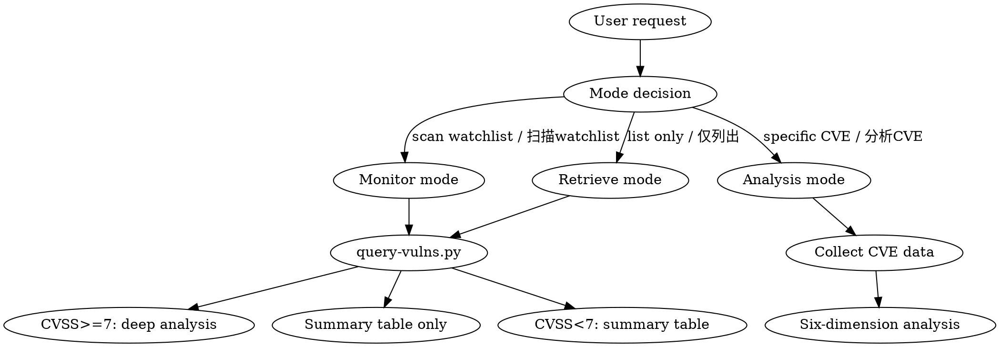

# CVE Sentinel

## Overview

Monitor open-source software for new CVE disclosures, retrieve vulnerability data from authoritative databases (OSV/NVD/CISA KEV/Github Advisory), and perform six-dimension deep analysis for high-severity vulnerabilities.

## When to Use

- Want to check if watched software has new vulnerability disclosures / 扫描watchlist中的软件有没有新漏洞
- Have a specific CVE-ID and need deep analysis report / 分析CVE-XXXX-YYYYY
- Want to extract project dependencies and monitor them for vulnerabilities / 提取项目依赖到watchlist
- Need to review archived vulnerability reports / 查看已归档的漏洞报告
- Want a lightweight CVE summary list without deep analysis / 只列出CVE摘要

## Execution Modes

## Monitor Mode

Scan watchlist for new vulnerabilities:

1. Run `python scripts/query-vulns.py --watchlist <path> --days 7 --index reports/INDEX.md --output reports/raw-results.json`
2. Parse JSON output, check `user_version_status` field:
   - **affected**: CVE affects versions within watchlist range → categorize by CVSS
     - CVSS < 7: Generate summary table
     - CVSS ≥ 7: Proceed to Deep Analysis below
   - **not_in_scope**: CVE only affects versions outside watchlist range → add to summary table with "out of watchlist scope" note
3. For infrastructure software (ecosystem empty in watchlist): always output summary table first, user manually decides which CVEs need deep analysis
4. Archive results and update `reports/INDEX.md`

## Analysis Mode

Deep analysis for a specific CVE:

1. Run `python scripts/query-vulns.py --watchlist <path> --cve CVE-YYYY-XXXXX --output reports/raw-{CVE-ID}.json`
2. Review collected data from all sources (NVD, OSV, GHSA, CISA KEV)
3. Search for patch commits, PoC, exploit details from reference URLs in collected data
4. Perform six-dimension analysis (see references/report-template.md for template)
5. Generate report file `reports/YYYY-MM-DD-{CVE-ID}.md`
6. Update `reports/INDEX.md`

## Retrieve Mode

List vulnerabilities without analysis:

1. Run `python scripts/query-vulns.py --watchlist <path> --days 7 --output reports/raw-results.json`
2. Output structured summary table only, no deep analysis

## Dependency Extraction

Add project dependencies to watchlist:

1. Run `python scripts/extract-deps.py --watchlist <path> --project-dir <path>`
2. Review updated watchlist.yaml, fill in missing CPE values manually
3. Run monitor mode to scan newly added software

## Deep Analysis Method

Six dimensions for CVSS ≥ 7 (see references/report-template.md):

1. **Root Cause**: Root cause from patch diff, vulnerability classification, code path explanation
2. **Trigger Conditions**: Trigger chain, prerequisites, trigger difficulty assessment
3. **Impact Scope**: Affected versions, deployment scenarios, lateral impact
4. **Mitigation Comparison**: ≥3 mitigation options with comparison table
5. **Verification**: Verification commands, success/failure criteria
6. **Long-term Plan**: Target upgrade version, upgrade path, mitigation removal timing

## Information Collection

Before deep analysis, collect from these sources (see references/data-sources.md):
- NVD: CVE description, CVSS, CPE scope, reference links
- OSV: Ecosystem-specific versions, fix versions, alias CVEs
- CISA KEV: Whether known exploited (adds urgency)
- GitHub Advisory: Official project advisory
- Patch commits: From reference URLs in collected data
- PoC/Exploit: From GitHub issues, exploit-db (search from reference links)

## Report Archival

- Deep reports: `reports/YYYY-MM-DD-{CVE-ID}.md`
- Summary tables: Append to monitoring session output
- Index: `reports/INDEX.md` with columns: CVE-ID, Software, CVSS, Deep Analysis, Date, Report Path

## New CVE Detection

Compare query results against `reports/INDEX.md` to filter out already-analyzed CVEs. First execution treats all found CVEs as new.

## Quick Reference

| Action | Command |
|--------|---------|
| Monitor watchlist | `python scripts/query-vulns.py --watchlist watchlist.yaml --days 7 --index reports/INDEX.md` |
| Analyze specific CVE | `python scripts/query-vulns.py --watchlist watchlist.yaml --cve CVE-YYYY-XXXXX` |
| Extract dependencies | `python scripts/extract-deps.py --watchlist watchlist.yaml --project-dir .` |
| List only (no analysis) | `python scripts/query-vulns.py --watchlist watchlist.yaml --days 30 --skip-osv` |

## Common Mistakes

- Running monitor without INDEX.md → all CVEs treated as new, re-analyzing known vulnerabilities
- Empty ecosystem in watchlist for packages → OSV query skipped, only NVD used (less precise for packages)
- Missing CPE for infrastructure software → NVD query skipped entirely
- Not checking CISA KEV → missing urgency flag for known-exploited vulnerabilities
