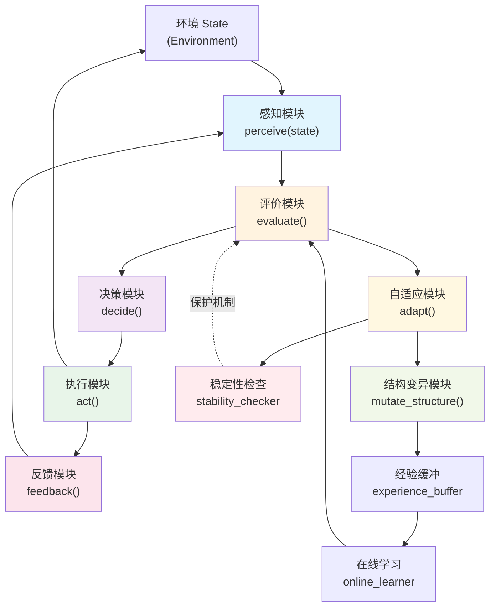

> **技能名称**: Cybernetic Evolver（控制论进化器）
> **版本**: v1.0.0
> **作者**: 基于钱学森《工程控制论》构建
> **触发方式**: 对话中提及"控制论进化"、"Cybernetic Evolver"、"自适应AI系统"、"自我进化"等关键词时激活
> **适用场景**: AI Agent的自主进化、策略优化、复杂任务分解与自适应执行

---

## 1. 技能元数据

| 字段 | 内容 |
|------|------|
| **名称** | Cybernetic Evolver |
| **版本** | 1.0.0 |
| **类型** | AI Agent 自我进化框架 |
| **核心理论来源** | 钱学森《工程控制论》(1954/1980) |
| **触发关键词** | `cybernetic evolver`、`控制论进化`、`自我进化`、`自适应策略`、`闭环反馈` |
| **依赖技能** | 无（独立运行） |
| **编程语言** | Python 3.8+ |

---

## 2. 核心架构（Mermaid闭环图）



### 闭环数据流

```
环境(Environment)
    ↓ state
感知(perceive) ──── 当前状态向量
    ↓ state
评价(evaluate) ──── 计算误差 e = target - actual
    ↓ error
决策(decide) ────── ε-greedy / 策略选择
    ↓ action
执行(act) ───────── 作用于环境，产生新状态
    ↓
反馈(feedback) ──── 记录经验至缓冲
    ↓
稳定性检查(stab) ─── Lyapunov判据
    ↓ (通过)
自适应(adapt) ──── 参数调整 / 结构变异
    ↓
经验缓冲(buffer) ─── 经验回放学习
    ↓
在线学习(learn) ─── 更新评价函数
    ↓
评价函数更新 ────── 下一次 evaluate() 更准确
```

---

## 3. 工作流程详述（每一步的控制论对应）

### Step 1: 感知（Perceive） — *对应：系统辨识与信息获取*
- **控制论来源**: 《工程控制论》第三章"输入、输出和传递函数"；系统辨识理论
- **操作**: 将环境状态映射为系统内部的特征向量
- **数学表达**: `s = perceive(state) → ℝ^n`
- **功能**: 从噪声环境中提取本质信息（对应信息处理理论）

### Step 2: 评价（Evaluate） — *对应：误差的控制与性能度量*
- **控制论来源**: 《工程控制论》第十八章"误差的控制"
- **操作**: 计算当前策略表现与目标的偏差
- **数学表达**: `error = J(target, s, θ) = target - f(s, θ)`
- **功能**: 实时量化系统表现，驱动后续调整方向

### Step 3: 决策（Decide） — *对应：最优控制与探索-利用平衡*
- **控制论来源**: 《工程控制论》第十五章"最优控制"；控制策略选择
- **操作**: 基于误差和探索-利用平衡选择行动策略
- **策略**: ε-greedy、UCB、贝叶斯优化等
- **功能**: 在已知最优策略和探索新策略之间取得平衡

### Step 4: 执行（Act） — *对应：随动系统与伺服机构*
- **控制论来源**: 《工程控制论》第六章"交流伺服系统"；反馈控制
- **操作**: 将决策输出的控制量作用于环境
- **功能**: 使系统输出跟踪目标（随动特性）

### Step 5: 反馈（Feedback） — *对应：闭环反馈与自稳定*
- **控制论来源**: 维纳反馈控制原理；第十七章"自行镇定和适应环境的系统"
- **操作**: 记录(action, state, reward, next_state)至经验缓冲
- **功能**: 形成完整的闭环，使系统具备自稳定能力

### Step 6: 稳定性检查（Stability Check） — *对应：Lyapunov稳定性判据*
- **控制论来源**: 自适应控制稳定性理论；Popov超稳定性理论
- **操作**: 计算Lyapunov函数 V(θ)，检测 dV/dt 符号
- **功能**: 防止参数调整导致系统失稳（保护机制）

### Step 7: 自适应（Adapt） — *对应：自适应控制与参数调整*
- **控制论来源**: 《工程控制论》第十七章；MIT自适应方案
- **操作**: 当误差超阈值时调整参数 `θ ← θ - α·∇J(θ)`
- **功能**: 使系统在环境变化时保持高性能

### Step 8: 结构变异（Mutate Structure） — *对应：自组织系统与进化*
- **控制论来源**: 1980年修订版"大系统理论"；协同学（哈肯）
- **操作**: 当参数调整失效时，探索性改变策略拓扑结构
- **功能**: 突破局部最优，实现真正的自我进化

---

## 4. 实现代码（CyberneticEvolver类）

详见 `CODE/evolver.py`

```python
class CyberneticEvolver:
    """
    基于钱学森《工程控制论》的AI自我进化框架。
    
    核心原理:
    1. 闭环反馈驱动（Perceive → Evaluate → Decide → Act → Feedback）
    2. 实时误差感知（evaluate() 实时计算性能误差）
    3. 自适应参数调整（adapt() 基于梯度/策略搜索调整参数）
    4. 探索-利用平衡（ε-greedy / UCB）
    5. 分层递阶进化（参数层 → 结构层 → 元策略层）
    6. 持续学习+稳定性保持（Lyapunov判据保护）
    """

    def __init__(self, target, state_dim, action_dim, ...):
        """初始化进化器"""
        pass

    def perceive(self, state: np.ndarray) -> np.ndarray:
        """感知：环境状态 → 内部特征向量（系统辨识）"""
        pass

    def evaluate(self) -> float:
        """评价：计算当前误差 J = target - performance（误差控制）"""
        pass

    def decide(self, epsilon: float = None) -> int:
        """决策：探索-利用平衡选择（最优控制）"""
        pass

    def act(self, action: int) -> Tuple[np.ndarray, float, bool]:
        """执行：将控制量作用于环境（随动系统）"""
        pass

    def feedback(self, exp: Experience):
        """反馈：记录经验至缓冲（闭环反馈）"""
        pass

    def stability_check(self) -> bool:
        """稳定性检查：Lyapunov判据（自稳定系统）"""
        pass

    def adapt(self):
        """自适应：参数调整（自适应控制）"""
        pass

    def mutate_structure(self):
        """结构变异：探索性改变策略拓扑（自组织系统）"""
        pass

    def evolve(self, n_steps: int):
        """完整进化循环"""
        pass
```

---

## 5. 自我进化演示示例

详见 `DEMO/example.py`

### 示例1：简单函数优化（看不见的手）
展示 CyberneticEvolver 如何通过反馈+自适应找到目标函数的最优解。

### 示例2：环境突变适应
展示环境目标突变时，系统如何通过自适应调整快速响应（对应自稳定系统）。

### 示例3：探索-利用平衡收敛
展示 ε-greedy 策略如何随时间从探索转向利用。

---

## 6. 理论基础引用

| 原理 | 钱学森《工程控制论》来源 |
|------|--------------------------|
| 闭环反馈 | 第一章引论、第三章传递函数 |
| 实时误差感知 | 第十八章"误差的控制" |
| 自适应调整 | 第十七章"自行镇定和适应环境的系统" |
| 最优控制 | 第十五章"自动寻求最优运转点" |
| 探索-利用平衡 | 第十五章（多种控制策略的代价比较） |
| 分层递阶进化 | 1980年修订版"大系统理论" |
| 持续学习+稳定 | 耗散结构论、协同学、"自我进化"章节 |
| 冗余与容错 | 第十四章（可靠性设计） |

---

## 7. Skill-as-Module 集成模式（推荐用法）

Cybernetic Evolver 作为**可嵌入模块**，被其他 agent 按需调用。各 agent 实例化时完全隔离，互不干扰。

### 7.1 集成架构

```
programmer agent
    ↓ 实例化
evolver_A = CyberneticEvolver(...)
evolver_A.set_performance_metric(j_code_quality)  # 注入程序员的J函数
evolver_A.set_state_extractor(extract_code_context)
evolver_A.set_action_transformer(transform_to_code_strategy)
    ↓ 调用
evolver_A.optimize(code_context)

news agent
    ↓ 实例化
evolver_B = CyberneticEvolver(...)
evolver_B.set_performance_metric(j_stock_pick)    # 注入财经的J函数
evolver_B.set_state_extractor(extract_market_context)
evolver_B.set_action_transformer(transform_to_portfolio)
    ↓ 调用
evolver_B.optimize(market_context)
```

### 7.2 核心接口

#### set_performance_metric(metric_fn)
注入性能度量函数（J函数）。**由调用方定义，进化器负责优化**。

| agent | 示例 metric_fn | 目标 |
|-------|---------------|------|
| news | `lambda s,a,r: r['daily_return']` | 最大化收益 |
| programmer | `lambda s,a,r: 1-0.7*r['bug_count']-0.3*r['complexity']` | 最小化缺陷 |
| secretary | `lambda s,a,r: 1-r['conflict_count']` | 最大化日程无冲突 |
| workassistant | `lambda s,a,r: r['report_score']` | 最大化报告评分 |

#### set_state_extractor(extractor_fn)
将 agent 上下文转换为特征向量。

#### set_action_transformer(transformer_fn)
将进化器输出的动作编号转换为具体策略。

#### optimize(context, n_iterations)
外部 agent 调用的主入口，执行 n 次优化迭代。

### 7.3 各 agent 集成示例

```python
# === programmer agent（开发）===
from CODE.evolver import CyberneticEvolver

evolver = CyberneticEvolver(
    target=1.0,        # 目标：bug_count=0, complexity最优
    state_dim=4,
    action_dim=3,       # 3种代码策略
)

# 注入程序员J函数
evolver.set_performance_metric(
    lambda s, a, r: 1.0 - 0.7*r['bug_count'] - 0.3*r['cyclomatic_complexity']
)

# 注入状态提取器
evolver.set_state_extractor(
    lambda ctx: np.array([
        ctx['task_difficulty'],
        ctx['test_coverage'],
        ctx['pr_review_time'],
        ctx['recent_bug_rate'],
    ])
)

# 注入动作转换器
strategies = ['aggressive_refactor', 'incremental_fix', 'conservative_review']
evolver.set_action_transformer(lambda a, ctx: strategies[a])

# 调用优化
result = evolver.optimize(code_context, n_iterations=20)
print(f"最优策略: {result['best_action']}, 误差: {result['best_error']:.4f}")

# === news agent（财经）===
evolver = CyberneticEvolver(
    target=0.0,        # 目标：收益最大化（用负收益作误差）
    state_dim=5,
    action_dim=4,       # 4种配置策略
)

evolver.set_performance_metric(
    lambda s, a, r: r['portfolio_return']
)

evolver.set_state_extractor(
    lambda ctx: np.array([
        ctx['market_volatility'],
        ctx['sector_rotation_score'],
        ctx['macro_indicator'],
        ctx['liquidity_score'],
        ctx['sentiment_index'],
    ])
)

result = evolver.optimize(market_context, n_iterations=20)
```

### 7.4 新增持久化与元控制接口

| 接口 | 作用 |
|------|------|
| `save(filepath)` | 保存当前状态（Q值、参数、epsilon等）到文件 |
| `load(filepath)` | 从文件加载状态，继续优化 |
| `get_best_strategy()` | 获取当前最优策略（含置信度） |
| `history(last_n)` | 获取优化历史及收敛分析 |
| `set_trigger_condition(fn)` | 注入触发条件判断函数 |
| `check_trigger(perf_history)` | 根据性能历史判断是否需要优化 |

**使用示例：**

```python
# === 持久化：每个agent保存自己的策略 ===
WORKSPACE = "<AGENT_WORKSPACE>"

evolver.save(f"{WORKSPACE}evolver_state.json")
# ... 一段时间后 ...
evolver.load(f"{WORKSPACE}evolver_state.json")

# === 获取最优策略 ===
strategy = evolver.get_best_strategy()
print(f"当前最优动作: {strategy['best_action_name']}")
print(f"置信度: {strategy['confidence']:.2%}")
print(f"策略版本: v{strategy['strategy_version']}")

# === 检查是否需要优化 ===
trigger_result = evolver.check_trigger([0.8, 0.75, 0.7, 0.65])
if trigger_result['should_optimize']:
    print(f"建议优化: {trigger_result['reason']}")
    evolver.optimize(context, n_iterations=trigger_result['suggested_iterations'])

# === 查看优化历史 ===
hist = evolver.history(last_n=50)
print(f"最近平均误差: {hist['recent_avg_error']:.4f}")
print(f"最优误差: {hist['best_error']:.4f}")
print(f"建议: {hist['recommendation']}")
```

### 7.5 J 函数设计指南

| 设计要点 | 说明 |
|---------|------|
| 范围 | 返回值应尽量在 [0, 1] 或相近量级，便于与 target 比较 |
| 方向 | 越大越好。误差 = target - metric_value |
| 权重 | 用加权组合表达多目标：`0.7*指标A + 0.3*指标B` |
| 平滑 | 避免突变（阶梯函数），用连续函数更利于梯度优化 |

---

## 8. 集成部署说明

本节描述如何将 Cybernetic Evolver 集成到大管家（main agent）的 SOUL.md 中，作为系统级自我优化引擎使用。

### 8.1 文件路径

| 文件 | 路径 |
|------|------|
| Evolver 目录 | `<WORKSPACE>/evolver/` |
| 加载器 | `<WORKSPACE>/evolver/init_evolver.py` |
| 配置文件 | `<WORKSPACE>/evolver/config.json` |
| 性能日志 | `<WORKSPACE>/evolver/performance_log.json` |
| 状态文件 | `<WORKSPACE>/evolver/state.json` |

### 8.2 动作空间（4种）

| 动作编号 | 名称 | 说明 |
|---------|------|------|
| 0 | `direct_handle` | 直接处理 |
| 1 | `delegate_to_news` | 分发给新闻 agent（来财） |
| 2 | `delegate_to_teleresearch` | 分发给学术 agent（贾维斯） |
| 3 | `delegate_to_programmer` | 分发给开发 agent（Coco） |

### 8.3 初始化（在 SOUL.md 中）

```python
import sys, os
WORKSPACE = "<USER_WORKSPACE>"
EVOLVER_DIR = os.path.join(WORKSPACE, "evolver")
sys.path.insert(0, EVOLVER_DIR)
from init_evolver import load_evolver_for_agent
evolver = load_evolver_for_agent(WORKSPACE)
```

### 8.4 调用时机

**触发条件：** `evolver.check_trigger(performance_history)` 当 performance_history 达到3条且连续下降时，返回 `{'should_optimize': True, ...}`。

**调用示例：**

```python
# 1. 记录本次任务质量分（每次主人指令完成后追加）
perf_score = 1.0 - 0.4*abs(user_satisfaction - 1.0) - 0.3*(1.0 - task_completion_rate)
performance_history.append(perf_score)

# 2. 判断是否需要优化
trigger = evolver.check_trigger(performance_history)
if trigger['should_optimize']:
    result = evolver.optimize(context, n_iterations=trigger['suggested_iterations'])
    evolver.save(f"{EVOLVER_DIR}/state.json")  # 保存状态
    print(f"建议策略: {result['best_action_name']}, 误差: {result['best_error']:.4f}")

# 3. 获取当前最优策略（下次决策参考）
strategy = evolver.get_best_strategy()
print(f"当前推荐: {strategy['best_action_name']} (置信度: {strategy['confidence']:.0%})")
```

### 8.5 J 函数设计（大管家用）

```python
J_score = 1.0 \
    - 0.4 * abs(user_satisfaction - 1.0) \
    - 0.3 * (1.0 - task_completion_rate) \
    - 0.3 * (1.0 - cross_domain_score)
```

- `user_satisfaction`：本次任务用户满意度（0-1，越高越好）
- `task_completion_rate`：任务完成率（0-1）
- `cross_domain_score`：跨域协作质量（0-1）

### 8.6 配置参数（config.json）

| 参数 | 值 | 说明 |
|------|---|------|
| target | 1.0 | 目标误差 |
| state_dim | 5 | 状态特征维度 |
| action_dim | 4 | 动作选项数 |
| epsilon_decay | 0.995 | 探索率衰减 |
| learning_rate | 0.02 | 学习率 |
| adaptation_threshold | 1.0 | 自适应触发阈值 |
| mutation_trigger | 10 | 结构变异触发步数 |

### 8.7 置信度阈值

| 置信度 | 策略 |
|--------|------|
| > 80% | 直接采用 `get_best_strategy()` 的结果 |
| 50% - 80% | 参考执行，可继续探索 |
| < 50% | 保持探索，不强制采用建议 |

### 8.8 与其他 agent 的数据隔离

Evolver 学习数据存储在 workspace 内部（`evolver/`），与其他 agent 完全隔离。外部 agent 调用 evolver 时不共享学习历史，各自独立进化。

### 8.9 performance_log.json 格式

```json
{"history": [0.85, 0.80, 0.75, ...]}
```

每次调用 `evolver.check_trigger()` 前，从该文件读取并追加最新的 quality score。

---

*版本: 1.2.1 | 最后更新: 2026-05-02*
*基于钱学森《工程控制论》(1954/1980) 构建*
*推荐用法：作为 Skill 模块嵌入其他 agent，而非独立运行*
