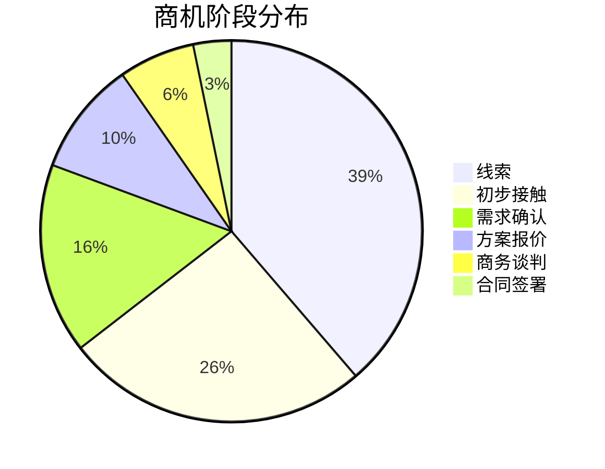
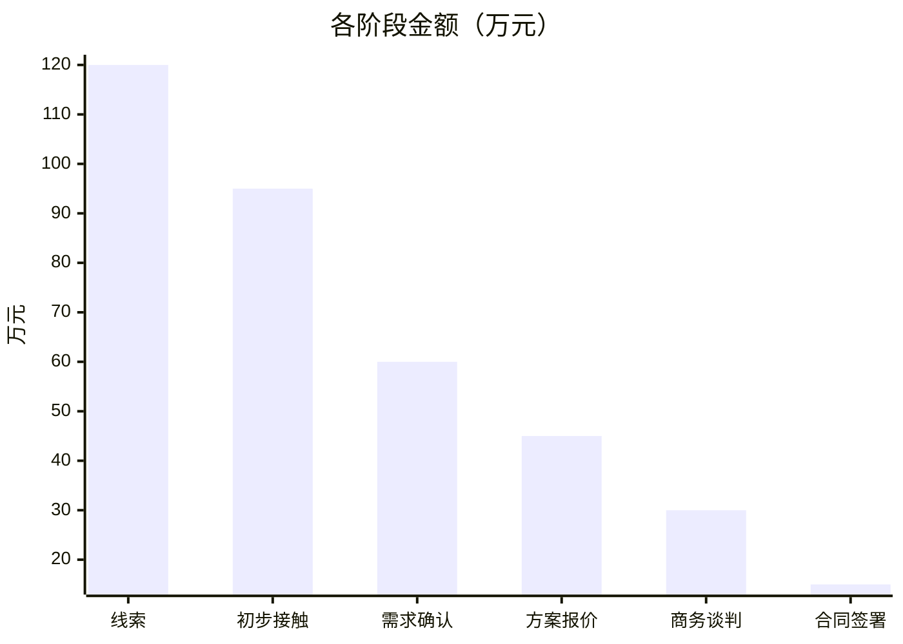
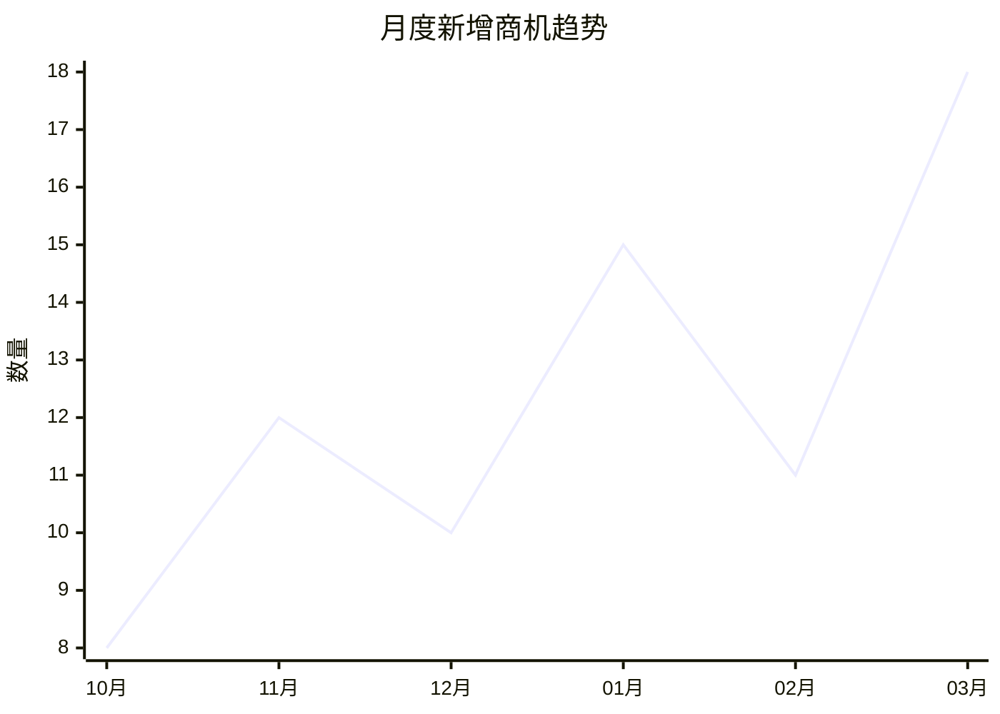

# 销售管道报告模板

本文档包含管道报告的标准格式和 Mermaid 图表示例。

---

## 漏斗报告模板

```markdown
# 销售漏斗报告 — YYYY-MM-DD

## 管道概览

| 阶段 | 商机数 | 金额 | 转化率 |
|------|--------|------|--------|
| 线索 | 12 | ¥120.00万 | - |
| 初步接触 | 8 | ¥95.00万 | 66.7% |
| 需求确认 | 5 | ¥60.00万 | 62.5% |
| 方案报价 | 3 | ¥45.00万 | 60.0% |
| 商务谈判 | 2 | ¥30.00万 | 66.7% |
| 合同签署 | 1 | ¥15.00万 | 50.0% |

## 风险预警

- 商机A: 已 21 天未更新，建议立即跟进
- 商机B: 已超出预计成交日期 7 天
```

---

## Mermaid 图表示例

### 饼图：商机阶段分布



### 柱状图：各阶段金额



### 折线图：月度趋势



---

## 收入预测模板

```markdown
# 收入预测报告

## 加权预测汇总

| 阶段 | 商机数 | 原始金额 | 加权金额 |
|------|--------|----------|----------|
| 需求确认 | 5 | ¥60.00万 | ¥15.00万 |
| 方案报价 | 3 | ¥45.00万 | ¥22.50万 |
| 商务谈判 | 2 | ¥30.00万 | ¥21.00万 |
| 合同签署 | 1 | ¥15.00万 | ¥13.50万 |
| **合计** | **11** | **¥150.00万** | **¥72.00万** |

## Top 5 高价值商机

| 商机 | 阶段 | 金额 | 概率 | 加权金额 |
|------|------|------|------|----------|
| 项目A | 商务谈判 | ¥20.00万 | 70% | ¥14.00万 |
| 项目B | 方案报价 | ¥18.00万 | 50% | ¥9.00万 |
```

---

## 周报/月报模板

```markdown
# 销售周报 — 2026-03-16 ~ 2026-03-22

## 本周概览

| 指标 | 数值 |
|------|------|
| 新增商机 | 5 个 |
| 成交商机 | 1 个 |
| 成交金额 | ¥15.00万 |
| 活跃管道 | ¥180.00万 |
| 风险商机 | 3 个 |
| 会议 | 8 场 |

## 下周重点

1. 重点跟进项目A（商务谈判阶段）
2. 项目B 预计本周提交方案
3. 处理 3 个风险商机
```
