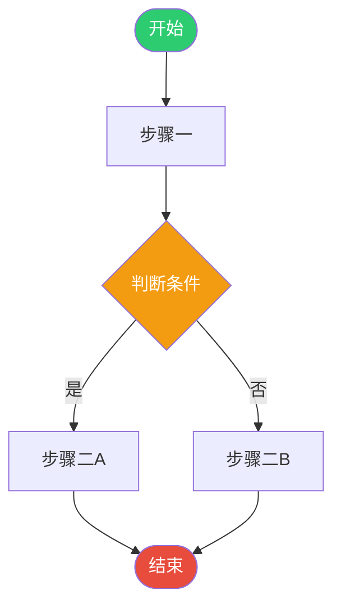
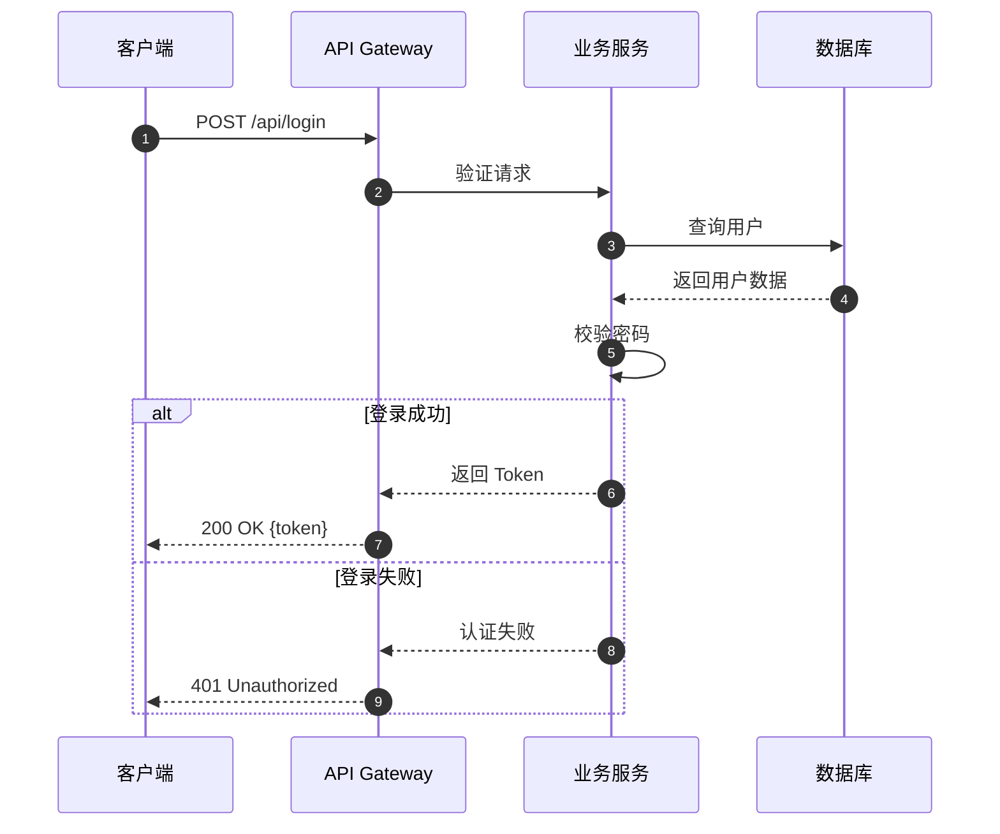
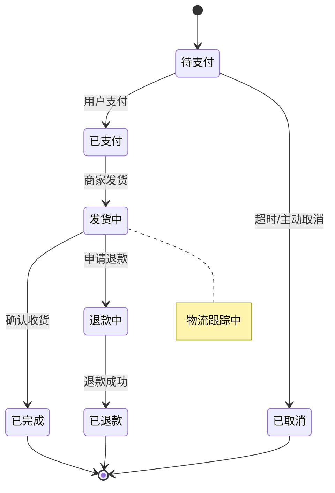
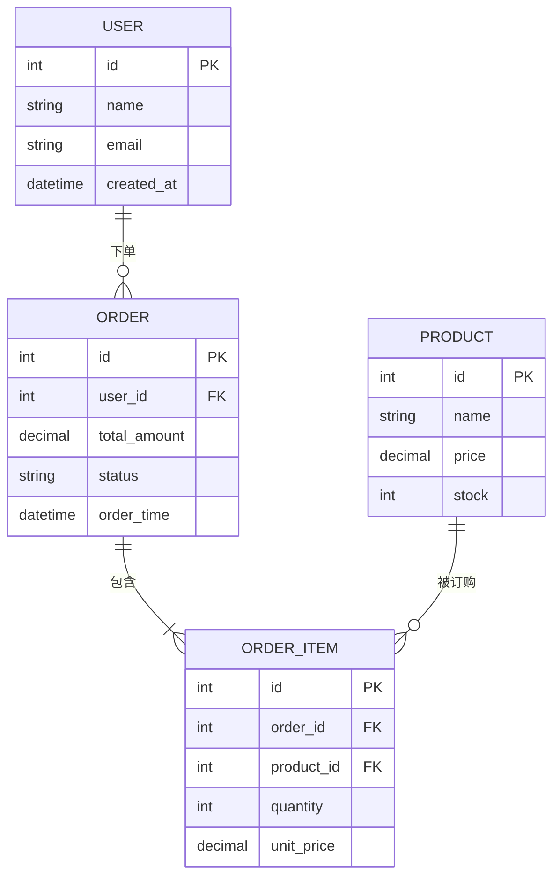
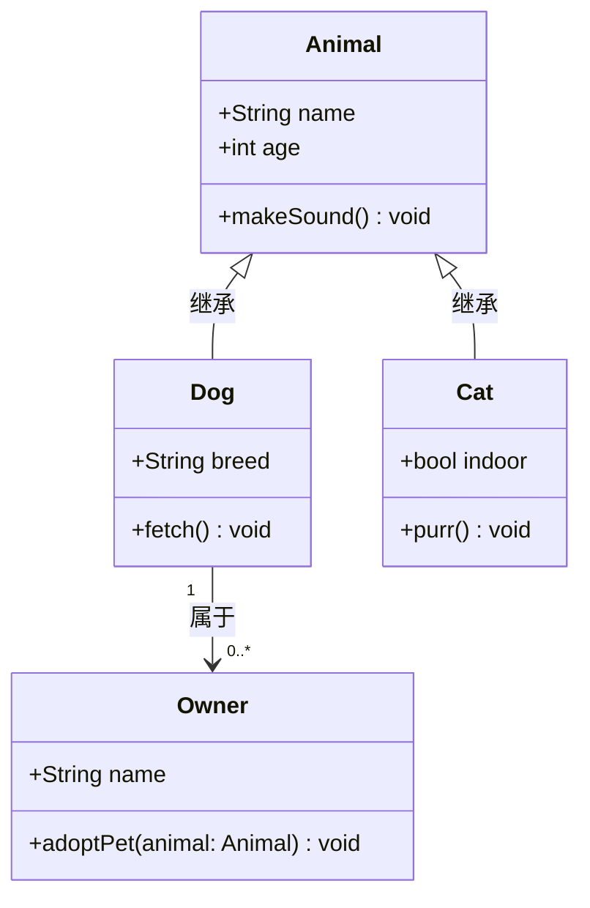
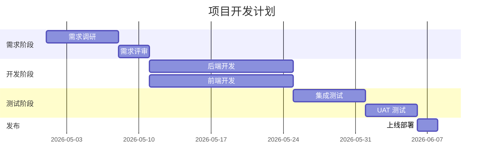
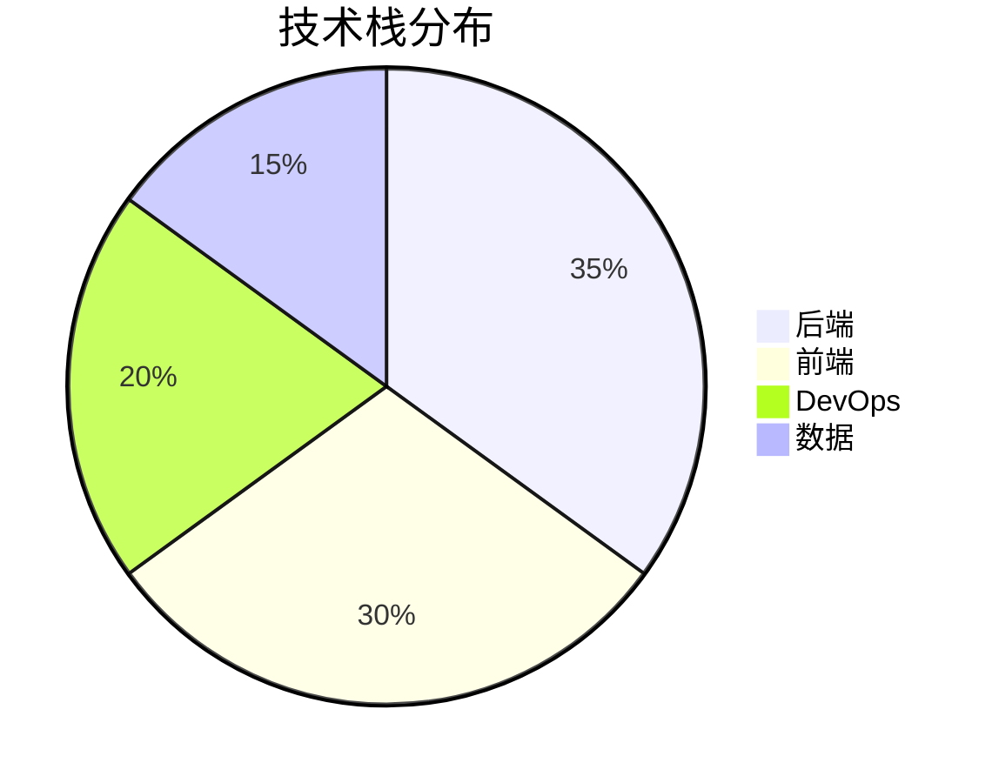
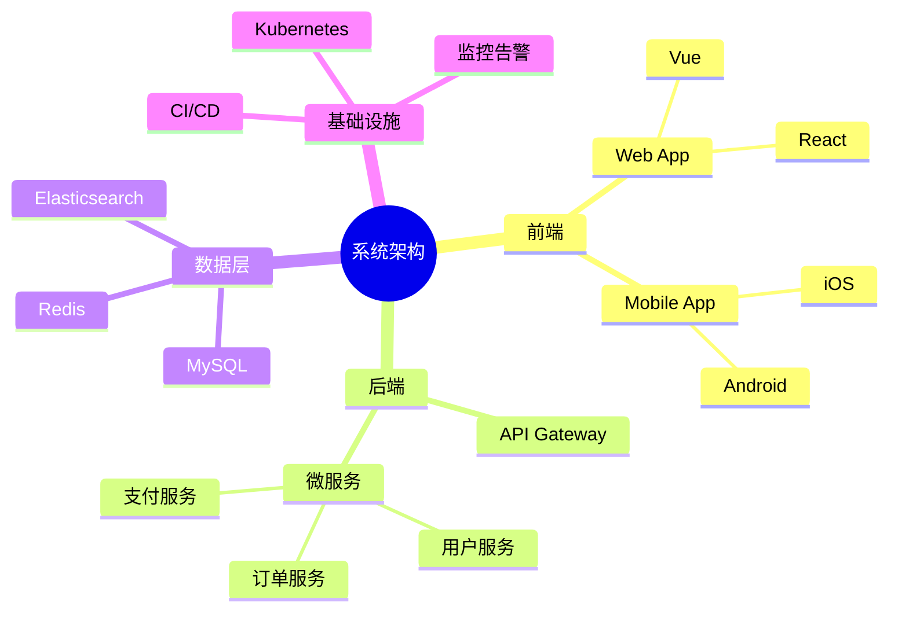
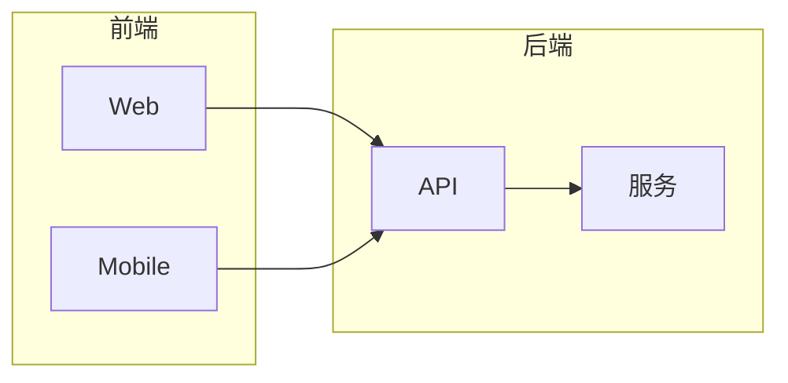

# 架构图与流程图绘制方法

## 核心理念

任何图表的本质是**信息结构的视觉化表达**。图表中的每个节点承载一个信息实体，每条连线承载一种实体关系，每个容器承载一层逻辑边界。绘制图表不是"用工具画图"，而是先理解信息结构，再选择合适的视觉编码将其映射为可渲染的SVG或Mermaid。

图表类型由信息结构决定——有层次用架构图，有顺序用流程图，有交互用时序图，有状态转换用状态机图。选错类型会让信息表达失真。

**适用范围广泛。** 任何有实体和关系的信息结构（系统架构、业务流程、数据模型、网络拓扑、状态转换、时序交互）都可以用本方法可视化。

---

## 绘制三步法

### 第一步：分析信息结构

从用户描述中提取核心信息：

1. **识别实体**：找出所有独立的信息单元（组件、状态、角色、表、节点）
2. **识别关系**：找出实体间的连接（调用、依赖、包含、时序、数据流）
3. **识别层次**：找出实体的归属关系（哪个属于哪个模块/层/泳道）

**实体判定准则**：如果去掉某个元素后信息不完整，它就是实体；如果去掉后信息仍然完整，它就是装饰。

**数量控制**：单张图实体≤20个。超出时拆分为多张子图，用概览图+细节图的方式表达。

### 第二步：选择图表类型与编码方案

根据信息结构特征选择最匹配的图表类型：

| 信息特征 | 图表类型 | 典型场景 |
|---------|---------|---------|
| 组件+层次+接口 | 系统架构图 | 微服务架构、云原生部署 |
| 步骤+分支+汇合 | 业务流程图 | 审批流、生产流程 |
| 角色+消息+时序 | 时序图 | API调用链、协议交互 |
| 状态+事件+转换 | 状态机图 | 订单状态、用户生命周期 |
| 实体+属性+关系 | ER图 | 数据库设计、领域模型 |
| 节点+链路+层级 | 网络拓扑图 | 网络架构、部署拓扑 |
| 数据源+处理+存储 | 数据流图 | ETL流水线、数据中台 |
| 类+属性+方法+继承 | 类图 | 面向对象设计、API契约 |

确定类型后，选定编码方案：
- **颜色编码**：不同类型实体用不同颜色
- **形状编码**：矩形=组件、菱形=决策、圆柱=数据库、椭圆=状态
- **线型编码**：实线=调用、虚线=依赖、粗线=主要路径、细线=次要路径

### 第三步：布局计算与渲染输出

1. **布局计算**：根据层次关系确定节点位置，确保同层对齐、跨层连线不交叉
2. **SVG/Mermaid生成**：按编码方案生成可渲染代码
3. **可读性优化**：调整间距、减少交叉、确保文字清晰

---

## 验证清单

绘制完成后逐项验证，七项全部通过才算完成：

| # | 验证项 | 说明 |
|---|--------|------|
| 1 | ⬜ 信息完整性 | 覆盖全部核心实体和关键关系，无遗漏 |
| 2 | ⬜ 类型匹配 | 图表类型与信息结构特征匹配 |
| 3 | ⬜ 层次清晰 | 分层/分组反映信息的逻辑层次 |
| 4 | ⬜ 关系准确 | 连线/箭头准确表达实体间关系类型 |
| 5 | ⬜ 可读性 | 文字清晰、间距合理、箭头不交叉 |
| 6 | ⬜ 编码一致 | 颜色/形状/线型编码全图统一 |
| 7 | ⬜ 可渲染 | 输出为有效SVG/Mermaid，可直接渲染 |

---

## 领域要求清单

### D0-01 系统架构图

- **必选组件**: 系统名称、组件列表（名称+职责）、层次划分（前端/后端/数据层/基础设施）、组件间接口关系、外部系统边界
- **可选组件**: 技术栈标注、部署环境标注、数据流向标注、安全边界标注
- **组装顺序**: 系统边界确认→层次划分→组件识别→接口关系标注→技术栈标注→布局计算→渲染
- **约束**: 同层组件水平对齐；跨层关系垂直连线；单张图≤20个节点
- **格式**: SVG（show_widget渲染）或Mermaid代码块

### D0-02 业务流程图

- **必选组件**: 流程名称、步骤列表（名称+角色+输入+输出）、步骤顺序、决策分支、开始/结束节点
- **可选组件**: 泳道划分、异常处理路径、并行分支、超时/重试逻辑
- **组装顺序**: 流程边界确认→步骤识别→顺序排列→决策分支标注→泳道划分→布局计算→渲染
- **约束**: 决策节点用菱形；是/否分支必须标注；循环必须有终止条件
- **格式**: SVG或Mermaid flowchart

### D0-03 时序图

- **必选组件**: 参与者列表、消息序列（发送方→接收方+消息名）、时序顺序、返回消息
- **可选组件**: 生命线激活区间、条件分支（alt/opt/loop）、自调用、创建/销毁标记
- **组装顺序**: 参与者识别→消息序列排列→返回消息标注→条件分支标注→布局计算→渲染
- **约束**: 时间轴从上到下；同步消息用实线箭头；异步消息用开放箭头
- **格式**: SVG或Mermaid sequenceDiagram

### D0-04 状态机图

- **必选组件**: 状态列表（名称+是否终态）、转换关系（源状态+事件+目标状态）、初始状态标记
- **可选组件**: 守卫条件、进入/退出动作、历史状态、嵌套子状态
- **组装顺序**: 状态识别→转换关系排列→初始/终态标注→守卫条件标注→布局计算→渲染
- **约束**: 初始状态用实心圆；终态用双圆；转换箭头标注事件名
- **格式**: SVG或Mermaid stateDiagram-v2

### D0-05 ER图

- **必选组件**: 实体列表（名称+属性）、主键标注、关系类型（1:1/1:N/M:N）、关系连线
- **可选组件**: 外键标注、属性类型、弱实体、复合属性
- **组装顺序**: 实体识别→属性列举→主键标注→关系识别→基数标注→布局计算→渲染
- **约束**: 实体用矩形；属性用椭圆；关系用菱形；基数必须标注
- **格式**: SVG或Mermaid erDiagram

### D0-06 网络拓扑图

- **必选组件**: 节点列表（设备类型+名称+IP）、链路关系、网络层级（核心/汇聚/接入）
- **可选组件**: 带宽标注、VLAN划分、安全区域、冗余链路
- **组装顺序**: 网络层级确认→节点识别→链路关系标注→IP/带宽标注→布局计算→渲染
- **约束**: 同层节点水平排列；层级间垂直连接；冗余链路用虚线
- **格式**: SVG

### D0-07 数据流图

- **必选组件**: 数据源、处理节点、数据存储、数据流（方向+内容）、输出
- **可选组件**: 转换规则、过滤条件、分支/合并、监控点
- **组装顺序**: 数据源识别→处理步骤排列→存储节点标注→数据流方向标注→布局计算→渲染
- **约束**: 数据源用矩形；处理用圆角矩形；存储用圆柱形；流向用箭头
- **格式**: SVG或Mermaid flowchart

### D0-08 类图

- **必选组件**: 类列表（名称+属性+方法）、继承关系、关联关系
- **可选组件**: 接口、抽象类、多重性标注、依赖关系、组合/聚合关系
- **组装顺序**: 类识别→属性/方法列举→继承关系标注→关联关系标注→布局计算→渲染
- **约束**: 类名用粗体；抽象类用斜体；接口用<<interface>>标注
- **格式**: SVG或Mermaid classDiagram

---

## 领域范本

### DF-01 图表绘制范本

**对应任务**: D0-01 ~ D0-08

**适用场景**: 任何需要将信息结构可视化为图表的场景

**绘制范本**:

```
## 图表绘制记录

### Step 1：分析信息结构（D0-0X）

**图表类型**：________（如：系统架构图/业务流程图/时序图/________）

**实体列表**：

| # | 实体名称 | 类型 | 属性/说明 | 所属层次 |
|---|----------|------|----------|---------|
| 1 | ________ | ________ | ________ | ________ |
| 2 | ________ | ________ | ________ | ________ |
| ... | ... | ... | ... | ... |

**关系列表**：

| # | 源实体 | 目标实体 | 关系类型 | 说明 |
|---|--------|---------|---------|------|
| 1 | ________ | ________ | ________ | ________ |
| 2 | ________ | ________ | ________ | ________ |
| ... | ... | ... | ... | ... |

**汇总**：___个实体 / ___个关系 / ___个层次

### Step 2：选择编码方案（D0-0X）

**颜色编码**：

| 实体类型 | 颜色 |
|---------|------|
| ________ | #______ |
| ________ | #______ |

**形状编码**：

| 元素类型 | 形状 |
|---------|------|
| 组件 | 矩形 |
| 决策 | 菱形 |
| 数据库 | 圆柱 |
| ... | ... |

**线型编码**：

| 关系类型 | 线型 | 箭头 |
|---------|------|------|
| 调用 | 实线 | 实心三角 |
| 依赖 | 虚线 | 开放三角 |
| ... | ... | ... |

### Step 3：布局与渲染（D0-0X）

**布局方案**：________（层次布局/网格布局/泳道布局）

| 实体 | X | Y | 宽 | 高 |
|------|---|---|----|----|
| ________ | ___ | ___ | ___ | ___ |
| ... | ... | ... | ... | ... |

### Step 4：验证（D0-0X）

| # | 验证项 | 通过？ |
|---|--------|-------|
| 1 | 信息完整性 | ⬜是/⬜否 |
| 2 | 类型匹配 | ⬜是/⬜否 |
| 3 | 层次清晰 | ⬜是/⬜否 |
| 4 | 关系准确 | ⬜是/⬜否 |
| 5 | 可读性 | ⬜是/⬜否 |
| 6 | 编码一致 | ⬜是/⬜否 |
| 7 | 可渲染 | ⬜是/⬜否 |
```

**范本要点**:
- 实体必须来自信息结构本身，不可凭空添加
- 编码方案必须全图一致，不可中途变换
- 验证七项必须全部通过
- 范本中 `________` 为待用户提供的内容，不可AI编造

---

## 图表类型SVG骨架

### 通用设计参数

| 参数 | 推荐值 |
|------|--------|
| SVG 宽度 | 固定 680px |
| SVG 高度 | 按内容计算，常见 300~600px |
| 节点圆角 | `rx="6"` ~ `rx="12"` |
| 主字体 | `font-family="sans-serif"` |
| 标题字号 | 14~16px，`font-weight="bold"` |
| 正文字号 | 11~13px |
| 节点间距 | 最少 16px |
| 文字内边距 | 最少 8px |
| 箭头颜色 | `#555`（默认）、`#3498db`（主色）、`#e74c3c`（警示） |
| 分层背景 | `#e8f4f8`（蓝）、`#f0f7ee`（绿）、`#fff3e0`（橙）、`#f3e5f5`（紫） |

### 1. 系统架构图（分层架构）

```svg
<svg viewBox="0 0 680 420" xmlns="http://www.w3.org/2000/svg" font-family="sans-serif">
  <defs>
    <marker id="arrow" markerWidth="10" markerHeight="7" refX="10" refY="3.5" orient="auto">
      <polygon points="0 0, 10 3.5, 0 7" fill="#555"/>
    </marker>
  </defs>
  <text x="340" y="28" text-anchor="middle" font-size="16" font-weight="bold" fill="#1a1a2e">系统架构图</text>
  <!-- 前端层 -->
  <rect x="40" y="50" width="600" height="70" rx="8" fill="#e8f4f8" stroke="#4a90d9" stroke-width="1.5"/>
  <text x="60" y="75" font-size="12" fill="#555">前端层</text>
  <rect x="80" y="80" width="120" height="30" rx="5" fill="#4a90d9"/>
  <text x="140" y="100" text-anchor="middle" font-size="12" fill="white">Web App</text>
  <rect x="230" y="80" width="120" height="30" rx="5" fill="#4a90d9"/>
  <text x="290" y="100" text-anchor="middle" font-size="12" fill="white">Mobile App</text>
  <line x1="340" y1="120" x2="340" y2="150" stroke="#555" stroke-width="1.5" marker-end="url(#arrow)"/>
  <!-- 后端层 -->
  <rect x="40" y="150" width="600" height="70" rx="8" fill="#f0f7ee" stroke="#5ba55b" stroke-width="1.5"/>
  <text x="60" y="175" font-size="12" fill="#555">后端层</text>
  <rect x="80" y="180" width="120" height="30" rx="5" fill="#5ba55b"/>
  <text x="140" y="200" text-anchor="middle" font-size="12" fill="white">API Gateway</text>
  <rect x="230" y="180" width="120" height="30" rx="5" fill="#5ba55b"/>
  <text x="290" y="200" text-anchor="middle" font-size="12" fill="white">业务服务</text>
  <rect x="380" y="180" width="120" height="30" rx="5" fill="#5ba55b"/>
  <text x="440" y="200" text-anchor="middle" font-size="12" fill="white">认证服务</text>
  <line x1="340" y1="220" x2="340" y2="250" stroke="#555" stroke-width="1.5" marker-end="url(#arrow)"/>
  <!-- 数据层 -->
  <rect x="40" y="250" width="600" height="70" rx="8" fill="#fff3e0" stroke="#e67e22" stroke-width="1.5"/>
  <text x="60" y="275" font-size="12" fill="#555">数据层</text>
  <rect x="80" y="280" width="120" height="30" rx="5" fill="#e67e22"/>
  <text x="140" y="300" text-anchor="middle" font-size="12" fill="white">MySQL</text>
  <rect x="230" y="280" width="120" height="30" rx="5" fill="#e67e22"/>
  <text x="290" y="300" text-anchor="middle" font-size="12" fill="white">Redis</text>
  <rect x="380" y="280" width="120" height="30" rx="5" fill="#e67e22"/>
  <text x="440" y="300" text-anchor="middle" font-size="12" fill="white">Elasticsearch</text>
  <line x1="340" y1="320" x2="340" y2="350" stroke="#555" stroke-width="1.5" marker-end="url(#arrow)"/>
  <!-- 基础设施层 -->
  <rect x="40" y="350" width="600" height="50" rx="8" fill="#f3e5f5" stroke="#9b59b6" stroke-width="1.5"/>
  <text x="60" y="370" font-size="12" fill="#555">基础设施</text>
  <text x="340" y="382" text-anchor="middle" font-size="12" fill="#7d3c98">Kubernetes / Docker / 云平台</text>
</svg>
```

**设计要点**：
- 每层用不同背景色区分（蓝/绿/橙/紫）
- 层间用竖向箭头连接
- 同层组件横向排列，间距均匀

### 2. 微服务架构图

**设计要点**：
- 以 API Gateway 为中心
- 各微服务使用圆角矩形，颜色统一
- 消息队列（MQ）用平行四边形或圆柱体表示
- 数据库用圆柱体表示（`ellipse` + 矩形组合）
- 服务间通信用不同颜色箭头区分（同步=实线，异步=虚线）

**SVG 骨架关键元素**：
```svg
<!-- 圆柱形数据库 -->
<ellipse cx="200" cy="360" rx="50" ry="12" fill="#e67e22"/>
<rect x="150" y="360" width="100" height="40" fill="#e67e22"/>
<ellipse cx="200" cy="400" rx="50" ry="12" fill="#d35400"/>
<text x="200" y="385" text-anchor="middle" font-size="11" fill="white">数据库名</text>
<!-- 虚线箭头（异步） -->
<line x1="x1" y1="y1" x2="x2" y2="y2" stroke="#999" stroke-width="1.5"
      stroke-dasharray="6,3" marker-end="url(#arrow)"/>
```

### 3. 网络拓扑图

**设计要点**：
- 节点用圆形（`<circle>`）表示网络设备
- 在圆内/圆下放图标或文字
- 连线用灰色实线，标注带宽/协议
- 按网络层次布局（互联网 → DMZ → 内网 → 核心）

**SVG 骨架关键元素**：
```svg
<!-- 网络节点 -->
<circle cx="340" cy="80" r="30" fill="#3498db" stroke="white" stroke-width="2"/>
<text x="340" y="85" text-anchor="middle" font-size="11" fill="white">互联网</text>
<!-- 防火墙（菱形） -->
<polygon points="340,130 370,155 340,180 310,155" fill="#e74c3c"/>
<text x="340" y="160" text-anchor="middle" font-size="10" fill="white">防火墙</text>
<!-- 连线带标注 -->
<line x1="340" y1="110" x2="340" y2="130" stroke="#555" stroke-width="2"/>
<text x="355" y="122" font-size="10" fill="#777">1Gbps</text>
```

### 4. 业务流程图（泳道图）

**设计要点**：
- 垂直或水平泳道划分角色
- 开始/结束：圆形（`<circle>`）
- 流程步骤：矩形（`<rect>`）
- 决策：菱形（`<polygon>`）
- 箭头连接，分支标注"是/否"

**SVG 骨架关键元素**：
```svg
<!-- 泳道背景 -->
<rect x="40" y="40" width="190" height="500" fill="#f8f9fa" stroke="#dee2e6"/>
<text x="135" y="65" text-anchor="middle" font-size="13" font-weight="bold" fill="#495057">用户</text>
<!-- 开始节点 -->
<circle cx="135" cy="100" r="20" fill="#2ecc71"/>
<text x="135" y="105" text-anchor="middle" font-size="12" fill="white">开始</text>
<!-- 决策菱形 -->
<polygon points="135,200 175,230 135,260 95,230" fill="#f39c12"/>
<text x="135" y="234" text-anchor="middle" font-size="11" fill="white">审核通过?</text>
<text x="180" y="225" font-size="10" fill="#555">是</text>
<text x="95" y="255" font-size="10" fill="#555">否</text>
```

### 5. 数据流图（DFD）

**设计要点**：
- 外部实体：矩形（方形角）
- 处理过程：圆角矩形或圆形
- 数据存储：两条平行横线加矩形（或圆柱）
- 数据流：带标注的有向箭头

```svg
<!-- 数据存储（两横线样式） -->
<line x1="260" y1="240" x2="420" y2="240" stroke="#555" stroke-width="1.5"/>
<line x1="260" y1="270" x2="420" y2="270" stroke="#555" stroke-width="1.5"/>
<text x="340" y="260" text-anchor="middle" font-size="12" fill="#333">D1: 用户数据库</text>
```

### 6. 时序图（Sequence Diagram）

**设计要点**：
- 角色在顶部，用矩形+标签表示
- 生命线为竖向虚线
- 消息为水平箭头，同步用实线，异步用虚线
- 激活框（activation bar）用细高矩形表示

```svg
<!-- 角色 -->
<rect x="60" y="30" width="80" height="30" rx="4" fill="#3498db"/>
<text x="100" y="50" text-anchor="middle" font-size="12" fill="white">客户端</text>
<!-- 生命线 -->
<line x1="100" y1="60" x2="100" y2="450" stroke="#aaa" stroke-width="1" stroke-dasharray="4,3"/>
<!-- 消息箭头 -->
<line x1="100" y1="100" x2="280" y2="100" stroke="#2c3e50" stroke-width="1.5" marker-end="url(#arrow)"/>
<text x="190" y="95" text-anchor="middle" font-size="11" fill="#555">HTTP 请求</text>
```

### 7. 状态机图（State Machine）

**设计要点**：
- 状态：圆角矩形（`rx="20"`）
- 初始状态：实心圆（`<circle fill="black">`）
- 终止状态：双圆（内圆 + 外圆）
- 转换：带标注的曲线或直线箭头

```svg
<!-- 状态节点 -->
<rect x="120" y="80" width="100" height="40" rx="20" fill="#3498db" stroke="#2980b9" stroke-width="1.5"/>
<text x="170" y="105" text-anchor="middle" font-size="13" fill="white">待支付</text>
<!-- 初始状态 -->
<circle cx="170" cy="50" r="10" fill="#2c3e50"/>
<line x1="170" y1="60" x2="170" y2="80" stroke="#2c3e50" stroke-width="1.5" marker-end="url(#arrow)"/>
<!-- 终止状态 -->
<circle cx="170" cy="400" r="14" fill="none" stroke="#2c3e50" stroke-width="2"/>
<circle cx="170" cy="400" r="9" fill="#2c3e50"/>
```

### 8. ER 图（实体关系图）

**设计要点**：
- 实体：矩形，标题栏 + 属性列表
- 主键：加粗或下划线
- 关系线：端点用菱形/竖线/叉表示基数（1:1 / 1:N / M:N）
- 属性较多时可折叠展示部分

```svg
<!-- 实体 -->
<rect x="60" y="80" width="160" height="140" rx="6" fill="white" stroke="#3498db" stroke-width="2"/>
<rect x="60" y="80" width="160" height="32" rx="6" fill="#3498db"/>
<rect x="60" y="96" width="160" height="16" fill="#3498db"/>
<text x="140" y="101" text-anchor="middle" font-size="13" font-weight="bold" fill="white">User</text>
<line x1="60" y1="112" x2="220" y2="112" stroke="#3498db" stroke-width="1"/>
<text x="75" y="132" font-size="12" fill="#333" font-weight="bold">🔑 id</text>
<text x="75" y="152" font-size="12" fill="#555">name</text>
<text x="75" y="172" font-size="12" fill="#555">email</text>
<text x="75" y="192" font-size="12" fill="#555">created_at</text>
```

---

## SVG渲染规范

### 箭头Marker规范

**核心原则**：

1. **路径必须朝右（+x 方向）**
   - `orient="auto"` 将 marker 的 x 轴沿线的方向旋转
   - marker 路径的尖端必须指向 +x 方向

   ```
   正确：尖端在右侧
     M1 2L8 5L1 8     ←—— 尖端在 x=8，朝右
   
   错误：尖端在下方  
     M1 2L5 8L9 2     ←—— 尖端在 y=8，朝下
   ```

2. **markerWidth/markerHeight ≥ viewBox**

   | viewBox | 错误的 markerWidth/Height | 正确的 | 后果 |
   |---------|--------------------------|--------|------|
   | 0 0 10 10 | 6 | 8 或 10 | 用 6 时 viewBox 被压缩，路径超出视口被裁切 |
   | 0 0 10 10 | 12 | 正常但偏大 | 用 12 时留了 margin，也 OK |

3. **refX/refY 精确对齐**

   | marker 参数 | 值 | 含义 |
   |------------|-----|------|
   | refX | 8 | 尖端 x 坐标，与线尾对接 |
   | refY | 5 | 箭头垂直中心，保持居中 |
   | orient | "auto" | 按线的方向自动旋转 |

**常见错误与修复**：

| 症状 | 根因 | 修复 |
|------|------|------|
| 箭头朝左 | 路径尖端朝下（y 轴），orient auto 旋转后方向错 | 路径改为朝右（+x），尖端 x=8 |
| 箭头只显示半边 | markerHeight < viewBox 高度，下半截被裁切 | markerHeight 改为 ≥10 |
| 箭头与线不对齐 | refX/refY 不在尖端坐标 | refX 对齐路径尖端 x，refY 取路径 y 中点 |
| 图例行内箭头方向错 | 行内水平线用了 `orient="auto-start-reverse"` 或未设 orient | 用 `orient="auto"`，路径朝右即可适配任何方向 |

**完整向下箭头定义**：

```svg
<defs>
  <marker id="arrow-down"
    viewBox="0 0 10 10"
    refX="8"
    refY="5"
    markerWidth="8"
    markerHeight="8"
    orient="auto">
    <path d="M1 2L8 5L1 8"
      fill="none"
      stroke="context-stroke"
      stroke-width="1.5"
      stroke-linecap="round"
      stroke-linejoin="round"/>
  </marker>
</defs>

<!-- 竖线：箭头自动朝下 -->
<line x1="340" y1="168" x2="340" y2="206"
  stroke="#888" stroke-width="1.8" marker-end="url(#arrow-down)"/>

<!-- 横线（如图例行内）：orient="auto" 自动适配为朝右 -->
<line x1="526" y1="11" x2="544" y2="11"
  stroke="#888" stroke-width="1.8" marker-end="url(#arrow-down)"/>
```

**箭头尺寸选择**：

| 图表类型 | 推荐 markerWidth/Height | stroke-width | 线 stroke-width |
|---------|------------------------|-------------|-----------------|
| 大型架构图（680×800+） | 8 | 1.5 | 1.8 |
| 中型图（680×400~600） | 8 | 1.5 | 1.5 |
| 小型图/流程图 | 6 | 1.2 | 1.2 |
| 图例中的微型箭头 | 8 | 1.5 | 1.8（与主图一致） |

### 分层架构图布局规范

**布局参数表**：

| 参数 | 值 | 说明 |
|------|-----|------|
| SVG 宽度 | 680px | 固定 |
| 标题 y | 28 | 图表标题距顶部 |
| 层内填充 | 12px | 分组框与内部元素的上下间距 |
| 层间箭头高度 | 40px | 箭头上端距上层框底 8px，下端距下层框顶 8px |
| 分组框 padding | 8~12px | 框左右两侧的空余（标题条不超出框左/右边界） |
| 图例间距 | ≥16px | 图例与最下层内容底部的距离 |

**分层结构模板**：

每层由三部分构成：

```
┌─ 分组框（虚线圆角矩形，stroke-dasharray="6 3"，rx="10"）─┐
│  [层号标签]  ← 左上角小字                                          │
│  ┌────── 标题条（胶囊形 rx="16"）──────────┐                        │
│  │  第N层：层名                              │                       │
│  └──────────────────────────────────────┘                           │
│  ┌────────┐  ┌────────┐  ┌────────┐                                │
│  │ 组件A  │  │ 组件B  │  │ 组件C  │                                │
│  │副标题  │  │副标题  │  │副标题  │                                │
│  └────────┘  └────────┘  └────────┘                                │
└─────────────────────────────────────────────────────┘
         │  ← 箭头 40px 间距
         ▼
┌─ 分组框（下一层）─────────────────────────────────┐
│  ...                                               │
```

**坐标系计算（5层示例）**：

viewBox 高度 = 图例底部 + 16px 余量，向上取整。

```
层标题 y = 12  (viewBox 内首个元素位置)
层标题 h = 32  (胶囊形标题条)

组件 y   = 层标题 y - 分组框 y + 58
         = (分组框内标题条高度 32 + 组件上方间距 14 + 填充 12)
组件 h   = 44  (标准组件)

分组框 y = 层标题 y - 12   (上方 12px 填充)
分组框 h = 120  (12px 上填充 + 32 标题 + 14 间隔 + 44 组件 + 12 下填充 = 114 → 取整)

// 层间距
层 N 框底 = 分组框_y + 120
箭头起点 = 层 N 框底 + 8
箭头终点 = 箭头起点 + 24 = 层 N+1 框顶 - 8
层 N+1 框顶 = 箭头终点 + 8
```

**5层架构实际坐标（viewBox="0 0 680 910"）**：

| 层 | 分组框 y | 标题条 y | 组件 y | 框底 | 箭头 y1→y2 |
|----|---------|---------|--------|------|-----------|
| 1 (用户界面) | 40 | 52 | 98 | 160 | 168→206 |
| 2 (Skill引擎) | 208 | 220 | 266 | 328 | 336→374 |
| 3 (AI执行) | 376 | 388 | 434 | 496 | 504→542 |
| 4 (工具调用) | 544 | 556 | 602 | 664 | 672→710 |
| 5 (存储层) | 712 | 724 | 770 / 826 | 864 | — |
| 图例 | — | — | 880 | 902 | — |

存储层特殊处理：含两行组件（44px + 28px），分组框高度 = 152px。

**分组框 CSS 类定义**：

```svg
<style>
  .layer-box {
    fill: none;
    stroke: #B0B0B0;
    stroke-width: 1.2;
    stroke-dasharray: 6 3;
  }
  .layer-badge {
    font: 500 11px sans-serif;
    fill: #666;
  }
</style>

<!-- 使用示例 -->
<rect class="layer-box" x="28" y="40" width="624" height="120" rx="10"/>
<text class="layer-badge" x="40" y="54">第1层</text>
```

**层间箭头**：

```svg
<style>
  .arr-down {
    stroke: #888;
    stroke-width: 1.8;
    marker-end: url(#arrow-down);
    fill: none;
  }
</style>

<!-- L1→L2，40px 箭身 -->
<line x1="340" y1="168" x2="340" y2="206" class="arr-down"/>
```

**图例布局**：

图例放在最底部，横排紧凑展示所有类别。

```
┌─ 图例框（浅灰填充，无虚线）──────────────────────────┐
│ 图例  ■ 用户交互  ■ 引擎处理  ■ AI执行  ■ 工具调用  ■ 存储层  → 层间调用 │
└────────────────────────────────────────────────────┘
```

关键约束：
- 图例 y 坐标 = 最下层框底 + 16px
- 图例行内箭头使用与主图相同的 marker（`orient="auto"` 自动适配水平方向）
- 图例高度 ≤30px，给主图留更多空间

**viewBox 高度计算公式**：

```
viewBox_H = 图例底部_y + 16
         = (最下层框底_y + 16) + 图例高度 + 16
         = 864 + 16 + 22 + 16 = 918
         → 取整 920（或保守一点取 910，只要箭头和图例都能完整显示）
```

**原则：viewBox 高度宁可多留 10px，也不要让任何元素被裁切。**

### 设计规范

- 颜色：加载`read_me diagram`后按CSS变量定义使用
- 字体：`font-family="sans-serif"`
- 间距：组件间距≥16px，文字与边框间距≥8px
- 图例：复杂图表右下角添加图例说明

---

## Mermaid语法参考

### 流程图（Flowchart）



**节点形状**：
| 语法 | 形状 |
|------|------|
| `A[文字]` | 矩形 |
| `A(文字)` | 圆角矩形 |
| `A([文字])` | 胶囊形（开始/结束） |
| `A{文字}` | 菱形（判断） |
| `A[(文字)]` | 圆柱（数据库） |
| `A((文字))` | 圆形 |
| `A>文字]` | 标签形 |

**方向**：`TD`（上下）、`LR`（左右）、`BT`（下上）、`RL`（右左）

### 时序图（Sequence Diagram）



**消息类型**：
- `A->>B: 消息` — 实线箭头（同步）
- `A-->>B: 消息` — 虚线箭头（返回/异步）
- `A-)B: 消息` — 异步（无箭头实线）
- `A-xB: 消息` — 带 × 的箭头（失败）

**控制块**：
```
loop 每10秒轮询
    ...
end

alt 条件A
    ...
else 条件B
    ...
end

opt 可选操作
    ...
end

par 并行操作1
    ...
and 并行操作2
    ...
end
```

### 状态机（State Diagram v2）



### ER 图（Entity Relationship）



**基数符号**：
| 符号 | 含义 |
|------|------|
| `\|\|` | 有且仅有一个 |
| `o\|` | 零或一个 |
| `\|{` | 一或多个 |
| `o{` | 零或多个 |

### 类图（Class Diagram）



### 甘特图（Gantt）



### 饼图（Pie Chart）



### 思维导图（Mindmap）



### 常用技巧

**添加链接**：
```
A --> B
click A "https://example.com" "跳转说明"
```

**子图（Subgraph）**：


**自定义样式**：
```
style nodeId fill:#color,stroke:#color,color:#color
classDef myClass fill:#f9f,stroke:#333
class nodeId myClass
```

**图表配置**：
```
%%{init: {'theme': 'base', 'themeVariables': {'primaryColor': '#3498db'}}}%%
```

可用主题：`base`、`default`、`dark`、`forest`、`neutral`

---

## 使用规则

1. **判断图表类型**：根据信息特征选择最匹配的图表类型
2. **按三步执行**：分析信息结构→选择编码方案→布局渲染
3. **产出交付**：按领域要求清单逐项填充，或按DF-01范本结构替换实际内容
4. **渲染输出**：优先show_widget内联SVG；需嵌入文档时用Mermaid代码块
5. **用户主权**：AI产出的图表是起点，用户对布局、颜色、实体选取有调整权

---

## 事实纪律

1. 图表类型选择必须基于信息结构特征，不得因"好看"选择不匹配的类型
2. 实体数量必须控制在合理范围内（单图≤20），超出时拆分为多张子图
3. SVG输出必须经过可渲染验证，不可输出无效标记
4. 涉及敏感信息的图表必须标注脱敏要求
