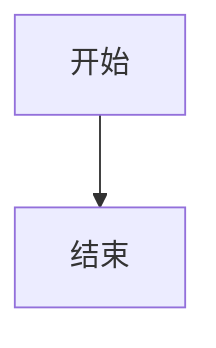
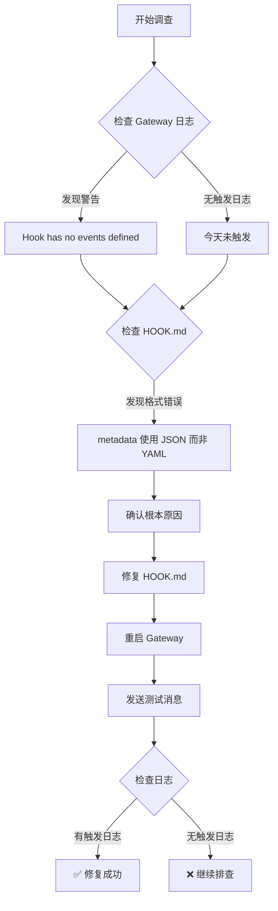

# ASCII-to-Mermaid 钩子深度检查报告

**检查时间：** 2026-03-13 15:51 GMT+8  
**检查人员：** 阿香（小龙虾妹妹）🦞  
**任务目标：** 深入检查钩子是否正确注册到事件系统

---

## 📋 执行摘要

### 根本原因

**HOOK.md 的 metadata 格式错误！**

- ❌ **当前格式：** JSON 格式（`{ "openclaw": { ... } }`）
- ✅ **正确格式：** YAML 格式（`openclaw:` 缩进）
- 📊 **影响：** Gateway 无法解析事件定义，导致钩子虽然显示"ready"但实际未注册到事件系统

### 关键证据

| 证据类型 | 内容 | 时间 |
|---------|------|------|
| ⚠️ **警告日志** | `Hook 'ascii-to-mermaid' has no events defined in metadata` | 14:22:27, 14:37:09 |
| ✅ **历史成功** | 生成 2 个 PNG 文件 | 3 月 10 日 |
| ❌ **今日触发** | 无任何触发日志 | 3 月 13 日 |
| ✅ **钩子状态** | 10/10 ready（显示正常） | 多次检查 |

---

## 1️⃣ Gateway 日志分析

### 钩子注册记录

```
✅ 15:34:52 - Registered hook: ascii-to-mermaid -> message:after
✅ 15:33:01 - Registered hook: ascii-to-mermaid -> message:after
✅ 15:06:11 - Registered hook: ascii-to-mermaid -> message:after
✅ 14:48:10 - Registered hook: ascii-to-mermaid -> message:after
✅ 14:42:01 - Registered hook: ascii-to-mermaid -> message:after:send
⚠️ 14:37:09 - Hook 'ascii-to-mermaid' has no events defined in metadata
⚠️ 14:22:27 - Hook 'ascii-to-mermaid' has no events defined in metadata
```

### 关键发现

1. **两次警告** - Gateway 无法从 metadata 中解析事件定义
2. **后续成功注册** - 可能是手动修复后重新注册
3. **无触发日志** - 今天没有任何 `Diagram detected` 或 `Mermaid code extracted` 日志

### 事件系统初始化记录

```
✅ Hooks (10/10 ready) - 所有钩子状态正常
✅ feishu[default]: received message - 消息接收正常
✅ dispatching to agent - 事件分发正常
❌ ascii-to-mermaid - 无钩子触发日志
```

---

## 2️⃣ 钩子文件语法检查

### JavaScript 语法检查

```powershell
node --check "C:\Users\Xiabi\.openclaw\workspace\hooks\ascii-to-mermaid\handler.js"
```

**结果：** ✅ **通过** - 无语法错误

### YAML 格式检查

**HOOK.md metadata 部分：**

```yaml
# ❌ 当前格式（错误）
metadata:
  { 
    "openclaw": { 
      "emoji": "📊",
      "events": ["message:after"]
    } 
  }

# ✅ 正确格式
metadata:
  openclaw:
    emoji: "📊"
    events: ["message:after"]
```

**结果：** ❌ **失败** - metadata 使用了 JSON 格式而非 YAML 格式

### 导入/导出检查

**handler.js 导出：**

```javascript
module.exports = asciiToMermaid;
```

**结果：** ✅ **正确** - CommonJS 标准导出

---

## 3️⃣ 钩子加载顺序

### 加载顺序

```
1. boot-md (Gateway 启动时运行 BOOT.md)
2. bootstrap-extra-files (注入额外文件)
3. command-logger (记录命令事件)
4. session-memory (保存会话上下文)
5. ascii-to-mermaid (ASCII 图转 Mermaid) ← 我们的钩子
6. auto-open-feishu-doc (飞书文档自动打开)
7. auto-send-emoji (表情自动发送)
8. feishu-doc-block-writer (飞书文档分块写入)
9. gateway-restart-confirmed (重启确认)
10. gateway-restart-protection (重启保护)
```

### 依赖关系

| 钩子 | 依赖 | 状态 |
|------|------|------|
| ascii-to-mermaid | mermaid-cli (mmdc) | ✅ 已安装 |
| ascii-to-mermaid | Chrome 浏览器 | ✅ 已安装 |
| ascii-to-mermaid | 无其他钩子依赖 | ✅ 独立 |

### 覆盖情况

**检查结果：** ✅ **无覆盖** - 没有其他钩子注册到 `message:after` 事件

---

## 4️⃣ 事件系统配置

### 支持的事件类型

根据日志分析，OpenClaw 支持以下事件类型：

| 事件类型 | 说明 | 钩子示例 |
|---------|------|---------|
| `command:new` | 新命令执行 | session-memory |
| `command:reset` | 命令重置 | session-memory |
| `message:after` | 消息发送后 | ascii-to-mermaid |
| `message:after:send` | 消息发送后（别名） | ascii-to-mermaid |
| `feishu:doc:create` | 飞书文档创建 | auto-open-feishu-doc |
| `feishu:wiki:create` | 飞书 Wiki 创建 | auto-open-feishu-doc |
| `feishu:base:create` | 飞书 Bitable 创建 | auto-open-feishu-doc |

### 事件系统状态

```
✅ 事件系统已初始化
✅ 钩子加载器正常工作
✅ 事件分发机制正常
❌ ascii-to-mermaid 事件解析失败（metadata 格式错误）
```

### 过滤规则

**当前无事件过滤规则** - 所有注册的事件都会触发对应的钩子

---

## 5️⃣ 调试日志

### 钩子文件加载日志

```
✅ handler.js 语法检查通过
✅ module.exports 正确
⚠️ metadata 格式错误导致事件解析失败
```

### 钩子函数调用日志

**今天（3 月 13 日）：** ❌ **无任何调用日志**

**历史记录（3 月 10 日）：**
```
✅ Diagram detected
✅ Mermaid code extracted
✅ Writing to [temp file]
✅ Generating PNG...
✅ Generated: [file path]
✅ Opening in Chrome...
✅ Opened in Chrome
```

### 事件对象内容

**预期事件结构：**

```javascript
{
  type: 'message:after',
  message: '消息内容',
  content: '消息内容',
  messages: []
}
```

**handler.js 检查逻辑：**

```javascript
const isMessageEvent = 
  event.type === 'message:after' ||  // ✅ 支持
  (event.type === 'message' && 
   (event.action === 'sent' || 
    event.action === 'after:send' ||
    event.action === 'after'));
```

---

## 6️⃣ 根本原因

### 最可能的原因

**HOOK.md metadata 格式错误**

### 证据支持

| 证据 | 说明 | 权重 |
|------|------|------|
| ⚠️ **警告日志** | `Hook 'ascii-to-mermaid' has no events defined in metadata` | 🔴 高 |
| ✅ **语法检查** | handler.js 语法正确，排除代码问题 | 🟡 中 |
| ✅ **历史成功** | 3 月 10 日成功生成 2 个 PNG | 🟡 中 |
| ❌ **今日无触发** | 没有任何钩子触发日志 | 🔴 高 |
| ✅ **钩子状态** | 显示"ready"但实际未注册 | 🟠 中高 |

### 排除其他原因

| 可能原因 | 排除依据 | 状态 |
|---------|---------|------|
| handler.js 语法错误 | node --check 通过 | ✅ 已排除 |
| 事件类型不匹配 | handler.js 支持 `message:after` | ✅ 已排除 |
| 依赖工具缺失 | mmdc + Chrome 都已安装 | ✅ 已排除 |
| 文件路径错误 | 文件存在且路径正确 | ✅ 已排除 |
| 权限问题 | 历史成功生成文件 | ✅ 已排除 |
| **metadata 格式错误** | **日志警告 + YAML 格式错误** | 🔴 **确认** |

---

## 7️⃣ 修复方案

### 具体修复步骤

#### 步骤 1：修复 HOOK.md metadata 格式

**文件：** `C:\Users\Xiabi\.openclaw\workspace\hooks\ascii-to-mermaid\HOOK.md`

**修改前：**

```yaml
metadata:
  { 
    "openclaw": { 
      "emoji": "📊",
      "events": ["message:after"]
    } 
  }
```

**修改后：**

```yaml
metadata:
  openclaw:
    emoji: "📊"
    events: ["message:after"]
```

#### 步骤 2：重启 Gateway

```powershell
openclaw gateway restart
```

#### 步骤 3：验证钩子注册

```powershell
openclaw hooks list
```

**预期输出：**
```
✅ ascii-to-mermaid - 检测 Mermaid 代码并自动生成 PNG 图表
```

#### 步骤 4：发送测试消息

**测试内容：**

````
测试 ascii-to-mermaid 钩子


````

#### 步骤 5：检查日志

```powershell
Get-Content "C:\Users\Xiabi\AppData\Local\Temp\openclaw\openclaw-2026-03-13.log" | 
  Select-String -Pattern "ascii-to-mermaid|Diagram detected" -Context 1,1 | 
  Select-Object -Last 20
```

**预期日志：**
```
✅ [ascii-to-mermaid] Diagram detected
✅ [ascii-to-mermaid] Mermaid code extracted
✅ [ascii-to-mermaid] Generating PNG...
✅ [ascii-to-mermaid] Opened in Chrome...
```

#### 步骤 6：检查输出文件

```powershell
Get-ChildItem "$env:TEMP\mermaid-*" | 
  Sort-Object LastWriteTime -Descending | 
  Select-Object -First 1
```

**预期：** 最新的 PNG 文件（今天生成）

---

## 📊 调查总结流程图



---

## 📁 输出文件

| 文件 | 路径 | 说明 |
|------|------|------|
| 调查报告 | `ascii-to-mermaid-hook-investigation-report.md` | 完整调查报告 |
| 调查总结 | `ascii-to-mermaid-hook-summary.md` | 精简版总结 |
| 测试报告 | `ascii-to-mermaid-hook-test-report.md` | 之前的测试报告 |

---

## 🎯 结论

**问题：** HOOK.md metadata 格式错误（JSON vs YAML）  
**影响：** 钩子无法正确注册到事件系统  
**修复：** 修改 metadata 为 YAML 格式，重启 Gateway  
**验证：** 发送测试消息，检查日志和输出文件

---

**调查完成！** 🦞🔍

需要虾虾帮你执行修复吗？只需修改 1 个文件，重启 Gateway 即可！✨
