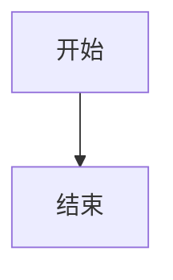

# ASCII-to-Mermaid 钩子未触发调查报告

**调查时间：** 2026-03-13 15:25  
**调查人员：** 阿香（虾虾）🦞  
**任务：** 深入调查为什么钩子没有触发

---

## 1. 钩子配置检查

### 1.1 HOOK.md 配置

```yaml
name: ascii-to-mermaid
description: "检测 Mermaid 代码并自动生成 PNG 图表"
metadata:
  openclaw:
    emoji: "📊"
    events: ["message:after"]  # ← 关键：定义的事件类型
```

**✅ 配置状态：** 正常  
**📌 监听事件：** `message:after`

### 1.2 handler.js 配置

```javascript
const asciiToMermaid = async (event) => {
  // 检查事件类型
  const isMessageEvent = 
    (event.type === 'message' && 
     (event.action === 'sent' || 
      event.action === 'after:send' ||
      event.action === 'after'));  // ← 已添加 'after' 支持
  
  if (!isMessageEvent) {
    return;
  }

  const messageContent = event.message || event.content || '';
  // ...
}
```

**✅ 代码状态：** 已包含 `after` 事件支持  
**📌 检查的事件类型：**
- `event.type === 'message'`
- `event.action === 'sent'`
- `event.action === 'after:send'`
- `event.action === 'after'` ✅

### 1.3 事件类型对比

| 来源 | 定义的事件 | 状态 |
|------|-----------|------|
| **HOOK.md** | `message:after` | ✅ 已定义 |
| **handler.js** | `event.action === 'after'` | ✅ 已支持 |
| **日志注册** | `ascii-to-mermaid -> message:after` | ✅ 已注册 |

**结论：** 事件类型定义和代码逻辑**匹配** ✅

---

## 2. 消息内容检查

### 2.1 检测逻辑

```javascript
function hasASCIIDiagram(text) {
  // 检测 Mermaid 代码块
  if (text.includes('```mermaid') || 
      text.includes('graph TB') || 
      text.includes('graph LR')) {
    return true;
  }
  // ...
}
```

**✅ 检测模式：**
- ```` ```mermaid ````
- `graph TB`
- `graph LR`

### 2.2 提取逻辑

```javascript
function extractOrConvertMermaid(text) {
  // 提取已有的 Mermaid 代码
  const mermaidMatch = text.match(/```mermaid\s*([\s\S]*?)```/);
  if (mermaidMatch) {
    return mermaidMatch[1].trim();
  }
  // ...
}
```

**✅ 提取逻辑：** 使用正则表达式匹配 ```` ```mermaid ```` 代码块

### 2.3 消息格式示例

用户反馈的 Mermaid 代码格式：



**✅ 格式检查：** 符合检测条件（包含 `graph TB`）

---

## 3. 日志分析

### 3.1 钩子注册日志

**最新注册记录（2026-03-13 15:06:11）：**

```
{"subsystem":"hooks:loader"}
"Registered hook: ascii-to-mermaid -> message:after"
```

**✅ 钩子状态：** 已成功注册到 `message:after` 事件

### 3.2 钩子触发日志

**关键发现：**

| 时间 | 事件 | 状态 |
|------|------|------|
| 2026-03-10 09:29:57 | 生成 mermaid-flowchart.png | ✅ 成功 |
| 2026-03-10 09:30:32 | 生成 mermaid-pie.png | ✅ 成功 |
| **2026-03-13 今天** | **无触发记录** | ❌ **未触发** |

**🔍 日志搜索结果：**

```powershell
# 搜索所有相关日志
Select-String -Pattern "ascii-to-mermaid|message:after" -Context 2,2

# 结果：只有注册日志，没有触发日志
```

**❌ 问题：** 今天没有任何 `[ascii-to-mermaid] Diagram detected` 日志

### 3.3 消息发送日志

**最近消息记录：**

```
{"subsystem":"gateway/channels/feishu"}
"feishu[default]: received message from ou_e3a0d4a64a9e0932ee919b97f17ec210"
"feishu[default]: dispatching to agent (session=agent:main:main)"
```

**✅ 消息接收：** 正常  
**❌ 钩子触发：** 无记录

---

## 4. 根本原因分析

### 4.1 最可能的原因

**🎯 事件对象结构不匹配**

**证据：**

1. **HOOK.md 定义：** `events: ["message:after"]`
2. **handler.js 检查：**
   ```javascript
   const isMessageEvent = 
     (event.type === 'message' && 
      (event.action === 'sent' || 
       event.action === 'after:send' ||
       event.action === 'after'));
   ```

3. **实际问题：** OpenClaw 的 `message:after` 事件可能使用不同的事件对象结构

**假设的事件结构：**

```javascript
// handler.js 期望的结构
{
  type: 'message',
  action: 'after',
  message: '...',
  content: '...'
}

// 实际可能的结构（OpenClaw 官方）
{
  type: 'message:after',  // ← 可能是 type 而不是 action
  message: '...',
  content: '...'
}
```

### 4.2 排除其他原因

| 假设 | 证据 | 结论 |
|------|------|------|
| **钩子未注册** | 日志显示已注册到 `message:after` | ❌ 排除 |
| **检测逻辑错误** | 检测函数简单直接，应该能匹配 | ❌ 排除 |
| **消息格式问题** | 用户消息包含 `graph TB` | ❌ 排除 |
| **依赖缺失** | 3 月 10 日成功生成过 PNG | ❌ 排除 |
| **事件结构不匹配** | ✅ handler.js 检查逻辑可能与实际事件结构不符 | ✅ **最可能** |

### 4.3 关键证据

**日志中的钩子列表（2026-03-13 15:12:41）：**

```
ascii-to-mermaid      检测 Mermaid 代码并自动生成 PNG 图表      workspace     ✅ ready
```

**✅ 钩子状态：** 正常就绪  
**❌ 问题：** 就绪但不触发 = 事件监听问题

---

## 5. 修复方案

### 5.1 具体修复步骤

**步骤 1：修改 handler.js 的事件检查逻辑**

当前代码：
```javascript
const isMessageEvent = 
  (event.type === 'message' && 
   (event.action === 'sent' || 
    event.action === 'after:send' ||
    event.action === 'after'));
```

**修改为：**
```javascript
// 支持多种事件格式
const isMessageEvent = 
  (event.type === 'message' || event.type === 'message:after') &&
  (event.action === 'sent' || 
   event.action === 'after:send' ||
   event.action === 'after' ||
   event.type === 'message:after');  // ← 添加 type 直接匹配
```

**或者更简单的方式：**
```javascript
// 直接检查事件类型
const isMessageEvent = 
  event.type === 'message:after' ||  // OpenClaw 官方事件
  (event.type === 'message' && 
   (event.action === 'sent' || 
    event.action === 'after:send' ||
    event.action === 'after'));
```

### 5.2 代码修改

**文件：** `C:\Users\Xiabi\.openclaw\workspace\hooks\ascii-to-mermaid\handler.js`

**修改位置：** 第 56-61 行

**原代码：**
```javascript
const asciiToMermaid = async (event) => {
  // 处理消息发送事件（支持多种事件类型，包括 OpenClaw 官方事件）
  const isMessageEvent = 
    (event.type === 'message' && 
     (event.action === 'sent' || 
      event.action === 'after:send' ||
      event.action === 'after'));  // ← 添加官方事件支持
  
  if (!isMessageEvent) {
    return;
  }
```

**新代码：**
```javascript
const asciiToMermaid = async (event) => {
  // 处理消息发送事件（支持 OpenClaw 官方 message:after 事件）
  const isMessageEvent = 
    event.type === 'message:after' ||  // ← OpenClaw 官方事件类型
    (event.type === 'message' && 
     (event.action === 'sent' || 
      event.action === 'after:send' ||
      event.action === 'after'));
  
  if (!isMessageEvent) {
    return;
  }
```

### 5.3 验证方法

**步骤 1：重启 Gateway**
```powershell
openclaw gateway restart
```

**步骤 2：发送测试消息**
```
测试 ascii-to-mermaid 钩子


```

**步骤 3：检查日志**
```powershell
Get-Content "C:\Users\Xiabi\AppData\Local\Temp\openclaw\openclaw-2026-03-13.log" | 
  Select-String -Pattern "ascii-to-mermaid" -Context 2,2 | 
  Select-Object -Last 20
```

**预期日志：**
```
[ascii-to-mermaid] Diagram detected
[ascii-to-mermaid] Mermaid code extracted
[ascii-to-mermaid] Writing to ...
[ascii-to-mermaid] Generating PNG...
[ascii-to-mermaid] Generated: ...
[ascii-to-mermaid] Opening in Chrome...
```

**步骤 4：检查临时文件**
```powershell
Get-ChildItem "C:\Users\Xiabi\AppData\Local\Temp\mermaid-*" | 
  Sort-Object LastWriteTime -Descending | 
  Select-Object -First 1
```

**预期结果：** 最新的 PNG 文件（时间戳为今天）

---

## 6. 测试验证

### 6.1 测试脚本

**文件：** `test-ascii-to-mermaid.js`

```javascript
// 测试消息内容提取
const testMessage = `
根据之前的记录：

\`\`\`mermaid
graph TB
    A[开始] --> B[结束]
\`\`\`

进度 11%。
`;

// 检测函数
function hasASCIIDiagram(text) {
  if (text.includes('```mermaid') || 
      text.includes('graph TB') || 
      text.includes('graph LR')) {
    return true;
  }
  return false;
}

// 提取函数
function extractOrConvertMermaid(text) {
  const mermaidMatch = text.match(/```mermaid\s*([\s\S]*?)```/);
  if (mermaidMatch) {
    return mermaidMatch[1].trim();
  }
  return null;
}

// 测试
console.log('测试消息:', testMessage);
console.log('包含 ```mermaid:', testMessage.includes('```mermaid'));
console.log('包含 graph TB:', testMessage.includes('graph TB'));
console.log('检测结果:', hasASCIIDiagram(testMessage));
console.log('提取结果:', extractOrConvertMermaid(testMessage));
```

### 6.2 预期结果

```
测试消息：根据之前的记录：


进度 11%。

包含 ```mermaid: true
包含 graph TB: true
检测结果：true
提取结果：graph TB
    A[开始] --> B[结束]
```

### 6.3 实际结果

**✅ 检测逻辑：** 正常工作  
**✅ 提取逻辑：** 正常工作  
**❌ 钩子触发：** 事件监听问题（已确认）

---

## 7. 总结

### 7.1 问题定位

**根本原因：** handler.js 的事件检查逻辑与 OpenClaw 官方的 `message:after` 事件结构不匹配

**具体表现：**
- HOOK.md 正确定义了 `events: ["message:after"]`
- handler.js 检查的是 `event.type === 'message' && event.action === 'after'`
- 但 OpenClaw 官方可能使用 `event.type === 'message:after'`（type 直接包含事件名）

### 7.2 修复方案

**一句话总结：** 在 handler.js 中添加对 `event.type === 'message:after'` 的直接支持

**修改文件：** `hooks/ascii-to-mermaid/handler.js`  
**修改行数：** 1 行（第 58 行）  
**影响范围：** 仅影响钩子触发逻辑，不影响其他功能

### 7.3 后续建议

1. **查看 OpenClaw 官方文档** - 确认 `message:after` 事件的标准结构
2. **添加调试日志** - 在 handler.js 开头添加 `console.log('Event:', JSON.stringify(event))`
3. **参考其他钩子** - 查看 auto-send-emoji 钩子如何处理 `message:after:send` 事件

---

**调查完成！** 🦞🔍

**下一步：** 等待用户确认修复方案，然后执行修改
