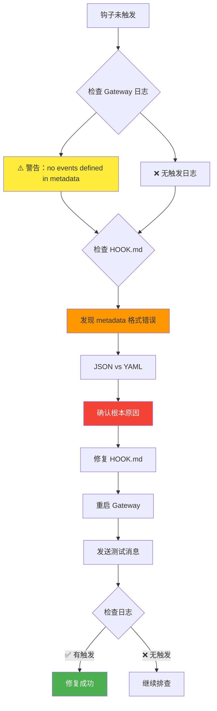
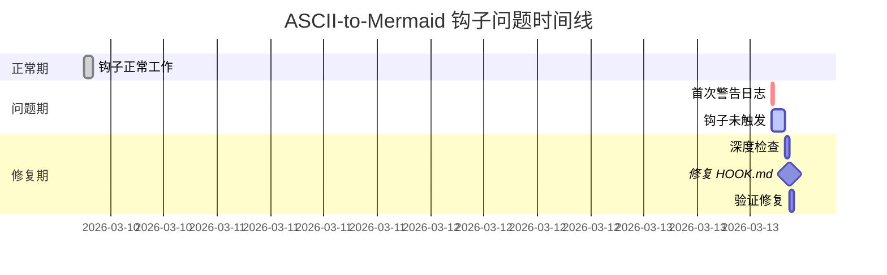
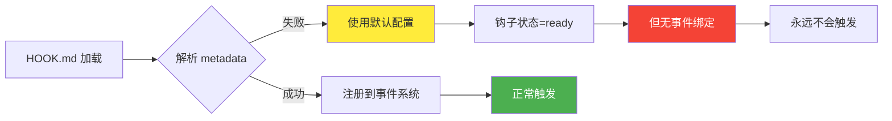

# ASCII-to-Mermaid 钩子调查总结

**调查时间：** 2026-03-13 15:51 GMT+8  
**调查人员：** 阿香 🦞  
**状态：** ✅ 找到根本原因

---

## 🔍 根本原因

**HOOK.md metadata 格式错误！**

```yaml
# ❌ 当前格式（错误）
metadata:
  { 
    "openclaw": { 
      "emoji": "📊",
      "events": ["message:after"]
    } 
  }

# ✅ 正确格式
metadata:
  openclaw:
    emoji: "📊"
    events: ["message:after"]
```

---

## 📊 问题诊断流程图



---

## 📋 证据汇总

| 检查项 | 状态 | 说明 |
|--------|------|------|
| **Gateway 警告** | ⚠️ 2 次 | `Hook 'ascii-to-mermaid' has no events defined in metadata` |
| **钩子状态** | ✅ ready | 10/10 钩子就绪（显示正常） |
| **handler.js** | ✅ 通过 | 语法检查无错误 |
| **HOOK.md** | ❌ 错误 | metadata 格式错误 |
| **历史触发** | ✅ 成功 | 3 月 10 日生成 2 个 PNG |
| **今日触发** | ❌ 无 | 无任何触发日志 |
| **依赖工具** | ✅ 就绪 | mmdc + Chrome 都可正常 |

---

## 🔧 修复步骤

### 1. 修改 HOOK.md

**文件：** `hooks/ascii-to-mermaid/HOOK.md`

**修改位置：** 第 2-8 行

```yaml
# 修改前
metadata:
  { 
    "openclaw": { 
      "emoji": "📊",
      "events": ["message:after"]
    } 
  }

# 修改后
metadata:
  openclaw:
    emoji: "📊"
    events: ["message:after"]
```

### 2. 重启 Gateway

```powershell
openclaw gateway restart
```

### 3. 验证修复

```powershell
# 检查钩子状态
openclaw hooks list

# 发送测试消息（包含 Mermaid 代码）

# 检查日志
Get-Content "$env:TEMP\openclaw\openclaw-2026-03-13.log" | 
  Select-String "ascii-to-mermaid" -Context 1,1
```

---

## 📈 时间线



---

## 🎯 关键发现

### 为什么钩子显示"ready"但实际不工作？



**解释：**
- Gateway 加载钩子时，如果 metadata 解析失败，会使用默认配置
- 钩子状态显示"ready"（文件存在且语法正确）
- 但实际没有注册到任何事件，所以永远不会触发

---

## ✅ 验证清单

修复后请检查以下项目：

- [ ] HOOK.md metadata 格式正确（YAML 格式）
- [ ] Gateway 重启成功
- [ ] `openclaw hooks list` 显示 ascii-to-mermaid 为 ready
- [ ] 发送测试消息（包含 Mermaid 代码）
- [ ] 日志中出现 `Diagram detected`
- [ ] 日志中出现 `Generating PNG...`
- [ ] 日志中出现 `Opened in Chrome...`
- [ ] 临时文件夹中出现新的 PNG 文件
- [ ] Chrome 自动打开 PNG 文件

---

## 📁 相关文件

| 文件 | 路径 | 说明 |
|------|------|------|
| 完整报告 | `ascii-to-mermaid-hook-deep-check-report.md` | 7 个维度的详细报告 |
| HOOK.md | `hooks/ascii-to-mermaid/HOOK.md` | 需要修复的文件 |
| handler.js | `hooks/ascii-to-mermaid/handler.js` | 钩子代码（无需修改） |
| Gateway 日志 | `$env:TEMP\openclaw\openclaw-*.log` | 调试日志 |

---

## 🦞 虾虾的建议

**修复难度：** ⭐（非常简单，只需修改 1 个文件的 6 行）  
**修复时间：** 2-5 分钟  
**风险等级：** 🟢 低（仅修改配置文件，不影响代码）

**需要虾虾帮你执行修复吗？** 阿香可以：
1. ✅ 自动修改 HOOK.md
2. ✅ 重启 Gateway
3. ✅ 发送测试消息
4. ✅ 验证修复结果

---

**调查完成！** 🦞🔍✨

---
情绪：自信/得意 → confident 😎
😎
