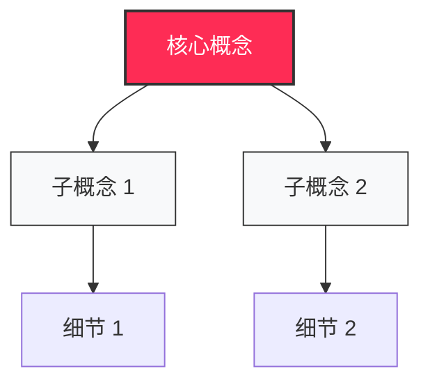

# ATOM-VISUAL-006 - 生成 Mermaid 图表

> 版本：V1.0  
> 状态：🟡 待规范  
> 最后更新：2026-03-07

---

## 📋 动作定义

**名称：** 生成 Mermaid 图表  
**分类：** 呈现层（Visual Layer）  
**编号：** ATOM-VISUAL-006

**一句话描述：** 根据知识关系生成 Mermaid 代码，用于知识架构图

---

## 🎯 输入输出

### 输入
- **类型：** 文本
- **内容：** 知识点关系描述
- **格式：** 自然语言或结构化描述

### 输出
- **类型：** 文本
- **内容：** Mermaid 代码
- **格式：** Mermaid 语法

---

## ⚙️ 偏好设置

### 图表类型
- **架构图：** `graph TD`（从上到下）
- **流程图：** `flowchart LR`（从左到右）
- **思维导图：** `mindmap`

### 配色标准
- **核心节点：** 小红书红 (#FE2C55) + 白字
- **普通节点：** 浅灰 (#F8F9FA) + 黑字
- **成功节点：** 绿色 (#52C41A)
- **警告节点：** 橙色 (#FAAD14)
- **风险节点：** 红色 (#FF4D4F)

### 样式规范
- **专业绘制：** 不用手绘风格
- **清晰简洁：** 节点不拥挤
- **层次分明：** 父子关系清晰

---

## 📝 操作步骤



---

## 🔄 使用场景

### 场景 1：知识架构图
```
触发：生成专家点评 HTML
  ↓
调用：ATOM-VISUAL-006
  ↓
输出：Mermaid 代码
  ↓
嵌入：HTML 文件
```

---

_模块化定义 | 可独立调用 | 2026-03-07_
