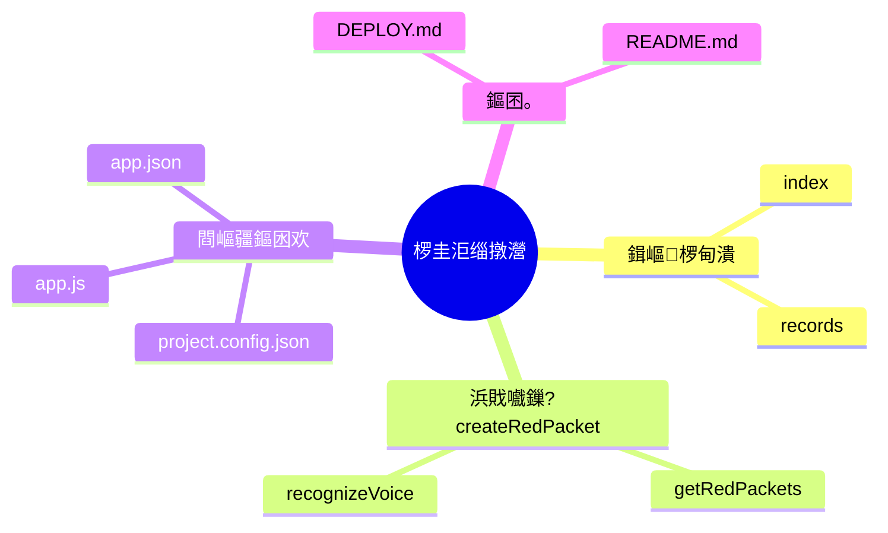
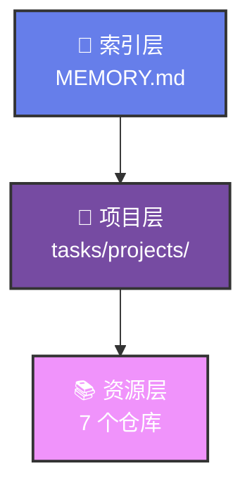

# HTML Expert Review Generator - HTML 涓撳鐐硅瘎鐢熸垚

## 鎶€鑳芥弿杩?
浠庤眴鍖呬細璇濈敓鎴愪笓瀹剁骇鐐硅瘎 HTML 缃戦〉锛屽寘鍚煡璇嗘灦鏋勫浘銆佹繁搴︽礊瀵熴€佸姣斿垎鏋愩€佽鍔ㄥ缓璁紝閲囩敤绉戝鏉傚織鎺掔増 + 灏忕孩涔﹁瑙夐鏍笺€?
**鈿狅笍 閲嶈锛氭墍鏈?HTML 杈撳嚭蹇呴』閬靛畧銆奌TML-STANDARD.md銆嬫爣鍑嗭紒**

**鏍囧噯鏂囨。锛?* `skills/html-expert-review/HTML-STANDARD.md`

## 瑙﹀彂鏉′欢

- **鑷姩瑙﹀彂**锛氳眴鍖呬細璇濆鐞嗘祦绋嬩腑锛堢 3 姝ワ級
- **鎵嬪姩瑙﹀彂**锛氱敤鎴疯"鐢熸垚涓撳鐐硅瘎"銆?鍒涘缓 HTML 鎶ュ憡"

## 鏍稿績鑳藉姏

1. **鍐呭鍒嗘瀽** - 瑙ｆ瀽璞嗗寘浼氳瘽锛屾彁鍙栨牳蹇冪煡璇嗙偣
2. **涓撳瑙嗚** - Critical Thinking锛屾寚鍑虹己澶卞拰闂
3. **鏋舵瀯缁樺埗** - Mermaid 鐭ヨ瘑鏋舵瀯鍥?4. **HTML 鐢熸垚** - 绉戝鏉傚織鎺掔増 + 灏忕孩涔﹀浘鏍?5. **鎬濈淮瀵煎浘** - 鍙戞暎寮忔墜缁橀鏍硷紙鏂囦欢澶圭骇鍒紝鑷姩鐢熸垚锛?6. **Chrome 鎵撳紑** - 鑷姩鐢?Chrome 鎵撳紑 HTML 棰勮
7. **鎬荤粨鎶ュ憡** - 椤圭洰浠?0 鍒?1 寮€鍙戝巻绋嬶紙鏃堕棿绾?+ 鎴愭灉缁熻锛?8. **鍙紪杈?Mermaid** - 鐢熸垚 Mermaid Live Editor 閾炬帴锛岄檮鍒?worklog锛堟柟渚块噸鏂扮紪杈戯級
9. **馃啎 HTML 杞?PDF** - 鑷姩杞崲涓?A4 PDF锛屼繚鐣欒儗鏅壊
10. **馃啎 鍙戦€侀涔?* - PDF 鍙戦€佸埌椋炰功锛屾柟渚挎墜鏈烘煡鐪?11. **馃啎 涓夌嚎鍚屾** - MD 鏂囦欢 + TXT 璁板綍 + 椋炰功閫氱煡鍚屾鎵ц

## 鎴愬姛妗堜緥锛?026-03-06锛?
### 鎰熺煡涓庤鍔ㄤ腑蹇冧笓瀹剁偣璇?
**杈撳叆锛?* 璞嗗寘浼氳瘽锛堥」鐩珛椤规姤鍛婂垎鏋愶級
**杈撳嚭锛?* `expert-review-2026-03-06-xiaomi-auto.html` (14846 bytes)

**鐢熸垚鍐呭锛?*
1. 鉁?涓撳璇勫垎锛堝畬鏁存€?85%/姝ｇ‘鎬?90%/缂哄け椤?15%锛?2. 鉁?鏍稿績瑙傜偣锛堢粨璁哄厛琛岋級
3. 鉁?娣卞害娲炲療锛? 涓ぇ瑙傜偣锛岄噾瀛楀灞曞紑锛?4. 鉁?鐭ヨ瘑鏋舵瀯锛圡ermaid 鍥捐〃锛?5. 鉁?瀵规瘮鍒嗘瀽锛堣〃鏍硷級
6. 鉁?琛屽姩寤鸿锛堝彲钀藉湴锛?
**瑙嗚椋庢牸锛?*
- 鐧借壊鑳屾櫙銆佸井杞泤榛?- Nature 鎺掔増 + 灏忕孩涔﹀浘鏍?- 鍙屾爮甯冨眬 + 渚ц竟鏍忓鑸?
---

### BOM 鐗╂枡绠＄悊涓撳鐐硅瘎

**杈撳叆锛?* 璞嗗寘浼氳瘽锛堜竷绉嶉浂浠剁被鍨嬭瑙ｏ級
**杈撳嚭锛?* `bom-expert-review.html`

**鐢熸垚鍐呭锛?*
1. 鉁?闆朵欢绫诲瀷瀵规瘮琛紙B/HC/V/C/D/S/M锛?2. 鉁?鏍稿績鍏紡锛堟瘺闇€姹?= B + HC + V锛?3. 鉁?鐗╂潈褰掑睘璇存槑
4. 鉁?鍏抽敭鍖哄埆锛圕 vs V, C vs D, D vs S锛?5. 鉁?涓氬姟閫昏緫鍥?
**鐗硅壊锛?*
- 琛ㄦ牸娓呮櫚瀵规瘮 7 绉嶇被鍨?- 鍏紡楂樹寒鏄剧ず
- 涓氬姟閫昏緫 Mermaid 鍥?
---

## HTML 缁撴瀯鏍囧噯

### 瀹屾暣缁撴瀯

```html
<!DOCTYPE html>
<html>
<head>
    <meta charset="UTF-8">
    <title>涓撳鐐硅瘎 - 涓婚</title>
    <script src="mermaid.min.js"></script>
    <style>
        /* 绉戝鏉傚織椋庢牸 CSS */
        body { font-family: 'Microsoft YaHei'; background: #fff; }
        .header { border-bottom: 2px solid #000; }
        .section { margin: 20px 0; }
        .icon { margin-right: 8px; }
    </style>
</head>
<body>
    <div class="header">
        <h1>馃幆 涓撳鐐硅瘎 - 涓婚</h1>
        <p>鐢熸垚鏃堕棿锛?026-03-07</p>
    </div>
    
    <div class="section">
        <h2>猸?涓撳璇勫垎</h2>
        <!-- 璇勫垎鍐呭 -->
    </div>
    
    <div class="section">
        <h2>馃挕 鏍稿績瑙傜偣</h2>
        <!-- 缁撹鍏堣 -->
    </div>
```

### 鎬濈淮瀵煎浘鏍囧噯锛堝彂鏁ｅ紡鎵嬬粯椋庢牸锛?
**鐢ㄦ埛绾﹀畾锛?026-03-08锛夛細** 鎬濈淮瀵煎浘鍙睍绀哄埌鏂囦欢澶圭骇鍒紝涓嶅睍绀?html 鏂囦欢鍚?
**椋庢牸瑕佹眰锛?*
- 鉁?鍙戞暎寮忓竷灞€锛堜腑蹇冧富棰?鈫?鍒嗘敮灞曞紑锛?- 鉁?鎵嬬粯椋庢牸锛堟き鍦嗚妭鐐?+ 鏇茬嚎杩炴帴锛?- 鉁?寰蒋闆呴粦瀛椾綋
- 鉁?鍙樉绀烘枃浠跺す锛屼笉鏄剧ず.html 鏂囦欢

**Mermaid 浠ｇ爜绀轰緥锛?*


**鑷姩鐢熸垚娴佺▼锛?*
1. 瑙ｆ瀽椤圭洰鏂囦欢澶圭粨鏋?2. 鎻愬彇鏂囦欢澶瑰悕绉帮紙蹇界暐.html 鏂囦欢锛?3. 鐢熸垚 Mermaid mindmap 浠ｇ爜
4. 宓屽叆鍒?HTML 涓?5. 淇濆瓨涓虹嫭绔嬫枃浠讹細`mindmap-folders-only.html`

**淇濆瓨浣嶇疆锛?* `html-expert-reviews/mindmap-folders-only.html`

**V8.0 鐗堟湰锛?* 鏂囦欢澶圭骇鍒€濈淮瀵煎浘锛堟渶缁堢増锛?    
    <div class="section">
        <h2>馃攳 娣卞害娲炲療</h2>
        <!-- 鈮? 涓ぇ瑙傜偣 -->
    </div>
    
    <div class="section">
        <h2>馃搳 鐭ヨ瘑鏋舵瀯</h2>
        <!-- Mermaid 鍥捐〃 -->
    </div>
    
    <div class="section">
        <h2>馃搵 瀵规瘮鍒嗘瀽</h2>
        <!-- 瀵规瘮琛ㄦ牸 -->
    </div>
    
    <div class="section">
        <h2>馃幆 琛屽姩寤鸿</h2>
        <!-- 鍙惤鍦板缓璁?-->
    </div>
</body>
</html>
```

---

## 琛屾枃缁撴瀯鏍囧噯

### 閲戝瓧濉斿師鐞?+ Critical Thinking

**寮€澶撮儴鍒嗭紙蹇呴€夛級锛?*

1. **涓撳璇勫垎**
   - 瀹屾暣鎬ц瘎鍒嗭紙%锛?   - 姝ｇ‘鎬ц瘎鍒嗭紙%锛?   - 缂哄け椤瑰垎鏋?
2. **鏍稿績瑙傜偣**
   - 缁撹鍏堣
   - 浣撶幇涓诲姩鎬濊€?   - Critical Thinking

**涓棿閮ㄥ垎锛堥噾瀛楀缁撴瀯锛夛細**

- 鍒嗗嚑涓眰娆★紙鈮? 涓ぇ瑙傜偣锛?- 澶ц鐐?鈫?灏忚鐐?鈫?璁烘嵁
- 璁烘嵁涓嶉噸涓嶆紡锛圡ECE 娉曞垯锛?- 閬靛畧绗竴鎬у師鐞?
**琛ㄨ堪瑕佹眰锛?*
- 浠ヤ笟鍔′环鍊间负瀵煎悜
- 鍏堝洖绛旓細浠峰€兼槸浠€涔堬紵
- 鍐嶅洖绛旓細濡備綍瀹炵幇锛?
**缁撳熬閮ㄥ垎锛?*
- 鎬荤粨鏍稿績娲炲療
- 琛屽姩寤鸿锛堝彲閫夛級
- 涓嬩竴姝ュ涔犳柟鍚戯紙鍙€夛級

---

## 瑙嗚璁捐鏍囧噯

### 绉戝鏉傚織 + 灏忕孩涔﹁瑙?
**閰嶈壊鏂规锛?*
```css
:root {
    --primary-color: #000;      /* 涓绘爣棰橀粦鑹?*/
    --secondary-color: #666;    /* 娆＄骇鏂囧瓧鐏拌壊 */
    --accent-color: #FE2C55;    /* 灏忕孩涔︾孩 */
    --bg-color: #FFFFFF;        /* 鐧借壊鑳屾櫙 */
    --section-bg: #F8F9FA;      /* 绔犺妭鑳屾櫙 */
}
```

**瀛椾綋瑙勮寖锛?*
```css
body {
    font-family: 'Microsoft YaHei', sans-serif;
    font-size: 14px;
    line-height: 1.6;
    color: #333;
}

h1 { font-size: 24px; font-weight: bold; }
h2 { font-size: 18px; font-weight: bold; border-left: 4px solid var(--accent-color); padding-left: 10px; }
h3 { font-size: 16px; font-weight: bold; }
```

**鍥炬爣浣跨敤锛?*
- 猸?涓撳璇勫垎
- 馃挕 鏍稿績瑙傜偣
- 馃攳 娣卞害娲炲療
- 馃搳 鐭ヨ瘑鏋舵瀯
- 馃搵 瀵规瘮鍒嗘瀽
- 馃幆 琛屽姩寤鸿

---

## 宸ヤ綔娴佺▼

### 瀹屾暣娴佺▼锛堜笁绾垮悓姝ワ級

```
1. 璇诲彇璞嗗寘浼氳瘽 - doubao-sessions/*.md
2. 鎻愬彇鏍稿績鐭ヨ瘑 - 璇嗗埆鍏抽敭姒傚康銆佸叧绯?3. 涓撳瑙嗚鍒嗘瀽 - Critical Thinking
4. 鐢熸垚璇勫垎 - 瀹屾暣鎬?姝ｇ‘鎬?缂哄け椤?5. 鏋勫缓閲戝瓧濉?- 鈮? 涓ぇ瑙傜偣
6. 缁樺埗 Mermaid 鍥?- 鐭ヨ瘑鏋舵瀯
7. 鐢熸垚 HTML - 绉戝鏉傚織鎺掔増
8. 淇濆瓨鏂囦欢 - expert-review-鏃ユ湡 - 涓婚.html
9. 鐢熸垚鎬濈淮瀵煎浘 - mindmap-folders-only.html锛堝彂鏁ｅ紡鎵嬬粯椋庢牸锛?10. Chrome 鑷姩鎵撳紑 - HTML + 鎬濈淮瀵煎浘锛堢數鑴戠锛?11. HTML 杞?PDF - 浣跨敤 Playwright 杞崲涓?A4 PDF
12. 椋炰功鍙戦€?- PDF 鏂囦欢 + 鏂囧瓧鎬荤粨锛堥涔︾锛?13. 涓夌嚎鍚屾 - MD 鏂囦欢 + TXT 璁板綍 + 椋炰功閫氱煡
14. 鉂?**鍙栨秷 TTS 璇煶**锛?026-03-07 17:48 璧凤紝浠呮瘡灏忔椂鎻愰啋浣跨敤锛?```

### 涓夌嚎鍚屾瀹氫箟

**涓夌嚎锛?*
1. **MD 鏂囦欢绾?* - worklog.txt銆乵emory/*.md銆侀」鐩崱鐗?2. **TXT 璁板綍绾?* - atomic-actions 鏃ュ織銆佹墽琛岃褰?3. **椋炰功閫氱煡绾?* - PDF 鏂囦欢 + 鏂囧瓧鎬荤粨 + 鍙紪杈戦摼鎺?
**鍚屾鎵ц锛?*
- 鉁?鍚屾椂鏇存柊涓夋潯绾?- 鉁?淇℃伅涓€鑷达紙鏂囦欢鍚嶃€佸ぇ灏忋€侀摼鎺ワ級
- 鉁?椋炰功鍖呭惈瀹屾暣鎽樿锛堟棤闇€鎵撳紑 HTML锛?- 鉁?鐢佃剳绔彲棰勮 HTML锛屾墜鏈虹鍙煡鐪?PDF

**绀轰緥娴佺▼锛?*
```
鐢熸垚 HTML 鈫?Chrome 鎵撳紑锛堢數鑴戠锛夆渽
   鈫?杞?PDF 鈫?鍙戦€侀涔︼紙椋炰功绔級鉁?   鈫?璁板綍 worklog 鈫?鏇存柊 memory 鈫?闄勫姞 Mermaid 閾炬帴锛堜笁绾垮悓姝ワ級鉁?```

### Mermaid 鍥捐〃缁樺埗

**鏋舵瀯鍥剧ず渚嬶細**
```mermaid
graph TD
    A[鎰熺煡涓庤鍔ㄤ腑蹇僝 --> B[椋庨櫓棰勮]
    A --> C[宸ュ崟闂幆]
    A --> D[椤圭洰缁忕悊]
    
    B --> B1[绾㈣壊<60%]
    B --> B2[榛勮壊 60-80%]
    B --> B3[缁胯壊鈮?0%]
    
    C --> C1[鍒涘缓]
    C --> C2[娲惧彂]
    C --> C3[鎵ц]
    C --> C4[楠屾敹]
    C --> C5[鍏抽棴]
```

**瀵规瘮鍥剧ず渚嬶細**
```mermaid
graph LR
    A[B 澶栬喘浠禲 --> E[姣涢渶姹俔
    F[HC 濮斿鎬绘垚] --> E
    G[V 鍙岀粡閿€] --> E
    
    H[C 濮斿鏁ｄ欢] -.->|涓嶇畻 | E
    I[D DB 浠禲 -.->|涓嶇畻 | E
    J[S 鏁ｄ欢] -.->|涓嶇畻 | E
```

---

## 鎶€鏈疄鐜?
### HTML 鐢熸垚鑴氭湰锛圥owerShell锛?
```powershell
param(
    [string]$SessionFile,
    [string]$OutputPath
)

# 璇诲彇璞嗗寘浼氳瘽
$content = Get-Content $sessionFile -Raw -Encoding UTF8

# 鍒嗘瀽鍐呭锛屾彁鍙栫煡璇嗙偣
$knowledgePoints = Extract-Knowledge $content

# 鐢熸垚涓撳璇勫垎
$rating = @{
    Completeness = 85
    Correctness = 90
    Missing = 15
}

# 鐢熸垚 HTML
$html = @"
<!DOCTYPE html>
<html>
<head>
    <meta charset="UTF-8">
    <title>涓撳鐐硅瘎 - 涓婚</title>
    <script src="https://cdn.jsdelivr.net/npm/mermaid/dist/mermaid.min.js"></script>
    <style>
        /* CSS 鏍峰紡 */
    </style>
</head>
<body>
    <div class="header">
        <h1>馃幆 涓撳鐐硅瘎 - 涓婚</h1>
    </div>
    
    <div class="section">
        <h2>猸?涓撳璇勫垎</h2>
        <p>瀹屾暣鎬э細$($rating.Completeness)%</p>
        <p>姝ｇ‘鎬э細$($rating.Correctness)%</p>
        <p>缂哄け椤癸細$($rating.Missing)%</p>
    </div>
    
    <!-- 鍏朵粬绔犺妭 -->
</body>
</html>
"@

$html | Set-Content $outputPath -Encoding UTF8
Write-Host "鉁?HTML 宸茬敓鎴愶細$outputPath"

# Chrome 鑷姩鎵撳紑
Start-Process "chrome.exe" -ArgumentList $outputPath
```

### Chrome 鑷姩鎵撳紑

```powershell
# 鐢?Chrome 鎵撳紑 HTML
$htmlPath = "C:\Users\Xiabi\.openclaw\workspace\expert-review-2026-03-06.html"
Start-Process "chrome.exe" -ArgumentList $htmlPath

# 鎴栦娇鐢ㄩ粯璁ゆ祻瑙堝櫒
Start-Process $htmlPath
```

### HTML 杞?PDF锛堟柊澧烇級

```powershell
# 浣跨敤 Playwright 杞崲
$scriptPath = "C:\Users\Xiabi\.openclaw\workspace\scripts\html-to-pdf-quick.js"
$htmlFile = "expert-review-2026-03-09-qwen-wanx-comic-gen.html"
$pdfFile = $htmlFile.Replace('.html', '.pdf')

node $scriptPath $htmlFile

# 杈撳嚭锛歁EDIA: C:\path\to\file.pdf
```

**鍙傛暟锛?*
- `format: 'A4'` - A4 鏍煎紡
- `printBackground: true` - 淇濈暀鑳屾櫙鑹?- `margin: { top: '10mm', ... }` - 椤佃竟璺?
### 鍙戦€侀涔︼紙鏂板锛?
```powershell
# 鍙戦€?PDF 鍒伴涔?$message = message --action send --channel feishu --filePath $pdfFile --message "HTML 杞?PDF 瀹屾垚锛?

# 鍚屾椂鍙戦€佹枃瀛楁€荤粨
$summary = @"
## 馃搳 涓撳鐐硅瘎 HTML 宸茬敓鎴?
**鏃堕棿锛?* 2026-03-09 09:20
**涓婚锛?* 閫氫箟涓囩浉婕敾鐢熸垚鍣?
**鏂囦欢淇℃伅锛?*
- 鏂囦欢鍚嶏細expert-review-2026-03-09-qwen-wanx-comic-gen.html
- 澶у皬锛?9 KB
- 绔犺妭锛? 涓紙璇勫垎/瑙傜偣/娲炲療/鏋舵瀯/瀵规瘮/寤鸿锛?
**宸叉墦寮€锛?* 鉁?Chrome 宸叉墦寮€棰勮
**宸插彂閫侊細** 鉁?PDF 宸插彂閫佸埌椋炰功

[鏌ョ湅 HTML](file://expert-review-2026-03-09-qwen-wanx-comic-gen.html)
"@

message --action send --channel feishu --message $summary
```

### 鎬濈淮瀵煎浘鐢熸垚锛圥owerShell锛?
```powershell
# 鐢熸垚鍙戞暎寮忔墜缁橀鏍兼€濈淮瀵煎浘锛堟枃浠跺す绾у埆锛?$mindmapPath = "C:\Users\Xiabi\.openclaw\workspace\html-expert-reviews\mindmap-folders-only.html"

$htmlContent = @"
<!DOCTYPE html>
<html>
<head>
    <meta charset="UTF-8">
    <title>HTML 涓撳鐐硅瘎椤圭洰鐭ヨ瘑搴?- 鎬濈淮瀵煎浘</title>
    <script src="https://cdn.jsdelivr.net/npm/mermaid@10/dist/mermaid.min.js"></script>
    <style>
        body { font-family: 'Microsoft YaHei'; background: linear-gradient(135deg, #fef9f3, #f8f4e8); }
        .mermaid { background: #fff; padding: 80px; }
    </style>
</head>
<body>
    <div class="mermaid">
mindmap
  root((馃搳 HTML 涓撳鐐硅瘎<br/>椤圭洰鐭ヨ瘑搴?)
    
    馃搧 html-expert-reviews
      13 涓?HTML 鏂囦欢
      ~220KB
      README.md 绱㈠紩
    
    馃搧 tasks/projects
      璞嗗寘浼氳瘽鑷姩鍖?md
      鍦扮悊鐭ヨ瘑搴?md
      鍛ㄦ姤绯荤粺.md
      浠诲姟绠＄悊.md
      鏁版嵁娌荤悊.md
    
    馃搧 memory
      2026-03-08.md
      triple-line-sync-log.md
    
    馃搧 skills
      README.md
      html-expert-review/SKILL.md
    </div>
    <script>
        mermaid.initialize({ 
            startOnLoad: true,
            theme: 'base',
            mindmap: { useMaxWidth: true, padding: 60 }
        });
    </script>
</body>
</html>
"@

$htmlContent | Set-Content $mindmapPath -Encoding UTF8
Write-Host "鉁?鎬濈淮瀵煎浘宸茬敓鎴愶細$mindmapPath"

# Chrome 鎵撳紑鎬濈淮瀵煎浘
Start-Process "chrome.exe" -ArgumentList $mindmapPath
```

---

## 杈撳嚭鏍煎紡

### 鏂囦欢鍚嶈鑼?
**鏍煎紡锛?* `expert-review-YYYY-MM-DD-涓婚.html`

**绀轰緥锛?*
```
expert-review-2026-03-06-xiaomi-auto.html
expert-review-2026-03-06-bom.html
expert-review-2026-03-07-weekly-report.html
```

### 椋炰功閫氱煡锛堢敓鎴愬畬鎴?+ PDF锛?
```markdown
## 馃搳 涓撳鐐硅瘎 HTML 宸茬敓鎴?
**鏃堕棿锛?* 2026-03-09 09:20
**涓婚锛?* 閫氫箟涓囩浉婕敾鐢熸垚鍣?
**鏂囦欢淇℃伅锛?*
- 鏂囦欢鍚嶏細expert-review-2026-03-09-qwen-wanx-comic-gen.html
- 澶у皬锛?9 KB
- 绔犺妭锛? 涓紙璇勫垎/瑙傜偣/娲炲療/鏋舵瀯/瀵规瘮/寤鸿锛?
**鏍稿績娲炲療锛?*
1. 閫氫箟涓囩浉 API 閰嶇疆娴佺▼娓呮櫚
2. 鍥戒骇浼樺厛鍘熷垯钀藉湴
3. 鎴愭湰鎺у埗鏂规鍙

**宸叉墦寮€锛?* 鉁?Chrome 宸叉墦寮€棰勮锛堢數鑴戠锛?**宸插彂閫侊細** 鉁?PDF 宸插彂閫佸埌椋炰功锛堟墜鏈虹锛?
**涓夌嚎鍚屾锛?*
- 鉁?MD 鏂囦欢锛歸orklog.txt 宸茶褰?- 鉁?TXT 璁板綍锛歛tomic-actions 宸叉洿鏂?- 鉁?椋炰功閫氱煡锛歅DF+ 鏂囧瓧鎬荤粨宸插彂閫?
[鏌ョ湅 HTML](file://expert-review-2026-03-09-qwen-wanx-comic-gen.html)
[缂栬緫 Mermaid](https://mermaid.live/edit#pako:...)
```

---

## 鐢ㄦ埛鍋忓ソ

### HTML 椋庢牸
- 鉁?**绉戝鏉傚織椋?* - Nature 鎺掔増 + 灏忕孩涔﹀浘鏍?- 鉁?**閲戝瓧濉旂粨鏋?* - 缁撹鍏堣锛屸墺3 涓ぇ瑙傜偣
- 鉁?**Mermaid 鍥捐〃** - 涓撲笟缁樺埗锛屼笉瑕佹墜缁?- 鉁?**Critical Thinking** - 涓诲姩鎬濊€冿紝鎸囧嚭缂哄け
- 鉁?**Chrome 鑷姩鎵撳紑** - 鐢熸垚鍚庣珛鍗抽瑙?- 鉂?**TTS 璇煶** - 宸插彇娑堬紙2026-03-07 17:48 璧凤紝浠呮瘡灏忔椂鎻愰啋浣跨敤锛?
### 鎬濈淮瀵煎浘椋庢牸锛?026-03-08 12:44 绾﹀畾锛?- 鉁?**鍙戞暎寮忓竷灞€** - 鏍硅妭鐐瑰湪涓棿锛屽洓闈㈠叓鏂瑰睍寮€
- 鉁?**鎵嬬粯椋庢牸** - 妞渾鑺傜偣 + 鏇茬嚎杩炴帴
- 鉁?**鏂囦欢澶圭骇鍒?* - 鍙睍绀哄埌鏂囦欢澶癸紝涓嶅睍绀?html 鏂囦欢鍚?- 鉁?**鏄剧ず缁熻** - 濡?13 涓?HTML 鏂囦欢"銆?~220KB"
- 鉁?**寰蒋闆呴粦** - 瀛椾綋缁熶竴鐢?Microsoft YaHei
- 鉁?**鑷姩鐢熸垚** - 姣忔 HTML 鐢熸垚鍚庤嚜鍔ㄥ垱寤烘€濈淮瀵煎浘
- 鉁?**淇濆瓨浣嶇疆** - html-expert-reviews/mindmap-folders-only.html

---

## 绀轰緥鐢ㄦ硶

**鍦烘櫙 1锛氳眴鍖呬細璇濆悗锛堜笁绾垮悓姝ワ級**
```
鐢ㄦ埛锛?璞嗗寘 [浼氳璁板綍...]"
AI:
1. 淇濆瓨 鈫?doubao-sessions/
2. 鏇存柊 鈫?worklog.txt
3. 鐢熸垚 鈫?expert-review-*.html
4. 鎵撳紑 鈫?Chrome 棰勮锛堢數鑴戠锛夆渽
5. 杞?PDF 鈫?Playwright 杞崲
6. 鍙戦€?鈫?椋炰功锛圥DF+ 鏂囧瓧鎬荤粨锛夛紙椋炰功绔級鉁?7. 涓夌嚎鍚屾 鈫?MD+TXT+ 椋炰功閫氱煡 鉁?```

**鍦烘櫙 2锛氭墜鍔ㄧ敓鎴?*
```
鐢ㄦ埛锛?鐢熸垚涓撳鐐硅瘎"
AI:
1. 璇诲彇鏈€杩戣眴鍖呬細璇?2. 鍒嗘瀽鍐呭
3. 鐢熸垚 HTML
4. Chrome 鎵撳紑
5. HTML 杞?PDF
6. 鍙戦€侀涔?```

**鍦烘櫙 3锛氭煡鐪嬪巻鍙?*
```
鐢ㄦ埛锛?鏌ョ湅涓婃鐨勪笓瀹剁偣璇?
AI:
1. 鍒楀嚭 expert-review-*.html
2. 鎵撳紑鎸囧畾鏂囦欢
```

**鍦烘櫙 4锛氭墜鏈烘煡鐪?*
```
鐢ㄦ埛锛?鍦ㄦ墜鏈轰笂鏌ョ湅涓撳鐐硅瘎"
AI:
1. 鎵惧埌瀵瑰簲 HTML 鏂囦欢
2. 杞?PDF
3. 鍙戦€侀涔?```

---

## 涓庤眴鍖呬細璇濆綊妗?Skill 鐨勫崗浣?
**娴佺▼锛?*
```
璞嗗寘浼氳瘽褰掓。 鈫?淇濆瓨鍘熷鍐呭
  鈫?HTML 涓撳鐐硅瘎 鈫?璇诲彇褰掓。鍐呭
  鈫?鐢熸垚 HTML 鎶ュ憡
  鈫?鎬濈淮瀵煎浘鐢熸垚 鈫?鎻愬彇椤圭洰缁撴瀯
  鈫?淇濆瓨 mindmap-folders-only.html
```

**鏁版嵁娴侊細**
- doubao-sessions/*.md 鈫?HTML 鐢熸垚 鈫?expert-review-*.html
- 椤圭洰鏂囦欢澶?鈫?鎬濈淮瀵煎浘 鈫?mindmap-folders-only.html

---

## 鎬荤粨鎶ュ憡鐢熸垚锛堟柊澧烇級

**瑙﹀彂鏉′欢锛?* 鐢ㄦ埛璇?鐢熸垚鎬荤粨鎶ュ憡"銆?鍥為【寮€鍙戝巻绋?銆?浠?0 鍒?1 鎬荤粨"

**鎶ュ憡鍐呭锛?*
1. **椤圭洰姒傝堪** - 鎰挎櫙 + 鏍稿績缁熻锛堝紑鍙戝懆鏈?鎴愭湰/鏂囦欢鏁?鍔熻兘鏁帮級
2. **寮€鍙戝巻绋嬫椂闂寸嚎** - 鍏抽敭鑺傜偣锛堝惎鍔ㄢ啋缁撴瀯鍒涘缓鈫扢VP 瀹屾垚鈫掓祴璇曞彿閰嶇疆鈫掕皟璇曗啋鎴愬姛锛?3. **韪╄繃鐨勫潙涓庤В鍐虫柟妗?* - 缁忓吀闂 + 瑙ｅ喅鏂规 + 鏁欒
4. **鎶€鏈灦鏋?* - 涓夊眰鏋舵瀯鍥撅紙UI 灞?鈫?閫昏緫灞?鈫?鏁版嵁灞傦級
5. **鍏抽敭浠ｇ爜鐗囨** - 鏍稿績鍔熻兘浠ｇ爜锛堝惈娉ㄩ噴锛?6. **鎴愭灉缁熻** - 鏂囦欢鏁?浠ｇ爜琛屾暟/韪╁潙鏁?寮€鍙戝懆鏈?7. **缁忛獙鎬荤粨涓庢劅鎮?* - 鏍稿績娲炲療 + 寮€鍙戝彛璇€
8. **涓嬩竴姝ヨ鍒?* - 鍒嗛樁娈佃鍒掞紙鐣岄潰鈫掗獙璇佲啋閮ㄧ讲鈫掕繍钀ワ級

**瑙嗚椋庢牸锛?*
- 鏃堕棿绾匡細宸︿晶绔栫嚎 + 鍦嗙偣鏍囪
- 缁熻鍗＄墖锛? 鍒楃綉鏍?+ 澶ф暟瀛?- 浠ｇ爜鍧楋細娣辫壊鑳屾櫙 + 璇硶楂樹寒
- 鏂囦欢缁撴瀯锛氭爲褰㈠睍绀?+ 棰滆壊鍖哄垎锛堟枃浠跺す/鏂囦欢/娉ㄩ噴锛?
**鎴愬姛妗堜緥锛?026-03-08锛夛細**
- `expert-review-2026-03-08-voice-redpacket-journey.html`锛?8KB锛?- 鍖呭惈 8 涓珷鑺?+ 鏃堕棿绾?+ 缁熻鍗＄墖 + 浠ｇ爜鐗囨

**涓庝笓瀹剁偣璇勭殑鍖哄埆锛?*
- **鎬荤粨鎶ュ憡**锛氬洖椤惧巻绋嬶紝璁插彂灞曟晠浜嬶紙鏃堕棿绾?+ 鎴愭灉 + 鎰熸偀锛?- **涓撳鐐硅瘎**锛氱煡璇嗗垎鏋愶紝鍋氫笓涓氳瘎浠凤紙璇勫垎 + 娲炲療 + 鏋舵瀯 + 寤鸿锛?
---

## 娉ㄦ剰浜嬮」

### 鈿狅笍 閲嶈缁忛獙鏁欒锛?026-03-08 15:33 鏇存柊锛?
**闂 1锛氫腑鏂囨枃浠跺悕瀵艰嚧 Chrome 鏃犳硶璁块棶锛?026-03-08 12:58锛?*
- **鐜拌薄锛?* Chrome 鏄剧ず ERR_FILE_NOT_FOUND
- **鍘熷洜锛?* PowerShell 缂栫爜涓嶄竴鑷?+ Chrome 鏃犳硶瑙ｆ瀽 URL 缂栫爜鐨勪腑鏂囪矾寰?- **瑙ｅ喅锛?* 浣跨敤鑻辨枃鏂囦欢鍚嶏紙濡?knowledge-architecture.html锛夛紝鍐呭淇濇寔 UTF-8 涓枃
- **鏁欒锛?* 鏂囦欢鍚嶇敤鑻辨枃锛屽唴瀹圭敤涓枃

**闂 2锛氱敤 write 宸ュ叿鍐欏叆 Markdown 婧愮爜鍒?html 鏂囦欢锛?026-03-08 15:27锛?*
- **鐜拌薄锛?* Chrome 鎵撳紑鍚庢樉绀?Markdown 婧愮爜锛? 鏍囬锛夛紝涓嶆槸娓叉煋鍚庣殑 HTML 椤甸潰
- **閿欒鎿嶄綔锛?* 鐢?write 宸ュ叿鐩存帴鍐欏叆 Markdown 鍐呭锛屼絾鏂囦欢鎵╁睍鍚嶆槸.html
- **姝ｇ‘鍋氭硶锛?*
  1. 鉁?蹇呴』鐢熸垚瀹屾暣 HTML 缁撴瀯锛坄<!DOCTYPE html><html><head><body></body></html>`锛?  2. 鉁?鍖呭惈 Mermaid JS 寮曠敤锛坄<script src="https://cdn.jsdelivr.net/npm/mermaid/dist/mermaid.min.js"></script>`锛?  3. 鉁?鍖呭惈 CSS 鏍峰紡锛坄<style>...</style>`锛?  4. 鉁?浣跨敤 html-expert-review 鎶€鑳界敓鎴愶紝涓嶈鎵嬪姩鐢?write 宸ュ叿
- **鍏抽敭鍔ㄤ綔锛?*
  - 鉂?**绂佹锛?* 鐢?write 宸ュ叿鐩存帴鍐?Markdown 鍐呭鍒?html 鏂囦欢
  - 鉁?**蹇呴』锛?* 璋冪敤 html-expert-review 鎶€鑳界敓鎴愬畬鏁?HTML 缁撴瀯
  - 鉁?**楠岃瘉锛?* 鐢熸垚鍚庢鏌ユ枃浠舵槸鍚﹀寘鍚玚<!DOCTYPE html>`鏍囩
- **鏁欒锛?* HTML 鏂囦欢蹇呴』鍖呭惈瀹屾暣 HTML 缁撴瀯锛屼笉鑳藉彧鏄?Markdown 婧愮爜

**鐜拌薄锛?*
- 鍒涘缓鏂囦欢锛歚寰俊杞处鑷姩鍖?mindmap.html`
- PowerShell 鏄剧ず锛歚微转远-mindmap.html`锛堜贡鐮侊級
- Chrome 璁块棶锛歚file:///.../%E5%BE%AE%E4%BF%A1...`锛圲RL 缂栫爜锛?- 缁撴灉锛氣潓 ERR_FILE_NOT_FOUND锛堢┖鐧介〉锛?
**鍘熷洜锛?*
- Windows PowerShell 澶勭悊涓枃璺緞鏃剁紪鐮佷笉涓€鑷?- write 宸ュ叿鍒涘缓鐨勬枃浠跺疄闄呭悕绉颁笌棰勬湡涓嶇
- Chrome 鏃犳硶姝ｇ‘瑙ｆ瀽 URL 缂栫爜鐨勪腑鏂囪矾寰?
**瑙ｅ喅鏂规锛?*
1. 鉁?**浣跨敤鑻辨枃鏂囦欢鍚?* - 閬垮厤浠讳綍涓枃/鐗规畩瀛楃
2. 鉁?**鍐呭鐢?UTF-8 涓枃** - 鏂囦欢鍐呭鍙互鏄腑鏂?3. 鉁?**鍛藉悕瑙勮寖锛?* `涓婚 - 绫诲瀷.html`锛堝锛歚wechat-transfer-mindmap.html`锛?4. 鉁?**楠岃瘉鏂规硶锛?* 鐢?`Get-ChildItem` 妫€鏌ュ疄闄呮枃浠跺悕

**姝ｇ‘绀轰緥锛?*
```powershell
# 鉁?姝ｇ‘锛氳嫳鏂囨枃浠跺悕 + 涓枃鍐呭
write --path "wechat-transfer-mindmap.html" --content "<html>涓枃鍐呭</html>"

# 鉂?閿欒锛氫腑鏂囨枃浠跺悕锛堜細涔辩爜锛?write --path "寰俊杞处 -mindmap.html" --content "..."
```

**楠岃瘉姝ラ锛?*
```powershell
# 1. 妫€鏌ユ枃浠舵槸鍚﹀瓨鍦?Get-ChildItem -Filter "wechat-*.html"

# 2. 鐢?file:// 鍗忚鎵撳紑 Chrome
Start-Process "chrome" -ArgumentList "file:///C:/path/to/wechat-transfer-mindmap.html"
```

---

### 甯歌娉ㄦ剰浜嬮」

1. **缂栫爜鏍煎紡** - UTF-8锛岄伩鍏嶄腑鏂囦贡鐮?2. **Mermaid 鐗堟湰** - 浣跨敤 CDN 鏈€鏂扮増
3. **鍝嶅簲寮忚璁?* - 閫傞厤涓嶅悓灞忓箷
4. **Chrome 璺緞** - 纭 chrome.exe 浣嶇疆
5. **鏂囦欢鍛藉悕** - 浣跨敤鑻辨枃锛岄伩鍏嶄腑鏂囷紙2026-03-08 鏁欒锛?5. **鏂囦欢澶у皬** - 鎺у埗鍦?50KB 浠ュ唴

---

## 鍙傝€冩枃妗?
- 璞嗗寘浼氳瘽褰掓。锛歚skills/doubao-session-archiver/SKILL.md`
- 鎴愬姛妗堜緥锛歚expert-review-2026-03-06-xiaomi-auto.html`
- BOM 妗堜緥锛歚bom-expert-review.html`

---

## 馃椇锔?鍙紪杈?Mermaid 閾炬帴鐢熸垚锛?026-03-08 鏂板锛?
**鐩殑锛?* 鏂逛究鐢ㄦ埛閲嶆柊缂栬緫鏋舵瀯鍥?
**鐢熸垚瑙勫垯锛?*
1. **鎻愬彇 Mermaid 浠ｇ爜** - 浠?HTML 涓彁鍙栨墍鏈?`<pre class="mermaid">` 浠ｇ爜
2. **鐢熸垚 Mermaid Live Editor 閾炬帴** - 浣跨敤 https://mermaid.live/edit
3. **闄勫姞鍒?worklog** - 鍦ㄥ綋澶?worklog 涓坊鍔?Mermaid 閾炬帴

**Mermaid Live Editor 鏍煎紡锛?*
```
https://mermaid.live/edit#pako:{base64 缂栫爜鐨?Mermaid 浠ｇ爜}
```

**worklog 闄勫姞鏍煎紡锛?*
```markdown
### 馃椇锔?Mermaid 鍙紪杈戦摼鎺?- **鐭ヨ瘑鏋舵瀯鍥撅細** https://mermaid.live/edit#pako:...
- **鎬濈淮瀵煎浘锛?* https://mermaid.live/edit#pako:...
- **Gantt 鍥撅細** https://mermaid.live/edit#pako:...
```

**鐢熸垚鑴氭湰绀轰緥锛?*
```powershell
# 鎻愬彇 Mermaid 浠ｇ爜
$htmlContent = Get-Content "expert-review.html" -Raw
$mermaidMatches = [regex]::Matches($htmlContent, '(?s)<pre class="mermaid">(.*?)</pre>')

foreach ($match in $mermaidMatches) {
    $mermaidCode = $match.Groups[1].Value.Trim()
    
    # 鐢熸垚 Live Editor 閾炬帴锛堜娇鐢?pako 鍘嬬缉锛?    # 娉ㄦ剰锛歁ermaid Live Editor 浣跨敤 pako 搴撳帇缂?    # PowerShell 鍙敤 System.IO.Compression 鏇夸唬
    $bytes = [System.Text.Encoding]::UTF8.GetBytes($mermaidCode)
    $ms = New-Object System.IO.MemoryStream
    $deflate = New-Object System.IO.Compression.DeflateStream($ms, [System.IO.Compression.CompressionMode]::Compress)
    $deflate.Write($bytes, 0, $bytes.Length)
    $deflate.Close()
    $base64 = [Convert]::ToBase64String($ms.ToArray())
    $link = "https://mermaid.live/edit#pako:$base64"
    
    # 闄勫姞鍒?worklog
    Add-Content "worklog.txt" "- **Mermaid 鍙紪杈戯細** $link"
    
    # 杈撳嚭鍒版帶鍒跺彴
    Write-Host "Mermaid Link: $link"
}
```

**涓夌嚎鍚屾鎵ц锛?*
1. **MD 鏂囦欢锛?* worklog.txt 涓檮鍔?Mermaid 閾炬帴
2. **TXT 鏂囦欢锛?* atomic-actions 涓褰曢摼鎺?3. **椋炰功娑堟伅锛?* 鍙戦€佹€荤粨鏃跺寘鍚?Mermaid 閾炬帴

**鐢ㄦ埛浠峰€硷細**
- 鉁?鍙殢鏃堕噸鏂扮紪杈戞灦鏋勫浘
- 鉁?鏃犻渶鎵嬪姩澶嶅埗 Mermaid 浠ｇ爜
- 鉁?涓€閿墦寮€ Mermaid Live Editor
- 鉁?淇敼鍚庡彲瀵煎嚭涓烘柊鍥剧墖/浠ｇ爜

---

_鏈€鍚庢洿鏂帮細2026-03-08 13:01 - 娣诲姞涓枃鏂囦欢鍚嶇紪鐮佹暀璁紙浣跨敤鑻辨枃鏂囦欢鍚嶏級_
_鏈€鍚庢洿鏂帮細2026-03-08 21:25 - 娣诲姞鍙紪杈?Mermaid 閾炬帴鐢熸垚锛堟柟渚块噸鏂扮紪杈戞灦鏋勫浘锛塤


## ⚠️ Mermaid 字符规范（重要！）

### 支持的字符

**✅ 可以用：**
- 英文字母（A-Z a-z）
- 数字（0-9）
- 中文（汉字）
- 基本标点（- _ . ()）

**❌ 不可以用：**
- emoji（🦞 ⚠️ 💡 📊）
- 特殊符号（# $ % &）

### 正确写法

**✅ 正确：**
`mermaid
graph TB
    A[成长日记表]
    B[错误追踪表]
`

**❌ 错误：**
`mermaid
graph TB
    A[🦞 成长日记表]  ❌ emoji 导致解析失败
    B[⚠️ 错误追踪表]  ❌
`

### emoji 使用位置

**✅ 放在 HTML 里：**
`html
<div class="section-title">🦞 成长日记表</div>
`

**❌ 不要放在 Mermaid 里：**
`mermaid
D[🦞 成长日记表]  ❌
`


## 🎨 V9.0 标准模板（手绘风格架构图）

### 核心特点

**架构图风格：**
- ✅ SVG 直接嵌入（无需 Mermaid）
- ✅ 白底黑框手绘风格
- ✅ 黑色边框（stroke="#333" stroke-width="2"）
- ✅ 白色背景（fill="white"）
- ✅ 黑色文字（fill="#333"）
- ✅ 圆角矩形（rx="5"）

**其他部分风格：**
- ✅ 保持原风格（渐变背景/彩色卡片）
- ✅ 紫色渐变 header
- ✅ 彩色卡片（绿色/蓝色）

### SVG 架构图代码模板

`svg
<svg width="800" height="520" xmlns="http://www.w3.org/2000/svg">
    <!-- 背景 -->
    <rect width="800" height="520" fill="white"/>
    
    <!-- 标题 -->
    <text x="400" y="30" text-anchor="middle" fill="#333" font-size="16" font-weight="bold">
        系统架构图
    </text>
    
    <!-- 节点 -->
    <rect x="50" y="50" width="150" height="60" rx="5" 
          fill="white" stroke="#333" stroke-width="2"/>
    <text x="125" y="85" text-anchor="middle" 
          fill="#333" font-size="14" font-weight="bold">
        节点名称
    </text>
    
    <!-- 箭头定义 -->
    <defs>
        <marker id="arrow" markerWidth="10" markerHeight="10" 
                refX="9" refY="3" orient="auto">
            <path d="M0,0 L0,6 L9,3 z" fill="#333"/>
        </marker>
    </defs>
    
    <!-- 连接线 -->
    <line x1="125" y1="110" x2="125" y2="175" 
          stroke="#333" stroke-width="2" marker-end="url(#arrow)"/>
</svg>
`

### HTML 结构模板

`html
<!DOCTYPE html>
<html lang="zh-CN">
<head>
    <meta charset="UTF-8">
    <title>专家点评报告</title>
    <style>
        /* 整体风格：渐变背景 */
        body {
            background: linear-gradient(135deg, #667eea 0%, #764ba2 100%);
        }
        .container {
            background: white;
            border-radius: 12px;
        }
        .header {
            background: linear-gradient(135deg, #667eea 0%, #764ba2 100%);
            color: white;
        }
        .section-title {
            color: #667eea;
            border-bottom: 2px solid #667eea;
        }
        .card {
            background: #f8f9fa;
            border-left: 4px solid #667eea;
        }
        .diagram {
            background: white;
            border: 1px solid #ddd;
        }
    </style>
</head>
<body>
    <div class="container">
        <div class="header">
            <h1>报告标题</h1>
        </div>
        <div class="content">
            <!-- 专家评分 -->
            <div class="section">
                <div class="section-title">专家评分</div>
                <div class="card">评分内容</div>
            </div>
            
            <!-- 架构图（手绘风格） -->
            <div class="section">
                <div class="section-title">系统架构图</div>
                <div class="diagram">
                    <!-- SVG 手绘风格架构图 -->
                    <svg>...</svg>
                </div>
            </div>
        </div>
    </div>
</body>
</html>
`

### 检查清单

生成 HTML 前检查：
- [ ] 架构图使用 SVG（不用 Mermaid）
- [ ] SVG 节点白底黑框（fill="white" stroke="#333"）
- [ ] 箭头使用#333 颜色
- [ ] 文字使用#333 颜色
- [ ] 其他部分保持原风格（渐变/彩色）
- [ ] 无 emoji 在 SVG 节点内

---

## 👤 用户偏好（2026-03-10 固化）

**重要：生成 HTML 专家点评时必须遵守以下视觉风格！**

### 🎨 核心风格：科学杂志排版 + 小红书图标风格

#### 1️⃣ 渐变背景

```css
/* 整体背景：浅灰蓝渐变 */
body {
    background: linear-gradient(135deg, #f5f7fa 0%, #c3cfe2 100%);
}

/* Header：紫色渐变 */
.header {
    background: linear-gradient(135deg, #667eea 0%, #764ba2 100%);
    color: white;
}
```

#### 2️⃣ 大圆角设计

```css
/* container：20px 圆角 */
.container {
    border-radius: 20px;
}

/* 卡片/图表：15px 圆角 */
.expert-card, .architecture-diagram, .flow-diagram {
    border-radius: 15px;
}

/* 表格：10px 圆角 */
.comparison-table {
    border-radius: 10px;
    overflow: hidden;
}
```

#### 3️⃣ 阴影效果

```css
/* container：大阴影 */
.container {
    box-shadow: 0 20px 60px rgba(0, 0, 0, 0.1);
}

/* 专家卡片：中等阴影 */
.expert-card {
    box-shadow: 0 10px 30px rgba(0, 0, 0, 0.1);
}

/* 评分卡片：小阴影 */
.score-item {
    box-shadow: 0 5px 15px rgba(0, 0, 0, 0.05);
}
```

#### 4️⃣ 配色方案

| 元素 | 渐变颜色 | 用途 |
|------|---------|------|
| **主色** | `#667eea → #764ba2` | Header、章节标题、评分数字 |
| **专家卡片** | `#ffecd2 → #fcb69f` | 专家评分卡片背景 |
| **存储格** | `#a8edea → #fed6e3` | 七仓存储系统卡片 |
| **高亮** | `#ffeaa7 → #fdcb6e` | 重点文字背景 |

#### 5️⃣ 装饰元素

**Header 装饰：**
```css
.header::before {
    content: '📚';
    font-size: 80px;
    position: absolute;
    top: 20px;
    left: 40px;
    opacity: 0.3;
}

.header::after {
    content: '🏗️';
    font-size: 80px;
    position: absolute;
    top: 20px;
    right: 40px;
    opacity: 0.3;
}
```

**章节标题装饰：**
```css
.section-title::before {
    content: '🔹';
    font-size: 1.2em;
}
```

**专家卡片装饰：**
```css
.expert-card::before {
    content: '⭐';
    font-size: 60px;
    position: absolute;
    top: -20px;
    right: -20px;
    opacity: 0.5;
}
```

**数字编号：**
- 使用渐变圆形背景（`#667eea → #764ba2`）
- 白色数字，居中显示
- 尺寸：30px × 30px

#### 6️⃣ Mermaid 样式

**架构图要求：**
- ✅ **带 emoji** - 节点名称前加 emoji（📑📁📚💬📊等）
- ✅ **自定义颜色** - 使用紫色系渐变
  ```mermaid
  style A fill:#667eea,stroke:#333,stroke-width:2px,color:#fff
  style B fill:#764ba2,stroke:#333,stroke-width:2px,color:#fff
  style C fill:#f093fb,stroke:#333,stroke-width:2px,color:#fff
  ```
- ✅ **字体** - Microsoft YaHei
- ✅ **主题** - default（浅色主题）

**示例代码：**


---

### 📋 生成前检查清单

每次生成 HTML 专家点评前必须检查：

- [ ] **背景渐变** - body 使用 `#f5f7fa → #c3cfe2`
- [ ] **Header 渐变** - 使用 `#667eea → #764ba2`（紫色）
- [ ] **圆角尺寸** - container 20px、卡片 15px、表格 10px
- [ ] **阴影效果** - container 大阴影（0 20px 60px）
- [ ] **专家卡片** - 橙色渐变背景（`#ffecd2 → #fcb69f`）
- [ ] **存储格** - 青粉渐变背景（`#a8edea → #fed6e3`）
- [ ] **装饰 emoji** - Header 有📚🏗️、章节有🔹、卡片有⭐
- [ ] **Mermaid emoji** - 节点名称前带 emoji
- [ ] **Mermaid 颜色** - 紫色系（#667eea, #764ba2, #f093fb）
- [ ] **字体** - Microsoft YaHei（微软雅黑）

---

### ⚠️ 禁止事项

- ❌ **不要使用白色背景** - 必须用渐变背景
- ❌ **不要使用小圆角** - 必须用大圆角（20px/15px/10px）
- ❌ **不要省略阴影** - 阴影增加层次感
- ❌ **不要使用单色** - 必须用渐变色
- ❌ **不要省略 emoji 装饰** - emoji 增加视觉吸引力
- ❌ **Mermaid 不要不带 emoji** - 节点名称前必须加 emoji
- ❌ **Mermaid 不要用默认颜色** - 必须自定义紫色系

---

### 🎯 成功案例参考

**参考文件：**
- `expert-review-2026-03-08-knowledge-architecture.html`（标准模板）
- `expert-review-2026-03-10-openclaw-knowledge-architecture.html`（最新复刻）

**视觉特点：**
- ✅ 渐变背景（浅灰蓝→紫色）
- ✅ 大圆角（20px/15px/10px）
- ✅ 阴影效果（层次感）
- ✅ 多彩渐变（紫色/橙色/青粉色）
- ✅ emoji 装饰（📚🏗️🔹⭐）
- ✅ Mermaid 带 emoji + 自定义颜色

---

_用户偏好固化时间：2026-03-10 11:00_  
_固化原因：恢复 2026-03-08 版本风格，避免再次丢失_
