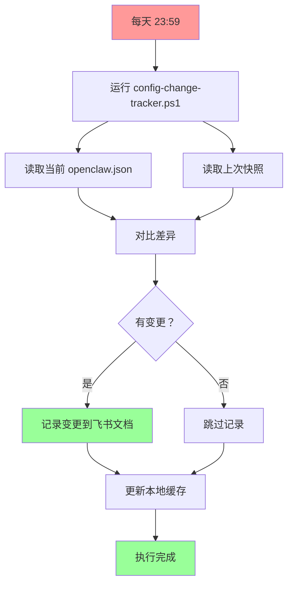

# 📝 OpenClaw 配置变更追踪器 - Cron 配置指南

**创建时间：** 2026-03-15 18:35  
**创建者：** 阿香 🦞  
**状态：** ⏳ 需要 Thomas 配置

---

## 📋 已创建的文件

### 1. PowerShell 脚本

**路径：** `C:\Users\Xiabi\.openclaw\workspace\cron\config-change-tracker.ps1`

**功能：**
- 读取当前 openclaw.json
- 对比上次快照
- 记录变更到飞书文档
- 更新本地缓存

**运行参数：**
```powershell
powershell -ExecutionPolicy Bypass -File "C:\Users\Xiabi\.openclaw\workspace\cron\config-change-tracker.ps1"
```

### 2. 飞书文档

**标题：** 📝 OpenClaw 配置变更记录 - 2026-03-15 启动  
**链接：** https://feishu.cn/docx/U1OcdSW61oiplBxoovQcoKzpnrd  
**文档 ID：** `U1OcdSW61oiplBxoovQcoKzpnrd`

**功能：**
- 存储每次配置变更快照
- 记录变更详情（新增/修改/删除）
- 变更统计表格

---

## 🔧 需要 Thomas 配置

### 方案 A：Windows 任务计划程序（推荐）

**步骤：**

1. **以管理员身份打开 PowerShell**
   - 按 `Win + X`
   - 选择"Windows PowerShell (管理员)"

2. **执行创建命令**
   ```powershell
   schtasks /Create /TN "OpenClaw-ConfigChangeTracker" /TR "powershell -ExecutionPolicy Bypass -File `"C:\Users\Xiabi\.openclaw\workspace\cron\config-change-tracker.ps1`"" /SC DAILY /ST 23:59 /RL HIGHEST /F
   ```

3. **验证任务**
   ```powershell
   schtasks /Query /TN "OpenClaw-ConfigChangeTracker"
   ```

4. **手动测试**
   ```powershell
   powershell -ExecutionPolicy Bypass -File "C:\Users\Xiabi\.openclaw\workspace\cron\config-change-tracker.ps1"
   ```

---

### 方案 B：OpenClaw 内置 Cron（如果支持）

**配置文件：** `C:\Users\Xiabi\.openclaw\gateway\config.json`

**添加配置：**
```json
{
  "cron": {
    "config-change-tracker": {
      "schedule": "59 23 * * *",
      "command": "powershell -ExecutionPolicy Bypass -File C:\\Users\\Xiabi\\.openclaw\\workspace\\cron\\config-change-tracker.ps1",
      "enabled": true
    }
  }
}
```

**重启 Gateway：**
```bash
openclaw gateway restart
```

---

### 方案 C：手动运行（临时方案）

**每天手动执行：**
```powershell
powershell -ExecutionPolicy Bypass -File "C:\Users\Xiabi\.openclaw\workspace\cron\config-change-tracker.ps1"
```

---

## 📊 工作流程



---

## 📝 飞书文档格式

### 初始快照

```markdown
### 2026-03-15 18:31 - 文档创建

**操作：** 创建配置变更记录文档  
**执行人：** 阿香 🦞  
**说明：** 启动 openclaw.json 变革记录系统

**当前配置快照：**
```json
{...}
```
```

### 变更示例

```markdown
### 2026-03-16 23:59 - 配置变更

**✅ 新增：**
- `env.NEW_API_KEY` = `"sk-xxxxx"`

**🔄 修改：**
- `messages.tts.auto`: `"always"` → `"never"`

**❌ 删除：**
- `plugins.entries.memory-lancedb`

**当前配置快照：**
```json
{...}
```
```

---

## ✅ 验证步骤

**1. 手动测试脚本**
```powershell
cd "C:\Users\Xiabi\.openclaw\workspace\cron"
.\config-change-tracker.ps1
```

**2. 检查飞书文档**
- 打开 https://feishu.cn/docx/U1OcdSW61oiplBxoovQcoKzpnrd
- 确认有初始快照

**3. 修改配置测试**
```powershell
# 修改 openclaw.json
notepad "$env:USERPROFILE\.openclaw\openclaw.json"

# 再次运行脚本
.\config-change-tracker.ps1
```

**4. 检查变更记录**
- 飞书文档应该有新增的变更记录

---

## 💡 注意事项

1. **飞书 API 集成**
   - 脚本中需要集成飞书 API 来更新文档
   - 可能需要使用 `feishu_doc` 工具
   - 或者调用飞书开放平台 API

2. **本地缓存**
   - 缓存路径：`C:\Users\Xiabi\.openclaw\config-snapshot.json`
   - 用于存储上次配置快照
   - 避免每次都读取飞书文档

3. **权限问题**
   - Windows 任务计划需要管理员权限
   - 确保脚本有执行权限

4. **错误处理**
   - 脚本已包含基本错误处理
   - 飞书 API 失败时记录本地日志

---

## 🎯 下一步行动

**Thomas 需要：**
1. ✅ 选择 Cron 配置方案（推荐方案 A）
2. ⏳ 配置定时任务
3. ⏳ 手动测试脚本
4. ⏳ 验证飞书文档更新

**虾虾已完成：**
- ✅ 创建 PowerShell 脚本
- ✅ 创建飞书文档
- ✅ 编写配置指南

---

_配置由阿香 🦞 创建，等待 Thomas 配置 Cron_

**最后更新：** 2026-03-15 18:35
