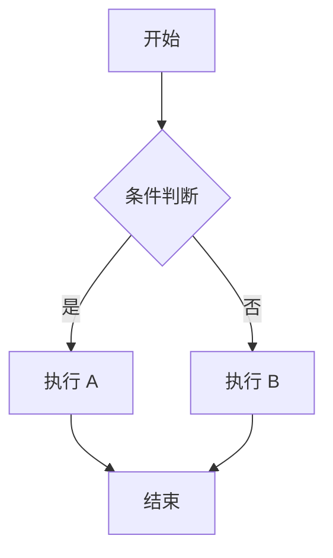
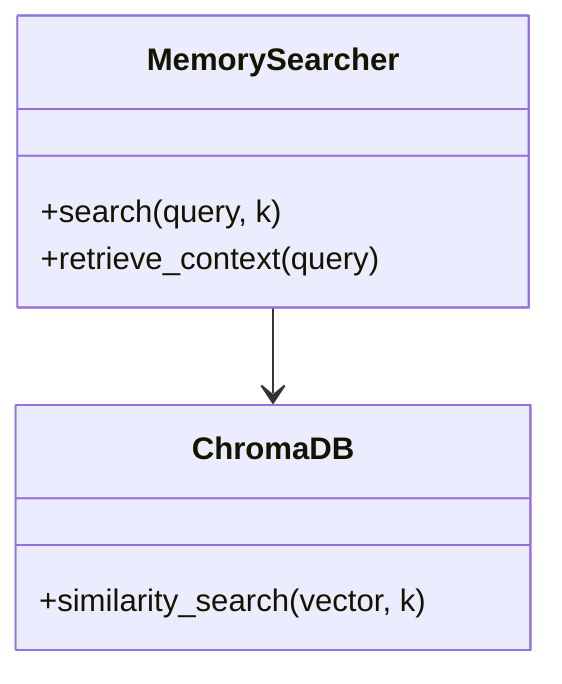
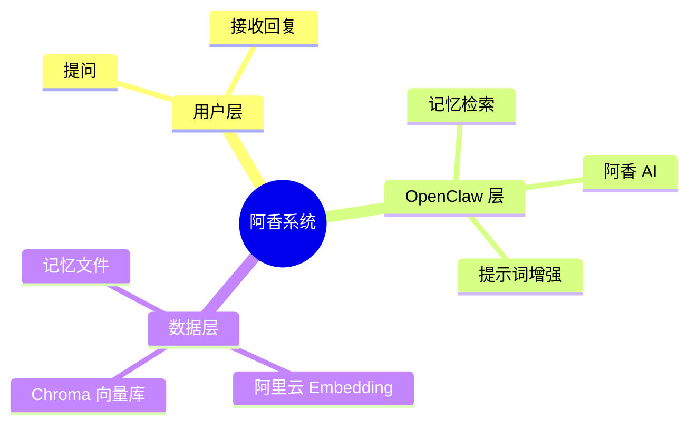
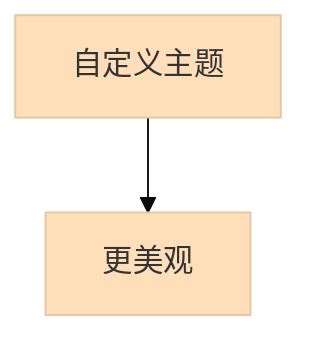
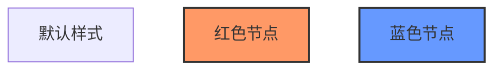
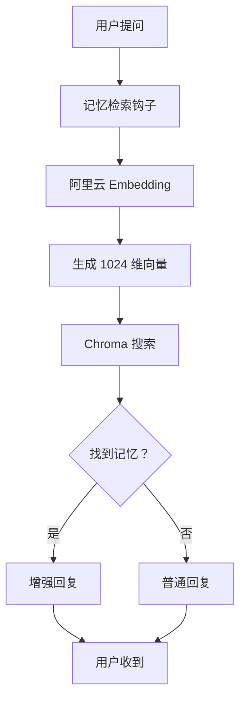
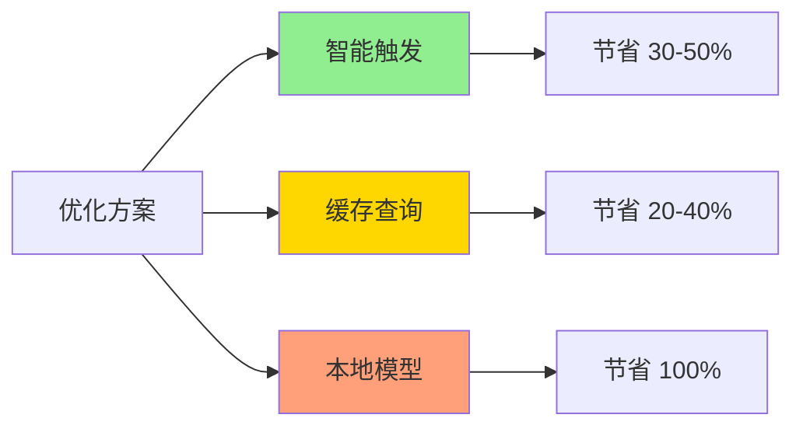

# Mermaid 图表集成指南

## 📖 简介

本指南介绍如何在阿香的飞书回复中使用 Mermaid 生成的美观图表，替代 ASCII 字符拼凑的线条图。

---

## 🎯 使用场景

### ✅ 适合使用图表的场景

1. **系统架构说明** - 展示组件关系
2. **工作流程** - 展示步骤顺序
3. **数据流向** - 展示数据处理过程
4. **决策树** - 展示判断逻辑
5. **时间线** - 展示事件顺序

### ❌ 不适合的场景

1. **简单回复** - 几句话能说清
2. **紧急回复** - 图表生成需要时间
3. **纯文字内容** - 不需要可视化

---

## 🚀 快速开始

### 方式 1：一键发送（推荐）⭐⭐⭐⭐⭐

```powershell
# 运行演示脚本（生成图表 + 回复）
python C:\Users\Xiabi\.openclaw\workspace\scripts\demo-feishu-response.py

# 发送飞书消息
powershell -File C:\Users\Xiabi\.openclaw\workspace\scripts\send-feishu-with-diagram.ps1
```

### 方式 2：自定义图表

```python
from scripts.mermaid-generator import MermaidGenerator

# 创建生成器
generator = MermaidGenerator()

# 定义 Mermaid 代码
mermaid_code = """
graph TD
    A[用户] --> B[阿香]
    B --> C[记忆检索]
    C --> D[增强回复]
"""

# 生成图表
diagram_path = generator.generate(
    mermaid_code,
    filename="custom-diagram",
    width=800,
    height=600
)

print(f"Diagram saved to: {diagram_path}")
```

### 方式 3：在代码中直接调用

```python
# 在阿香回复逻辑中
def respond_with_diagram(user_message):
    # 1. 生成回复文本
    response = generate_response(user_message)
    
    # 2. 如果需要图表
    if should_include_diagram(user_message):
        mermaid_code = create_diagram_for_topic(user_message)
        diagram_path = MermaidGenerator().generate(mermaid_code)
        
        # 3. 发送文字 + 图表
        send_to_feishu(response)
        send_to_feishu(file_path=diagram_path)
    else:
        send_to_feishu(response)
```

---

## 📊 Mermaid 图表类型

### 1. 流程图（Flowchart）



**适用场景：** 工作流程、决策树

---

### 2. 时序图（Sequence Diagram）

```mermaid
sequenceDiagram
    用户->>阿香：提问
    阿香->>记忆检索：检索记忆
    记忆检索->>阿里云：生成向量
    阿里云-->>记忆检索：返回向量
    记忆检索->>Chroma: 搜索
    Chroma-->>记忆检索：返回结果
    记忆检索-->>阿香：相关记忆
    阿香->>用户：回复
```

**适用场景：** 交互流程、API 调用顺序

---

### 3. 类图（Class Diagram）



**适用场景：** 代码结构、类关系

---

### 4. 思维导图（Mindmap）



**适用场景：** 知识梳理、功能分解

---

## 🎨 样式配置

### 主题配置



**可用主题：** `default`, `base`, `dark`, `neutral`, `forest`

### 节点样式



---

## 💡 最佳实践

### 1. 图表尺寸

| 场景 | 推荐尺寸 | 文件大小 |
|------|---------|---------|
| **简单流程** | 600x400 | ~30KB |
| **系统架构** | 1000x800 | ~80KB |
| **详细设计** | 1200x900 | ~150KB |

**原则：** 不要超过 200KB（飞书加载慢）

---

### 2. 颜色使用

**推荐：**
- ✅ 使用柔和的颜色（马卡龙色系）
- ✅ 保持颜色一致（同类型节点同色）
- ✅ 考虑色盲用户（不用红绿对比）

**避免：**
- ❌ 过多颜色（< 5 种）
- ❌ 过于鲜艳（刺眼）
- ❌ 纯黑纯白（对比太强）

---

### 3. 文字说明

**图表 + 文字组合：**

```markdown
## 📊 系统架构

上图展示了系统的三层架构：

1. **用户层** - 用户交互界面
2. **OpenClaw 层** - 核心处理逻辑
3. **数据层** - 存储和检索

详细说明：
- 用户提问后，阿香会自动检索记忆
- 阿里云 Embedding 生成向量
- Chroma 搜索相似记忆
- 最终生成增强回复
```

---

## 🔧 故障排查

### 问题 1：mermaid-cli 未找到

**错误：** `mmdc: command not found`

**解决：**
```powershell
npm install -g @mermaid-js/mermaid-cli
```

---

### 问题 2：生成超时

**错误：** `Timeout expired`

**解决：**
- 增加超时时间（默认 30 秒）
- 减小图表尺寸
- 简化 Mermaid 代码

---

### 问题 3：中文乱码

**错误：** 图表中文显示为方框

**解决：**
```python
# 在 Mermaid 代码开头添加
%%{init: {'theme': 'base', 'themeVariables': { 'fontFamily': 'Microsoft YaHei'}}}%%
```

---

### 问题 4：图片太大

**问题：** 文件超过 200KB

**解决：**
- 减小尺寸（width/height）
- 使用 PNG 格式（比 SVG 小）
- 简化图表内容

---

## 📝 示例库

### 示例 1：记忆检索流程



---

### 示例 2：优化方案对比



---

## 🎯 总结

**核心要点：**
1. ✅ 使用 Mermaid 生成美观图表
2. ✅ 文字 + 图片组合发送
3. ✅ 控制图表尺寸（< 200KB）
4. ✅ 选择合适场景使用
5. ✅ 遵循最佳实践

**工具位置：**
- 生成器：`scripts/mermaid-generator.py`
- 演示脚本：`scripts/demo-feishu-response.py`
- 发送脚本：`scripts/send-feishu-with-diagram.ps1`
- 输出目录：`mermaid-output/`

---

_阿香 🦞 维护的 Mermaid 集成指南_
_最后更新：2026-03-12_
