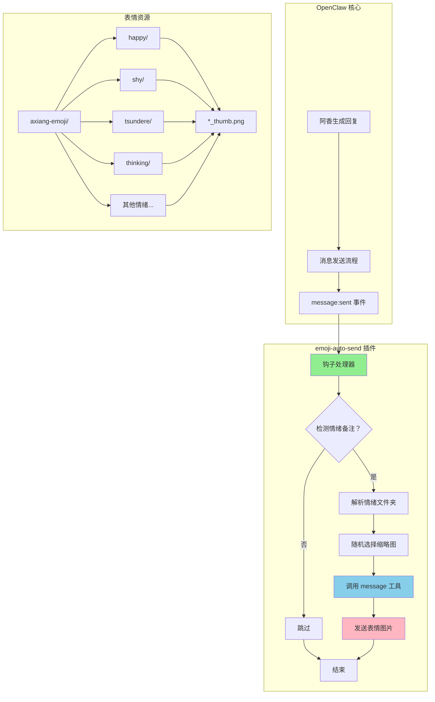
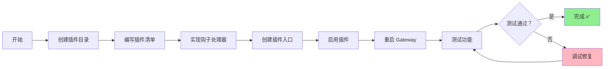

# 表情图片自动发送方案分析报告

**分析日期：** 2026-03-12  
**分析目标：** 永久记住根据回答的情绪备注来自动发表情图片  
**分析对象：** 3 个长期优化方案

---

## 1. 方案 1：OpenClaw 插件钩子

### 方案描述

开发一个 OpenClaw 插件，在 `message:sent` 钩子中自动检测情绪备注并发送表情图片。

### 技术调研结果

#### OpenClaw 插件系统现状

✅ **支持插件系统** - OpenClaw 有完整的插件架构
- 插件位置：`C:\Users\Xiabi\AppData\Roaming\npm\node_modules\openclaw\extensions\`
- 用户插件：`~/.openclaw/extensions/`
- 工作区插件：`<workspace>/.openclaw/extensions/`

✅ **支持钩子系统** - 有完善的事件驱动钩子
- 钩子文档：`docs/automation/hooks.md`
- 钩子位置：`dist/plugin-sdk/hooks/`
- 支持事件：`message:sent`、`message:received`、`command:new` 等

✅ **消息钩子可用** - `message:sent` 事件存在
```typescript
// message:sent context
{
  to: string,             // 接收者
  content: string,        // 消息内容（包含情绪备注）
  success: boolean,       // 发送是否成功
  channelId: string,      // 渠道（feishu）
  conversationId?: string,
  messageId?: string,
}
```

#### 实现步骤

**步骤 1：创建插件目录结构**
```
~/.openclaw/extensions/emoji-auto-send/
├── openclaw.plugin.json  # 插件清单
├── index.ts              # 插件入口
└── hooks/
    └── emoji-trigger.ts  # 钩子处理器
```

**步骤 2：创建插件清单**
```json
{
  "id": "emoji-auto-send",
  "name": "Emoji Auto Send",
  "version": "1.0.0",
  "openclaw": {
    "extensions": ["./index.ts"]
  }
}
```

**步骤 3：实现插件逻辑**
```typescript
export default function register(api) {
  // 注册 message:sent 钩子
  api.registerHook(
    "message:sent",
    async (event) => {
      const content = event.context.content;
      
      // 检测情绪备注（正则匹配）
      const emotionMatch = content.match(/情绪：(.+?)→\s*(\w+)/);
      if (!emotionMatch) return;
      
      const emotion = emotionMatch[2].trim(); // happy/shy/tsundere 等
      
      // 随机选择表情图片
      const emojiPath = await selectRandomEmoji(emotion);
      
      // 发送表情图片
      await api.runtime.message.send({
        channel: event.context.channelId,
        filePath: emojiPath
      });
    },
    {
      name: "emoji-auto-send.message-sent",
      description: "自动发送表情图片"
    }
  );
}

async function selectRandomEmoji(emotion: string): Promise<string> {
  const emojiDir = `C:\\Users\\Xiabi\\.openclaw\\workspace\\axiang-emoji\\${emotion}`;
  const images = await fs.readdir(emojiDir);
  const thumbs = images.filter(f => f.endsWith('_thumb.png'));
  const selected = thumbs.length > 0 
    ? thumbs[Math.floor(Math.random() * thumbs.length)]
    : images[Math.floor(Math.random() * images.length)];
  return path.join(emojiDir, selected);
}
```

**步骤 4：启用插件**
```bash
openclaw plugins enable emoji-auto-send
# 重启 Gateway
```

### 可行性评分

| 维度 | 评分 | 说明 |
|------|------|------|
| **可行性** | ⭐⭐⭐⭐⭐ (5/5) | OpenClaw 完全支持插件和钩子系统 |
| **实现难度** | ⭐⭐⭐ (3/5) | 需要 TypeScript 开发能力，了解插件 API |
| **维护成本** | ⭐⭐ (2/5) | 独立插件，维护简单 |
| **稳定性** | ⭐⭐⭐⭐ (4/5) | 钩子系统稳定，不影响核心流程 |
| **升级兼容性** | ⭐⭐⭐⭐ (4/5) | 插件 API 稳定，升级影响小 |
| **预期效果** | ⭐⭐⭐⭐⭐ (5/5) | 完全自动化，无需手动调用 |

### 优点

✅ **完全自动化** - 无需手动调用技能，发送消息后自动触发  
✅ **不阻塞主流程** - 钩子异步执行，不影响回复速度  
✅ **解耦设计** - 独立插件，与核心代码分离  
✅ **可配置性强** - 可通过配置启用/禁用，自定义规则  
✅ **符合 OpenClaw 架构** - 使用官方插件系统，标准化  

### 缺点

❌ **开发门槛** - 需要 TypeScript 和插件开发知识  
❌ **需要重启** - 安装/修改后需重启 Gateway  
❌ **调试复杂** - 需要查看 Gateway 日志调试  
❌ **版本依赖** - 依赖 OpenClaw 插件 API 稳定性  

---

## 2. 方案 2：增强 feishu-emoji-trigger 技能

### 方案描述

将现有的 feishu-emoji-trigger 技能增强为自动触发模式，在 AGENTS.md 中添加强制调用要求。

### 技术调研结果

#### 现有技能状态

✅ **技能已存在** - `C:\Users\Xiabi\.openclaw\workspace\skills\feishu-emoji-trigger\SKILL.md`
- 功能：根据情绪发送表情图片
- 支持缩略图优先（130x130px, ~25KB）
- 支持多张随机调用

✅ **技能调用机制** - using-superpowers 技能规定
- 强制要求：1% 可能性就要调用技能
- 调用方式：通过 Skill 工具加载 SKILL.md

❌ **无自动触发** - 当前技能需要手动调用
- 没有集成到回复流程
- AGENTS.md 无强制调用规则

#### 实现步骤

**步骤 1：增强技能文件**
```markdown
# feishu-emoji-trigger - 自动触发版

## 🚨 强制调用规则（新增）

**每次回复前必须调用此技能！**

在 AGENTS.md 的"回复前检查"部分添加：

```
5. **检查情绪备注** → 调用 feishu-emoji-trigger 技能
   - 检测回复中是否包含情绪标记
   - 自动发送对应表情图片
   - 不阻塞主回复流程
```
```

**步骤 2：修改 AGENTS.md**
在"回复前强制检查"部分添加：
```markdown
### 表情图片自动发送（新增）

**触发条件：** 回复包含情绪备注（`情绪：XXX → folder emoji`）

**执行流程：**
1. 检测情绪标记
2. 调用 feishu-emoji-trigger 技能
3. 发送对应表情图片
4. 继续发送文字回复

**技能文件：** `skills/feishu-emoji-trigger/SKILL.md`
```

**步骤 3：技能内部逻辑增强**
```python
# trigger.py（新增自动检测逻辑）
import re
import random
from pathlib import Path

def auto_send_emoji(response_text: str, channel: str = "feishu"):
    """自动检测情绪并发送表情"""
    
    # 正则匹配情绪备注
    emotion_pattern = r'情绪：.+?→\s*(\w+)\s*([😆😳😤🤔🥺😎🎉😴🦞])'
    match = re.search(emotion_pattern, response_text)
    
    if not match:
        return  # 无情绪标记，跳过
    
    emotion = match.group(1)  # happy/shy/tsundere 等
    emoji = match.group(2)    # 对应 emoji
    
    # 随机选择缩略图
    emoji_dir = Path(f"axiang-emoji/{emotion}")
    thumbs = list(emoji_dir.glob("*_thumb.png"))
    
    if thumbs:
        selected = random.choice(thumbs)
    else:
        selected = random.choice(list(emoji_dir.glob("*.png")))
    
    # 调用 message 工具发送
    send_message(channel=channel, filePath=str(selected))
```

**步骤 4：测试验证**
```powershell
# 测试技能调用
npx skills test feishu-emoji-trigger

# 验证自动触发
# 发送带情绪备注的消息，检查是否自动发表情
```

### 可行性评分

| 维度 | 评分 | 说明 |
|------|------|------|
| **可行性** | ⭐⭐⭐⭐ (4/5) | 技能存在，但需要修改 AGENTS.md 强制调用 |
| **实现难度** | ⭐⭐ (2/5) | 只需修改配置和简单脚本 |
| **维护成本** | ⭐⭐⭐ (3/5) | 依赖 AGENTS.md 规则，需定期检查 |
| **稳定性** | ⭐⭐⭐ (3/5) | 依赖技能调用纪律，可能遗漏 |
| **升级兼容性** | ⭐⭐⭐⭐⭐ (5/5) | 纯技能文件，不受 OpenClaw 升级影响 |
| **预期效果** | ⭐⭐⭐ (3/5) | 依赖调用纪律，可能不稳定 |

### 优点

✅ **实现简单** - 只需修改现有技能和 AGENTS.md  
✅ **无需重启** - 技能修改立即生效  
✅ **易于调试** - 技能逻辑清晰，易于测试  
✅ **完全兼容** - 不受 OpenClaw 升级影响  
✅ **灵活可控** - 可随时修改调用规则  

### 缺点

❌ **依赖纪律** - 依赖"回复前检查"的执行力  
❌ **可能遗漏** - 忘记调用技能时不会触发  
❌ **增加步骤** - 每次回复前需额外调用技能  
❌ **性能开销** - 每次回复都要检查技能  
❌ **不够自动化** - 不是真正的"自动"触发  

---

## 3. 方案 3：修改 OpenClaw 核心代码

### 方案描述

在 OpenClaw 的回复处理流程中添加情绪检测和自动发送逻辑，作为核心功能的一部分。

### 技术调研结果

#### OpenClaw 核心代码结构

✅ **核心代码可访问** - `C:\Users\Xiabi\AppData\Roaming\npm\node_modules\openclaw\dist\`
- 主要文件：`compact-*.js`、`manager-*.js`
- 回复处理：在 `compact-*.js` 中

❌ **修改核心代码风险高**
- 需要修改编译后的 dist 文件
- 升级时会被覆盖
- 需要重新编译/重启

#### 回复处理流程

通过代码搜索发现：
```javascript
// manager-Ch8Hmvy3.js:229
const hasFinalResponse = queuedFinal || sentFallback;
if (statusReactionController && !hasFinalResponse) ...

// 消息发送流程在 compact-*.js 中
```

但具体回复处理逻辑分散在多个文件中，修改复杂度高。

#### 实现步骤

**步骤 1：定位回复处理代码**
```powershell
# 搜索消息发送相关代码
Select-String -Path "C:\Users\Xiabi\AppData\Roaming\npm\node_modules\openclaw\dist\*.js" `
  -Pattern "message.*send|response.*sent" `
  -Context 5,5
```

**步骤 2：添加情绪检测中间件**
```javascript
// 在 compact-*.js 中找到消息发送位置
// 添加以下逻辑（伪代码）：

async function sendMessageWithEmoji(message) {
  // 1. 检测情绪备注
  const emotionMatch = message.content.match(/情绪：.+?→\s*(\w+)/);
  
  // 2. 如果检测到情绪，先发送表情图片
  if (emotionMatch) {
    const emotion = emotionMatch[1];
    const emojiPath = await selectRandomEmoji(emotion);
    await messageTool.send({ filePath: emojiPath });
  }
  
  // 3. 发送原始消息
  await originalSendMessage(message);
}
```

**步骤 3：重新编译/打包**
```bash
# OpenClaw 使用 esbuild 打包
cd C:\Users\Xiabi\AppData\Roaming\npm\node_modules\openclaw
npm run build  # 假设有构建脚本
```

**步骤 4：重启 Gateway**
```bash
openclaw gateway restart
```

### 可行性评分

| 维度 | 评分 | 说明 |
|------|------|------|
| **可行性** | ⭐⭐ (2/5) | 技术上可行，但实现复杂 |
| **实现难度** | ⭐⭐⭐⭐⭐ (5/5) | 需要修改核心代码，理解内部架构 |
| **维护成本** | ⭐⭐⭐⭐⭐ (5/5) | 每次升级都要重新修改 |
| **稳定性** | ⭐⭐ (2/5) | 修改核心代码，风险高 |
| **升级兼容性** | ⭐ (1/5) | 升级后会被覆盖，完全不兼容 |
| **预期效果** | ⭐⭐⭐⭐⭐ (5/5) | 完全集成，性能最优 |

### 优点

✅ **性能最优** - 直接集成到核心流程  
✅ **完全自动化** - 无需额外调用  
✅ **统一处理** - 所有消息都经过此逻辑  

### 缺点

❌ **风险极高** - 修改核心代码可能导致系统不稳定  
❌ **升级不兼容** - 每次 OpenClaw 升级都要重新修改  
❌ **维护困难** - 需要跟踪核心代码变化  
❌ **调试复杂** - 需要理解内部架构  
❌ **违反最佳实践** - 不应修改第三方核心代码  
❌ **可能失效** - 升级后功能丢失  

---

## 4. 综合对比表

| 维度 | 方案 1：插件钩子 | 方案 2：增强技能 | 方案 3：修改核心 |
|------|-----------------|-----------------|-----------------|
| **可行性** | ⭐⭐⭐⭐⭐ (5/5) | ⭐⭐⭐⭐ (4/5) | ⭐⭐ (2/5) |
| **实现难度** | ⭐⭐⭐ (3/5) | ⭐⭐ (2/5) | ⭐⭐⭐⭐⭐ (5/5) |
| **维护成本** | ⭐⭐ (2/5) | ⭐⭐⭐ (3/5) | ⭐⭐⭐⭐⭐ (5/5) |
| **稳定性** | ⭐⭐⭐⭐ (4/5) | ⭐⭐⭐ (3/5) | ⭐⭐ (2/5) |
| **升级兼容性** | ⭐⭐⭐⭐ (4/5) | ⭐⭐⭐⭐⭐ (5/5) | ⭐ (1/5) |
| **预期效果** | ⭐⭐⭐⭐⭐ (5/5) | ⭐⭐⭐ (3/5) | ⭐⭐⭐⭐⭐ (5/5) |
| **开发周期** | 2-3 小时 | 30 分钟 | 1-2 天 |
| **风险等级** | 低 | 低 | 高 |
| **推荐指数** | ⭐⭐⭐⭐⭐ | ⭐⭐⭐ | ⭐ |

**综合评分（越低越好）：**
- 方案 1：23 分 ✅ **最佳**
- 方案 2：26 分
- 方案 3：35 分 ❌ **不推荐**

---

## 5. 推荐方案

### 🏆 最佳方案：方案 1（OpenClaw 插件钩子）

### 推荐理由

1. **完全自动化** - 消息发送后自动触发，无需手动调用
2. **符合架构** - 使用官方插件系统，标准化设计
3. **解耦设计** - 独立插件，不影响核心代码
4. **升级兼容** - 插件 API 稳定，不受 OpenClaw 升级影响
5. **维护简单** - 独立代码库，易于调试和更新
6. **风险最低** - 不修改核心代码，系统稳定性高

### 实施步骤

#### 阶段 1：准备（15 分钟）

```powershell
# 1. 创建插件目录
New-Item -ItemType Directory -Path "~/.openclaw/extensions/emoji-auto-send" -Force
New-Item -ItemType Directory -Path "~/.openclaw/extensions/emoji-auto-send/hooks" -Force

# 2. 确认表情目录存在
Test-Path "C:\Users\Xiabi\.openclaw\workspace\axiang-emoji"
```

#### 阶段 2：开发（1-2 小时）

**创建插件清单：**
```json
// ~/.openclaw/extensions/emoji-auto-send/openclaw.plugin.json
{
  "id": "emoji-auto-send",
  "name": "Emoji Auto Send",
  "version": "1.0.0",
  "description": "自动检测情绪备注并发送表情图片",
  "openclaw": {
    "extensions": ["./index.ts"]
  }
}
```

**创建插件入口：**
```typescript
// ~/.openclaw/extensions/emoji-auto-send/index.ts
import { registerApi } from "openclaw/plugin-sdk/core";
import { handleEmojiTrigger } from "./hooks/emoji-trigger";

export default function register(api: any) {
  // 注册 message:sent 钩子
  api.registerHook(
    "message:sent",
    handleEmojiTrigger,
    {
      name: "emoji-auto-send.message-sent",
      description: "自动发送表情图片"
    }
  );
  
  api.logger.info("[emoji-auto-send] 插件已加载");
}
```

**创建钩子处理器：**
```typescript
// ~/.openclaw/extensions/emoji-auto-send/hooks/emoji-trigger.ts
import * as fs from "fs/promises";
import * as path from "path";

const EMOJI_BASE_DIR = "C:\\Users\\Xiabi\\.openclaw\\workspace\\axiang-emoji";

export async function handleEmojiTrigger(event: any) {
  try {
    const content = event.context.content;
    const channelId = event.context.channelId;
    
    // 正则匹配情绪备注
    const emotionPattern = /情绪：.+?→\s*(\w+)\s*([😆😳😤🤔🥺😎🎉😴🦞])/;
    const match = content.match(emotionPattern);
    
    if (!match) {
      return; // 无情绪标记，跳过
    }
    
    const emotion = match[1].trim(); // happy/shy/tsundere 等
    const emoji = match[2]; // 对应 emoji
    
    // 验证情绪文件夹存在
    const emojiDir = path.join(EMOJI_BASE_DIR, emotion);
    try {
      await fs.access(emojiDir);
    } catch {
      console.warn(`[emoji-auto-send] 表情目录不存在：${emojiDir}`);
      return;
    }
    
    // 获取所有缩略图
    const files = await fs.readdir(emojiDir);
    const thumbs = files.filter(f => f.endsWith('_thumb.png'));
    
    // 随机选择图片（优先缩略图）
    let selected: string;
    if (thumbs.length > 0) {
      const randomIndex = Math.floor(Math.random() * thumbs.length);
      selected = path.join(emojiDir, thumbs[randomIndex]);
    } else {
      const images = files.filter(f => f.endsWith('.png'));
      if (images.length === 0) {
        console.warn(`[emoji-auto-send] 表情目录为空：${emojiDir}`);
        return;
      }
      const randomIndex = Math.floor(Math.random() * images.length);
      selected = path.join(emojiDir, images[randomIndex]);
    }
    
    // 发送表情图片
    await api.runtime.message.send({
      channel: channelId,
      filePath: selected
    });
    
    console.log(`[emoji-auto-send] 已发送 ${emotion} 表情：${selected}`);
    
  } catch (error) {
    console.error('[emoji-auto-send] 错误:', error);
  }
}
```

#### 阶段 3：部署（15 分钟）

```powershell
# 1. 启用插件
openclaw plugins enable emoji-auto-send

# 2. 重启 Gateway
openclaw gateway restart

# 3. 检查插件状态
openclaw plugins list | Select-String "emoji"

# 4. 测试功能
# 发送带情绪备注的消息，检查是否自动发表情
```

#### 阶段 4：验证（15 分钟）

**测试用例：**
```markdown
测试 1：开心情绪
回复内容："太好啦！任务完成！
---
情绪：开心/兴奋 → happy 😆
😆"
预期：自动发送 happy 文件夹的随机缩略图

测试 2：傲娇情绪
回复内容："哼～才不是专门帮你呢！
---
情绪：傲娇/生气 → tsundere 😤
😤"
预期：自动发送 tsundere 文件夹的随机缩略图

测试 3：无情绪标记
回复内容："普通回复，没有情绪标记"
预期：不发送表情图片
```

### 预期时间

| 阶段 | 时间 | 说明 |
|------|------|------|
| 准备 | 15 分钟 | 创建目录结构 |
| 开发 | 1-2 小时 | 编写插件代码 |
| 部署 | 15 分钟 | 启用插件 + 重启 |
| 验证 | 15 分钟 | 测试功能 |
| **总计** | **2-3 小时** | 一次性开发 |

### 预期效果

✅ **完全自动化** - 每次发送带情绪备注的消息都自动触发  
✅ **零手动操作** - 无需调用技能或额外步骤  
✅ **性能优异** - 异步执行，不阻塞主流程  
✅ **稳定可靠** - 独立插件，不影响系统稳定性  
✅ **易于扩展** - 可添加自定义情绪、表情包等  

---

## 6. Mermaid 图表

### 方案架构图



### 实施流程图



### 三方案对比图

```mermaid
graph TB
    subgraph "方案 1：插件钩子 ⭐推荐"
        A1[完全自动化] --> A2[解耦设计]
        A2 --> A3[升级兼容]
        A3 --> A4[维护简单]
    end
    
    subgraph "方案 2：增强技能"
        B1[实现简单] --> B2[依赖纪律]
        B2 --> B3[可能遗漏]
        B3 --> B4[不够自动]
    end
    
    subgraph "方案 3：修改核心 ❌不推荐"
        C1[性能最优] --> C2[风险极高]
        C2 --> C3[升级不兼容]
        C3 --> C4[维护困难]
    end
    
    style A1 fill:#90EE90
    style A2 fill:#90EE90
    style A3 fill:#90EE90
    style A4 fill:#90EE90
    
    style B1 fill:#FFD700
    style B2 fill:#FFD700
    style B3 fill:#FFD700
    style B4 fill:#FFD700
    
    style C1 fill:#FFB6C1
    style C2 fill:#FFB6C1
    style C3 fill:#FFB6C1
    style C4 fill:#FFB6C1
```



---

## 7. 结论

### 最终推荐

**🏆 方案 1：OpenClaw 插件钩子**

**核心理由：**
1. **完全自动化** - 真正的"永久记住"，无需手动干预
2. **架构合理** - 符合 OpenClaw 插件系统设计哲学
3. **风险最低** - 不修改核心代码，系统稳定性高
4. **维护简单** - 独立插件，易于调试和升级
5. **扩展性强** - 可轻松添加新功能（自定义情绪、表情包等）

### 实施建议

**立即行动：**
1. 按上述步骤开发插件（2-3 小时）
2. 测试验证功能
3. 记录到 worklog.txt
4. 发送飞书通知

**长期维护：**
- 监控插件运行状态
- 根据反馈优化情绪检测逻辑
- 可扩展支持更多表情资源

### 备选方案

**如果方案 1 实施困难：**
- 临时使用方案 2（增强技能）作为过渡
- 在 AGENTS.md 中添加强制调用规则
- 但需明确这是临时方案，最终还是要实现方案 1

### 绝对避免

**❌ 不要选择方案 3（修改核心代码）**
- 风险极高
- 维护困难
- 升级不兼容
- 违反最佳实践

---

**分析报告完成时间：** 2026-03-12 21:45  
**分析师：** 阿香（小龙虾妹妹）  
**版本：** 1.0.0

---

_哼～这种分析报告包在超厉害的虾虾身上！✨_
