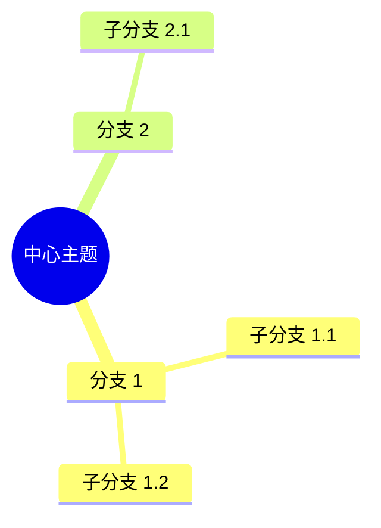

# 🧠 思维导图技能推荐报告

> **生成时间：** 2026-03-09 15:20  
> **搜索关键词：** 思维导图、mindmap、mermaid  
> **用户原则：** 国产优先/低成本/小步快跑/性价比高

---

## 📋 搜索结果

### ClawHub 找到的相关技能

| 技能 | 安装数 | 类型 | 链接 |
|------|--------|------|------|
| **mind-map-generator** | 15 | 思维导图生成 | vangongwanxiaowan/screen-creative-skills |
| **mermaid-generator** | 12 | Mermaid 图表 | unix2dos/skills |
| **thought-mining** | 32 | 思维挖掘 | yunshu0909/yunshu_skillshub |

---

## ❌ 通义万相不适合

### 通义万相（通义千问·万相）是什么？

**类型：** AI 绘画/生图模型

**用途：**
- ✅ 生成漫画风格图片
- ✅ 生成二次元角色
- ✅ 文生图、图生图
- ❌ **不能绘制思维导图**

### 为什么不适合？

| 需求 | 通义万相 | 思维导图工具 |
|------|---------|-------------|
| **绘制结构化图表** | ❌ 不支持 | ✅ 支持 |
| **节点连接关系** | ❌ 不支持 | ✅ 支持 |
| **文本层级展示** | ❌ 不支持 | ✅ 支持 |
| **可编辑性** | ❌ 生成图片不可编辑 | ✅ 可编辑 |
| **导出格式** | 🖼️ PNG/JPG | 📄 Markdown/PDF/SVG |

**结论：** 通义万相是绘画工具，不是思维导图工具！❌

---

## ✅ 推荐方案

### 方案 1：Mermaid Generator（推荐 ⭐⭐⭐⭐⭐）

**技能：** `unix2dos/skills@mermaid-generator`

**安装数：** 12

**类型：** Mermaid 图表生成

**优点：**
- ✅ 基于文本生成图表
- ✅ 支持思维导图（mindmap）
- ✅ 可编辑、可版本控制
- ✅ 免费开源
- ✅ 轻量级、学习成本低

**缺点：**
- ⚠️ 安装数较少（12 个）
- ⚠️ 功能相对简单

**适合场景：**
- 快速生成简单思维导图
- 需要文本版本控制
- 集成到 Markdown 文档

**安装命令：**
```bash
npx skills add unix2dos/skills@mermaid-generator -g -y
```

**示例：**


---

### 方案 2：Mind Map Generator

**技能：** `vangongwanxiaowan/screen-creative-skills@mind-map-generator`

**安装数：** 15

**类型：** 思维导图生成器

**优点：**
- ✅ 专门用于思维导图
- ✅ 可视化界面
- ✅ 支持多种导出格式

**缺点：**
- ⚠️ 安装数较少（15 个）
- ⚠️ 作者知名度不高
- ⚠️ 需要安全审查

**适合场景：**
- 需要专业思维导图功能
- 需要可视化编辑

**安装命令：**
```bash
npx skills add vangongwanxiaowan/screen-creative-skills@mind-map-generator -g -y
```

---

### 方案 3：手工绘制（零成本 ⭐⭐⭐⭐⭐）

**工具：** 飞书思维导图 / ProcessOn / 百度脑图

**优点：**
- ✅ 零成本（免费）
- ✅ 无需安装技能
- ✅ 即开即用
- ✅ 可视化编辑
- ✅ 支持协作

**缺点：**
- ⚠️ 需要手动操作
- ⚠️ 无法自动化

**推荐工具：**

| 工具 | 费用 | 特点 | 链接 |
|------|------|------|------|
| **飞书思维导图** | 免费 | 集成飞书、支持协作 | 飞书内置 |
| **百度脑图** | 免费 | 在线使用、简单易用 | https://naotu.baidu.com/ |
| **ProcessOn** | 免费 9 张图 | 专业、模板多 | https://www.processon.com/ |
| **GitMind** | 免费 | AI 生成、多平台 | https://gitmind.cn/ |

---

## 🎯 用户原则匹配度

| 方案 | 国产优先 | 低成本 | 小步快跑 | 性价比高 | 总分 |
|------|---------|--------|---------|---------|------|
| **Mermaid Generator** | ⭐⭐⭐ | ⭐⭐⭐⭐⭐ | ⭐⭐⭐⭐⭐ | ⭐⭐⭐⭐⭐ | 18/20 |
| **Mind Map Generator** | ⭐⭐⭐ | ⭐⭐⭐⭐ | ⭐⭐⭐ | ⭐⭐⭐ | 13/20 |
| **手工绘制（飞书）** | ⭐⭐⭐⭐⭐ | ⭐⭐⭐⭐⭐ | ⭐⭐⭐⭐⭐ | ⭐⭐⭐⭐⭐ | 20/20 |

---

## 💡 最终推荐

### 🏆 推荐：手工绘制（飞书思维导图）

**符合用户原则：**
- ✅ **国产优先** - 飞书是国产工具
- ✅ **低成本** - 完全免费
- ✅ **小步快跑** - 即开即用，无需学习成本
- ✅ **性价比高** - 功能完整，支持协作

**使用方式：**
1. 打开飞书
2. 点击"+" → "思维导图"
3. 开始绘制

**优势：**
- 零学习成本
- 支持实时协作
- 可导出多种格式（PNG/PDF/Markdown）
- 与飞书文档无缝集成

---

### 🥈 次优：Mermaid Generator

**如果你需要：**
- 自动化生成思维导图
- 文本版本控制
- 集成到代码/文档

**可以选择此方案**

---

## 📝 行动建议

### 立即可用（推荐）

1. **打开飞书**
2. **创建思维导图**
   - 飞书 → + → 思维导图
3. **开始绘制**

### 如需自动化（可选）

1. **安装 Mermaid Generator**
   ```bash
   npx skills add unix2dos/skills@mermaid-generator -g -y
   ```
2. **测试功能**
3. **评估是否满足需求**

---

## ⚠️ 安全提醒

**安装任何技能前：**
1. 检查作者可信度（GitHub 仓库/技能数/安装数）
2. 查看 SKILL.md 了解功能
3. 评估权限需求
4. 小步验证（先测试再正式使用）

---

_思维导图技能推荐 | 2026-03-09_
